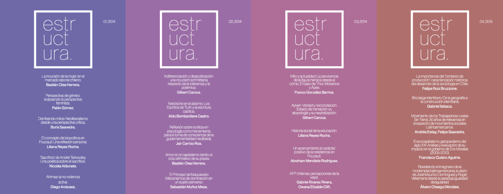

> Revista Estructura fue un proyecto universitario de publicación independiente que surgió en 2014 en la Universidad Alberto Hurtado, principalmente en la carrera de Sociología, pero también con apoyo interdisciplinar de otras carreras, universidades y países. Nuestro objetivo fue ofrecer un espacio de difusión a la discusión intelectual estudiantil, e incentivar la generación de nuevas interpretaciones de la realidad.

Estructura apunta a volverse una revista académica de distribución gratuita, cuyo material sea producido y proporcionado por estudiantes universitarios de las ciencias sociales y humanidades. El objetivo de la revista es ofrecer a las y los estudiantes universitarios una posibilidad de publicitar su propia producción intelectual, socializando así información y conocimientos que, de otra manera, quedarían en la oscuridad.

Todo aquello pensado, reflexionado, analizado y producido por los estudiantes suele perderse, oculto en cuadernos o computadores, sólo habiendo sido leídos por profesores –tal vez indiferentes, o desinteresados. Ésta es una oportunidad para sacar a la luz la capacidad de interpretación de la realidad de los estudiantes, puesto que no por carecer aún de títulos formales o grados académicos deben ser vistos en menos o mal juzgados: la visión universitaria de la sociedad es moderna, crítica, y necesaria.

El nombre de la revista proviene del concepto mismo de estructura, que se presenta en variadas acepciones a través de las diferentes disciplinas científicas. En lo que a las ciencias sociales respecta, la estructura subyace y da forma a lo aparente – es el armazón de la realidad. Nada es lo que aparenta ser; y, por lo tanto, sólo a través del estudio y la teorización podemos des-naturalizar lo idealizado.

Revista Estructura es diseñada, mantenida y organizada por Bastián Olea (estudiante de Sociología de la Universidad Alberto Hurtado), pero no podría ser posible sin la multiplicidad de compañeros que desearon compartir y publicar sus productos intelectuales.

:::: {.boton}
[ Leer Estructura 01](/posts/2014/revista_estructura_1/)
::::

:::: {.boton}
[ Leer Estructura 02](/posts/2014/revista_estructura_2/)
::::

:::: {.boton}
[ Leer Estructura 03](/posts/2014/revista_estructura_3/)
::::

:::: {.boton}
[ Leer Estructura 04](/posts/2014/revista_estructura_4/)
::::

## Equipo

El equipo de Estructura está compuesto por un grupo multidisciplinar de estudiantes comprometidos con el objetivo de la revista.

- **Bastián Olea H.** Estudiante de sociología, Universidad Alberto Hurtado (2011).
Director, diseño y diagramación.
- **Diego Andueza.** Estudiante de sociología, Universidad Alberto Hurtado (2011).
Comunicaciones.
- **Valentina Covarrubias.** Estudiante de sociología y pedagogía en lenguaje y comunicaciones, UAH (2011)
Relaciones.

### Comité editorial

- **Felipe Márquez.** Bachiller en humanidades, y estudiante de sociología (2011), Universidad Alberto Hurtado.
Director del comité editorial.
- **Abraham Mendieta.** Estudiante de ciencias políticas, Universidad Complutense de Madrid (2012).
Comité editorial y relaciones internacionales.
- **Luciano Sáez.** Licenciado en historia, Universidad Alberto Hurtado (2007). Programa pedagogía para profesionales Universidad Alberto Hurtado, Diplomado en teoría, metodología y enseñanza de la historia reciente, Instituto de estudios avanzados USACH (2014).
Comité editorial.
- **Luis Clavería.** Licenciado en ciencias políticas y relaciones internacionales, Universidad Alberto Hurtado (2009).
Comité editorial. 
- **Gilbert Caroca.** Egresado de filosofía, Universidad Alberto Hurtado (2010).
Comité editorial.
- **Nicolás Aldunate.** Egresado de filosofía, Universidad Alberto Hurtado (2010).
Comité editorial.
- **Javier Soto Antihual.** Estudiante de sociología, Universidad Alberto Hurtado (2010), minor en Educación y Políticas Educativas, Universidad Alberto Hurtado.