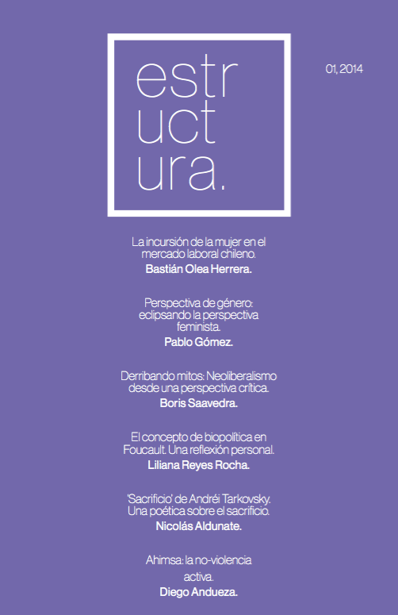

Es con gran orgullo que presentamos el primer número de nuestra revista. Sólo gracias al constante apoyo y el trabajo de lxs compañeras y compañeros es que se pudo dar inicio a este proyecto, el cual esperamos prosiga de forma positiva, y que sea posible realizar nuestro objetivo primordial: avivar la discusión intelectual estudiantil a través de la conformación de un espacio de difusión y socialización, y propiciar la generación de nuevas y necesarias interpretaciones de nuestra realidad.

::: {style="max-width:260px; margin: auto;"}

:::

En el presente número, recopilamos los siguientes artículos:

- La incursión de la mujer en el mercado laboral chileno. **Bastián Olea.** (Sociología)
- Perspectiva de género: eclipsando la perspectiva feminista. **Pablo Gómez.** (Sociología)
- Derribando mitos: Neoliberalismo desde una perspectiva crítica.
**Boris Saavedra.** (Geografía)
- El concepto de biopolítica en Foucault. Una reflexión personal. **Liliana Reyes.** (Sociología)
- ‘Sacrificio’ de Andréi Tarkovsky. Una poética sobre el sacrificio. **Nicolás Aldunate.** (Filosofía).
- Ahimsa: la no-violencia activa. **Diego Andueza.** (Sociología)

:::: {.boton}
[ Descargar Estructura 01 en PDF](revista_estructura_1.pdf)
::::

> Revista Estructura fue un proyecto universitario de publicación independiente que surgió en 2014 en la Universidad Alberto Hurtado, principalmente en la carrera de Sociología, pero también con apoyo interdisciplinar de otras carreras, universidades y países. Nuestro objetivo fue ofrecer un espacio de difusión a la discusión intelectual estudiantil, e incentivar la generación de nuevas interpretaciones de la realidad.