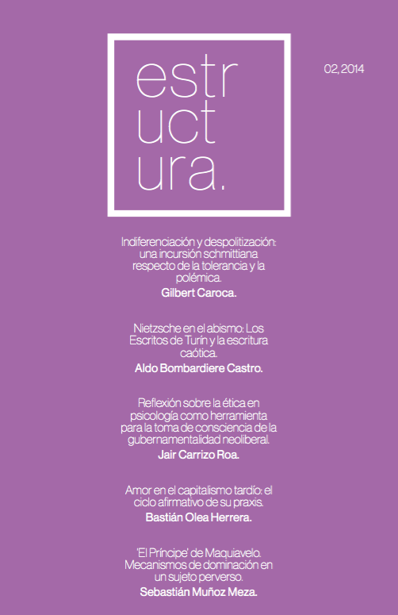

Nos enorgullece presentar el segundo número de la revista, correspondiente al ya pasado mes de septiembre. Cinco artículos lo conforman, estrenando la participación de la psicología en nuestro repertorio, junto a dos artículos de filosofía y dos de sociología.

Agradecemos desde ya todo el apoyo que hemos recibido (académico, institucional, e inclusive internacional –del cual nos jactamos de la reciente inclusión de un nuevo integrante del comité editorial desde España).

::: {style="max-width:260px; margin: auto;"}

:::

En el presente número, recopilamos los siguientes artículos:

- Indiferenciación y despolitización: una incursión schmittiana respecto de la tolerancia y la polémica. **Gilbert Caroca.** (Filosofía)
- Nietzsche en el abismo: Los Escritos de Turín y la escritura caótica. **Aldo Bombardiere.** (Filosofía)
- Reflexión sobre la ética en psicología como herramienta para la toma de consciencia de la gubernamentalidad neoliberal. **Jair Carrizo.** (Psicología)
- Amor en el capitalismo tardío: el ciclo afirmativo de su praxis. **Bastián Olea.** (Sociología)
- El príncipe de Maquiavelo. Mecanismos de dominación en un sujeto perverso. **Sebastián Muñoz Meza.** (Sociología)

:::: {.boton}
[ Descargar Estructura 02 en PDF](revista_estructura_2.pdf)
::::

> Revista Estructura fue un proyecto universitario de publicación independiente que surgió en 2014 en la Universidad Alberto Hurtado, principalmente en la carrera de Sociología, pero también con apoyo interdisciplinar de otras carreras, universidades y países. Nuestro objetivo fue ofrecer un espacio de difusión a la discusión intelectual estudiantil, e incentivar la generación de nuevas interpretaciones de la realidad.