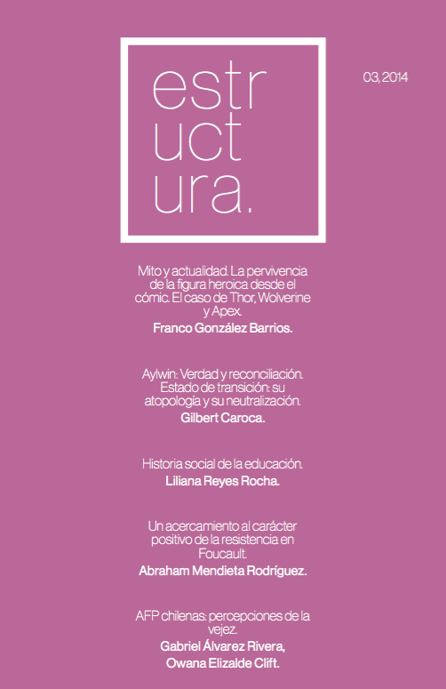

Presentamos el tercer número de la revista, correspondiente a los meses de octubre y noviembre de 2014. Consiste de cinco artículos, estrenando la participación de un artículo del área de humanidades, consolidándose así nuestra vocación multidisciplinar en nombre de la socialización del conocimiento.

Poco a poco crecemos como equipo editorial y revista, alcanzando cada vez más lectores y paulatina participación desde diversas disciplinas, a las cuales recibimos con mucha felicidad. Gracias a todxs los que a diario se interesan y participan de este proyecto estudiantil de divulgación de las ciencias sociales y humanidades desde una óptica universitaria y moderna.

::: {style="max-width:260px; margin: auto;"}

:::

En el presente número, recopilamos los siguientes artículos:

- Mito y actualidad. La pervivencia de la figura heroica desde el cómic. El caso de Thor, Wolverine y Apex. **Franco González Barrios.** (Pedagogía en Lengua Castellana)
- Aylwin: Verdad y reconciliación. Estado de transición: su atopología y su neutralización. **Gilbert Caroca.** (Filosofía)
- Historia social de la educación. **Liliana Reyes Rocha.** (Sociología)
- Un acercamiento al carácter positivo de la resistencia en Foucault. **Abraham Mendieta Rodríguez.** (Ciencias Políticas y Filosofía)
- AFP Chilenas: percepciones de la vejez. **Gabriel Álvarez Rivera y Owana Elizalde Clift.** (Sociología)

:::: {.boton}
[ Descargar Estructura 03 en PDF](revista_estructura_3.pdf)
::::

> Revista Estructura fue un proyecto universitario de publicación independiente que surgió en 2014 en la Universidad Alberto Hurtado, principalmente en la carrera de Sociología, pero también con apoyo interdisciplinar de otras carreras, universidades y países. Nuestro objetivo fue ofrecer un espacio de difusión a la discusión intelectual estudiantil, e incentivar la generación de nuevas interpretaciones de la realidad.