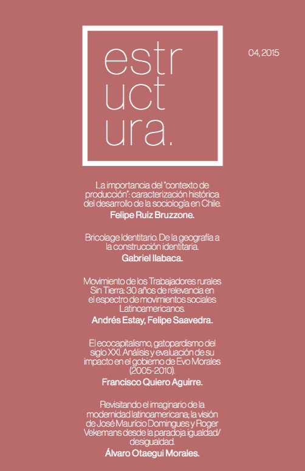

El 4º número de Estructura tiene por tema la producción de las ciencias sociales en el contexto latinoamericano y su aplicación a la multiplicidad de fenómenos sociales y políticos que configuran la región.

::: {style="max-width:260px; margin: auto;"}

:::

Para la ocasión, hemos seleccionado cinco artículos concernientes a las ciencias sociales en la región:

- La importancia del "contexto de producción": caracterización histórica del desarrollo de la sociología en Chile. **Felipe Ruiz Bruzzone.** (Sociología)
- Bricolage Identitario. De la geografía a la construcción identitaria. **Gabriel Ilabaca.** (Sociología)
- Movimiento de los Trabajadores rurales Sin Tierra: 30 años de relevancia en el espectro de movimientos sociales Latinoamericanos. **Andrés Estay, Felipe Saavedra.** (Sociología)
- El ecocapitalismo, gatopardismo del siglo XXI. Análisis y evaluación de su impacto en el gobierno de Evo Morales (2005-2010). **Francisco J. Quiero Aguirre.** (Sociología)
- Revisitando el imaginario de la modernidad latinoamericana; la visión de José Maurício Domingues y Roger Vekemans desde la paradoja igualdad/desigualdad. **Álvaro B. Otaegui Morales.** (Sociología)

:::: {.boton}
[ Descargar Estructura 04 en PDF](revista_estructura_4.pdf)
::::

> Revista Estructura fue un proyecto universitario de publicación independiente que surgió en 2014 en la Universidad Alberto Hurtado, principalmente en la carrera de Sociología, pero también con apoyo interdisciplinar de otras carreras, universidades y países. Nuestro objetivo fue ofrecer un espacio de difusión a la discusión intelectual estudiantil, e incentivar la generación de nuevas interpretaciones de la realidad.