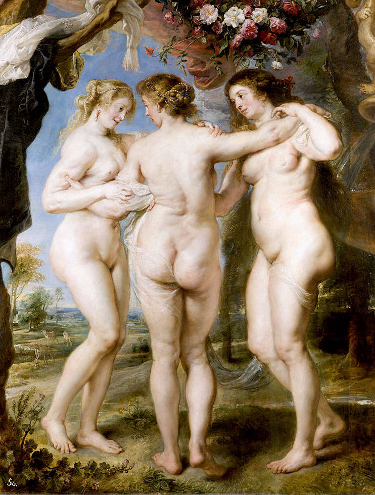
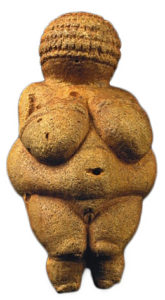
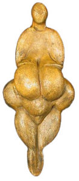
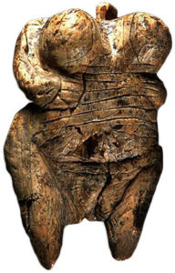
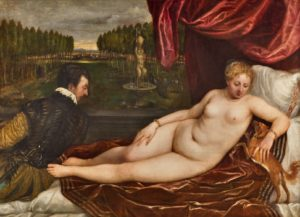
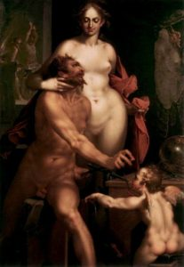
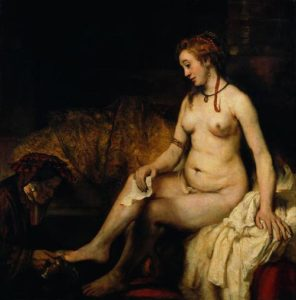
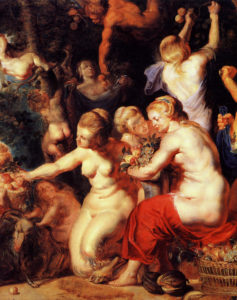

El presente artículo corresponde a una visión breve y utilitaria de la representación corporal femenina en la antigüedad y en ciertos periodos (s. XVI – XIX) del arte europeo. Es un subcapítulo de mi tesis de grado que debió ser excluido en virtud de su extensión y baja relevancia ante el tema principal. La tesis en cuestión es en realidad un paper, que se tituló _“La estigmatización de la gordura femenina. Reproducción simbólico-cultural del estatus social de la delgadez mediante la representación mediática de la corporalidad”_, y espero subirla a este sitio tan pronto como sea publicada en el libro _“Los cuerpos del género. Políticas y mercados del sexo en Chile”._ 

* * *

\[caption id="attachment\_27" align="aligncenter" width="742"\] Las Tres Gracias (1639), de Rubens\[/caption\]

Son diversos los autores que aseguran una tendencia dramática a la disminución en el tamaño corporal de las representaciones mediáticas de la figura femenina ideal (Swami et al., 2010, p. 311). En 1980, Garner y Garfinkel et al. realizaron un estudio empírico sobre los cambios históricos que ha visto la representación del cuerpo femenino en Estados Unidos, usando las medidas corporales de las modelos de Playboy y de participantes del concurso Miss America, junto a la cuantificación de artículos referidos a dietas en seis revistas populares de mujeres. Concluyen la existencia de una tendencia cultural definida hacia un ideal corporal ligado a la delgadez femenina en las últimas dos décadas (Garner, Garfinkel, Schwartz, & Thompson, 1980, p. 489). Mientras la representación de mujeres normativamente bellas se dirige hacia la delgadez extrema, el resto de las mujeres se exponen a “modelos” inalcanzables, de una delgadez imposible: sólo el 5% de las mujeres poseen el tipo de cuerpo requerido para ser una modelo (Irving, 2001). Las modelos de Playboy pesan consistentemente menos cada año, mientras que el peso promedio de las mujeres del mismo país va en alza (Harrison & Cantor, 1997, p. 42).

La belleza femenina en la actualidad podría ser considerada sinónimo de delgadez. Es difícil concebir que una mujer considerada socialmente bella pueda romper con esta normatividad, y quienes lo hacen sufren la sanción de la sociedad por su atrevimiento. Pero, históricamente, lo que ha sido considerado bello no se ha mantenido invariable. La existencia de diferentes formas de representación del cuerpo durante la historia humana pueden ser un manifiesto de la plétora de interpretaciones estéticas que pueden darse sobre la fisionomía de nuestra especie, indicando que los cánones de belleza son socialmente construidos, y como tales podrían ser alterados en pos de una mayor diversidad de cuerpos y en contra de expectativas de belleza represivas.

<!--more-->La representación del cuerpo humano más antigua encontrada hasta la fecha es la Venus de Hohle Fels, con entre 35.000 y 40.000 años de antigüedad. Esta figurilla, tallada en marfil, fue hallada en 2008 en Alemania, y representa el cuerpo de una mujer cuyas proporciones la ubicarían muy por sobre el límite de la obesidad contemporánea. Su figura, indudablemente redonda, tiene dos brazos gruesos (uno de ellos ausente) que posan sus manos sobre un abdomen enorme, sobre el cual se encuentran dos senos aún más grandes y envidiablemente elevados; entre sus dos piernas, nacidas de caderas más anchas que sus brazos, se divisa una gran vulva, con sus labios abiertos.

\[caption id="attachment\_34" align="alignright" width="165"\] Venus de Willendorf (22.000 A.C.)\[/caption\]

La famosa Venus de Willendorf (Klein, 2001; Seshadri, 2012), datada en los 22.000 años a.C, se encontró cerca del río Danubio (Austria), posando sus brazos sobre dos grandes pechos, cuyo largo alcanza su ombligo, ubicado en el centro de una panza grande y redonda que toma mayor volumen hacia sus costados, bajo la que también encontramos una hinchada y sobresaliente vulva; por el reverso posee un gran trasero, redondo y alto, iniciándose desde su marcada voluptuosidad entre dos gruesas piernas, con rodillas redondas de la grasa acumulada, que finalmente dan lugar a unas cortas antepiernas.

\[caption id="attachment\_36" align="alignleft" width="131"\] Venus de Lespugue (26.000 A.C.)\[/caption\]

En 1922 se encuentra en una cueva a los pies de los Pirineos la estatuilla de la Venus de Lespugue (26.000 a.C), distintiva por poseer las características físicas más exageradas, con unos pechos redondos y protuberantes de un largo comparable con el de sus piernas, una panza redonda y pequeña, y unas anchas caderas con un trasero también de proporciones épicas.

La Venus de Laussel (25.000 a.C) presenta una gordura mucho más realista que las demás, con minuciosas definiciones de las curvas que se posan sobre sus caderas y en su ancha cintura, pero con un vientre sin protuberar cual embarazo, ni tampoco extendido como depósito de grasa, eliminando la fertilidad como explicación de su apariencia gorda.

\[caption id="attachment\_35" align="alignright" width="192"\] Venus de Hohle Fels (40.000 A.C.)\[/caption\]

Durante el resto de la era paleolítica se tallaron varias figuras similares en diversos lugares del mundo, todas con características compartidas. Venus de Hohle Fels (40.000 a.C.) en Alemania, Venus de Galgenberg (30.000 a.C.) en Austria, Venus de Dolní Věstonice (29.000 a.C.) en la República Checa, Venus de Moravany (23.000 a.C.) en Eslovaquia, las Venus de Mal’ta (23.000 a.C.) en Rusia, Venus de Parabita (13.000 a.C.) en Francia. Y es que muchos estudiosos han buscado explicar la característica talla que agrupa a estas _Venus_, cuyo nombre reciben (irónicamente) por las tempranas hipótesis de su significancia como referente estético de la época, a través de la asimilación a símbolos de fertilidad y abundancia. Cabe criticar estas últimas interpretaciones: ¿Es necesario explicar utilitariamente la gordura de estas figuras como un significante de fertilidad?; ¿No pueden acaso simplemente ser un referente de belleza, como cualquier representación artística contemporánea?

En la escultura romana (s. IV a.C.) se mantiene la herencia de esta fascinación por la grasa femenina y su correspondencia con las habilidades maternales y de disposición de recursos. Varias representaciones de mujeres talladas en granito, mármol, o incluso bronce “vestían” ropajes dispuestos de manera que se destacaran sus atributos fértiles: amplias caderas, pechos rellenos, vientres, etcétera (Brown & Sweeney, 2009). Algunas, como la Venus Genetrix, eran posadas deliberadamente para destacar sus atributos adiposos en forma de pliegues y rollos.

\[caption id="attachment\_25" align="aligncenter" width="300"\] Venus recreándose en la música (1549), por Tiziano\[/caption\]

La tendencia continúa durante los siglos XVII y XVIII, donde la representación toma forma en las diversas técnicas de pintura en lienzo. En el renacimiento italiano, Tiziano ilustra cuerpos voluptuosos en obras como _Concierto campestre_ (1510), _Venus del espejo_ (1555), o _Venus recreándose en la música_ (1549), con un cierto sesgo por las caderas y retaguardias grandes.

\[caption id="attachment\_26" align="alignright" width="207"\] Venus y Vulcano (1610), por Spranger\[/caption\]

Venus, la deidad romana del amor y la fertilidad, mantiene sus notables caderas en _Venus y Vulcano_ (1610), del belga Bartholomeus Spranger. Por su parte, Tintoretto pinta _Susana y los viejos_ (1617), donde se sombrean delicadamente las numerosas curvas de la protagonista. Más célebre fue su coterráneo barroco Pieter Paul Rubens, quien inmortalizó una cantidad de reuniones de múltiples mujeres gordas y bellas en obras como _Diana y Calisto_ (1635), pintando sus caderas hinchadas y sus vientres suaves, o en las _Tres Gracias_ (1639), donde, cubiertas parcialmente por un velo transparente, cada mujer reside cuerpos blancos de piel tirante y de numerosos contornos plegados. Debido a su obra se conoce hoy el vocablo “rubenesco”, sinónimo de una voluptuosidad y gorduras consideradas atractivas.

\[caption id="attachment\_28" align="alignleft" width="296"\] Betsabé con la carta de David (1654), por Rembrandt\[/caption\]

Por su parte, Rembrandt Harmenszoon van Rijn, de igual o mayor fama, estudia la figura femenina gorda en bocetos de 1631, para luego realizar obras como _Dánae_ (1636), la mujer mitológica embarazada por Zeus a través de una lluvia de oro mientras yacía en cautiverio por obra de Acrisio, que aparece recostada en una lujosa cama, totalmente desnuda, su abdomen a merced de la gravedad y sus caderas maternales contrastadas con su delgada cintura; posteriormente, en _Betsabé con la carta de David_ (1654), se materializa el relato bíblico donde Betsabé recibe la invitación al palacio del rey David, convenientemente desnuda, con un vientre relajado y suspendido sobre su pubis. En _Homenaje a Pomona_ y _La educación de Júpiter_ de Jacob Jordaens (1734) podemos observar mujeres corpulentas y de apariencia fuerte. François Boucher pinta _Júpiter Disfrazado de Diana y la Ninfa Calisto_ (1759), donde los pliegues del vientre de Calisto destacan sobre unas redondas caderas; mientras que en _Desnudo en reposo_ y _La odalisca marrón_ (1745) se nos presentan de forma explícita unos gordos traseros descubiertos. Más adelante, artistas como Dominique Ingres, Pierre-Auguste Renoir, y Giacomo Grosso participarán de un siglo XIX donde la tendencia es a una representación cada vez más mesurada de la gordura femenina.

\[caption id="attachment\_29" align="alignright" width="237"\] Homenaje a Pomona (1616), por Jordaens\[/caption\]

Algunos autores apuntan al cristianismo como una fuerte influencia a la dirección que tomó esta tendencia. El ideal estético del judeo-cristianismo se basó en su conjunto de valores particulares, principalmente el pecado de la gula, la mortificación de la carne, y el valor de la penitencia, donde la capacidad disciplinas y la fuerza de voluntad para contraponerse a los impulsos del pecado eran y son considerados cualidades positivas (Pausé, 2014). Bajo este paradigma, la corpulencia es un indicador de la excesiva debilidad moral del sujeto, lo cual implicaría un descenso en la carnalidad, que es la contraposición del ascetismo (Braziel, 2001). Por ende, los cuerpos gordos, en tanto cuerpos corruptos valóricamente, serían marginados de forma explícita por efecto del poder de las diversas religiones judeo-cristianas (LeBesco, 2004). El autocontrol necesario para cumplir con el ascetismo de la castidad y los excesos carnales producen cuerpos disciplinados que son teórica–o teológica–mente más cercanos a Dios, y por consiguiente alejados del pecado y cercanos a un estadio de superioridad moral (Lupton, 2013), y más bien estéticamente similares a los antiguos religiosos entregados a la adoración que a los sujetos de una supuesta gula dados a los excesos de consumo y placer. Hoy en día, en un contexto de consumismo neoliberal, la expiación del pecado y la demostración de credenciales morales y disciplinares en una sociedad indulgente se realiza de forma figurativa regulando el consumo de comida (Stearns, 2002).

En un estudio trascendental para el campo de la estética corporal humana, Brown y Sweeney (2009) analizaron los datos recogidos por la Human Relation Area Files, que es una compilación de información etnográfica de más de 300 de las sociedades humanas más estudiadas, para llevar a cabo un estudio intercultural. Descubrieron que el “deseo de gordura” (en inglés _plumpness_), que comprende hasta la obesidad contemporánea, se encuentra presente como un valor de belleza en un 81% de las sociedades contenidas en la muestra.

Lo que es cierto, en diferentes grados, es que la delgadez claramente no fue tratada en el pasado de la misma manera con la que se trata en el mundo occidental actual.

Bastián Olea Herrera. Sociólogo (Universidad Alberto Hurtado) Contacto: bastianolea (arroba) gmail.com

### Referencias:

- Braziel, J. E. (2001). Sex and Fat Chics: Deterritorializing the Fat Female Body. In _Bodies out of Bounds: Fatness and Transgression_ (pp. 231–256). University of California Press.
- Brown, P. J., & Sweeney, J. (2009). The anthropology of overweight, obesity, and the body. AnthroNotes.
- Garner, D. M., Garfinkel, P. E., Schwartz, D., & Thompson, M. (1980). Cultural Expectations of Thinness in Women. _Psychological Reports_, _47_. http://doi.org/10.2466/pr0.1980.47.2.483
- Harrison, K., & Cantor, J. (1997). The relationship between media consumption and eating disorders. _Journal of Communication_, _47_, 40–67. http://doi.org/10.1111/j.1460-2466.1997.tb02692.x
- Irving, L. M. (2001). Media Exposure and Disordered Eating: Introduction to the Special Section. _Journal of Social and Clinical Psychology_, _20_(3), 259–269. http://doi.org/10.1521/jscp.20.3.259.22305
- Klein, R. (2001). Fat Beauty. In _Bodies out of Bounds: Fatness and Transgression_ (pp. 19–39). University of California Press.
- LeBesco, K. (2004). Introduction: The Discourse of Revolt. In _Revolting bodies?: The struggle to redefine fat identity_ (pp. 1–9). University of Massachusetts Press.
- Lupton, D. (2013). Fat Politics: Collected Writings. _University of Sydney_, 1–18.
- Pausé, C. (2014). Causing a Commotion: Queering Fat in Cyberspace. In _Queering Fat embodiment_ (pp. 89–98). Routledge.
- Seshadri, K. (2012). Obesity: A Venusian story of Paleolithic proportions. _Indian Journal of Endocrinology and Metabolism_, _16_. http://doi.org/10.4103/2230-8210.91208
- Stearns, P. (2002). Fat History: Bodies and Beauty in the Modern West. New York University Press.
- Swami, V., Frederick, D. A., Aavik, T., Alcalay, L., Allik, J., Anderson, D., et al. (2010). The Attractive Female Body Weight and Female Body Dissatisfaction in 26 Countries Across 10 World Regions: Results of the International Body Project I. _Personality and Social Psychology Bulletin_, _36_, 309–325. http://doi.org/10.1177/0146167209359702
