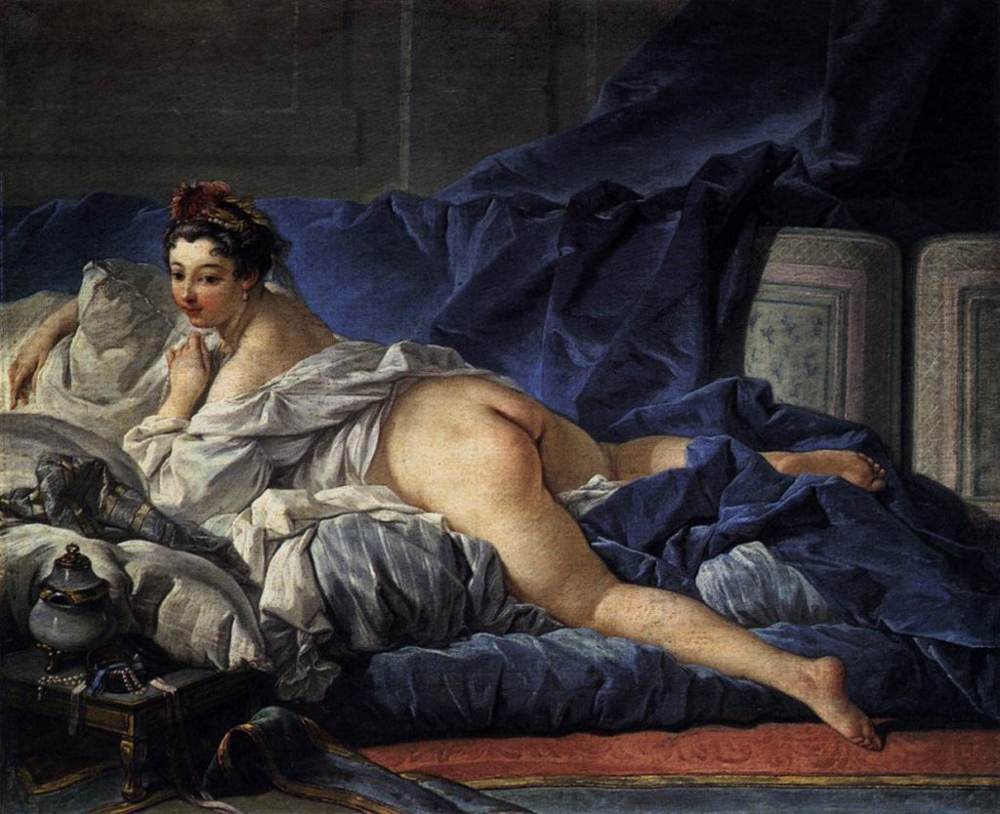

Este artículo corresponde al seminario de grado con el cual me licencié como sociólogo. Fue inscrito como memoria de tesis en el proyecto Fondecyt, 1131144: _“Imaginarios de género, representaciones del cuerpo y mercados del sexo, Chile, siglo XX”._

\[caption id="attachment\_74" align="aligncenter" width="840"\] L'Odalisque Brune (1745), de Boucher\[/caption\]

## Resumen/abstract:

En la actualidad, los cuerpos gordos femeninos son negativizados y des-representados a través del poder discursivo de los medios comunicacionales. De acuerdo a nuestra tesis, la discriminación contra la gordura se basaría en la constitución mediática de un canon de belleza normativo, mediante el cual se construye un sujeto gordo inferiorizado en función de la reproducción del estatus social positivo vinculado a la delgadez, y su relación histórica a las clases privilegiadas. Este trato simbólico pernicioso es probado a través de un análisis de la representación corporal femenina en la prensa chilena reciente. La constitución simbólico-discursiva de las corporalidades femeninas se sustenta en dinámicas de poder patriarcal internalizadas, lo cual produce sujetos disciplinados cuya disatisfacción es resuelta ideológicamente en la ilusión consumista de poseer el cuerpo perfecto. Esta estigmatización corporal basada en una lógica oposicional entre delgadez y gordura provee al cuerpo gordo femenino de la capacidad política para denunciar la opresión de género implícita en los cánones de belleza modernos.

<!--more-->

- [**Leer/descargar en PDF.**](http://bastian.olea.biz/wp-content/uploads/2018/10/la-estigmatización-de-la-gordura-femenina-olea.pdf)
- Ver en [ResearchGate](https://www.researchgate.net/publication/311872887_La_estigmatizacion_de_la_gordura_femenina_Reproduccion_simbolico-cultural_del_estatus_social_de_la_delgadez)
- Leer desde [Scribd](https://es.scribd.com/document/334980953/La-estigmatizacion-de-la-gordura-femenina-Reproduccion-simbolico-cultural-del-estatus-social-de-la-delgadez)
- Citar como: Olea, B. (2017). La estigmatización de la gordura femenina. Reproducción simbólico-cultural del estatus social de la delgadez. En J. Pavez (Ed.), _(Des)Orden de género. Políticas y mercados del cuerpo en Chile_ (pp. 299–329). CRANN Editores.

* * *

_“Amarte a ti misma es tan subversivo cuando se es gorda.”_ Whitney Thore.[\[1\]](#_ftn1)

La gordura es hoy en día una de las últimas formas de discriminación abiertamente toleradas (Braziel y LeBesco 2001; L. S. Brown 1985; Fikkan y Rothblum 2012; Gaytán y Lara Méndez 2009; Hartley 2001; Kirkland 2011; Kwan y Fackler 2008; Lupton 2013; Puhl y D. K. D. Brownell 2001; Ritenbaugh 1991; Swami et al., 2010). ¿Qué ocurre en torno a la corporalidad y el género que permite la estigmatización social de otros en virtud de su apariencia?

La etimología del término surge del latín _gurdus_, que significaba boto, obtuso, necio. Deriva, a su vez, en _gurdo,_ que significa simple e insensato. _Obeso_, “gordo _en exceso_”, proviene del latín _obésus_ (“el que ha _comido_ mucho”), y se relaciona al latín _obex,_ que significa cerrojo, pero también obstáculo, estorbo e impedimento. La connotación negativa del concepto de la gordura y sus derivados pareciera ser un hecho que suele suavizarse mediante el uso de eufemismos, donde conceptos como _sobrepeso_ implican la existencia de un peso considerado _normal,_ lo cual resulta arbitrariamente estigmatizante y removido de cualquier consideración por la diversidad corporal humana; mientras que la palabra _obeso_ implica la patologización de la gordura como una condición médica crítica. Corrientes feministas enfocadas en la corporalidad, y particularmente a la gordura femenina como problemática de género, plantean el uso de una _estrategia de inversión_ (Varikas, 2006) respecto del concepto _gordo_/a, emprendiendo una revalorización positiva de aquello que ha sido históricamente infravalorado, subvirtiendo el prejuicio que recae sobre su enunciación. Consideramos la palabra _gordo_ como la opción[\[2\]](#_ftn2) más honesta y directa para referirse a sujetos cuya corporalidad es significativamente más grande que la de los sujetos emaciados, y como tal debe ser removida de las valoraciones negativas que actualmente conlleva (L. S. Brown, 1989).

Procederemos a revisar el trato discursivo que se ejerce sobre la gordura desde dos frentes: el médico y el social, para contextualizar la condición actual de los sujetos gordos en occidente.

## Implicancias médicas de la gordura

Las instituciones de salud suelen referirse a la obesidad como una “epidemia” nacional (Atalah, 2012), y es que, de acuerdo a datos de la Encuesta Nacional de Salud del Ministerio de Salud de Chile (2010), dos de cada tres adultos pesa por encima de lo considerado “normal”; esto es, por sobre los 25 puntos en la escala del índice de masa corporal (IMC). Desde 2003 al 2010, la cantidad de adultos categorizados dentro de la obesidad “mórbida” (IMC de 40 o mayor) se ha duplicado, mientras que el resto de las categorías de sobrepeso han aumentado en no menos de 2 puntos porcentuales. Un 25% de las mujeres chilenas es considerada obesa (Albala et al., 2002), y tal condición prevalece en ellas por sobre los hombres a través de todos los rangos etarios. El porcentaje de escolares de primero básico con obesidad también ha aumentado de forma sostenida (Atalah, 2012), mientras un 17,5% de los niños de 6 años y un 10% de los preescolares califican como obesos (Albala et al., 2002).

Si bien la población masculina presenta un mayor porcentaje de sobrepeso (IMC entre 25 y 29), la población femenina destaca en los cohortes más extremos: las mujeres reportan un 62,5% más de casos de obesidad por sobre los hombres, mientras que en la obesidad mórbida las mujeres los sobrepasan en una razón de 2,6 (Ministerio de Salud, Chile, 2010). La mujer, por lo tanto, es puesta en el centro de la problemática social y médica de la obesidad en tanto sufren una mayor disposición a ella (P. J. Brown y Sweeney, 2009).

A nivel global, la Organización Mundial de la Salud (2006) también considera la obesidad y el sobrepeso como epidemias, y ambas son socialmente consideradas como enfermedades (Brewis et al., 2011). ¿Es válido patologizar y calificar como epidemia a un tipo de cuerpo que posee más del 30% (Erazo, 2012) de la población mundial?

## Implicancias sociales de la gordura

El discurso médico se vale del método científico para investirse de una autoridad incuestionable, en tanto opera desde una _caja negra_ en teoría infalible. Esto posiciona a discursos como el de _lo saludable_ en posiciones hegemónicas desde las cuales se normalizan sus dictámenes (Kirkland, 2011: 476). Pero fuera del campo médico o biológico, los síntomas negativos que el discurso médico atribuye a la gordura “traspasan” las barreras de lo somático, repercutiendo socialmente.

La valoración social negativa de la gordura es un fenómeno consolidado. Infelicidad, estupidez, soledad, fealdad, y pereza son algunos de los adjetivos con los que son definidos los sujetos obesos (Rothblum, 1992). De forma consistente, diferentes grupos sociales reportan preferir e interpretar positivamente a la corporalidad delgada, mientras que a los obesos se les suele relacionar con características negativas, deficiencia en las habilidades sociales, y con la mayoría de los valores opuestos de los atribuidos a la delgadez.

En el ámbito laboral confluyen numerosas formas de discriminación a la gordura, las cuales devienen en malos tratos, menores oportunidades de ascenso, y mayor cantidad de acciones disciplinares en su contra (Puhl y D. K. D. Brownell, 2001: 790). En una investigación con una muestra de 2.838 estadounidenses se concluyó que la posibilidad de sufrir discriminación laboral crece con el tamaño del cuerpo, y que mujeres la sufren el doble en todos los niveles corporales en comparación con hombres. Los participantes obesos reportaron ser 37 veces más discriminados, y aquellos con obesidad mórbida reportaron serlo 100 veces más en comparación a los no-obesos (Puhl y Heuer, 2009: 942; M. V. Roehling, P. V. Roehling, y Pichler, 2007). En efecto, los trabajadores con un peso superior a la media sufren más de discriminación en comparación con sus pares de peso “normal” (Carr y M. A. Friedman 2005; Puhl y D. K. D. Brownell 2001; M. V. Roehling et al., 2007), sobre todo si son mujeres (Fikkan y Rothblum, 2012). Las mujeres con sobrepeso son peor remuneradas que las mujeres delgadas, mientras que a los hombres con sobrepeso no se les remunera diferente (Maranto y Stenoien, 2000). La diferencia de sueldos entre mujeres obesas y no-obesas es equivalente a la diferencia que harían dos años de educación (Conley y Glauber, 2006). En el proceso de contratación de personal, los empleadores discriminan a los postulantes gordos, e inclusive discriminan a postulantes delgados por el mero hecho de estar sentados junto a mujeres obesas (Hebl y Mannix, 2003).

En espacios educacionales, los individuos no-delgados son discriminados más frecuentemente que los delgados, y las mujeres gordas son percibidas como menos competentes y menos aptas académicamente (Nasser, 2005). Dentro de los servicios de salud existe amplia evidencia acerca del sesgo del personal médico en contra de pacientes gordos (Fikkan y Rothblum, 2012: 582; Puhl y Heuer, 2009: 944), el cual les atribuye implícitamente características negativas, y a su vez características positivas a los delgados. Los médicos admiten sostener actitudes negativas respecto a sus pacientes obesos (Thuan y Avignon, 2005), reportando apreciar menos su trabajo a medida que el tamaño de sus pacientes se eleva (Hebl y Xu, 2001). De una muestra de 620 médicos de cuidados primarios, más de la mitad aseguró que los pacientes obesos son torpes y desobedientes, mientras que 200 de ellos los calificaron como débiles de voluntad, descuidados y perezosos (Foster et al., 2003), mientras otra investigación develó que los estudiantes de medicina presentan prejuicios negativos contra pacientes gordos en comparación con pacientes delgados, a pesar de que ambos presenten los mismos síntomas (Blumberg y Mellis, 1985). El trato discriminatorio que sufren los pacientes gordos inhibe su asistencia regular a exámenes y consultas rutinarias, reproduciendo la concepción de que son menos saludables.

Se vuelve patente la discriminación de la gordura ejercida por diversos grupos sociales. Pero, a pesar de ser un fenómeno ampliamente documentado, pocas fuentes ofrecen explicaciones. ¿Cómo se pueden explicar estas formas de discriminación?

## La estigmatización de la gordura

En Chile, las mujeres obesas suelen provenir de los estratos socioeconómicos bajos (Albala et al., 2002). A nivel global, la tendencia es la misma: el riesgo de obesidad es mayor en las poblaciones de menores ingresos (Berlant 2007; P. J. Brown y Sweeney 2009; Garner et al. 1980; Kirkland 2011; Martin 2005; Swami et al., 2010). La relación entre bajo nivel socioeconómico y la corporalidad gorda puede llevar a los individuos a relacionar causalmente ambos fenómenos, interpretando la gordura como un marcador que refiere simbólicamente a condiciones socioeconómicas deficientes. A su vez, las sociedades de menor nivel socioeconómico reportan preferencias estéticas que tienden hacia los cuerpos más gruesos en comparación con sociedades de mayor nivel socioeconómico (Swami, 2015), indicando que además de albergar corporalidades más gordas, también estas sociedades suscitan una mayor valoración de tal corporalidad; e inversamente, las sociedades de mayor nivel socioeconómico prefieren la delgadez (Ídem).

La valoración de la delgadez en la que incurren ciertos individuos no se sustentaría en una búsqueda por una mejor salud o por aspiraciones de belleza sin más, sino que su objetivo sería asociarse a características socialmente valorables (K. D. Brownell, 1991); es decir, características que _no_ estarían en la gordura, en tanto corporalidad relacionada a poblaciones de inferior nivel socioeconómico. La gordura se transformaría en un _marcador_ corporal de un estatus social inferior, simbolizando estéticamente las características negativas atribuidas a dicha población.

Los cánones estéticos no suelen ser concebidos desde las clases bajas, sino que brotan desde las clases altas a través de la solidificación de sus gustos en modas. Éstas, al ser emuladas por las demás clases, son forzadas a mutar en pos de una nueva distinción simbólica de las clases altas respecto de las clases inferiores (Bourdieu 1998; Girard, 1996). Cuando este proceso de diferenciación opera bajo criterios netamente estéticos, remite a la evitación de marcas de estatus características de los grupos sociales respecto de los cuales se desea distinguir. La delgadez, como corporalidad y canon de las clases altas, mantiene su exclusividad simbólica a través de la diferenciación oposicional con la gordura. Los sujetos que desean adscribir a la delgadez, por consiguiente, persiguen los valores simbólicos positivos atribuidos a dicha corporalidad. La consecución de delgadez bajo justificaciones de salud y calidad de vida incurren en una identificación incorrecta de causalidad entre el marcador del estatus y el significado total del estatus social (Kirkland, 2011: 473) —es decir, entre delgadez y salud, éxito y bienestar— en tanto las formas de vida de los sujetos de clases altas se explican por sus contextos sociales y no por sus corporalidades (los mejores predictores de longevidad son la educación y el estatus socioeconómico, y no el peso corporal).

Si bien la gordura afecta mayoritariamente a la mujer, es importante notar que el efecto cultural que recae en ellas es considerablemente mayor a la diferencia estadística de la medición corporal por género binario. A continuación indagaremos algunas razones de este fenómeno.

## Género, sexualidad y corporalidad

Los fenómenos de la corporalidad, la belleza, y los desórdenes alimenticios están envueltos por la desigualdad de género. Varios estudios señalan que la preocupación estética por el peso y el tamaño corporal suele ser mayor en la población femenina (Rothblum, 1992), la cual se encuentra sujeta a la opresión constante de la ideología patriarcal mediante la constitución de una normatividad estética respecto de sus cuerpos. La docilidad de los cuerpos parece ser, en consiguiente, mayor en mujeres que en hombres (Bartky, 1988: 27). Mediante la presión social sobre la corporalidad y la apariencia que recaen sobre la mujer, se refuerza su determinación de género, bajo la cual se inculcan la sexualidad y el erotismo como características o funciones netamente femeninas.

Las mujeres obesas suelen ser interpretadas como menos capaces, atractivas, y habilidosas en el ámbito sexual, y también suele prejuzgárseles como vírgenes y con deseos sexuales menos frecuentes, en comparación a mujeres delgadas u hombres de ambas corporalidades (Regan, 1996:, 1812). La información morfológica de los sujetos resultaría básica para realizar “inferencias y evaluaciones sobre las características sexuales e interpersonales de \[los\] individuo\[s\], y especialmente sobre las experiencias sexuales cuando el individuo es mujer” (Ídem).

Físicamente, la distribución del tejido adiposo subcutáneo posibilita la identificación de un cuerpo comúnmente concebido como femenino, en tanto viabiliza varias de las características sexuales secundarias que lo caracterizan y diferencian del cuerpo masculino. Pero ocurre que, dada cierta cantidad, pronunciación y concentración de la grasa corporal, las curvas otrora “femeninas” son negadas de su atractivo, al volverse indicadores de gordura. La gordura en la mujer conlleva la exacerbación de sus características sexuales secundarias, volviéndola inequívocamente femenina, lo cual teóricamente debiese significar un mayor valor erótico comparado con un cuerpo delgado o emaciado (de hecho, el aumento de grasa corporal incrementa la cantidad de estrógeno en el cuerpo); pero diversos mecanismos sociales se encargan de simbolizar negativamente dicha corporalidad, invalidando su sexualidad y volviéndola indeseable incluso en etapas tempranas del sobrepeso (M. V. Roehling et al., 2007). El erotismo reducido con el que se sanciona a la corporalidad gorda condiciona la posibilidad de una sexualidad saludable, respecto de lo cual se suele recurrir a métodos de exageración para posibilitarse como sujeto sexual válido, exaltando lo que le es negado.

La gordura u obesidad en hombres, por otro lado, carece del mismo estigma. La identidad de género masculina no parecer regirse por exigencias estéticas análogas a las que las mujeres deben someterse para validarse como tales. Las incomodidades físicas experimentadas por mujeres respecto de sus cuerpos podrían ser manifestaciones de los efectos provocados por la sujeción normativa que sufren, en tanto se les impide disfrutar de las mismas permisiones y libertades que los cuerpos masculinos en cierta medida sí poseen.

## Deseo y diferencia en lo femenino

Las expectativas simbólicas del _ser mujer_ son constituidas desde la hegemonía discursiva masculina bajo criterios de deseo y apropiación (Beauvoir, 1969: 108). Ese objeto de deseo para el hombre toma las características de un _todo-otro_, conteniendo todo aquello que no está en él: su antítesis complementaria, capaz de ofrecerle dominio sobre una totalidad que le es ajena. El otro-todo que es la mujer se configura como una expectativa infinita, un imperativo de lo que la mujer debiese contener para el hombre que se encuentra en campaña de su apropiación. Cuando esta expectativa es tan grande, suele volverse en decepción.

Las imposiciones del género masculino sobre el femenino buscarán exacerbar la diferenciación dimórfica entre géneros por medio de la cultura, en la forma de prácticas tales como la vestimenta, el maquillaje, el cuidado del cabello, y otros trabajos valorizantes realizados sobre el cuerpo, capaces de acentuar las diferencias fenotípicas básicas. “Todo cuanto acentúa en lo otro la diferencia lo hace más deseable, puesto que es lo otro en tanto que tal lo que el hombre desea apropiarse” (Beauvoir, 1969: 105). La _apropiación_ yace en este simulacro de conquista del otro-misterioso, en el cual el hombre hace suyo un cuerpo que contiene en él un trabajo biopolítico y disciplinar, sintetizado de forma latente desde la expectativa de la _mirada masculina_.

Las imposiciones estéticas, prácticas y discursivas relacionadas al _ser_ mujer se vuelven imperativos de performatividad necesarios de realizar para obtener la validación de una identidad de género heteronormada.

## Representación mediática de la corporalidad

La influencia de los medios comunicacionales occidentales creció paulatinamente con la segunda guerra mundial, cuando nuevas plataformas de exposición concebidas por los adelantos tecnológicos y el aumento global del consumo se configuraron como importantes difusores de símbolos culturales, entre ellos los ideales de belleza (Nasser, 2005). En una época de surgimiento de mercados desregulados, el flujo libre de información influenciada por la potencia de turno propició la difusión global de símbolos culturales “americanizados”, que fueron fácilmente asimilados por diferentes culturas debido al debilitamiento de las identidades nacionales derivado del rápido desarrollo socioeconómico globalizado (Swami, 2015: 47). El resultado de este conjunto de fenómenos propios del siglo XX fue la asimilación a escala internacional de ciertos valores culturales. El capitalismo global y los mecanismos publicitarios transnacionales fueron capaces de difundir patrones de consumo e ideales de belleza homogéneos hacia realidades heterogéneas.

Los medios masivos de comunicación, sustentados en posiciones enunciativas privilegiadas basadas en su cuasi-monopolio sobre las tecnologías comunicacionales, tienen el poder de controlar la representación de la realidad a través de la divulgación de simbolizaciones culturales acerca de fenómenos o grupos sociales. La exposición a fuentes masivas de información consiste en un proceso de socialización unilateral, en el cual se reciben sostenidamente símbolos culturales capaces de moldear concepciones acerca de la realidad social (Van Vonderen y Kinnally, 2012: 43), enseñando sobre la existencia de ideales culturales (Harrison y Cantor, 1997), y caracterizando a los miembros de diversos grupos sociales por medio de categorizaciones discursivas (Stecher, 2012).

El cuerpo en la sociedad occidental contemporánea corresponde a una superficie sobre la cual la cultura se inscribe simbólicamente (Heyes, 2006), y los medios comunicacionales cumplen su parte inscribiendo valores negativos sobre la gordura, comúnmente de forma asociativa a través de la representación de personajes gordos negativizados (Blaine y McElroy 2002; Braziel y LeBesco 2001; Giovanelli, Ostertag, y Sondra Solovay 2009; Kwan y Fackler 2008; Puhl y Heuer 2009; Regan 1996; Rothblum y Solovay 2009; Swami 2015; Wolf, 2009). La gordura como concepto comunicacionalmente aprendido despierta un repertorio de significados influidos por el sesgo constante de su representación, los cuales son capaces de sobreponerse a las particularidades de los sujetos (Varikas, 2005: 77).

A través de la exposición a representaciones y simbolizaciones mediáticas sesgadas bajo un canon de belleza particular, puede acontecer la interiorización de valores normativos por parte de la población respecto de tal ideal y sus particularidades. Con una muestra de 7.434 individuos en 26 países, Viren Swami et al. (2010) llevó a cabo un estudio de preferencias de cuerpos femeninos, en el cual confirmó que la exposición a medios de comunicación occidentales en sus diferentes formas se correlaciona con la preferencia por los cuerpos femeninos delgados (Swami et al., 2010: 320). En ciertas sociedades, como fue el caso de la República de Fiyi, los cánones de belleza tradicionales que valoraban a la gordura fueron reemplazados por desórdenes alimenticios y deseos de delgadez entre las mujeres al introducirse programación televisiva occidental (Swami, 2015: 24; Swami et al., 2010).

La exposición a cuerpos simbólicamente impresos genera un constante proceso de reconocimiento, comparación y evaluación: una presión formulada como el _deseo_ de obtener las características de la imagen del otro-positivo, lo cual gatilla un proceso de auto-reflexión que evalúa la mismidad en comparación con el ideal representado, provocando expectativas y estrategias en torno a la obtención de dicha corporalidad canónica.

Los medios de comunicación, desde su naturaleza monopolista, poseen un poder editorial capaz de sesgar o negar el flujo de información acerca de ciertos temas, manipulando contenidos según sus intereses. Se trata de un poder de _invisibilización_ con repercusiones nefastas para el reconocimiento simbólico de los sujetos representados. Cuantitativamente, la invisibilización consiste en el acto de prescindir de la representación de mujeres con cuerpos no-delgados, optando por la (sobre)representación de cuerpos delgados en su lugar. Como efecto, las mujeres gordas se transforman simbólicamente en una “minoría”, a pesar de formar parte importante de la población. Se incurre en la naturalización de la exclusión de mujeres gordas de los espacios de representatividad y visibilidad, normalizando la exclusión e infra-representación de mujeres gordas en posiciones sociales públicas o de visibilidad. Cualitativamente, opera de manera selectiva en pos de la relación simbólica entre gordura y características indeseables —núcleo del mecanismo de diferenciación que la hegemonía mediática construye— a través de representaciones negativizadas, estereotípicas y discriminantes de los cuerpos gordos femeninos. El acercamiento cualitativo se aplica por sobre el cuantitativo, actuando cada vez que la invisibilización cuantitativa no es total, estigmatizando las escasas instancias de representación restantes.

Estudios de contenidos mediáticos reportan ambos acercamientos de invisibilización (Giovanelli et al., 2009), destacando que las pocas representaciones identificadas habitúan ser roles de bajo estatus social (Dyrenforth, O. W. Wooley, y S. C. Wooley, 1980), removidas de todo erotismo y caracterizadas como sexualmente indeseables, o fracasadas en su vida de pareja (Giovanelli et al., 2009), y tratadas como objeto de burla y denostación con fines humorísticos (Fouts y Burggraf, 2000). Estas representaciones de indeseabilidad formaron la base de un posicionamiento erótico y moralmente superior de los personajes delgados.

Las representaciones de gordas, siendo mínimamente recurrentes y simbólicamente estigmatizadas, enseñan a las audiencias a interpretar a los miembros de su categorización social de forma despectiva, lo cual deriva en una presión para _corregirse_ de parte de sus pares, mientras que las mujeres no-gordas ven reafirmada la valoración de su distanciamiento de la gordura.

## Disatisfacción corporal[**\[3\]**](#_ftn3)

Cuando la exposición mediática sugiere la posibilidad de obtener ciertos estatus socialmente valorados a través de la adquisición de una corporalidad específica, la existencia de la posibilidad misma en tanto posibilidad _normativa_, entendida como alcanzable por todos, produce _disatisfacción corporal_.

En una muestra poblacional expuesta por Brownell (1991), un 96% de las y los encuestados reportaron desear cambiar algo de sus cuerpos, de los cuales un 78% de las mujeres versus un 56% de los hombres indicaron querer cambiar su peso. En la investigación de V. Swami et al. anteriormente referida (2010), los participantes masculinos reportaron preferir siluetas de mujeres de tallas más grandes que lo que las mismas mujeres predijeron; en otras palabras, las mujeres supusieron que la preferencia masculina respecto del cuerpo femenino correspondía a siluetas más delgadas de lo que en realidad reportaron preferir. Esto indica un grado de interiorización de los cánones de belleza agudizado en las mujeres, llegando a un nivel de desconexión con las exigencias estéticas masculinas que indican una presión exagerada respecto de la imposición normativa de la delgadez. Por otro lado, las mismas mujeres sobreestimaron su propio tamaño corporal, considerando sus cuerpos como de un mayor tamaño que lo que en realidad medían, y también indicaron una distancia importante entre dicho cuerpo y el que en realidad deseaban tener. Tal es la definición de _disatisfacción corporal_ que manejaremos: discrepancias entre el tamaño corporal actual e ideal.

Indicios de disatisfacción corporal pueden ser vistos en los resultados de una encuesta de 3.200 mujeres de 10 países realizada por Etcoff et al. (2004) para la compañía Dove de la multinacional Unilever, donde casi la mitad de las mujeres (47%) evaluaron su peso corporal como _demasiado elevado_, mientras que un 31% de las mujeres reportó sentirse _algo_ o _muy_ insatisfechas con su peso y forma corporal. Las mujeres de avanzada edad, las mujeres gordas, y las que más se exponen a medios comunicacionales occidentales son las que reportan mayores niveles de disatisfacción corporal (Swami et al., 2010: 318).

Una mayor exposición a medios comunicacionales que representan imágenes delgadas o promueven la delgadez se correlaciona directamente con el sentimiento de disatisfacción corporal (Dittmar y Howard 2004; Harrison y Cantor 1997; Irving 2001; Stice y Shaw 1994; Swami et al. 2010; Van Vonderen y Kinnally, 2012), posiblemente producido por la internalización de cánones normativos de belleza. Mediante el proceso de comparación corporal con cuerpos de mujeres delgadas, se producen sentimientos negativos en las mujeres que han internalizado con anterioridad el canon normativo de belleza (Dittmar y Howard 2004; Stice, Spangler, y Agras, 2001), provocándose una alteración de la capacidad de estimación, de las expectativas sociales frente a la belleza, y de las valoraciones de sus propios cuerpos (Dittmar y Howard 2004; Freedman 1984; Irving, 2011). Las comparaciones corporales son explicativas del sufrimiento de desórdenes alimenticios (Harrison y Cantor 1997; Johnston y Taylor 2008; Nasser, 2005) como la bulimia (Rayón et al., 2013), y al efectuarse respecto de cuerpos en extremo delgados —como los de las modelos— son capaces de sugerir la idea de tener sobrepeso (Rothblum, 1992). De la misma manera, la comparación con pares que sí han sido capaces de adelgazar y adscribirse en el canon de la delgadez potencian el sentimiento de disatisfacción al evidenciar la posibilidad incumplida —la _delgadez en potencia_— de la gorda que ha sido incapaz (Van Vonderen y Kinnally, 2012).

Pero los fenómenos de representación y comparación operan en ambas direcciones: si bien la exposición mediática a la delgadez produce sentimientos adversos, la exposición a modelos de tallas más grandes es capaz de generar satisfacción corporal (Dittmar y Howard 2004; Irving, 2011), lo cual significa que es posible realizar esfuerzos mediáticos si se desea mejorar la salud psíquica de mujeres con problemas de estima y disatisfacción corporal (Cusumano y J. K. Thompson 1997; Rauscher, Kauer, y Wilson 2013; J. K. Thompson y Heinberg, 1999). El nivel de satisfacción corporal medido antes de la exposición experimental a medios comunicacionales es clave a la hora de estimar el efecto de la exposición a representaciones corporales, en tanto un mayor nivel de satisfacción corporal previo, relacionado a una mayor autoestima, permite que los sujetos se enfrenten mejor a los mensajes mediáticos, disminuyendo su efecto (Esnaola Etxaniz 2005; Ricciardelli, McCabe, y Banfield, 2000).

Para el presente trabajo nos enfocaremos en medios escritos, en tanto investigación previa ha demostrado que su consumo predice con mayor consistencia la interiorización de cánones de belleza relacionados a la delgadez (Bermúdez et al. 2009; Currie 1997; Field et al. 1999; Harrison y Cantor 1997; Stice y Shaw 1994; Utter et al., 2003). Autores como Field (1999) incluso demuestran que la lectura frecuente de revistas de moda duplican o triplican la probabilidad de incurrir en dietas con el objetivo de bajar de peso. Esto puede ser explicado de acuerdo a la forma particular del consumo que cada medio ofrece: mientras la televisión y radio son medios que suelen ser consumidos sin necesidad de concentración o compromiso, la lectura implica un acto de constante atención y reflexividad, por lo que sus mensajes podrían ser adquiridos más profundamente.

## Análisis de representaciones corporales en la prensa

Desde tan temprano como la década de los ‘30 que el tópico de la “talla ideal” es públicamente tratado en revistas para mujeres en Chile (Saa Espinoza, 2014). Como una forma de evaluar el nivel de representación mediática de estos cuerpos en el caso chileno, analizamos los contenidos (incluyendo publicidad) de los dos diarios de tiraje nacional y de las dos revistas “de mujeres” más leídas en Chile según el estudio IPSOS (2015) de lectoría de diarios y revistas (enero-junio, 2015), siendo muestreados 10 números de los diarios _Las Últimas Noticias_ y _La Cuarta_, y 10 números de las revistas _Mujer_ (de _La Tercera_) y _Ya_ (de _El Mercurio_).[\[4\]](#_ftn4) Llevamos a cabo un análisis de contenidos —con énfasis en posibles subtextos negativos— sobre el trato que se dio a temáticas concernientes a la corporalidad, la belleza y la gordura, y un análisis cuantitativo de las representaciones gráficas de los diferentes tipos de cuerpos femeninos, clasificándolos[_**\[5\]**_](#_ftn5) en las categorías _delgado_, _intermedio_ y _gordo,_ notando su contexto y particularidades.[\[6\]](#_ftn6)

Dentro de la muestra estudiada, se obtuvieron un total de 1.297 cuerpos femeninos representados dentro del _contenido_ (artículos, portadas, etc.) de las fuentes, y 516 cuerpos femeninos utilizados en _publicidad_, dando un total de 1.813 representaciones femeninas.

| _Tabla 1: Totales generales de casos en contenidos y publicidad.[**\[7\]**](#_ftn7)_ |  |  |  |  |
| --- | --- | --- | --- | --- |
| Corporalidad | **Contenido** | **Publicidad** | **Ambos** | Total |
| **Delgada** | 1.203 | 511 | 1.714 | 94,54% |
| **Intermedia** | 73 | 5 | 78 | 4,3% |
| **Gorda** | 21 | 0 | 21 | 1,16% |
| Total | 1.297 | 516 | 1.813 | 100% |

La cuantificación de las representaciones gráficas de cuerpos femeninos arrojó resultados que se condicen con la bibliografía estudiada. La tabla 1 contiene un resumen general de resultados, donde la amplia mayoría de los casos correspondieron a cuerpos delgados, conformando un 94,54% (1.714) del total de cuerpos, representándose sólo marginalmente a otros cuerpos de contexturas no-delgadas, que se desagregan en un 4,3% de cuerpos bajo la categoría “intermedio” y un 1,16% en la categoría “gordo”.

| _Tabla 2:_
_Casos en contenidos y sus porcentajes internos desagregados por fuente._ |  |  |  |  |  |  |  |  |  |  |
| --- | --- | --- | --- | --- | --- | --- | --- | --- | --- | --- |
| Corporalidad | **Mujer** |  | **Ya** |  | **LC** |  | **LUN** |  | Total |  |
| **Delgada** | 612 | 97,5% | 403 | 90,4% | 105 | 84% | 83 | 84,7% | 1203 | 92,8% |
| **Intermedia** | 14 | 2,2% | 38 | 8,5% | 11 | 8,8% | 10 | 10,2% | 73 | 5,6% |
| **Gorda** | 2 | 0,3% | 5 | 1,1% | 9 | 7,2% | 5 | 5,1% | 21 | 1,6% |
| Total | 628 | 100% | 446 | 100% | 125 | 100% | 98 | 100% | 1297 | 100% |

| _Tabla 3:_
_Casos en publicidad y sus porcentajes internos desagregados por fuente._ |  |  |  |  |  |  |  |  |  |  |
| --- | --- | --- | --- | --- | --- | --- | --- | --- | --- | --- |
| Corporalidad | **Mujer** |  | **Ya** |  | **LC** |  | **LUN** |  | Total |  |
| **Delgada** | 214 | 99,1% | 205 | 99% | 28 | 100% | 64 | 98,5% | 511 | 99% |
| **Intermedia** | 2 | 0,9% | 2 | 1% | 0 | 0% | 1 | 1,5% | 5 | 1% |
| **Gorda** | 0 | 0% | 0 | 0% | 0 | 0% | 0 | 0% | 0 | 0% |
| Total | 216 | 100% | 207 | 100% | 28 | 100% | 65 | 100% | 516 | 100% |

Dentro de las representaciones ubicadas en contenidos (tabla 2), la distribución se da como 92,8%, 5,6% y 1,6% (_delgado_, _intermedio_ y _gordo_, respectivamente). La fuente que internamente representó una proporción mayor de cuerpos delgados fue la revista _Mujer_, con un 97,5% de sus casos. Esta tendencia a la delgadez se agudiza en el caso de la publicidad (tabla 3), donde un 99% de los cuerpos identificados son delgados, mientras que el 0,97% restante responde a cuerpos “intermedios”, sin existir ningún caso de cuerpos gordos.

La distribución comparativa de los cuerpos entre las diferentes fuentes respecto del total se da de la siguiente manera:

| _Tabla 4:_
_Porcentajes de representación total en contenidos (ponderado)._ |  |  |  |  |  |
| --- | --- | --- | --- | --- | --- |
|   | **Mujer** | **Ya** | **LC** | **LUN** | Total |
| Factor de ajuste: | 0,516 | 0,727 | 2,594 | 3,309 |
| **Delgada** | 27,3% | 25,3% | 23,6% | 23,8% | 100% |
| **Intermedia** | 7,5% | 28,6% | 29,6% | 34,3% | 100% |
| **Gorda** | 2,3% | 8,2% | 52,4% | 37,1% | 100% |

| _Tabla 5:_
_Porcentajes de representación total en publicidad (ponderado)._ |  |  |  |  |  |
| --- | --- | --- | --- | --- | --- |
|   | **Mujer** | **Ya** | **LC** | **LUN** | Total |
| Factor de ajuste: | 0,597 | 0,623 | 4,607 | 1,985 |
| **Delgada** | 25% | 25% | 25,2% | 24,8% | 100% |
| **Intermedia** | 27% | 28,2% | 0% | 44,8% | 100% |
| **Gorda** | 0% | 0% | 0% | 0% | 100% |

Para comparar el nivel de explicación total de cada fuente según categoría corporal, las tablas 4 y 5 contienen los porcentajes de representación corporal ponderados,[\[8\]](#_ftn8) de manera que las diferencias de cantidad de casos entre las fuentes se regularicen. En la primera tabla destaca cómo _La Cuarta_ explica más de la mitad (52,4%) de la representación de cuerpos gordos, seguido de _Las Últimas Noticias_ (LUN) con un 37,1%. Las revistas, por su parte, presentan los menores porcentajes de representación de cuerpos gordos e intermedios, donde la revista Mujer contiene de forma simultánea la mayor cantidad de mujeres delgadas y la menor de mujeres intermedias y gordas. _Las Últimas Noticias_ fue la fuente con porcentajes de representación menos variables y por ende más balanceados. _La Cuarta_ presentó comparativamente el menor grado de invisibilización de la corporalidad gorda, no temiendo representar a las protagonistas de las noticias a pesar de no pertenecer al canon de belleza, y referenciando problemas particulares a la gordura, como por ejemplo la disponibilidad de vestimenta de su talla.[\[9\]](#_ftn9)

La mayoría casi absoluta de la representación de cuerpos delgados en publicidad es tan alta (superior al 98,5% en las cuatro fuentes, de acuerdo a la tabla 3) que su distribución por fuentes es pareja, de un ~25% por cada una. Si bien la representación de gordura en publicidad fue completamente nula, _Las Últimas Noticias_ explica comparativamente casi la mitad de la representación de corporalidades intermedias, mientras que _La Cuarta_ fue la única fuente que únicamente utilizó cuerpos delgados.

En términos generales, la presencia de mujeres delgadas es prácticamente absoluta. Fueron cualitativamente destacadas mediante fotografías de mayor tamaño, apareciendo junto a escenas en las cuales aparentemente no tenían pertinencia, en mayor cantidad dentro de una misma noticia, distintivamente en situaciones erotizadas y sugestivas, o bien a través de fotografías de estudio. Aparecieron representadas también a cuerpo completo, e incluso con texto bordeando sus siluetas recortadas. De forma contraria, las fotografías de mujeres de cuerpos categorizados como intermedios y gordos, junto a los cuerpos de mujeres de mayor edad, parecieron ser sometidos a esfuerzos de ocultamiento, usando diferentes recursos para reemplazar la corporalidad como foco de la imagen y trasladarlo a otros elementos,[\[10\]](#_ftn10) apareciendo en fotografías pequeñas, a menudo en blanco y negro, en situaciones totalmente des-erotizadas y circunstanciales, o a través de planos más generales, los cuales disminuyen el tamaño de representación del cuerpo e incluyen otros elementos en el plano. La representación de mujeres gordas fue muy marginal en comparación con los porcentajes poblacionales citados anteriormente, careciendo de registros del mismo rigor estético que sus contrapartes delgadas. Aparecieron en situaciones poco vistosas, a menudo como grupos de mujeres reunidas o en sus puestos de trabajo, naturalmente sin ninguna de las consideraciones estéticas contempladas para las mujeres delgadas. En efecto, una de las dos únicas portadas con mujeres gordas representa un grupo de mujeres haciendo ingreso a un recién inaugurado centro comercial,[\[11\]](#_ftn11) mientras que la otra retrata a una mujer que recibió atenciones estéticas junto al texto “se aliñó el _caracho”.[**\[12\]**](#_ftn12)_ Otras mujeres gordas son deportistas de contextura gruesa, o incluso transexuales.

_Publicidad de cuerpos no-delgados._ Sólo se identificaron 5 casos de publicidad con cuerpos de la categoría intermedio. En tres instancias, se trató de representaciones de trabajadoras, y en el resto se trató de mujeres realizando actividades. Su representación parecería estar condicionada a la necesidad, puesto que no recibieron el trato gratuito o privilegiado de exposición que sí recibieron las mujeres delgadas en anuncios publicitarios, donde una simple exposición de sus rostros o cuerpos sin otro componente relevante al anuncio o producto promocionado era suficiente para constituir publicidad. Aparentemente, los cuerpos no-delgados no son tratados como modelos a seguir; ni son considerados deseables o vistosos, sino que existen y son representados sólo por pertenecer a condiciones específicas, como relacionarse con el estereotipo la mujer trabajadora o dueña de casa. Los cuerpos no-delgados parecieran no ser considerados necesarios de representar, sino que su representación sería un recurso al cual se accede sólo a falta de alternativas. Resulta cuestionable esta tendencia a invisibilizar corporalidades ampliamente existentes a través de su exclusión de los registros visuales de nuestra cultura.

_Culpa y reivindicación._ Los cuerpos de actores y actrices o personajes de farándula tendieron a estar presentes en las entrevistas o reportajes, donde algunas mujeres fueron increpadas por alzas de peso o cambios en su apariencia. La respuesta ante estas interpelaciones fueron reivindicativas, apelando a la existencia de una normatividad que las y los determina hacia la pertenencia a ciertos parámetros estéticos. Argumentos como “son las reglas del juego” fueron usados en respuesta a la presión de regresar a una corporalidad “óptima” luego de embarazos, o bien en el caso de mujeres empezando a ser invisibilizadas mediáticamente debido a su edad. Las desviaciones de la normalidad —el “salirse de la línea” o “dejarse estar”— presuponen la necesidad de hacer un esfuerzo para regresar a _lo normal,_ pero también para mantenerse dentro de dicha condición y así satisfacer las predisposiciones corporales y estéticas del oficio mediático, donde una incapacidad generaría un sentimiento de culpa en tanto prescripción fallida, o fracaso.

_Deporte y salud._  Para los periódicos, el deporte se trató de un problema político, aunque también —así como en las revistas— se le dio exposición en tanto actividad de aire libre en auge. El objetivo del deporte fue expresado como el mejoramiento de la salud de sus participantes, pero en general ocurrió que el concepto “salud” operó como un eufemismo para referirse al adelgazamiento como motivación última, basado en la común correlación espuria entre bajo peso y buena salud. Los artículos sobre actividades deportivas inquirieron en las experiencias corporales de mujeres, su reducción de tallas, y su baja de peso producida por su práctica, y los artículos que trataron el tema del deporte en sí recibieron connotaciones similares: hacer deporte “para cuidar el cuerpo”, hacer deporte “para el verano”[\[13\]](#_ftn13) (implicando el objetivo de exponerse públicamente al lograr delgadez), etcétera. Las mujeres fueron a menudo incentivadas a practicar deportes, principalmente el _running_ y yoga, este último notablemente desplazado desde la mente al cuerpo.[\[14\]](#_ftn14)

El deporte ha sido reducido a una práctica más de embellecimiento del cuerpo femenino, un conocimiento disciplinar implícito al cual se apela constantemente en tanto conjunto de saberes interiorizados: el emisor está enterado de la interiorización del canon de belleza normativo por parte de sus receptoras, por lo que simplemente bastan sutiles referencias para justificar los sesgos en el trato de las temáticas: es innecesaria una justificación para el deporte, pues todas saben bien por qué lo practican_._

_Alimentación “saludable”._ Los artículos sobre deporte habituaron acompañar notas sobre nutrición y alimentación, sugiriendo la afinidad entre los tópicos. El concepto de alimentación fue enunciado siempre en compañía del adjetivo “saludable”: las recetas comúnmente propuestas en los números de ambas revistas y en ciertas notas de los periódicos fueron siempre destacadas por sus cualidades nutricionales, junto a un notorio silencio acerca de la evidente consecuencia del disfrute culinario. Tal como en el caso del deporte y su justificación implícita, se vuelve aparente la intuición por parte del emisor sobre la adscripción del lector a la práctica de la regulación de ingesta y conteo de calorías, aludiendo a los efectos nocivos para la salud de ciertos componentes nutricionales, y por ende la posibilidad de alteración del “peso normal”, junto a otras patologías típicamente atribuidas a la obesidad. La gordura y la obesidad son mencionadas directamente con poca frecuencia, tratándose de manera tangencial, bien sea desde el imperativo de la _buena salud_ y la necesidad innegable del _cuerpo sano,_ o en base al rechazo a la ingesta de ciertas comidas[\[15\]](#_ftn15) y la adopción de prácticas alimentarias específicas, a menudo vinculadas a comentarios tecnificados como método de validación. Nuevamente encontramos prácticas que no parecen requerir justificación, en tanto apelan a un objetivo normativo más profundo a la voluntad propia, como un imperativo de parte de los pares: _la mirada masculina_ (Bartky 1988; L. S. Brown 1985; Hartley, 2001).

La dieta como método de control del peso corporal fue tocada con mesura y asesoramiento propicio, reconociéndose los peligros que puede conllevar de no controlarse debidamente. Fueron denunciadas también prácticas como el ayuno y la bulimia, y en ciertas ocasiones fueron referenciadas las circunstancias sociales que llevan a las mujeres a incurrir en ellas. A pesar de ello, las revistas contaron entre sus páginas con numerosos espacios publicitarios sobre fármacos destinados a la quema de grasa y reducción de peso, con una frecuencia media de 1,75 espacios publicitarios por revista. Uno de ellos versa: “el lunes empiezo la dieta, y la termino”, acompañado de una foto de una mujer delgada comiendo una dona de chocolate, implicando que el consumo de las pastillas promocionadas permite liberarse de la irresponsabilidad que conlleva el comer “de más”.

_Corporalidad._ La revista _Ya_ lleva la delantera en el trato político de la corporalidad femenina, al destacar en la primera página de cada número su “Compromiso de Revista Ya por la imagen saludable de la mujer”, en el cual se promete evitar el uso de software de manipulación fotográfica, contratar modelos con un IMC mayor a 18,5 bajo certificación médica, y evitar la promoción de “estereotipos femeninos físicos no saludables”_._ Este compromiso pareciera corresponder a un acto de correctitud política que en la práctica carece de efectividad, al no traducirse en diferencias comparativas respecto de la representación femenina presentada por la competencia. Si bien la manifestación de dicha intención puede ser un avance para el reconocimiento de la arbitrariedad de los cánones de belleza femeninos y las presiones que a su alrededor se configuran, ésta actitud puede terminar volviéndose en un acto de tolerancia represiva, donde la revista obtiene una ganancia política por medio de la apropiación y neutralización de una crítica social válida (Marcuse, 1965). El compromiso deriva en un seminario resumido en un reportaje titulado “En busca de una pantalla sin estereotipos”,[\[16\]](#_ftn16) donde principalmente se expusieron críticas contra la discriminación etaria por parte del mundo del espectáculo, y además se hacen referencias a la falta de representación bajo criterios de género. La actriz Catalina Saavedra toca el tema de la corporalidad al denunciar la “condena” del físico gordo a la estereotipación: “Yo voy a seguir siendo la pobre o la de clase media”.

Cabe cuestionar el interés por parte de las empresas en exponer estas temáticas inclusivas en sus contenidos claramente excluyentes. Las prácticas de cooptación en temas de identidad y discriminación son poco valorables y estériles en su efectividad real al carecer de crítica sobre los procesos estructurales que generan la discriminación (Cooper 2008; Johnston y Taylor, 2008).

_Halagos y descalificaciones._ En el análisis general de contenidos se percibieron ciertos indicios de normativas editoriales acerca de reducir las referencias y calificaciones sobre la gordura y las prácticas que producen cada uno de los diferentes cuerpos. La transgresión común de estas directrices, alimentadas por lo políticamente correcto, fue el uso de eufemismos tales como “grandes”, “otras tallas”, “diferentes tipos de cuerpos”, o “extra lindas” para la gordura en general, o bien “elegante”, “estilizado”, o “estirado” para referirse a la delgadez de las modelos. Contrariamente, los juicios valóricos positivos respecto de la apariencia delgada abundaron, siendo abiertos y normalizados en algunas instancias, tales como las periódicas secciones de semidesnudos que caracterizan a _La Cuarta_, u otros espacios referentes al modelaje y personajes de fama internacional en _Las Últimas Noticias_. El trabajo sobre la apariencia corporal (operaciones y cambios de _look_) es recibido con elogios. La corporalidad no-delgada, por su parte, fue objeto de juicios valóricos negativos: una publicidad de un cuarto de página sobre el tránsito lento presenta a un sapo maquillado como mujer,[\[17\]](#_ftn17) un hombre recibe burlas por confesar haber tenido relaciones sexuales con una mujer mayor gorda,[\[18\]](#_ftn18) la maratonista “más famosa de Chile” es descrita a través de una cierta fijación a su cuerpo “menudo”, “grueso y fibroso que pareciera ensancharse en el aire”,[\[19\]](#_ftn19) entre otros.

_Belleza y consumo._ La belleza corporal como análogo de la delgadez se expresó como un imperativo indiscutido, llenando las páginas de revistas con avisaje focalizado en el cuerpo que insinuó el beneficio del adelgazamiento al promover cirugías estéticas, operaciones reductivas, suplementos alimenticios, servicios de belleza, masajes reductivos, y otras técnicas. El consumo amenazó desde cada rincón del papel cuché mediante la enunciación de la posibilidad de _volverse gorda,_ ofreciendo a su vez múltiples soluciones para prevenir y tratar esta enfermedad en potencia. Mediante el consumo, la mujer vuelve a ser dueña de su cuerpo e imagen.

La delgadez fue hegemónica en las instancias de representación positivas: la publicidad, que suele pretender la comunicación de deseos de consumo, se valió casi completamente del uso de cuerpos delgados como vehículo de ventas para sus diversos productos, independiente de la relación de éstas con la figura femenina en cuestión. Una figura femenina junto a un enunciado o logotipo fueron elementos suficientes para conformarse en una invitación al consumo teóricamente capaz de despertar el deseo de adquirir lo promocionado; es decir, la mujer, lejos de _ser_ la mercancía en venta, consistió en un _espejo_ frente al cual el lector fetichiza la corporalidad representada y la propia, interpretando los valores que posicionan a la delgadez como privilegio en ese cuerpo culturalmente simbolizado. La delgadez se torna en el significante de estatus con el que el lector desea identificarse, lo cual puede ser posibilitado en la adquisición de productos que marcan a la mujer delgada y normativamente bella. Compartir la marca del estatus permitirá que el consumidor se beneficie de parte de él.

_Marca corporal de la ausencia._ Uno de los fenómenos más destacables del análisis fue la _omnipresencia invisible_ de la gordura, traducida como posibilidad inminente; una “ausencia que es evocada como fuera del marco de significación y referenciación, mientras permanece estructuralmente presente como un ausencia subtendida” (Braziel, 2001: 233). La presencia hegemónica de la delgadez recurre a una gordura _temporalmente_ ausente, cuya irrepresentabilidad es subrogada por imágenes y textos metonímicos que marcan su presencia como un espectro que aqueja el día a día a través de las comidas azucaradas, las mujeres corriendo en las mañanas, las modelos y sus vestidos de talla única, los productos nutricionales y de adelgazamiento por doquier, etcétera. La repetitividad de esta representación ausente sugiere un esfuerzo incesante por escapar de un destino nefasto, un terror por la posibilidad de _volverse_ gorda que al parecer sólo puede combatirse con consumo y trabajo sobre el cuerpo, ambos realizados bajo la espectralidad de la insinuación amenazante de lo que puede significar el cese de la performación de la delgadez. Este terror es interiorizado como un referente panopticista, al posicionarse la mujer dentro de lo que podría ser una sala de espejos donde cada reflejo es su mismidad vuelta gorda que la presiona a reprimirse; el devenir en la gordura resulta motivación suficiente para acatar las determinaciones disciplinares de la delgadez en proyecto, dotando de sentido a todas aquellas actividades otrora justificadas ideológica y técnicamente. La gordura es significada, entonces, no mediante la imagen explícita de una corporalidad desagradable y amenazante, sino que a través de diferentes significantes que aluden a su presencia: la tentación de la comida, el sedentarismo de la vida moderna, la ropa y sus tallas restrictivas, la salud y su reducción a proporciones corporales, entre otros se vuelven en manifestaciones del espectro que mantiene la amenaza del estigma en el inconsciente.

## El canon de belleza normativo

_“Lo que solía ser la especialidad del aristócrata o cortesano es ahora la rutina obligatoria de toda mujer, sea una abuela o apenas una niña pubescente.”_ (Bartky, 1988: 42)

En la actualidad, los procesos de occidentalización han sido capaces de divulgar una normatividad de la belleza a nivel global (Brewis et al., 2011). La belleza, en tanto conjunto de cualidades que la cultura de turno considera deseables, se constituye como principio socialmente normativo; es decir, una ideología manifestada como expectativa socialmente posicionada que no implica un absoluto, sino una imposición constantemente reforzada y compensada mediáticamente. El centro ideológico de esta normatividad, para occidente, suele ser la delgadez (Guthman y Sondra Solovay 2009; Hartley 2001; Jolles 2012; Kwan y Fackler 2008; Oksala 2004; Swami et al., 2010), la cual es considerada como la corporalidad _normal_ o neutral, implicando una pretensión de naturaleza constituida en torno a la categorización de las demás corporalidades como excepción (Girard, 1996). Un _canon_ de belleza, entonces, remite a conjuntos de _normas_ culturalmente difundidas, cargadas simbólicamente, y significadas como patrones ideales de conducta. Su configuración como _deseo_ a través de su carácter normativo deviene opresivo cuando el poder discursivo se vuelve capaz de divulgar prácticas disciplinares internalizadas a toda clase de mujeres a través del orbe, generando un efecto de estigmatización sobre los grupos negativizados.

La internalización acontece cuando el sistema de símbolos de la belleza normativa cesa de ser coercionado mediante sanciones y estímulos repetitivos en pos de su aprendizaje. El poder “encuentra el núcleo mismo de los individuos, alcanza su cuerpo, se inserta en sus gestos, sus actitudes, sus discursos, su aprendizaje, su vida cotidiana” (Foucault, 1979: 89). Las mujeres, al internalizar este conjunto de prácticas, conocimientos y disposiciones, se vuelven sus propias carceleras (Bordo 1993; Giovanelli et al., 2009) cuando toman por sí mismas la responsabilidad de su regulación y represión dentro de las prescripciones establecidas. Este proceso ve sus inicios en la socialización más temprana, cuando la condición insuficiente y _mejorable_ del cuerpo femenino es enseñada desde la niñez (Hartley, 2001), donde la familia y los otros significativos inculcan valores respecto de la corporalidad femenina como un factor perfectible (Beauvoir 1969; Kwan y Fackler 2008; Rayón et al., 2013). El cuerpo, embellecido y expuesto, se dispone como público, abierto a la mirada del otro, y constituido con tal mirada en consideración; la cual a su vez también lo vuelve deficiente.

En tanto mujeres, la falta a los imperativos de belleza vigentes bajo lo _femenino_ constituye un _fracaso,_ pues son mandatadas a performar la feminidad. Bajo estas imposiciones, la feminidad toma la forma de una especie de _encierro_ (Bartky, 1988: 29), donde la naturaleza construida de su categorización (Hacking, 1999) se dota de valores que vienen dados de antemano desde la ideología patriarcal. Es en este contexto que la gordura puede ser interpretada como una feminidad desviada (Heyes 2006, 2007), donde su cuerpo _fracasado_ se vuelve un blanco para una opinión pública que se siente empoderada para supervisar y juzgar los cambios corporales. Los pares, quizás inadvertidamente, conforman parte del panóptico estético, reforzando constantemente la existencia del canon, de su error y sus consecuencias como una técnica de autovalidación y exclusión.

La anorexia, la bulimia, y los desórdenes alimenticios en general serían somatizaciones de esta patología cultural del peso corporal, incentivadas por la rigidez del canon y sus implicancias evaluativas para las mujeres. El grado de sanción social contra la gordura es más agudo apenas las mujeres salen de la categoría de delgadez (Judge y Cable, 2011), sugiriendo que el momento de romper con la norma es el que genera más reacción, en tanto situación inicial de desobediencia estética. La incapacidad o negación de la gorda por complacer las predisposiciones corporales provoca el rechazo del otro que sí se esmera por satisfacer un conjunto de preceptos y valores, constituyéndose esta diferenciación también en exclusión.

## Descorporeización

La relación del sujeto gordo con su cuerpo aparentemente es la de un ser enfrentado a un cuerpo-otro (Bartky, 1988: 28; Heyes, 2006: 132) que está fuera del control propio, el cual debe ser guiado hacia estados socialmente valorados mediante el desarrollo de un trabajo psíquico y físico sobre sí. La gordura se posiciona fuera de la mujer: no es algo propiamente suyo, sino que un sobrante con lo que ella carga, pues “el self nunca es gordo” (Kent, 2001: 134). Cuando la mujer cesa de _ser_ su cuerpo, el cuerpo se vuelve _suyo_, implicando la apertura a las posibilidades de modificación y regulación basadas en sus dictámenes. La descorporeización es el fenómeno cultural de rechazar al cuerpo como parte de uno, ergo relacionándose con él como un otro. El cuerpo femenino, al dividirse del self, se dispone a los efectos de los procesos naturales (biológicos) y del consumo.

Bajo las exigencias que presenta la comparación cotidiana con cuerpos normativamente bellos, la descorporeización ofrece el punto intermedio mediante el cual la mujer es capaz de rechazarse a sí misma bajo criterios estético-ideológicos y optar por la posibilidad de satisfacer tales expectativas por medio de diferentes técnicas, como son el control de sus funciones biológicas (la ingesta, el consumo y el gasto energético), o la adquisición de mercancías que provoquen efectos en la apariencia y el funcionamiento del cuerpo.

## Docilidad y mirada masculina

Naomi Wolf (2009:70) nota que, de todas las portadas de la popular revista _Life_ que muestran mujeres, sólo 19 de ellas _no_ eran actrices o modelos, implicando que todo el resto fue destacado meramente por su belleza. Los cuerpos femeninos son disciplinados para volverse objetos de contemplación y admiración, y no sujetos políticos. Los valores del canon de belleza hegemónico reprochan el tamaño, la fuerza y la madurez, en tanto el ideal es adolescente y débil, cuyas facciones no demuestren carácter, experiencia, ni apariencia sea desafiante. Así, el éxito en la mujer es tipificado como el logro de la belleza, la cual si bien genera admiración y halago, no conlleva poder ni sustenta posiciones de respeto o autoridad, pues carece de relato subjetivo; se trata de sujetos de facto vacíos y mudos, porque las posiciones sociales que alcanzan en base a sus características estéticas son convenientemente posiciones despolitizadas e inofensivas.

La configuración de la belleza femenina como deliberadamente inferior excluye a las mujeres de numerosas posibilidades de ser, volviéndolas sujetos dóciles a través del entrenamiento de movimientos y tareas específicas que deben realizar ritualísticamente a lo largo de su día, volviéndolas inconscientemente en sujetos de obediencia y sumisión, en tanto el contenido de las acciones performa su propio estado de inferioridad. La meta de la belleza como normatividad pareciera ser el proveer de objetivos de vida socialmente validados y valorizados que revoquen a la mujer de agencia política real, generando incentivos para optar por carreras que _las saquen del juego_, posibilitando la dominación masculina en aquellas esferas de la sociedad donde se juega el poder político_._

La imposición de un ideal estético y corporal se manifiesta en los numerosos refuerzos y sanciones que acompañan a la representación de cuerpos. La simbolización positiva del canon de belleza se refuerza cuando la delgadez se expresa como deseable, valorable, y dignas de emulación (no es coincidencia que se utilice el término _modelo_ para referirse a las mujeres normativamente bellas). Cuando el cuerpo gordo u otras marcas de “fealdad” se representan como receptores de burla y desprecio públicos, se incurre en la sanción discursiva de tales corporalidades. Las representaciones cargadas de juicios de valor parecieran ser omnipresentes: la publicidad usa mujeres normativamente bellas como foco de atención en sus avisos y como factor fetichizante de sus mercancías, ciertos géneros musicales populares destacan cualidades corporales femeninas como canon estético/erótico (subyugando a la mujer a un objeto de contemplación y placer), la mujer en el cine sigue siendo disminuida a una función erótico/romántica en tramas lideradas por hombres, la industria del maquillaje utiliza su enorme capital para consolidar la norma estética de la mujer maquillada (mientras reproduce el concepto de una mujer no-maquillada como _insuficiente_), la industria de la moda masifica el uso de vestimenta femenina cada vez más reveladora e hipersexualizada (Driscoll, 2011), etcétera.

El carácter que toma este discurso hegemónico sobre la estética corporal es el de un panóptico cosmético (Giovanelli et al., 2009), donde la corporalidad femenina se constituye dentro de un espacio disciplinar totalizado por una mirada masculina (_male gaze_) (Bartky 1988; Hartley 2001; Mulvey, 1975), que evalúa la apariencia y valía de cada sujeto mientras fuerza sus ideales propios bajo el juicio y gusto masculino patriarcal. “La mirada determinante del varón proyecta su fantasía sobre la figura femenina, a la que talla a su medida y conveniencia” (Mulvey, 1975: 370), provocando la auto-regulación de los cuerpos femeninos dentro de los cánones de este régimen de vigilancia que aparece como la presión incesante de una audiencia masculina físicamente ausente (Hartley, 2001: 62), capaz de subyugar las corporalidades a objetos de una contemplación masculinamente configurada. La feminidad toma el carácter de espectáculo, que significa la interiorización del otro-represor y juez que reforzará y sancionará bajo los criterios de validez heteronormativos del hombre. Su interiorización significa el paso desde una competencia por complacer a los hombres hacia una competencia entre mujeres (L. S. Brown 1989; Girard, 1996), puesto que cada mujer se torna también jueza de sus pares, donde las diferentes prácticas de presión al cumplimiento de la performatividad de la belleza femenina institucionalizan la mirada masculina en base a la amenaza que significa la comparación y el reconocimiento.

## Consumo, ilusión, e ideología

El sujeto descorporalizado dispone los atributos y falencias de su cuerpo a los beneficios del mercado, volviéndose capaz de aumentar su valoración al invertir trabajo _estéticamente necesario_ y _tecnologías del yo_ sobre él. Este proceso de _construcción_ es netamente económico dentro de categorías culturales, donde la capacidad de consumo se vuelve la condición para la agencia sobre el cuerpo-otro, donde las mujeres descorporalizadas deben jugar un despliegue de estrategias de mercado para modificarse.

El cuerpo gordo se torna un campo de acción de la ideología neoliberal del individualismo y la libertad a través del consumo (Kwan y Fackler, 2008: 2), donde la responsabilidad individual y las libertades económicas personales (Guthman y Sondra Solovay 2009; Rothblum 1992; Saguy y Almeling, 2008) son ideológicamente sobrepuestas a los factores sociales o biológicos (P. J. Brown y Sweeney 2009; K. D. Brownell 1991; Crandall y Martinez 1996; Kirkland, 2011). El discurso que impera sobre el estado imperfecto y maleable del cuerpo femenino (Hartley 2001; Jolles, 2012: 302; Ritenbaugh, 1991) es el de la promesa de una delgadez accesible a todas aquellas que acepten someterse ante sus técnicas constitutivas. El uso de tecnologías del yo y métodos sociales de autoayuda pueden ser considerados síntomas del _empobrecimiento fundamental_ de la realidad ideológica y política actual, donde constituyen prácticamente las únicas formas de empoderamiento y realización personal posibles (Bröckling, 2015). La relación de rechazo y represión al cuerpo propio es proclive a la generación de deseos de consumo que aparecen como soluciones a las necesidades dictadas por la normatividad hegemónica.

La inhibición de la ingesta de comida a través de dietas (Ritenbaugh, 1991) y su complementación con fármacos, procedimientos clínicos, y diferentes regímenes alimenticios; el mercado de los cosméticos, y el sinnúmero de mercancías y servicios relacionados a la actividad física y los estilos de vida deportivos, constituyen tecnologías del yo que denuncian la verdadera industria de la delgadez que gira en torno a esta _fantasía del buen vivir,_ en tanto condición hipotéticamente beneficiosa pero limitada por sus evidentes dificultades. Tales consideraciones incurren en una situación de _optimismo cruel_ (Berlant, 2011), donde la delgadez codificada como fantasía se persigue a pesar que la posibilidad de fracasar sea más alta que la de posicionarse en la reducida categoría social de la belleza normativa, lo cual a su vez la valoriza como escasa.

Cuando el control sobre el cuerpo-otro se remite a la capacidad disciplinar y la responsabilidad de personal de la mujer como agente de consumo (Saguy y Almeling, 2008), la incapacidad de salir de la no-delgadez significa un sentimiento de culpa (Klein, 2001) sufrido por los millones de mujeres incapaces de adscribirse al marcador de estatus de la delgadez, una culpa resignificada como deseo que resulta un eficiente método de control social (Bröckling, 2015).

## El privilegio de la delgadez

La corporalidad, en tanto característica estética diferenciadora, puede instituirse como mecanismo básico de demarcación de credenciales sociales e indicador de origen de clase. En la antigüedad, cuando la tendencia de las poblaciones pobres solía ser la delgadez, la diferenciación simbólica provocó aristocracias y élites que buscaron la gordura y el gran tamaño como formas de demostrar la abundancia y virtud de sus condiciones de vida; mientras que hoy, cuando es más fácil generar cuerpos gordos mediante comidas procesadas baratas, condiciones de salud insuficientes y regímenes laborales que dificultan una nutrición estable, la delgadez se posiciona como significante de un cuerpo privilegiado. La delgadez y la gordura son capaces de decirnos bastante sobre origen social e intereses de clase de cada sujeto sin necesidad de entablar una comunicación directa con él o ella, como también puede ocurrir con la raza, la nacionalidad, y otros marcadores corporales, en tanto suelen ir correlacionados con diagnósticos sociales conocidos. Pero el privilegio surge ahí cuando estas simbolizaciones dejan de ser simbolizaciones de “antecedentes” y se transforman en prácticas performativas de identidades y estilos de vida particulares, donde las mismas determinaciones sociales que dieron origen a la oposición entre marcadores de estatus positivos y negativos respecto del cuerpo vuelven a limitar el acceso de todos los sujetos a esta forma de comunicación (y comparación) no verbal ostentosa. Hoy en día, no todos tenemos la libertad ni la posibilidad estructural de moldear nuestros cuerpos como se nos plazca, y esta es la gran ilusión que conforma al privilegio de la delgadez: el acceso a los saberes, técnicas y medios para la generación de cuerpos delgados se encuentra bajo restricciones de clase.

## Lógica oposicional

La regulación de individuos dentro de patrones canónicos de comportamiento opera en beneficio de otros grupos sociales; el género, por ejemplo, es una de las bases culturales para la desigual distribución del poder, así como también lo es la raza, y probablemente también lo sea la gordura. El cuerpo gordo, a través de su mera existencia, significa el fundamento para el nacimiento del privilegio de su contraparte; se trata de un continuo proceso de diferir, en el cual la identidad de la delgadez genera una relación contingente con la construcción política del otro como estrategia constituyente de la posición dominante (Benhabib, 2006).

Todo discurso oposicional remite a la creación de aquello que excluye (Braziel, 2001), agrupando los valores positivos y negativos dentro de una condición de existencia mutua: “Un exterior constitutivo o relativo está compuesto, por supuesto, por una serie de exclusiones que, sin embargo, son interiores a ese sistema como su propia necesidad no tematizable” (Butler, 2002: 71). La conformación de la delgadez requiere de la existencia de la gordura como elemento interno dispuesto a la exclusión, lo cual anula toda posibilidad de eliminación entre contrapuestos, en tanto la eliminación del enemigo en la política resulta en la imposibilidad de contraposición, y por consiguiente, en la despolitización (Derrida, 1998). Se recurre, entonces, a la _enemistad reconstituyente_, entendida como la mantención y reproducción del enemigo en pos de la afirmación de la identidad propia, que permite la agrupación de individuos afines como constitución identitaria de un grupo social. La lógica oposicional de la delgadez y la gordura reside en la construcción performativa del otro posibilitada por el desigual acceso al poder enunciativo, ejecutando “la reiteración de una norma o un conjunto de normas \[que\], en la medida en que adquiera\[n\] la condición de acto en el presente, oculta o disimula las convenciones de las que es una repetición.” (Butler, 2002: 34)

La construcción simbólica negativizada presupone, lógicamente, la intención del grupo positivado de alejarse de aquello determinado por él como negativo. En el acto de denuncia del otro ocurre tanto la solidificación de la negativización como el distanciamiento respecto de ella misma, pero a menudo el afán de estigmatizar discursivamente llega a un extremo en el cual la denuncia se desenmascara a sí misma como estrategia discursivo-política de constitución oposicional de la identidad, ahora fuera del velo de “objetividad” que proveía su naturalización. La anoréxica es el ejemplo paradigmático de este fenómeno, llamado _autoinmunidad_ en el paradigma biológico, donde el terror interiorizado de la gordura que fomenta su denuncia simultáneamente incentiva la realización de prácticas que serían propias de una mujer gorda en búsqueda de la delgadez. Pero la anoréxica _no es gorda_, a pesar de que todas sus prácticas y discursos respecto de su propio cuerpo puedan informarnos que sí lo es, pues termina actuando un rol que la dispone como tal basada en su desprecio a la gordura.

En el fenómeno autoinmune, las fuerzas propias “se dañan a sí mismas en su intención de herir al enemigo” (Serratore, 2015) cuando la preocupación panóptica del “evitar caer” en la gordura dirige a la mujer, presionada por todos los frentes, hacia la eliminación performativa del límite entre lo gordo y lo delgado, al descubrirse ambos cuerpos performando las mismas prácticas.

## La gordura subvertida

El deseo patriarcal de la posesión del cuerpo femenino rehúye del cosificar la corporalidad gorda: el cuerpo gordo escapa de la condición pública del cuerpo femenino oprimido, implicando que deja de ser _reconocida_ como feminidad válida, denunciando el carácter sexista del canon de belleza (Hartley, 2001): la mujer sólo es _mujer_ cuando _es para_ un hombre.

El estigma de la gordura adquiere sentido sólo dentro de la lógica oposicional dictada por el canon. Esto significa que su superación implicaría la performación de su renuncia: actuar la _gordura como belleza_ significa una subversión de lo negativizado y un escape del juego represivo de la configuración de los cuerpos. Este acto despierta las fuerzas reaccionarias de los sujetos que internalizaron el canon de la delgadez, pues ven inconscientemente a su privilegio amenazado de devenir arbitrario por obra de esta belleza fuera de sus parámetros dicotómicos. Una gordura bella vulnera las estructuras de poder al desarticular la lógica de segregación, estigmatización y diferenciación que definen a la belleza, y permite a la mujer escapar de lo normativamente femenino al desafiar las estructuras del género mediante su existencia contrahegemónica que disrrumpe el sentido común. En efecto, las demostraciones públicas de gordura femenina son aún entendidas como _performances_ en el sentido artístico/político por su rareza, y suelen ser asociadas a la escena queer en tanto expresiones abiertas de lo abyecto.

El combate contra la abyección (Kent, 2001) mediante la exposición pública del cuerpo gordo genera el espacio para plantear la crítica contra las estructuras de opresión de género en clave estética que han sido ampliamente naturalizadas, rompiendo con la concepción descorporeizada del self, la calidad imperfecta del cuerpo, y la maquinaria mercantil instalada alrededor de este verdadero problema social.

Inmersos en una sociedad represiva, son subversivas las prácticas que aporten a nivelar el campo de lo estructuralmente determinado (McAllister y Sondra Solovay, 2009) en pos de la liberación de las posibilidades eróticas e identitarias de las mujeres, a través de actos contrahegemónicos que denuncien la arbitrariedad de las opresiones a las cuales nos disponemos. Toda mujer gorda contiene dentro de sí el germen de las contradicciones que pueden conducirla a la destrucción de la opresión que la estigmatiza, por consiguiente guiándola junto a sus hermanas a la emancipación.

### Bibliografía:

- Albala, C., F. Vio, J. Kain, y R. Uauy. 2002. “Nutrition Transition in Chile: Determinants and Consequences.” Public health nutrition 5(1a):123–28.
- Atalah, E. 2012. “Epidemiología de la obesidad en chile.” Revista Médica Clínica Las Condes 23(2):117–23.
- Bartky, S. L. 1988. “Foucault, Feminity, and the Modernization of Patriarchal Power.” Pp. 25–45 en Feminism and Foucault: Reflections on Resistance.
- Beauvoir, S. D. 1969. El Segundo Sexo. Buenos Aires: Siglo Veinte.
- Benhabib, S. 2006. El ser y el otro en la ética contemporánea. Barcelona: Editorial Gedisa.
- Berlant, L. 2007. “Slow Death (Sovereignty, Obesity, Lateral Agency).” Critical Inquiry 33(4):754–80.
- Berlant, L. 2011. Cruel Optimism. Duke University Press Books.
- Bermúdez, S. et al. 2009. “El rol de la insatisfacción corporal e influencia de grupo de pares sobre la influencia de la publicidad, los modelos estéticos y dieta.” Revista mexicana de investigación en psicología 1(1):9–18.
- Blaine, B. y J. McElroy. 2002. “Selling Stereotypes: Weight Loss Infomercials, Sexism, and Weightism.” Sex Roles 46(9-10):351–57.
- Blumberg, P. y L. P. Mellis. 1985. “Medical Students' Attitudes Toward the Obese and the Morbidly Obese.” International Journal of Eating Disorders 4(2):169–75.
- Bordo, S. 1993. Unbearable Weight: Feminism, Western Culture, and the Body. Berkeley: University of California Press.
- Bourdieu, P. 1998. La distinción. Criterio y bases sociales del gusto. España: Taurus.
- Braziel, J. E. 2001. “Sex and Fat Chics: Deterritorializing the Fat Female Body.” Pp. 231–56 en Bodies out of Bounds: Fatness and Transgression. University of California Press.
- Braziel, J. E. y K. LeBesco. 2001. Bodies Out of Bounds: Fatness and Transgression. University of California Press.
- Brewis, A. A., A. Wutich, A. Falletta-Cowden, y I. Rodriguez-Soto. 2011. “Body Norms and Fat Stigma in Global Perspective.” Current Anthropology 52(2):269–76.
- Brown, L. S. 1985. “Women, Weight, and Power.” Women & Therapy 4.
- Brown, L. S. 1989. “Fat-Oppressive Attitudes and the Feminist Therapist: Directions for Change.” Women & Therapy 8(3):19–30.
- Brown, P. J. y J. Sweeney. 2009. The Anthropology of Overweight, Obesity, and the Body. AnthroNotes.
- Brownell, K. D. 1991. “Dieting and the Search for the Perfect Body: Where Physiology and Culture Collide.” Behavior Therapy 22.
- Bröckling, U. 2015. El Self Emprendedor. Sociología de una forma de subjetivación. Santiago: Universidad Alberto Hurtado.
- Butler, J. 2002. Cuerpos que importan. Sobre los límites materiales y discursivos del “sexo.” 1st ed. Buenos Aires: Paidós.
- Carr, D. y M. A. Friedman. 2005. “Is Obesity Stigmatizing? Body Weight, Perceived Discrimination, and Psychological Well-Being in the United States.” Journal of Health and Social Behavior 46(3):244–59.
- Conley, D. y R. Glauber. 2006. “Gender, Body Mass, and Socioeconomic Status: New Evidence From the PSID.” Pp. 253–75 en The Economics of Obesity, vol. 17, Advances in Health Economics and Health Services Research. Bingley: Emerald (MCB UP ).
- Cooper, C. 2008. “What’s Fat Activism?.” University of Limerick 1–25.
- Crandall, C. S. y R. Martinez. 1996. “Culture, Ideology, and Antifat Attitudes.” Personality and Social Psychology Bulletin 22.
- Currie, D. H. 1997. “Decoding Femininity: Advertisements and Their Teenage Readers.” Gender & Society 11(4):453–77.
- Cusumano, D. L. y J. K. Thompson. 1997. “Body Image and Body Shape Ideals in Magazines: Exposure, Awareness, and Internalization.” Sex Roles 37.
- Derrida, J. 1998. “El amigo aparecido (en nombre de la democracia).” Pp. 93–130 en Políticas de la amistad, Políticas de la amistad. Madrid: Editorial Trotta.
- Dittmar, H. y S. Howard. 2004. “Thin-Ideal Internalization and Social Comparison Tendency as Moderators of Media Models‘ Impact on Women’S Body-Focused Anxiety.” Journal of Social and Clinical Psychology 23.
- Driscoll, J. 2011. “‘The Age of the Ass’: Baudrillard, Black Leggings, and the More Nude Than Nude.” The International Journal of Baudrillard Studies 8.
- Dyrenforth, S. R., O. W. Wooley, y S. C. Wooley. 1980. “A Woman‘S Body in a Man’S World: a Review of Findings on Body Image and Weight Control.” en A Woman's Conflict: The Special Relationship between Women and Food. New Jersey: Prentice Hall.
- Erazo, M. 2012. “Visión Global en Relación a La Obesidad.” Revista Médica Clínica Las Condes 23(2):196–200.
- Esnaola Etxaniz, I. 2005. “Imagen corporal y modelos estéticos corporales en la adolescencia y la juventud.” Análisis y Modificación de Conducta 31(135):5–22.
- Etcoff, N., S. Orbach, y J. Scott. 2004. “La verdad acerca de la belleza. Resultados del estudio global de dove sobre las mujeres, la belleza y el bienestar.” dove.pr.
- Field, A. E. et al. 1999. “Exposure to the Mass Media and Weight Concerns Among Girls..” Pediatrics 103(3):E36.
- Fikkan, J. L. y E. D. Rothblum. 2012. “Is Fat a Feminist Issue? Exploring the Gendered Nature of Weight Bias.” Sex Roles 66.
- Foster, G. D. et al. 2003. “Primary Care Physicians' Attitudes About Obesity and Its Treatment..” Obesity research 11(10):1168–77.
- Foucault, M. 1979. Mircrofísica del poder. 2nd ed. Madrid: La Piqueta.
- Fouts, G. y K. Burggraf. 2000. “Television Situation Comedies: Female Weight, Male Negative Comments, and Audience Reactions.” Sex Roles 42(9-10):925–32.
- Freedman, R. J. 1984. “Reflections on Beauty as It Relates to Health in Adolescent Females..” Women & health 9(2-3):29–45.
- Gardner, R. M., B. N. Friedman, y N. A. Jackson. 1998. “Methodological Concerns When Using Silhouettes to Measure Body Image..” Perceptual and motor skills 86(2):387–95.
- Garner, D. M., P. E. Garfinkel, D. Schwartz, y M. Thompson. 1980. “Cultural Expectations of Thinness in Women.” Psychological Reports 47.
- Gaytán, L. y A. Lara Méndez. 2009. “Diferentes Perspectivas De Estudio Sobre La Corporeidad Y Sexualidad De Las Personas Obesas.” 147–61.
- Giovanelli, D., S. Ostertag, y M. W. Sondra Solovay. 2009. “Controlling the Body. Media Representations, Body Size, and Self-Discipline.” Pp. 289–296 en The Fat Studies Reader. New York: New York University Press.
- Girard, R. 1996. “Eating Disorders and Mimetic Desire.” Contagion: Journal of Violence, Mimesis, and Culture 3(1):1–20.
- Guthman, J. y M. W. Sondra Solovay. 2009. “Neoliberalism and the Constitution of Contemporary Bodies.” Pp. 187-196 en The Fat Studies Reader. New York: New York University Press.
- Hacking, I. 1999. “Making Up People.” The Science Studies Reader.
- Harrison, K. y J. Cantor. 1997. “The Relationship Between Media Consumption and Eating Disorders.” Journal of Communication 47:40–67.
- Hartley, C. 2001. “Letting Ourselves Go: Making Room for the Fat Body in Feminist Scholarship.” Pp. 60–74 en Bodies out of Bounds: Fatness and Transgression. University of California Press.
- Hebl, M. R. y J. Xu. 2001. “Weighing the Care: Physicians' Reactions to the Size of a Patient..” International journal of obesity and related metabolic disorders: Journal of the International Association for the Study of Obesity 25(8):1246–52.
- Hebl, M. R. y L. M. Mannix. 2003. “The Weight of Obesity in Evaluating Others: a Mere Proximity Effect.” Personality and Social Psychology Bulletin 29.
- Heyes, C. J. 2006. “Foucault Goes to Weight Watchers.” Hypatia 21(2):126–49.
- Heyes, C. J. 2007. Self-Transformations: Foucault, Ethics, and Normalized Bodies (Studies in Feminist Philosophy). Oxford University Press.
- IPSOS y El Mercurio. 2015. Estudio de Lectoría Gran Santiago (Enero-Junio 2015). Santiago: El Mercurio.
- Irving, L. M. 2001. “Media Exposure and Disordered Eating: Introduction to the Special Section.” Journal of Social and Clinical Psychology 20(3):259–69.
- Irving, L. M. 2011. “Mirror Images: Effects of the Standard of Beauty on the Self- and Body-Esteem of Women Exhibiting Varying Levels of Bulimic Symptoms.” dx.doi.org 9(2):230–42.
- Johnston, J. y J. Taylor. 2008. “Feminist Consumerism and Fat Activists: a Comparative Study of Grassroots Activism and the Dove Real Beauty Campaign.” Journal of Women in Culture and Society 33(4):941–66.
- Jolles, M. 2012. “Between Embodied Subjects and Objects: Narrative Somaesthetics.” Hypatia 27(2):301–18.
- Judge, T. A. y D. M. Cable. 2011. “When It Comes to Pay, Do the Thin Win? the Effect of Weight on Pay for Men and Women..” The Journal of applied psychology 96(1):95–112.
- Kakeshita, I. S. y S. de S. Almeida. 2006. “Relationship Between Body Mass Index and Self-Perception Among University Students.” Revista de Saúde Pública 40:497–504.
- Kent, L. 2001. “Fighting Abjection. Representing Fat Women.” Pp. 130–50 en Bodies out of Bounds: Fatness and Transgression. University of California Press.
- Kirkland, A. 2011. “The Environmental Account of Obesity: a Case for Feminist Skepticism.” Signs 36(2):463–85.
- Klein, R. 2001. “Fat Beauty.” Pp. 19–39 en Bodies out of Bounds: Fatness and Transgression. University of California Press.
- Kwan, S. y J. Fackler. 2008. “Women and Size. Sociologists for Women in Society (SWS) Fact Sheet.” Sociologists for Women in Society 1–9.
- Lupton, D. 2013. “Fat Politics: Collected Writings.” University of Sydney 1–18.
- Maranto, C. L. y A. F. Stenoien. 2000. “Weight Discrimination: a Multidisciplinary Analysis.” Employee Responsibilities and Rights Journal 12(1):9–24.
- Marcuse, H. 1965. “La tolerancia represiva.” Pp. 105-123 en A Critique of Pure Tolerance. Boston: Beacon Press.
- Martin, S. S. 2005. “From Poverty to Obesity: Exploration of the Food Choice Constraint Model and the Impact of an Energy-Dense Food Tax.” The American Economist 49(2):78–86.
- McAllister, H. y M. W. Sondra Solovay. 2009. “Embodying Fat Liberation.” Pp. 305–311 en The Fat Studies Reader. New York: New York University Press.
- Ministerio de Salud, Chile. 2010. Encuesta Nacional de Salud Chile, 2009-2010. Observatorio Social, Universidad Alberto Hurtado.
- Mulvey, L. 1975. “Placer Visual Y Cine Narrativo.” Screen 364–78.
- Nasser, M. 2005. Culture and Weight Consciousness. Routledge.
- Oksala, J. 2004. “Anarchic Bodies: Foucault and the Feminist Question of Experience.” Hypatia 19(4):99–121.
- Organización Mundial de la Salud (OMS). 2006. “Global Database on Body Mass Index. an Interactive Surveillance Tool for Monitoring Nutrition Transition.” who.int. Retrieved November 7, 2015 (http://apps.who.int/bmi/index.jsp).
- Puhl, R. y D. K. D. Brownell. 2001. “Bias, Discrimination, and Obesity.” Obesity 9.
- Puhl, R. M. y C. A. Heuer. 2009. “The Stigma of Obesity: a Review and Update.” Obesity 17.
- Rauscher, L., K. Kauer, y B. D. M. Wilson. 2013. “The Healthy Body Paradox: Organizational and Interactional Influences on Preadolescent Girls' Body Image in Los Angeles.” Gender & Society 27(2):208–30.
- Rayón, G. A., M. de L. N. García, J. M. M. Díaz, R. V. Arévalo, y M. T. O. Téllez-Girón. 2013. “Interiorización del ideal de delgadez, imagen corporal y sintomatología de trastorno alimentario en mujeres adultas.” Psicología y salud 17(2):251–60.
- Regan, P. C. 1996. “Sexual Outcasts: the Perceived Impact of Body Weight and Gender on Sexuality.” Journal of Applied Social Psychology 26.
- Ricciardelli, L. A., M. P. McCabe, y S. Banfield. 2000. “Sociocultural Influences on Body Image and Body Change Methods.” Journal of Adolescent Health 26:3–4.
- Ritenbaugh, C. 1991. “Body Size and Shape: a Dialogue of Culture and Biology.” Medical Anthropology 13(3):173–80.
- Roehling, M. V., P. V. Roehling, y S. Pichler. 2007. “The Relationship Between Body Weight and Perceived Weight-Related Employment Discrimination: the Role of Sex and Race.” Journal of Vocational Behavior 71.
- Rothblum, E. y S. Solovay. 2009. The Fat Studies Reader. New York: New York University Press.
- Rothblum, E. D. 1992. “The Stigma of Women's Weight: Social and Economic Realities.” Feminism & Psychology 2.
- Saa Espinoza, M. 2014. “Jóvenes delgadas, bellas y blancas: la producción del cuerpo juvenil en la publicidad. El caso de Revista Margarita (1930-1940).” Última década 22(41):71–87.
- Saguy, A. C. y R. Almeling. 2008. “Fat in the Fire? Science, the News Media, and the ‘Obesity Epidemic’.” Sociological Forum 23(1):53–83.
- Serratore, C. 2015. “Biopolítica Y Filosofía: ‘Autoinmunidad: El cuerpo se defiende de sí mismo’.” biopoliticayfilosofia.blogspot.cl 1–5. Retrieved October 13, 2015 (http://biopoliticayfilosofia.blogspot.cl/2015/01/autoinmunidad-el-cuerpo-se-defiende-de.html).
- Stecher, A. 2012. “Los procesos de construcción identitaria: un abordaje crítico-interpretativo para el estudio de las identidades laborales.” editado por J. M. Blanch. Universitat Autònoma de Barcelona.
- Stice, E. y H. E. Shaw. 1994. “Adverse Effects of the Media Portrayed Thin-Ideal on Women and Linkages to Bulimic Symptomatology.” Journal of Social and Clinical Psychology 13.
- Stice, E., D. Spangler, y W. S. Agras. 2001. “Exposure to Media-Portrayed Thin-Ideal Images Adversely Affects Vulnerable Girls: a Longitudinal Experiment.” Journal of Social and Clinical Psychology 20.
- Stunkard, A. J., T. Sorensen, y F. Schulsinger. 1983. “Use of the Danish Adoption Register for the Study of Obesity and Thinness.” Research publications - Association for Research in Nervous and Mental Disease 60:115–20.
- Swami, V. 2015. “Cultural Influences on Body Size Ideals.” European Psychologist 20(1):44–51.
- Swami, V. et al. 2010. “The Attractive Female Body Weight and Female Body Dissatisfaction in 26 Countries Across 10 World Regions: Results of the International Body Project I.” Personality and Social Psychology Bulletin 36:309–25.
- Thompson, J. K. y L. J. Heinberg. 1999. “The Media‘S Influence on Body Image Disturbance and Eating Disorders: We’Ve Reviled Them, Now Can We Rehabilitate Them?.” Journal of social issues 55(2):339–53.
- Thompson, M. A. y J. J. Gray. 1995. “Development and Validation of a New Body-Image Assessment Scale..” Journal of personality assessment 64(2):258–69.
- Thuan, J. F. y A. Avignon. 2005. “Obesity Management: Attitudes and Practices of French General Practitioners in a Region of France.” International journal of obesity (2005) 29(9):1100–1106.
- Utter, J., D. Neumark-Sztainer, M. Wall, y M. Story. 2003. “Reading Magazine Articles About Dieting and Associated Weight Control Behaviors Among Adolescents.” Journal of Adolescent Health 32:78–82.
- Van Vonderen, K. E. y W. Kinnally. 2012. “Media Effects on Body Image: Examining Media Exposure in the Broader Context of Internal and Other Social Factors.” American Communication ….
- Varikas, E. 2005. “Lo que no somos. historicidad del género y estrategias de desidentificación.” Revista Internacional de Filosofía Política (25):77–88.
- Varikas, E. 2006. Penser Le Sexe Et Le Genre. Paris: Presses universitaires de France.
- Wolf, N. 2009. The Beauty Myth: How Images of Beauty Are Used Against Women. HarperCollins.

### Notas:

[\[1\]](#_ftnref1) _“Fat Dancer: Campaigning For Body Positivity”_ (2014): https://youtu.be/qz0CCP8Mdj0

[\[2\]](#_ftnref2) Para fines del presente tr_abajo, nos remitiremos a usar los conceptos que se usaron originalmente en las fuentes y referencias citadas, aclarando que los usos de conceptos médicos como anorexia, peso normal, sobrepeso y obesidad se usarán sólo como calificativos de c_orporalidades basadas en los criterios técnicos de sus definiciones, y por ende removidos de cualquier juicio médico o moral.

[\[3\]](#_ftnref3) _Se ha preferido el empleo del concepto disatisfacción por sobre el más común insatisfacción en tanto se consideró que el uso del prefijo dis-, que implica no sólo negación sino también contrariedad, es más apropiado para explayar el fenómeno descrito._

[\[4\]](#_ftnref4) Para los diarios, se analizó un número por semana, empezando el día viernes 06 de octubre, luego retrocediendo en el tiempo cada 8 días, con tal de obtener al menos una muestra de cada día de la semana hacia atrás. En tanto las revistas utilizadas fueron de tiraje semanal, simplemente se analizaron los números semanalmente hacia atrás, empezando por la misma semana que los diarios. Las fuentes fueron obtenidas desde las secciones “papel digital” de sus respectivos sitios web.

[\[5\]](#_ftnref5) La categorización de los cuerpos representados en las gráficas y fotografías se basó en la escala de representación corporal de dibujos contorneados (_contour drawing scale_) producida por Kakeshita y S. de Sousa (2006), a su vez basada en las recomendaciones de Gardner, Friedman y Jackson (Gardner, B. N. Friedman, y Jackson 1998), que contiene 9 cuerpos dispuestos del más delgado al más gordo (rango de IMC entre 17.5 y 37.5). Para reducir complejidad, se interpretó como _delgado_ a los cuerpos desde el 1 al 3, _intermedio_ del 4 al 6, y _gordo_ del 7 al 9. Se escogió esta escala por sobre las más ampliamente usadas —como la de Stunkard (1983) o la de Thompson (1995)— por representar cuerpos más realistas, atractivos, y distribuidos de forma más lineal entre etapas.

[\[6\]](#_ftnref6) El criterio para contabilizar cuerpos fue el siguiente: es visible al menos desde el vientre hacia arriba; se encuentra dentro del primer o segundo plano de la fotografía; está vestido de tal manera que pueda identificarse la silueta de la mujer; no está oscurecido o interrumpido significativamente; y finalmente, aparece de un tamaño considerable, no menor a una octava parte de la medida vertical de la página.

[\[7\]](#_ftnref7) Todas las tablas son de elaboración propia.

[\[8\]](#_ftnref8) El factor de ajuste se calculó ponderando el peso de cada fuente para igualar su número total de casos con el promedio de los totales por fuente (324,35 para contenido, 129 para publicidad).

[\[9\]](#_ftnref9) _La Cuarta_ (2015, octubre 10)

[\[10\]](#_ftnref10) La situación de parcial invisibilización y no-representación complejizó el proceso de contabilización de cuerpos representados, ya que muchas veces rozaron con la no-calificación (por ser fotografías pequeñas, cuerpos recortados, fuera de foco, etc.).

[\[11\]](#_ftnref11) _Las Últimas Noticias_ (2015, agosto 15)

[\[12\]](#_ftnref12) _La Cuarta_ (2015, agosto 15)

[\[13\]](#_ftnref13) _Mujer_ (2015, septiembre 13)

[\[14\]](#_ftnref14) _La Cuarta_ (2015, octubre 10)

[\[15\]](#_ftnref15) _Ya_ (2015, septiembre 15), _Mujer_ (2015, agosto 23), _Mujer_ (2015, agosto 30)

[\[16\]](#_ftnref16) _Ya_ (2015, septiembre 08)

[\[17\]](#_ftnref17) _Las Últimas Noticias_ (2015, septiembre 21)

[\[18\]](#_ftnref18) _La Cuarta_ (2015, agosto 15)

[\[19\]](#_ftnref19) _Ya_ (2015, agosto 18)
