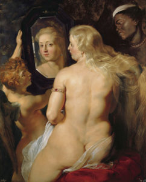

La _gordofobia_ es, en términos sencillos, la discriminación que sufren las personas gordas por el mero hecho de ser gordas.  A continuación, exploraremos diversas situaciones de la vida cotidiana en las que se manifiesta la gordofobia, con el objetivo de entender el alcance del concepto y ofrecer una suerte de concientización acerca de los efectos de esta forma de discriminación.<!--more-->

En diferentes situaciones del día a día, desde lo cotidiano a las situaciones más íntimas, la gordura es rechazada, invisibilizada, discriminada y odiada de diferentes formas. Esta discriminación se acentúa cuando se trata de _mujeres_ gordas. Los gordos son los fuertes, los de contextura gruesa, con buen apetito, mientras que las gordas son las feas, que no se cuidan, que están enfermas. No por nada la mayor parte de las mujeres, sean gordas o no, están constantemente a dieta y preocupándose de su figura; casi la totalidad de las operaciones reductivas (y estéticas) son hechas en mujeres, los productos de belleza y para bajar de peso se venden casi exclusivamente a mujeres, y la anorexia y bulimia son desórdenes eminentemente femeninos.

Las expectativas existentes en torno al género femenino ponen un gran énfasis en la apariencia personal y la belleza de las mujeres, lo cual resulta en que la sociedad sea mucho más juiciosa e intolerante respecto de cómo las mujeres se ven y lo que hacen con sus cuerpos y sexualidades. El cuerpo gordo femenino transgrede las expectativas de género, al representar a una mujer grande y fuerte (en lugar de delgada y delicada), y cuando esta gordura es acompañada de amor propio (_body positivity_), resulta en un cuerpo que se revela contra los cánones de belleza diseñados según el gusto y consumo masculino, gatillando un rechazo aún mayor. Por consiguiente, la gordura en una mujer es interpretada como negación de su feminidad, y como razón suficiente para estigmatizarlas negativamente y agredirlas verbal, psicológica y/o físicamente.

Por estas particularidades en el tratamiento del tema de la gordura es que para el presente texto nos enfocaremos principalmente en las mujeres.

## Gordofobia en la vida cotidiana

La discriminación contra la gordura es vivida en cualquier etapa de las vidas de las personas, y en prácticamente la totalidad de los espacios en los cuales nos desenvolvemos.

### La escuela

En la escuela, es típico conocer o experimentar el trato que sufren las niñas gordas, las cuales se ven inmersas en dinámicas de género que a menudo las segrega de las demás mujeres, las cuales evitan juntarse con “la gorda”, y a su vez las acerca a los hombres, los cuales reconocen a un _amigo_ en la mujer fea e indeseable (en otras palabras, sólo la mujer que deja de ser objeto de deseo –la mujer poco femenina– es considerada un igual). Efectivamente, las mujeres gordas suelen ser percibidas como menos femeninas. Dados sus cuerpos diferentes (o disidentes), se podría concluir que los cuerpos percibidos como femeninos serían aquellos que se condicen con los parámetros de belleza determinados por la mirada masculina.

### Familia

En la familia se dan dinámicas especiales respecto a la gordura: debido a que se trata de un espacio de mayor confianza y afecto, las inquietudes respecto de la gordura que serían calladas en otros espacios acá sí son dichas, sólo que maquilladas de genuina preocupación.

Comer es una actividad social, donde suelen reunirse y compartir los familiares. La mujer gorda es reprochada por sus familiares cuando se le hacen bromas o comentarios sobre lo que come o bebe, se le hacen comentarios “cariñosos” sobre su apariencia, su (in)capacidad de encontrar pareja, o su supuesta salud, así como cuando se le compara con otras familiares (primas o sobrinas) que están más flacas, “se han puesto más bonitas”, etc. A la gorda le abundan las recomendaciones no solicitadas sobre técnicas para bajar de peso y dietas; esto último pues la reunión familiar también es un espacio donde las mujeres pueden compartir las preocupaciones femeninas que no comparten con sus parejas, actuando así como “apoyos” en sus experiencias femeninas compartidas, pero también como vigilantes de desviaciones a la norma.

Este conjunto de actitudes puede producir una relación negativa con la comida, donde la mujer gorda prefiere evitar enfrentarse a estos espacios de supuesta seguridad donde de todas maneras se le recuerda su condición negativa, lo cual puede devenir en desórdenes alimenticios. Muchos de estos comportamientos, además, resultan siendo sexistas, puesto que a los hombres de la familia no se les critica ni vigila de la misma manera, sino que se les suele incentivar a comer, y se les celebra el crecimiento y el ser grandes y fuertes.

### Comida

Los excesos en la alimentación son comúnmente entendidos como el causante por excelencia de la gordura. Si sumamos a este mito el rechazo social a la gordura entendido como una desigualdad de género, cualquier relación entre _mujer_ y _comida_ resulta negativa. Así como en el ámbito familiar se critica sutilmente su consumo, en el ámito público se interpreta la imagen de la mujer gorda comiendo como un acto excesivo (como si por gordas tuviesen que dejar de comer), llevando a las mujeres a optar por pasar hambre y comer ocultas con tal de evitar la sanción asociada al _pecaminoso_ acto de comer en público siendo gorda.

La gordura es socialmente rechazada, en parte, por el subtexto inmoral que contiene el supuesto ejercicio de la gula, entendiendo quenuestra cultura obsesionada con la delgadez es capaz de entender casi cualquier ingesta puede como gula. Ergo, cualquier gorda o gordo rexultan en teoría culpables de dicho pecado, pues se cree que los gordos y las gordas están “así” porque cometieron excesos que “evidentemente” remiten una supuesta incapacidad de regularse, a un egoísmo hedónico, un consumismo ilimitado (¿No somos tod@s nosotr@s también culpables, en cierta medida, de estos mismos pecados?).

En consecuencia, millones de mujeres en todo el mundo se privan voluntariamente de una alimentación correcta (o caún patrones alimenticios problemáticos, tales como desórdenes alimenticios) para alcanzar sus objetivos de delgadez, haciéndose víctimas de un sufrimiento auto-infligido con la sola meta de acercarse a un canon estético, efectivamente castigando a sus cuerpos por no ser “como _debiesen_ ser”. En otras palabras, las mujeres se castigan a sí mismas por las insuficiencias y falencias inherentes a su género, y por lo mismo se esmeran tanto en embellecerse, “_arreglarse_”, y “verse _bien_”.

### Infancia

La preocupación por la apariencia, y principalmente por el peso corporal, se ha vuelto cada vez más en una preocupación que ha trascendido los periodos de adolescencia y adultez, afectando ahora también a l@s niñ@s. Más aún, últimamente ha crecido la tendencia de vigilar el peso de l@s bebés durante sus primeros años (pues se confunde nivel de grasa corporal con salud), introduciendo la preocupación por la estética mediante el uso de dietas desde los primeros momentos de sus vidas. Las exigencias estéticas que experimentan las niñas pequeñas se han vuelto restrictivas más allá del uso canónico del color rosado, sumando la preocupación por su apariencia física y su peso, y llevándolas a rechazar sus cuerpos en base a las inseguridades que aprenden de sus familias, los medios comunicacionales, y las expectativas exigidas por sus pares. Este interés por el control del peso de niñas y niños suele provenir de la preocupación familiar en su salud (cayendo en el error de la _salud visible_, que trataremos más adelante), o bien, más gravemente, en la interacción con sus pares de escuela que han internalizado los ideales de belleza y delgadez, o de familiares y otros significativos que les incentiven o influyan en seguir dichos ideales (lo que también puede verse en el fenómeno de las niñas que se maquillan a temprana edad).

### Relaciones de pareja

En el ámbito de las relaciones interpersonales, las mujeres gordas (de todas las edades) son generalmente rechazadas por los hombres, donde es extremadamente baja la cantidad de estos últimos que admite un gusto por las mujeres gordas (rellenitas, “grandes”, plus-size, BBW, o cualquier otro eufemismo). Sucede que los hombres (como cualquier otro grupo social) son socializados durante todas sus vidas en definiciones bastante acotadas de lo que corresponde al deseo masculino, así como sobre lo que es o no bello para los hombres. La homosocialización; es decir, la socialización que ocurre en la tendencia de los géneros a segregarse, plantea un escenario en el que los hombres internalizan de forma casi homogénea los patrones que conforman al deseo y el rol masculino en las relaciones interpersonales de corte romántico o sexual, mediante el consumo cultural y la habituación de una identidad y orientaciones de género heteronormadas. Asimismo, la homosocialización también opera en la inhibición y sanción de aquellos que difieran de la norma: al “gay”, al que no le gustan al “minas”, al que no sabe “ser hombre”, y al que se junta con “la fea”, se le humilla y sanciona socialmente.

## Vestimenta y moda

La vestimenta puede parecer un problema superfluo o vanidoso para algun@s, pero en la apariencia personal subyacen importantes formas de identificación, diferenciación, y expresión básicas para la vida en sociedad,  que son sencillamente negadas para las mujeres gordas.

En los enormes centros comerciales, donde se reúnen millones de productos y miles de consumidores, la ropa se encuentra en su mayoría en tallas bajas. Entonces, en un ejercicio tan sencillo como la compra de ropa, a las mujeres gordas se les dificulta encontrar prendas que se adecúen a sus cuerpos, que les permita reconocerse y las haga sentir como sujetos normales, merecedores de vestir un bonito vestido o de probarse un traje de baño para pasar el verano. Entre todos esos compradores y todas esas marcas internacionales, perciben que sus cuerpos sencillamente no calzan.

Vestirnos u ornamentarnos es quizás la forma más inmediata en que preparamos nuestros cuerpos a su enfrentamiento los demás; una forma de comunicación simbólica. Pero la industria de la belleza y la moda, al prestar menos atención a la existencia de cuerpos diferentes (probablemente para evitar que se relacionen sus marcas a cuerpos estigmatizados y desvalorizados socialmente), niega derechamente la capacidad de dichas mujeres de sentirse a gusto con sus cuerpos, de poder expresarse como ciudadanas en el espacio público, de mostrarse con comodidad en las distintas situaciones de sus vidas.

Es más: a las tallas grandes se les dedican secciones especiales ("ropa de señoras”), o bien se les denomina _plus size_ (o _tallas grandes_ en español). Este último es un concepto que hace ruido: ¿“Plus” respecto a qué?, ¿Al promedio? (porque el promedio corporal _es_ gordo, no delgado); ¿“Plus” respecto a la delgadez, implicando que la delgadez es lo normal, y los demás cuerpos son anormales? Al respecto, algunas autoras han empezado a usar el concepto _minus size_ para volver evidente este problema en el uso del lenguaje para representar los distintos cuerpos.

Algo tan “superficial” como la apariencia puede provocar que las mujeres sean inhibidas y segregadas de ciertos espacios, o bien que posterguen ciertas facetas de sus vidas por la inseguridad que viven respecto de su cuerpo actual.

## Medios comunicacionales

\[caption id="attachment\_82" align="alignright" width="242"\] Venus en el espejo, por Rubens (1615)\[/caption\]

Los medios masivos de comunicación son sin lugar a duda la fuente que dota de significado a las imágenes que todas y todos consumimos e internalizamos diariamente. Mediante ellos conocemos el mundo, valoramos ciertas cosas y desvalorizamos otras, y nos formamos una opinión de nuestro entorno. Es un hecho que la percepción del público general hacia las y los gordos es negativa. Pero, ¿cómo vamos a tener una imagen positiva de la gente gorda, si los medios de comunicación siempre han reproducido una imagen de la gordura como chiste, desagrado, y enfermedad?

Los medios comunicacionales no cumplen una labor imparcial. La representación que hacen de ciertos tipos de sucesos noticiosos es un ejemplo evidente: la perspectiva que se le da a las protestas y luchas sociales a menudo oculta parte de la verdad con el objetivo de moldear la opinión pública en favor de ciertas tendencias políticas. Pero también, la representación que hacen de las personas tiene consecuencias simbólicas importantes: la representación mayoritaria de cuerpos femeninos sexualizados o en situaciones y apariencias eróticas, pasivas o de sumisión, y por lo general bajo cánones de belleza occidentales y de delgadez, reproduce un concepto de belleza femenina reducido, que alimenta con muy acotadas opciones al deseo masculino hetero y dota de acotadas posibilidades de identificación femenina, siempre bajo significados de género represivos. La falta de representación de cuerpos que se desvíen de los cánones de belleza, así como la representación negativa de estos cuerpos, producen la discriminación generalizada de los cuerpos gordos y diferentes en nuestra sociedad.

## Salud y medicina

La respuesta automática que surge cuando una persona escucha la palabra _gordofobia_, o conoce acerca de otra persona que defiende o ama su cuerpo, es el argumento de la salud.

Básicamente, se repite: la gordura no es saludable, porque produce _a, b_ y _c_ enfermedad; es dañina para las personas; los gordos no se cuidan, se hacen daño; etc. Luego, se avanza a críticas más duras: las personas gordas no hacen nada para “mejorarse”, por lo tanto _no se quieren_, o: las personas gordas tienen más enfermedades, son un costo a la salud pública que pagamos todos los demás.

Yo no soy especialista en salud (y probablemente tampoco lo sea la gente que comenta este tipo de críticas), pero resulta interesante que las personas usen estos argumentos con tanta frecuencia, como si alguien les solicitara su “preocupación”. ¿Creerán que los gordos no saben que son gordos, y que con decirles les están ayudando a darse cuenta?, ¿Acaso piensan que la sugerencia de que hagan dieta le resulta novedosa a alguien que ha sido gordo toda su vida?, ¿Pensarán que los gordos y las gordas nunca han escuchado esos mismos argumentos repetidos hasta el cansancio por sus madres, por el regaño de los familiares, de la amiga preocupada, de la pareja que te rechaza, del ginecólogo, el médico general, la enfermera y hasta el oftalmólogo, del desconocido en la calle?

La medicina, pese a ser una ciencia, está plagada de sesgos —como cualquier otra actividad humana. Su sesgo gordofóbico se evidencia en la enorme cantidad de estudios que concluyen con la gordura como causa –y no como síntoma– de las patologías (inhibiendo la profundización en las causas de las enfermedades al complacerse los/las investigadores/as con la asociación entre gordura y enfermedad), como si el tejido adiposo fuese una mágica fuente de enfermedad. Los médicos (y los críticos de la gordura) caen en la tendencia a impartir diagnósticos superficiales, donde el mero avistamiento de gordura pareciera ser suficiente razón para reprochar a una paciente y ponerla “a régimen” (sin importar la causa de consulta), reduciendo el concepto de salud a lo que es meramente visible y superficial (y, en consecuencia, avivando los enormes mercados de productos dietéticos y de “cuidado” del cuerpo). De aquí surge el problema de la _salud visible_, donde las personas aprenden a relacionar lo sano son lo “bello”, incurriendo en prácticas discriminatorias hacia los cuerpos distintos, y en hábitos de consumo y automedicación preocupantes.

Pero el tema no es negar a secas la posible relación entre gordura y salud, sino ver el tema de la gordura desde otro ángulo.

Aún si cuerpo gordo fuese un cuerpo enfermo, es un cuerpo merecedor de respeto. Todas las personas, sin importar su condición física o su apariencia, debiesen tener el derecho de ser quienes son sin discriminación, de hacer lo que deseen con sus cuerpos y su apariencia, y de ser libres para ser quienes deseen ser (incluso cuando esto incomode a las flacas aspiracionales y al deseo masculino).

Aún si el cuerpo gordo fuese un cuerpo enfermo, es netamente un problema entre el/la gordo/a y sus especialistas médicos o quienes velen por su salud, y no de cualquier desconocido en la calle o en los comentarios de internet. ¿O acaso se le hostiga a las víctimas de otras enfermedades así como se les hostiga a los gordos y gordas, repitiéndoles que no se cuidaron, que están enfermos, y que no debiesen convivir felices con su condición? Este último caso deja a entrever que el problema de la gordofobia no es la mera preocupación por la salud de la gente, sino que implica algo mucho más profundo.

## Conclusiones

Todas estas diferentes experiencias vividas por las personas gordas (en este caso, como dijimos al principio, principalmente mujeres); vivencias cotidianas cuya gravedad puede ser variable para cada lector/a, se acumulan en lo que las y los gordos viven como _gordofobia_. La gordofobia, entonces, comprende comportamientos que resultan discriminatorios y hostiles hacia las personas gordas, los cuales son adquiridos por los sujetos gordofóbicos desde diversas fuentes. Estas fuentes pueden ser resumidas en:

- los sesgos de género que describen la belleza como un deber-ser femenino,
- los medios comunicacionales que negativizan a las gordas y representa a otros cuerpos en su lugar, reproduciendo ideales de belleza difíciles de alcanzar,
- los “mitos” de la belleza presentes en nuestra cultura que definen qué es bello y qué no lo es,
- el discurso de la “salud visible”, que se opone a la gordura mediante una pseudo-ciencia al servicio de un mercado basado en la existencia de ideales de belleza,
- etcétera.

En definitiva, la gordofobia es un fenómeno que afecta negativamente la vida de las personas gordas, pero lo que mucha gente ignora es que también también afecta a las personas delgadas o no-gordas. ¿Por qué?

La discriminación opera como una suerte de amenaza respecto de lo que te espera si transgredes una cierta norma. En el caso de la gordofobia, la sanción social contra la gordura (sintetizada en el presente texto) es una forma de presionar a las mujeres a adecuarse a los gustos masculinos contemporáneos, y de “castigar” a las mujeres que se oponen a obedecer estos cánones o estándares de belleza; pero por otro lado, el temor a la gordura también es un mecanismo eficiente para inculcar necesidades de consumo en las personas, las cuales, por el mero temor a engordar y el deseo a adelgazar, invertirán notables sumas de dinero con tal de evitar la sanción y obtener el privilegio de la belleza.

Por lo tanto, combatir la gordofobia es una forma de lucha contra las imposiciones de género (para hombres y mujeres), contra los discursos de odio (que alegan superioridad por el mero hecho de ser “bellas”), y contra los intereses mercantiles que difunden necesidades de consumo en la población con la finalidad de enriquecerse.

* * *

## Epílogo feminista: el objetivo de la gordofobia

Resulta complejo explicar las razones de la existencia de la gordofobia. El hecho de que la gordofobia sea un fenómeno particularmente femenino deriva de un interés cultural/patriarcal en mantener a las mujeres sometidas en el consumo y la sobre-preocupación sobre sus cuerpos, volviéndolas en especialistas (por necesidad) en prácticas superficiales que consumen su tiempo, energía y recursos (mediante cosméticos, dietas, fármacos, ejercicios, operaciones, purgas, y otros trabajos corporales).

Es decir, nuestra cultura construye a la feminidad como algo incompleto y fallido, que debe ser “embellecido” para ser valioso (ejemplo de esto es que las mujeres en su mayoría usen maquillaje facial y participen en dietas, mientras que ambas prácticas son mucho menos frecuentes en hombres). Enmarcados en una cultura patriarcal, el objetivo de lo anterior pareciera ser mantener a la mujer en una posición de sumisión, con el fin de garantizar la prevalencia masculina en los campos de poder y las causas políticas, al descalificar a las mujeres y desviar su atención a prácticas políticamente inocuas. Las dimensiones del concepto de feminidad que conciernen a la preocupación con la apariencia y la belleza, por lo tanto, operan como un mecanismo que aleja a las mujeres de las causas políticas y radicales. De esto deriva que la lucha contra la gordofobia y contra la belleza patriarcal se enmarque dentro de los múltiples frentes en oposición a todas las formas de opresión existentes.

Bastián Olea H. Sociólogo (Universidad Alberto Hurtado) Contacto: bastianolea (arroba) gmail.com
