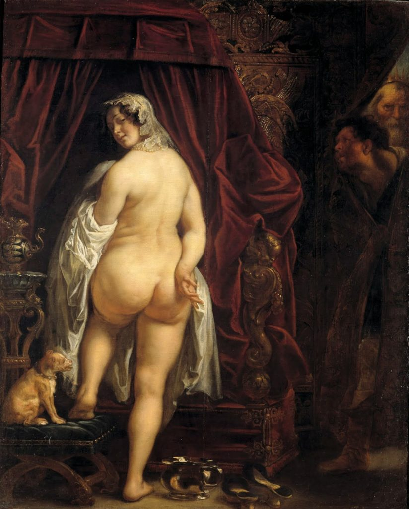

\[caption id="attachment\_100" align="aligncenter" width="824"\] “El rey Candaules de Lidia mostrando su esposa a Giges”, por Jacob Jordaens (1646)\[/caption\]

La feminidad, en tanto conjunto de valores, prácticas y expectativas, representa una especie de mandato, una _prescripción_ acerca de la manera esperada en que las mujeres deben vivir sus vidas, cuyo desacato conlleva sanción social y estigmatización. Esta feminidad está definida por múltiples conceptos, pero uno de ellos destaca de manera particular, tanto por constituir el indicio más evidente de la existencia de desigualdad entre géneros, así como por representar un conjunto de prácticas e ideales que, a pesar de caracterizarse por su difícil concreción, son seguidos por la mayoría de las mujeres, a un enorme costo emocional y económico. Nos referimos al concepto de _belleza_, cuyo ideal contemporáneo incluye una cantidad tan alta de exigencias por cumplir que resulta difícilmente alcanzable para la mayoría de las mujeres; pero a pesar de esto, sigue siendo una parte integral del concepto de feminidad exigido, en tanto la apariencia (o expresión) opera como el marcador más inmediato para comunicar e interpretar la pertenencia a un género.<!--more-->

- [Leer/descargar en PDF.](http://bastian.olea.biz/wp-content/uploads/2018/08/Feminidad-y-gordofobia.-Ideales-de-belleza-como-estrategias-de-opresión-femenina-Olea.pdf)
- [Ver en ResearchGate.](https://www.researchgate.net/publication/326720302_Feminidad_y_gordofobia_ideales_de_belleza_como_estrategias_de_opresion_femenina)
- Citar como: Olea, B. (2017). Feminidad y gordofobia: ideales de belleza como estrategias de opresión femenina. _Fanzine Imposible 1(11), 7-11._ Disponible en: [http://bastian.olea.biz/feminidad-y-gordofobia-ideales-de-belleza-como-estrategias-de-opresion-femenina/](http://bastian.olea.biz/feminidad-y-gordofobia-ideales-de-belleza-como-estrategias-de-opresion-femenina/)

* * *

Andar bien vestida, combinada –y con los accesorios pertinentes– siempre de acuerdo a la temporada y la situación; tener la piel perfecta, sin arrugas ni espinillas; no ser baja –usar tacos o plataformas– (¡pero tampoco ser más alta que tu pareja!); tu piel no puede ser ni “tan” blanca (paliducha) ni “tan” negra (¡negra!), pero siempre maquillada; tu cabello debe estar cuidado, sano y brillante, nunca despeinado, siempre en tratamiento (y para qué hablar de los pelos de aquí y allá, el arreglo de las cejas, pestañas, uñas, labios...); y, finalmente (y quizás más importante): estar delgada y mantener un tipo de cuerpo _válido_.

Durante décadas, la repetición incansable de imágenes acerca de “lo que es bello” en las mujeres ha ido inculcándonos (o, mejor dicho, imponiéndonos) una definición particular, _normativa,_ de belleza femenina. Estas imágenes las vemos en todas partes: en la televisión, las películas, la publicidad, los videoclips, y a cada minuto en las redes sociales, y mediante ellas nos acostumbramos a ver que en la(s) pantalla(s) todas las mujeres son perfectas y destacan por su belleza, expresando un rango de apariencias y corporalidades extremadamente acotado a los cánones de belleza eurocéntricos y clasistas (delgadez extrema, pieles blancas, cabello liso, eroticidad obligatoria, vestimenta restrictiva y estética por sobre funcionalidad y comodidad). El resto de las corporalidades que no se adecuan a estas normas o expectativas son sencillamente denostadas e invisibilizadas: la gente “fea” y gorda resulta casi no se ve en los medios comunicacionales, a menos que sea para la risa o representada de forma negativa, como personajes indeseables o fracasos sexuales.

Mediante el mundo de las imágenes y las representaciones nos enfrentamos al culto de la belleza, donde toda mujer que vemos representada en películas, publicidad, o redes sociales cumple a cabalidad con el ideal estético, a su vez volviéndonos conscientes de que lo que vemos en el espejo dista con creces de lo idealizado. En otras palabras, las mujeres son socialmente comparadas, juzgadas y valoradas respecto de estas imágenes omnipresentes de belleza idealizada: por ejemplo, la delgadez extrema de las actrices, modelos o cantantes famosas se constituye en un referente corporal ante el cual se evalúa la delgadez o gordura del resto de las mujeres; lo último en vestuario o maquillaje debe ser imitado para mantenerse a la moda; la imagen que tienen los demás de una misma debe ser actualizada consistentemente en las redes sociales para dar cuenta de que todo aquello que simboliza un cuerpo femenino está siendo acatado a cabalidad.

En otras palabras, esta concepción hegemónica de la belleza femenina no acaba en un ideal, sino que de ella derivan las numerosas prácticas que cada mujer es presionada socialmente a ejecutar sobre sus cuerpos en pos de acercarse al ideal de lo bello. Ahora, el mero acto de velar por la apariencia propia y de modificar distintas facetas de nuestras expresiones corporales –mediante el maquillaje, la moda, el ejercicio, el peinado, o cualquier otro trabajo corporal– no tiene nada de opresivo per se. Cada persona es libre de hacer lo que considere necesario para lograr la apariencia que desee y le acomode. Es por eso que en este texto tratamos la forma en que socialmente son _impuestas_ numerosas preocupaciones corporales que hacen conscientes a las mujeres de sus _supuestas_ fallas y falencias, y por consiguiente son presionadas a performar múltiples prácticas sobre sus cuerpos para acercarse a un ideal imposible. Este malestar se traduce en graves problemas emocionales y psicológicos: millones de mujeres se someten al hambre o a cirugías para alcanzar "su peso ideal", y otras tantas viven constantemente inseguras de sí mismas e insatisfechas de lo que son y pueden llegar a ser. Evidencia de ello es que los desórdenes alimenticios (anorexia, bulimia) sean casi exclusivamente problemas femeninos.

Así, en pos de enfrentar esta epidemia de inseguridades y acatar el mandato de la feminidad, hoy en día las mujeres incurren en altos grados de trabajo corporal: invierten gran parte de su tiempo, dinero y energías en su apariencia –algo que los hombres, en comparación, hacen en mucha menor medida. Las dietas son una de las formas más comunes de trabajo corporal: un régimen disciplinar de control sobre el apetito y la alimentación, totalmente contrario al bienestar y al placer de cada una, pero aún así practicado religiosamente por millones; la cotidiana disposición de _estar a dieta_ implica la represión del deseo individual, el rechazo del cuerpo propio, el consumo de ciertos productos y el rechazo de otros, la práctica de ejercicios o rutinas incentivadas por la disatisfacción corporal, y la inhibición de una función básica para la supervivencia. Todo esto con el objetivo de "mejorar" _un sólo aspecto_ de la apariencia femenina.

Y a pesar de lo anterior, las dietas fallan. Los resultados no se alcanzan, y la disatisfacción crece. Por más empeño que se ponga en el tratamiento de las inseguridades, la solución definitiva no existe, pues el patriarcado concibe a la mujer como un cuerpo idealizado a su gusto que en la práctica siempre será insuficiente –ya sea en su peso, su figura, estatura, su forma. Pero, ¿quién exige este ideal? La mirada del viejo que acosa a las escolares en la calle y que se divierte gritándole cosas al resto de las mujeres: no tiene tapujos para expresar abiertamente su evaluación de los cuerpos femeninos; la mirada del hombre que empieza a sentirse insatisfecho con la apariencia de su compañera: pensó que la apariencia juvenil era para siempre; la mirada de los telespectadores que se deleitan con las actrices y las modelos que ejercen roles no-protagónicos y generalmente cosificadas como adornos o meros acompañamientos; la mirada de los consumidores de pornografía, que habituados a la sumisión de los cuerpos plásticos y emaciados de las actrices, esperan y exigen (violenta, unilateralmente) lo mismo de las demás mujeres; la mirada de tantas personas –familiares, amigas o desconocidos– que de "buena fe" ponen en juicio los cuerpos femeninos, criticándoles o recomendándoles una buena dieta, o decidiendo en lugar de ellos que pueden o no comer... Literalmente cualquier persona o situación se encargará de poner a la mujer en “su lugar” dentro de la sociedad patriarcal, internalizando en ellas una inseguridad exacerbada. Luego, cualquier mirada puede ser interpretada como una potencial desaprobación silenciosa, o en el peor de los casos, de desaprobación explícita. Hemos aprendido lo que _el otro_ busca en lo femenino, lo que _el otro_ desea que lo femenino satisfaga, y cuando ese ideal no se cumple, viene el rechazo, la sanción y la estigmatización. La desaprobación nutre la inseguridad que no cesa de crecer, inhibiendo la libertad de ser como se es. Y es por esta razón de base que prácticamente la totalidad del mercado de las cirugías estéticas y de reducción de peso, y gran parte del de la moda y los cosméticos, dirigen sus ventas mayoritariamente hacia las mujeres; pero más grave aún: el acoso callejero es un fenómeno vivido casi únicamente identidades femeninas, pues en definitiva la cultura patriarcal interpreta los cuerpos femeninos como objetos. Objetos sexuales, objetos de deseo, objetos de ornamentación, objetos que consumen otros objetos en la búsqueda imposible por volverse el objeto perfecto.

Llamar _fea_ o _gorda_ a una mujer a modo de insulto es recordarle su fracaso respecto de las determinaciones de la feminidad normativa. Es una forma de decirle: fallaste en tu responsabilidad como mujer de ser bella (fea); fallaste en tu responsabilidad de ser bella _para mí_ (mala mujer). Fallaste por todo lo que comes (cerda), por todo lo que te gastas echada en vez de estar en el gimnasio (floja), por todo el espacio que ocupas y el desperdicio que eres (inútil); por ser un objeto que no me satisface (fracaso). La palabra _gorda_ usada como insulto es, entonces, reforzar el mandato social femenino de trabajar por superar la condición de insuficiencia inherente a su género, mediante la adecuación de su cuerpo rechazado al molde increíblemente estrecho que son los estándares de belleza: un molde metálico con la figura de la mujer perfecta, abierto con bisagras como un sarcófago, que en su interior tiene púas que dañan y deforman el cuerpo femenino, y que al cerrarse cercena todo lo “sobrante”… es un infame mecanismo de tortura, la _doncella de hierro_ que describe Naomi Wolf en _El mito de la belleza._

La gordofobia es una expresión explícita de este concepto belleza represivo y sexista. La discriminación sistemática de las mujeres con cuerpos más grandes que el promedio no es más que otra forma de sancionar a los cuerpos que fallan ante la norma de la feminidad, los cuerpos _no normativos_. La opresión que sufren los cuerpos gordos; es decir, la idea de que son feos e indeseables, las burlas que sufren, su representación mediática negativa, su asexualización y rechazo, refiere a una _sanción ejemplar_, puesto que su inferiorización inculca en el resto de las mujeres un verdadero temor a volverse gordas: la mayoría de las mujeres consideran el engordar como el peor destino posible, y lo evitan a toda costa, o bien, tanto mujeres apenas pasadas en unos pocos kilos de su “peso ideal” como las mujeres delgadas sufren al percibirse a sí mismas como más gordas de lo que realmente son, producto de la insatisfacción exacerbada que han internalizado. Es decir, la negativización de la gordura en tanto negativización estética, moral, socioeconómica y sexual produce un temor a engordar que somete a las mujeres a una insatisfacción constante mediante su insegurización.

El sometimiento ejercido por la presión del ideal de belleza se expresa en la dependencia en el consumo y la sobre-preocupación sobre sus cuerpos, lo cual vuelve a las mujeres en especialistas (por necesidad) en prácticas superficiales que consumen su tiempo, energía y recursos en mucho mayor grado que los hombres, desgastándolas y relegándolas al espacio de lo privado, al igual que la prescripción social del trabajo reproductivo, de cuidados y doméstico como tareas femeninas, la educación sexista que limita las oportunidades y valoración femeninas, y a la segregación ocupacional por género que divide el mundo laboral entre lo masculino (público) y lo femenino (privado). Entendido esto, podemos identificar en el ideal normativo de belleza un factor de desigualdad de género crucial, ya que reproduce la diferenciación y segregación de las mujeres respecto de los hombres en base a preocupaciones e inseguridades estéticas que _inhabilitan políticamente_ a las mujeres mediante su descalificación, insegurización, sometimiento, y desvío de los intereses femeninos a prácticas políticamente inocuas, con el objetivo patriarcal de garantizar la prevalencia masculina en los campos del poder y la política, reproduciendo la desigualdad material y simbólica entre los géneros. A fin de cuentas, esta ideología sostenida en el concepto hegemónico de feminidad no sólo cosifica e inferioriza a la mujer, sino que principalmente la relega a la esfera de lo privado, dejando el campo libre a la dominación masculina.

En conclusión, el problema no es con la belleza en sí misma, ni con el hecho de que lo femenino implique un gusto por el cuidado de las apariencias (lo cual puede perfectamente también ser una práctica empoderante y política), sino con una belleza puesta al servicio de distintas formas de opresión: (1) opresión patriarcal o de género, pues se define lo bello y lo femenino según el gusto y deseo masculino, y en una posición inferiorizada y políticamente inhabilitada; (2) opresión burguesa o de clase, pues lo bello es en gran medida una emulación del gusto y los patrones de consumo de las clases altas y un rechazo de todo lo interpretable como popular (incluyendo el hecho de que la delgadez es en gran medida una corporalidad que refleja el privilegio económico); (3) opresión colonialista, basada en patrones de belleza eurocéntricos que rechazan las particularidades estéticas y corporales negras, étnicas y latinas; (4) y una opresión neoliberal, que –mediante el control de los medios comunicacionales y los discursos sociales investidos de autoridad– configura y reproduce lo femenino como una identidad de género caracterizada por su insegurización y relegación al ámbito privado de la esfera social, y por consiguiente, excluyendo a las mujeres de los espacios de participación y deliberación política.

Bastián Olea Herrera.  
(Texto publicado en _Fanzine Imposible Nº11,_ publicación feminista sobre cuestión de género y arte)

* * *

_Apuntes y ensayos sobre estudios de género, sociología del cuerpo y teoría feminista por Bastián Olea Herrera, licenciado y magíster en sociología (Pontificia Universidad Católica de Chile)._
