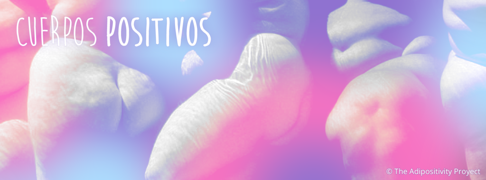

<iframe src="https://www.youtube.com/embed/7bs1TEUtfjk" width="560" height="315" frameborder="0" allowfullscreen="allowfullscreen"></iframe>

[Cuerpos Positivos](http://www.facebook.com/cuerpospositivos) es un colectivo feminista (aún en conformación) enfocado en la discriminación corporal, particularmente aquella ejercida contra las personas gordas.

Actualmente, en un contexto de presiones mercantiles y discriminaciones de género, se ha fomentado un estereotipo de belleza sobre lo que se espera de la imagen de un cuerpo, afectando principalmente a las mujeres, quienes son constantemente criticadas y medidas según su apariencia. Evidencia de esto es la enorme industria de la belleza y la moda, que basan sus ganancias en la inseguridad de las mujeres; el uso en publicidad de cuerpos femeninos “perfectos”, alterados quirúrgica y digitalmente; y la masividad de la disatisfacción que sentimos hacia nuestros cuerpos, donde incluso las personas con cuerpos socialmente percibidos como bellos sufren para alcanzar y mantenerse dentro de la norma estética.

Frente a estas (y muchas otras) discriminaciones socialmente permitidas, Cuerpos Positivos nace como un espacio de resistencia y liberación respecto de las presiones que operan sobre los cuerpos, apuntando hacia la aceptación, la diversificación, y el amor propio.

<!--more-->

Este video fue realizado por Bárbara Ugarte (quien es también la voz en off), Josefina Reyes, y Bastián Olea, para visibilizar de forma sencilla el concepto de gordofobia como problemática social. A continuación, adjuntamos la transcripción del video:

_**¿Qué es la gordofobia?**_

Es cuando la gente mira en menos, trata mal y discrimina a gordos y gordas solamente por su figura. Los gordofóbicos encuentran que la gente gorda es fea, floja, y que comen demasiado, además de un montón de otros prejuicios negativos.

Usando la excusa de que la gordura es equivalente a mala salud, la gente se cree con derecho de opinar sobre nuestros cuerpos y criticarlos. Así, desde lo cotidiano a las situaciones más íntimas, a las gordas se nos rechaza, ignora, y discrimina de distintas formas.

_**Gordura y salud**_

El primer cuestionamiento que se nos hace cuando se habla de gordura es sobre nuestra salud. La gente se pregunta: ¿Cómo llegamos a estar así? ¿Por qué no nos cuidamos? Detrás de la supuesta preocupación por la salud que amigos, familiares y desconocidos nos expresan, se oculta un mensaje negativo: “estás fea, necesitas arreglo, eres insuficiente, lo estás haciendo mal…”

Pero el punto va mas allá de que la gordura sea o no dañina, o de que sea o no una enfermedad. Ese es un tema personal. ¡Los gordos somos personas! Merecemos respeto y aceptación como todos, y estamos aburridas de que se nos repita hasta el cansancio una condición que nos vuelve víctimas de prejuicios y de rechazo.

**_La gente encuentra a la gordura fea:_**

Ser tratado de gordo o gorda es sinónimo de insulto. “El gordo” es un objeto de burla, donde su cuerpo se vuelve prácticamente su apodo, y “la gorda” suele ser “la simpática”, o nada más que “la amiga”. Por ejemplo, en la tele, las gordas son las rechazadas, las indeseables, las chistosas, o derechamente hacen el papel “de gorda”…

El discurso contra la gordura es tan fuerte, que para muchas, ser gorda es prácticamente una maldición de la que son culpables; y engordar, una pesadilla constante.

¿Por qué no podemos ser vistas simplemente como mujeres normales?

El problema es que la sociedad refuerza ideales de belleza imposibles de alcanzar: Diariamente nos bombardean con las “mujeres perfectas” en las películas, la publicidad, las modelos, ¡en todas partes! Una gorda en bikini o una modelo gorda son imágenes casi impensables!

A los hombres se les enseña que la mujer perfecta es delgadísima, y las mujeres tienen ídolas imposiblemente bellas y flacas, lo cual las presiona a bajar de peso para calzar con el ideal de belleza. Como si el sinónimo de mujer fuese ser bonita, y el sinónimo de ser bonita fuese ser flaca.

**_¿Qué significa esto para la gente gorda?_**

Todo esto hace que los gordos seamos víctimas de múltiples discriminaciones, pues los años de rechazo, maltrato  e inseguridad rompen nuestra autoestima y confianza en nosotros mismos.

La gordofobia nos hace sentir como si todos nuestros problemas personales derivaran de la gordura. Nos lleva al extremo de rechazar a nuestros cuerpos y a nosotros mismos…

**_¿Qué hacer?_**

Es necesario enfrentar todas las formas de discriminación estética que niegan la diversidad de los cuerpos, y defender la libertad de ser felices siendo nosotras mismas.

Tenemos que aprender a valorar y respetar la diversidad de apariencias y bellezas; aceptarnos y amarnos tal como somos, con todas nuestras imperfecciones, cicatrices, estrías y rollitos!

En lugar de luchar por cambiar nuestros cuerpos, cambiemos la forma en que nos vemos: Aprendamos a querer al cuerpo que ya tenemos y no al que deseamos, y amémonos dejando atrás el temor y la inseguridad por nuestra apariencia, porque nuestra belleza y valía va más allá de nuestra talla o nuestro peso.

Amémonos y empoderémonos, porque ¡Todos los cuerpos son bellos!
