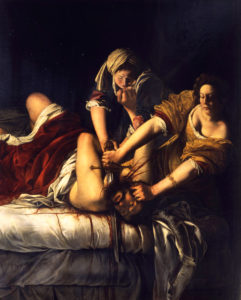

\[caption id="attachment\_128" align="alignright" width="241"\] “Judit decapitando a Holofernes” (1614), por Artemisia Gentileschi.\[/caption\]

Hace casi dos semanas, he sido foco de intenso hostigamiento por redes sociales, por el mero hecho de sostener opiniones distintas y opuestas a la de machistas y anti-feministas. Durante estos días, fotos mías, de mi perfil de Twitter, y tuits míos han rondado por páginas de estas tendencias en Facebook, y por diversos foros. El ataque ha tenido tal alcance que personas desconocidas me han reconocido en la calle al ver memes o publicaciones denostándome, y muchísimas personas me han contactado por redes sociales al verme expuesto y humillado por otros medios.

Como bien me mencionó una gran compañera, _“la violencia masculina es una realidad que se hace tangible día a día, y ahora la viv\[í\] no sólo como atento al riesgo de 'ejecutarla' en \[mi\] proceso de autoconciencia  sino como víctima, y eso es doloroso e injusto.”_ Respondo así a su incitación a despersonalizar estos ataques, e intentar comprenderlos desde un enfoque sociológico, feminista y de masculinidades críticas, para así evidenciar el alcance y profundidad de estos discursos de odio hoy en día.<!--more-->

Con esta finalidad en mente, analicé el discurso de un total de 13 publicaciones en mi contra (publicadas en las páginas de Facebook _Fanáticos de Extrema Izquierda, Zorrón Socialista_, y otras), las cuales fueron compartidas en total 1.526 veces, sumando un total de 6.104 reacciones (“me gusta”), con un número de comentarios (principalmente insultos y burlas en mi contra) cercano a 3.000. A eso se suma el _doxxing_ (publicación de mi información personal y privada como amedrentamiento), y el resto de ataques por otras redes sociales. En base a esta muestra de 422 comentarios, pretendo analizar la expresión y discursos asociados a la masculinidad hegemónico-patriarcal de usuarios de páginas de Facebook antifeministas, anticomunistas y de derecha, así como formular una crítica contra la masculinidad hegemónico-patriarcal (es decir, la forma de masculinidad imperante), y concluir con un comentario sobre los hombres y el feminismo.

El medio más común de ataque en mi contra resultó ser la divulgación de mi avatar de Twitter –en el que aparezco con el pelo largo y suelto, y una flor junto a mi nombre– y mi descripción, en la que me declaro comunista y feminista, interesado en el estudio de la gordofobia, y expresó mis tres militancia política-sociales. Pero la crítica residió particularmente en mi identificación como feminista, y mi apariencia personal.

### **La lógica del chivo expiatorio**

Aparentemente, el hecho de que un hombre pueda tener el pelo largo y exprese una apariencia insuficientemente masculina le resulta digno de burla a muchos hombres. Pareciera que, para ellos, los únicos hombres _válidos_ son los “machos recios” que ocupan su tiempo en reafirmarse como tales, ejerciendo los comportamientos patriarcales que pude ver en sus cuentas y foros. Entre ellos se encuentran: burlarse de personas LGBTIQ, acusar a sus pares de homosexualidad en broma, publicar y compartir pornografía para demostrar su deseo heterosexual, publicar fotos de mujeres (sin su consentimiento) humillándolas por su apariencia para sancionar desviaciones de la norma, y acosando o violentando mujeres para creerse dominantes. A este tipo de personas les parece impensable y sancionable cualquier alternativa a la masculinidad hegemónico-patriarcal que posibilite formas femeninas (o menos masculinas) de identificarse y expresarse. Toda práctica que les quiebre el rígido esquema heteronormado y binario del sexo/género les incomoda, por lo que recurren a inferiorizar y amenazar para exigir su orden.

Los machistas y antifeministas son grupos que se configuran en base a la inferiorización de las mujeres y las identidades LGBTIQ. Es por ello que requieren constantemente de _chivos expiatorios_ que les permitan agruparse en contra de quienes repudian (feministas, mujeres, izquierdistas, inmigrantes negros, mujeres gordas… los _otros_), con el objetivo de afianzar sus posiciones machistas, homofóbicas, xenofóbicas, anti-feministas, y derechamente fascistas. Un chivo expiatorio provee al colectivo de un sujeto que reúne vagamente un relato que les resulte colectivamente repudiable, cuyo odio sacrificial posibilita un mundo en el que puedan encontrar un sentido de normalidad y superioridad: ven validada su posición de privilegio social. Los inmigrantes que roban trabajo y traen delincuencia y enfermedades, las _feminazis_ que tratarán a los hombres como los machistas han tratado a las mujeres y LGBTIQ hasta hoy, o las personas LGBTIQ que supuestamente traerán la depravación y la inmoralidad, son algunas de las imágenes ante las cuales se configuran las ideologías reaccionarias del anti-feminismo y el derechismo “libertario”.

El modelo reduccionista de la dicotomía hombre/mujer es puesto en crítica cuando se visibilizan sujetos que salen de la norma (incluso cuando lo hacen levemente, como en este caso), y en vista de aquello los machistas y antifeministas se organizan para negar a estos sujetos, en un acto de diferenciación que afirma su posicionamiento bajo una masculinidad hegemónica: “no somos como _ellos_”.

### **Hombres feministas como traidores a su género**

Para muchos de estos hombrecitos indignados con los “crímenes” de ser feminista y afeminado, un hombre feminista supone una "traición al género masculino”. Pensar que el unirse a las filas de las luchas feministas significa una “traición” al “género masculino” equivale a admitir que son los hombres los que se benefician al reproducir el machismo y la opresión sistemática de las mujeres, puesto que, bajo su propia lógica, el hombre feminista estaría actuando en contra de los intereses de _los hombres_ (en este caso, _machistas_), quienes están interesados en reproducir el patriarcado puesto que ven en él beneficios y privilegios que rehúsan a ceder. Por lo tanto, un hombre que se desligue del machismo –que no es sino la ideología de la masculinidad hegemónica– y se ponga del lado del feminismo estaría boicoteando el privilegio masculino del que “nuestro género” disfruta y renunciando a tal beneficio, traicionando así a los hombres al oponerse a su supremacía discriminatoria, violenta y opresiva.

Un hombre feminista es identificado como un traidor a su género porque encarna una denuncia contra la masculinidad hegemónico-patriarcal: el continuo ejercicio de la renuncia a los privilegios masculinos demuestra que hay más alternativas para los hombres-cis que la masculinidad _por defecto_, desenmascarando las actitudes sexistas propias de dicha masculinidad como una opción a la que ellos acceden ya sea por ignorancia, o bien según su propia conveniencia (la conveniencia de encarnar la identidad de género que está en la cima del esquema de posiciones patriarcal).

Otra forma de ver la "traición al género" es comprendiendo la lógica de victimización que ocupan ciertos machistas para justificar su causa por los "derechos de los hombres", la cual recurre a mostrar a los hombres como víctimas de la igualdad por la que lucha el feminismo. Bajo este paradigma, se representan a los hombres como víctimas del mismo patriarcado que reproducen y defienden, alegando desigualdades sufridas por los hombres tales como: trabajos más explotadores y riesgosos, roles y expectativas masculinas rígidas, discriminación a la hora de decidir la tuición de los hijos junto a la obligación del pago de pensiones de familia, mayores cifras de víctimas de asesinatos, etc. El gran y evidente error de este paradigma es que ignora completamente que todas estas desigualdades de género que afectan a los hombres surgen justamente por la imposición patriarcal de roles de género excluyentes. Por otro lado, y de forma contradictoria a este discurso de victimización masculina, los hombres también se reconocen como víctimas de un feminismo –en tanto movimiento político revolucionario– consciente de que la redistribución equitativa de nuestra sociedad implica necesariamente _quitarle_ _algo_ a quienes poseen una parte mayor de la distribución desigual del poder y del capital; es decir, removerles los privilegios que han gozado durante siglos, tales como las oportunidades para gobernar y escribir la historia según su género, la independencia económica que les brinda su eximición de los roles domésticos, de cuidados y de crianza, la seguridad de poseer cuerpos que no son considerados objetos sexuales ni mercancías, la legitimidad profesional, académica y política que su mera expresión de género provee, la crianza bajo una educación sexista que incentiva su participación en esferas sociales política y económicamente relevantes, y un largo etcétera. Estamos ante una incongruencia que devela el carácter manipulador de esta lógica de victimización: los hombres alegan que el patriarcado también les perjudica (un falso discurso que pretende ocultar el privilegio que gozan, tachando a las demandas feministas como sesgadas e infundadas), mientras que a su vez reconocen que la realización del proyecto feminista les afectaría aún más (quitándoles los privilegios patriarcales que supuestamente “les perjudican”). Se trata de un reconocimiento implícito del interés de la masculinidad hegemónico-patriarcal de mantener impávido a un sistema social que les beneficia, y por consiguiente, de reaccionar con el repudio a cualquier proyecto de cambio social que toque esta estructura de privilegios.

Este discurso de un supuesto patriarcado que afecta a los hombres tanto como a las mujeres y un feminismo que supuestamente busca discriminar a los hombres apesta a la más rancia posverdad, ya que es pintado como una supuesta “verdad oculta” (la lógica _red pill_) que versa acerca de un orden social basado en argumentos biológicos y esencialistas (transfobia, homofobia, xenofobia, culto a la familia, repudio de lo “degenerado” y lo “enfermo”) que debe ser defendido a toda costa bajo un carisma propio del fascismo.

### **Genitalidad y falocentrismo**

Una de las grandes recurrencias de los ataques de hombres en mi contra recurrieron a la genitalidad masculina (o ausencia de ella) como insulto. Hablaron de sus penes como si correspondieran a su orgullo como hombres, literalmente la figura del falo como símbolo detentor del privilegio masculino, o bien como una credencial para disfrutar del mismo. La idea del falo se comprende desde una perspectiva bastante limitada de una correspondencia directa del sexo biológico con la identidad y expresión del género, al suponer que la posesión de pene implica necesariamente una expresión e identidades masculinas y una orientación sexual hétero. Bajo esta lógica, todo sujeto masculino que no se adecue a la norma binaria del sexo/género _sufre_ una de las siguientes condiciones: bien (a) carece de un pene, o bien (b) no merece tener uno.

Poseer un pene y recordarlo de forma constante, así como violentar y repudiar a quienes no lo tienen, resulta es una estrategia básica de reafirmación oposicional de la propia masculinidad. El pene se entiende como objeto de orgullo que simboliza la pertenencia a la masculinidad hegemónico-patriarcal, un falo que acredita el privilegio de ser (o desear ser) el dominante en todo ámbito de la vida social: efectivamente, se trata de la metáfora de “ser quien _penetra_” (quien se impone y domina de forma individual haciendo uso de su fuerza, compite con coraje sin importar el resto, se cree poseedor de quien subyuga) versus “ser quien _es_ _penetrado_” (les débiles, les inferiores, les pasivos; las víctimas de la violencia machista: mujeres y personas LGBTIQ, junto a todo sujeto inferiorizado). Aquella es una definición de las actitudes masculino-patriarcales, tal como versaba uno de los infames tuits con los que me ridiculizaban (errando su interpretación por leerlo de forma literal y no figurativa… idiotas).

Jotear _minas_, subir y compartir porno, llamar a sus amigos _maricones_ y bromear con la homosexualidad como inferiorización, denostar a cualquier hombre “sin falo”, rechazar la homosexualidad, repudio y violencia contra las mujeres con apariencias no normativas y transgénero, enviar mensajes indeseados a mujeres, fobia a cualquier indicio de feminidad en ellos mismos o cualquier otro hombre, reafirmación a lo que es y no es de hombre (por muy tonta que sea la distinción), valorar o repudiar mujeres bajo criterios sexistas... Aquellos son algunos de los comportamientos masculino-patriarcales que indican estrategias para demarcar la pertenencia al género, afirmando a la vez que diferenciando las distintas posiciones identitarias y genéricas dentro del ideal binario patriarcal. De ahí que tantos insultos recurran a una apariencia afeminada u homosexual, o a una supuesta falta de genitales. Un curioso producto de esta lógica falocéntrica es la fijación de los machistas y antifeministas con los denominados “bragapenes" (o _strap-on_ en inglés: penes plásticos acoplados a un calzón). Los bragapenes les producen gracia porque son literalmente penes postizos (o _falos desacoplables_ en la jerga de Lacan) que simbolizan una falsa masculinidad, un supuesto deseo de pertenencia a este grupo de los machos que se trunca al no poseer el falo que tanto aprecian, su supuesto certificado de inclusión en el grupo de los privilegiados. La contraparte de este concepto es la burla contra el hombre que gusta de ser penetrado, basada en un sencillo mecanismo de demarcación del nosotros vs. ellos, nosotros "los machos" en contraposición a "los huecos, las maracas, los negros", es decir, _los penetrados,_ todos aquellos no merecen compartir el privilegio masculino que los machistas tan fehacientemente defienden. Es sencillamente una lógica de discriminación cuyo objetivo es el de mantener la ficción de que los machos hétero merecen los privilegios especiales que gozan.

### **Porsilaponguismo**

Otra acusación fue la de que los hombres feministas son _porsilaponguistas_. “_Por si la pongo”_ es un concepto que refiere a actitudes realizadas con el puro objetivo de “ponerlo”, es decir, de convencer mujeres para que accedan al sexo. La premisa del _porsilapongo_ es que las acciones de los machistas remiten a engañar mujeres, pretendiendo ser de cierta manera con el objetivo de que accedan a tener sexo con ellos. Esto implica que el hombre genera un falso relato: por ejemplo, se dice _feminista_ para atraer mujeres; pero también significa que la mujer _cae_ en el engaño del porsilaponguista, de lo cual se deriva (según el discurso de estos machistas) que las mujeres son _tontas_ o _fáciles_ por haber creído en el engaño. En este sentido, _porsilapongo_ es más un insulto contra las mujeres que le creen a los machistas, quienes ven y usan a las mujeres como objetos sexuales que deben ser _conquistados_ con engaños (o violencia psicológica) para satisfacer el deseo masculino.

Una acusación de este tipo no sorprende, puesto que este grupo de hombres probablemente esté proyectando la concepción profundamente machista que tienen acerca del tipo de relación que deben mantener ante las mujeres: para el machista y el patriarcado la mujer es un objeto, en este caso un objeto sexual, por lo que toda forma de relación con ellas busca el beneficio unilateral basado en el engaño y la coerción, o derechamente la violación. La visión machista de la mujer y el feminismo es increíblemente estrecha, al nivel que toda crítica contra un hombre feminista es figurada como una estrategia para obtener sexo, una expresión de la falta de pene o testículos, o bien la posesión figurativa de vagina en vez de pene (de donde proviene el ridiculísimo y transfóbico insulto “_mangina”:_ un hombre con vagina).

* * *

Finalmente, queda enfrentar las críticas en mi contra de parte de otras y otros feministas (o antifeministas aprovechándose de una retórica esencialista y separatista de la militancia feminista), lo cual intento en [este breve texto.](http://bastian.olea.biz/la-im-posibilidad-de-ser-un-hombre-feminista/)

Bastián Olea Herrera
