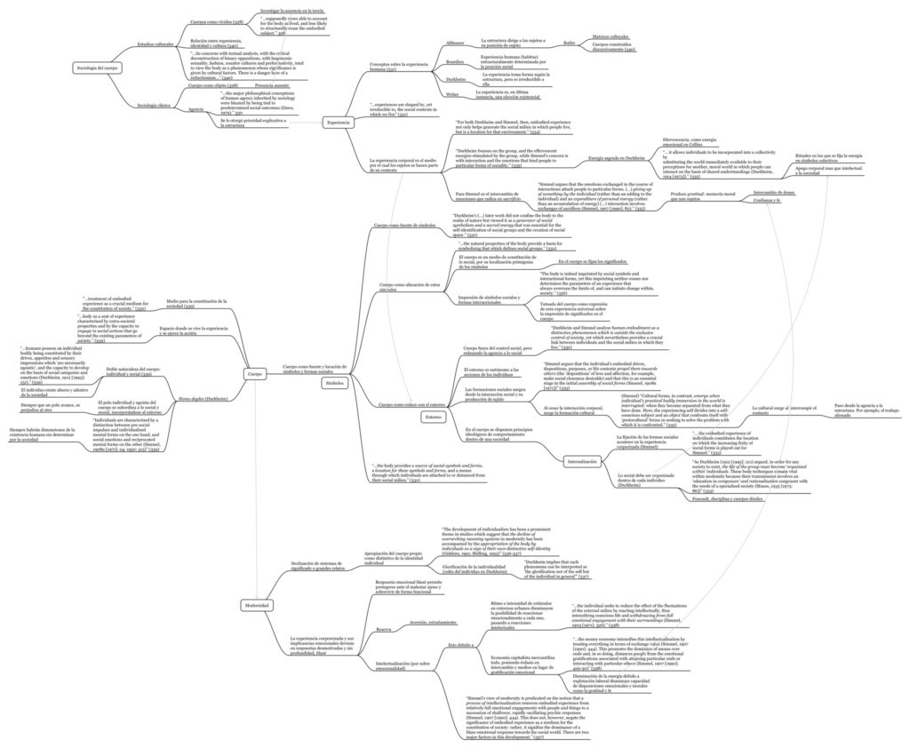
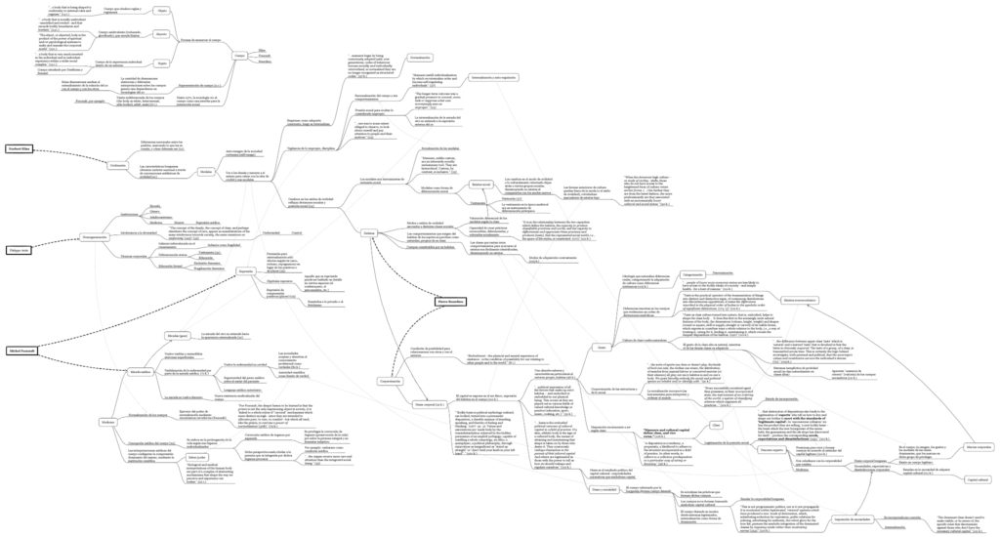
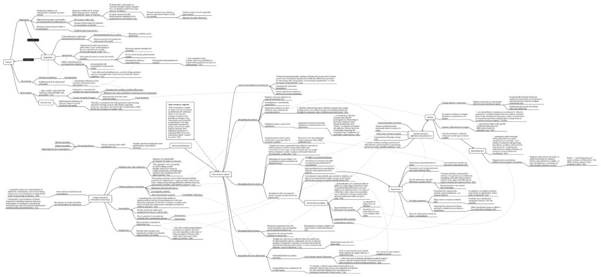

A continuación van tres mapas conceptuales producidos a partir de la lectura de tres textos sobre el concepto de _cuerpo_ para el seminario de teoría sociológica contemporánea del magíster en sociología de la Universidad Católica.

- Shilling, C. (2001). _Embodiment, Experience and Theory: In Defence of the Sociological Tradition._ The Sociological Review, 49(3), 327–344. http://doi.org/10.1111/1467-954x.00335
- Cregan, K. (2006). _Object - The Regulated Body._ In _The Sociology of the Body. Mapping the Abstraction of Embodiment_ (chapter 1, pp. 18–89). London.
- Murphy, M. (2012). _Immodest Witnessing, Affective Economies, and Objectivity._ In _Seizing the Means of Reproduction. Entanglements of Feminism, Health and Technoscience_ (pp. 67–101).

Clic en cada imagen para abrir el mapa conceptual en PDF.

## Cuerpo, experiencia y modernidad (Shilling, 2001)

* * *

## Cuerpo y gusto: Elías, Foucault y Bourdieu (Cregan, 2006)

* * *

## Ciencia y conocimiento corporizado desde el feminismo (Murphy, 2012)

