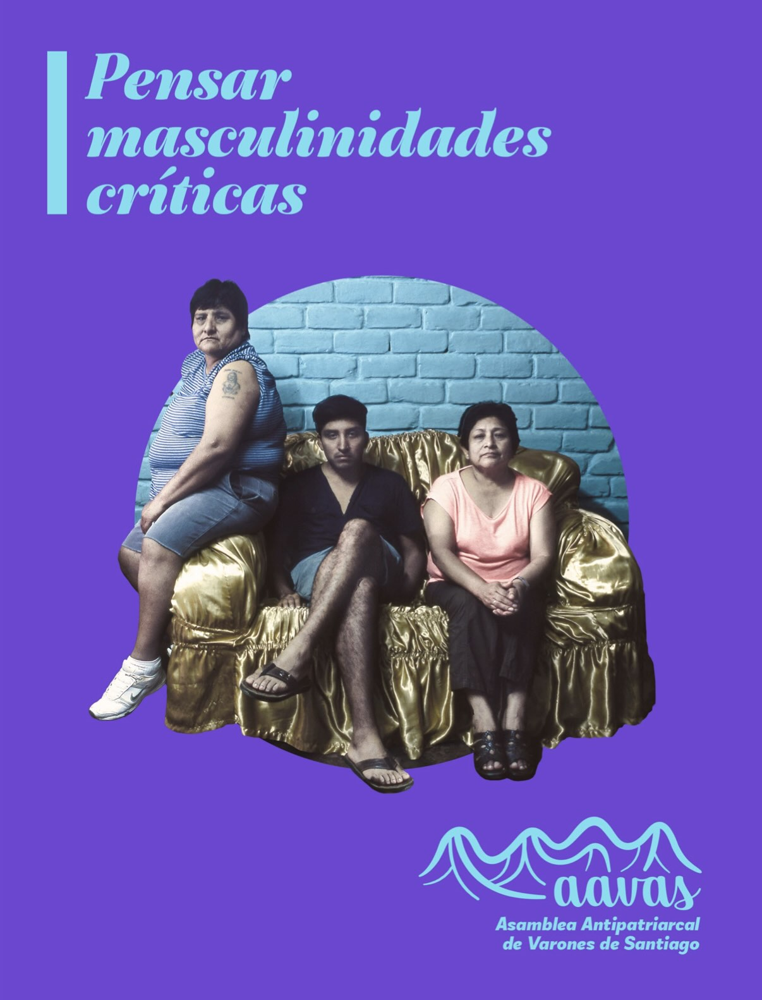
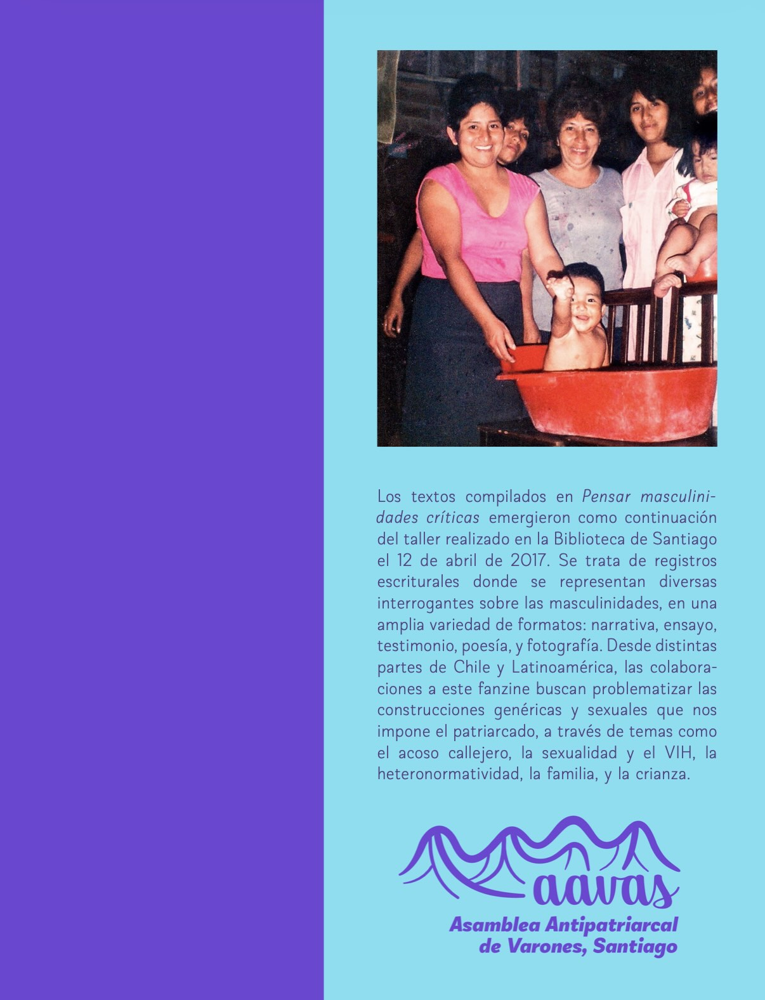

La **Asamblea Antipatriarcal de Varones de Santiago** (AAVAS) es un espacio de coordinación y reflexión para las luchas de género y sexuales que se posiciona desde el lugar problemático de la experiencia masculina (ya sea impuesta socialmente o elegida). Desde fines de 2016 ha realizado diversas actividades y talleres apuntados a nutrir la discusión sobre masculinidades y el rol de los varones dentro del combate contra la opresión patriarcal.

:::: {.centrar}
::: {style="max-width: 320px;"}

:::
::::

:::: {.centrar}
::: {.boton style="width: 240px;"}
[ Descargar fanzine](Fanzine-AAVAS-Pensar-masculinidades-críticas.pdf)
:::
::::

Los textos compilados en **Pensar masculinidades críticas** emergieron como continuación
del taller realizado en la Biblioteca de Santiago el 12 de abril de 2017. Se trata de registros escriturales donde se representan diversas interrogantes sobre las masculinidades, en una amplia variedad de formatos: narrativa, ensayo, testimonio, poesía, y fotografía. Desde distintas partes de Chile y Latinoamérica, las colaboraciones a este fanzine buscan problematizar las construcciones genéricas y sexuales que nos impone el patriarcado, a través de temas como el acoso callejero, la sexualidad y el VIH, la heteronormatividad, la familia, y la crianza.

## Prólogo

Creemos que la siguiente pregunta permite sintetizar las inquietudes que animan la gestación de este fanzine. ¿En qué medida las luchas feministas del Chile reciente nos obligan a repensar los distintos proyectos críticos en torno al problema de las masculinidades?

En esta medida, el panorama político en el que nos situamos aparece configurado por una serie de disputas: las movilizaciones a favor del aborto y el derecho sobre los cuerpos, la visibilización de la violencia y el acoso sexual en los distintos espacios (privados y públicos), las iniciativas de ley en torno a la diversidades sexuales e identidades de género, la visibilización mediática y legislativa de las identidades trans, la creciente conciencia de formas patriarcales de explotación económica (trabajo doméstico, migración, precarización de las condiciones laborales), y la articulación de propuestas y demandas en torno a una educación no sexista.

A partir de este escenario, se ha vuelto urgente discutir y precisar el lugar político que ocupamos como “varones” e identidades masculinas en dicho contexto, en un proceso que nos permita situarnos activamente en esa conyuntura y aporta desde aquella posición. Creemos necesario actuar a partir de la confluencia de una reflexión crítica de nuestras identidades y las prácticas que las instituyen. A pesar de la urgencia de este contexto, muchos hombres siguen reproduciendo y actuando bajo la lógica patriarcal y neoliberal. Los feminismos que han surgido y se constituido desde la lucha mujeres han logrado reconfigurar la forma de comprender críticamente la realidad de hoy. El problema aparece cuando aquellos a quienes socialmente se nos asigna un rol “masculino” aparecemos como espectadores indiferentes de dichas transformaciones, e incluso, manteniendo nuestras posiciones de privilegio y buscando cooptar aquellas luchas. El discurso patriarcal en sus múltiples formas ve amenazado su status quo. Incluso en las mismas organizaciones que se asumen como revolucionarias, dichas prácticas se replican, aunque cada vez de manera menos impune. Al hablar de “múltiples formas”, queremos decir que el concepto de patriarcado ha cambiado en sus dimensiones y formas de manifestación; ya no solo debe ser comprendido como una estructura rígida y ahistórica, sino como una que ha logrado reconfigurarse en formas solapadas, sutiles, progresistas, y “blanqueadas” (en el sentido coloquial y también racista de dicho concepto). Por otro lado, ¿qué ocurre con esos “otros” hombres, que han decidido iniciar un proceso autocrítica y posicionamiento con respecto al sistema patriarcal del cual provienen?, ¿de qué manera es posible ser “hombre”, reconocer el lugar de poder socialmente asignado, y construir una alternativa crítica–revolucionaria, y que, junto a ello –desde una praxis transforme la relación de jerarquía que se establece entre el binomio hombre/mujer– reconozca e inaugure nuevas alianzas y relaciones entre las distintas identidades y sexos?

Frente a esta pregunta, creemos que se evidencian dos respuestas iniciales que son insuficientes. En primer lugar, identificamos una actitud de victimización de la idea hombre, quienes reconocen la existencia del patriarcado, pero que fija la atención en las consecuencias “negativas” que este sistema tiene en su vida cotidiana en tanto hombre. Creemos que esta lectura es limitada e individualista, porque no reconoce el impacto diferencial que ejerce el sistema de opresiones, en las mujeres y en las disidencias sexuales y se sitúa, nuevamente, como hombre en el primer lugar de prioridades.

En segundo lugar, se produce un cierto autoflagelo masculino, donde se evidencian las consecuencias negativas que ha tenido el patriarcado sobre nosotros, pero que no supera el estadio de inmovilidad o emocionalidad de aquello “que no queremos ser”. Es decir, no aspira a ser transformador. Creemos que la culpa no transforma nada. Es necesario, por supuesto, analizar críticamente las consecuencias que el patriarcado ha tenido sobre nosotros y nuestra vida cotidiana, pero luego esa “sensación” debe dar paso a una crítica y práctica que modifiquen de manera radical no solo los discursos, sino también las prácticas cotidianas y sistémicas.

En esta línea, es pertinente discutir desde dónde nos interesa hablar. Nos reconocemos varones porque creemos necesario descentrar el concepto de “hombre” que históricamente ha uniformado las identidades e instalado jerarquías opresivas entre ellas. En ese contexto, esta violencia estructural se ha traducido en la aparición sistemas de género binarios; la heterosexualidad obligatoria, la subordinación política, económica, y cultural de lo femenino; y la patologización de las identidades otras. Un eje fundamental de estos procesos ha sido la hegemonía de una identidad masculina, burguesa, blanca, occidental, que configura el denominado sistema patriarcal que hoy conocemos. En este se cruzan otros sistemas de opresiones, tales como la raza, la clase, a identidad de género, la religión, el territorio. Por lo tanto, creemos que una mirada crítica de las identidades masculinas debe situarse de manera radical en la lucha contra el patriarcado. Desde ahí asumimos una perspectiva antipatriarcal, que reconoce el entramado de opresiones y busca indagar y problematizar nuestras identidades y procesos.

Nos planteamos en solidaridad de las luchas feministas, y queremos aportar a ellas respetando la centralidad y el lugar que han tenido las mujeres; sin embargo, creemos que ello no debe comprenderse como ser espectadores pasivos del trabajo de nuestras compañeras, sino por el contrario, identificar aquellas zonas donde nos compete y es urgente la transformación. Nuestra invitación reside en convocar a todos aquellos que se identifican con las identidades masculinas a materializar una lucha antipatriarcal colectiva como una responsabilidad política, en consonancia y en alianza con las problemáticas que los feminismos de mujeres han relevado, y que han modificado la manera en que percibimos hoy, críticamente la realidad.

## Índice

### Acoso
- _Qué asco_, Alex Lima
- _La violencia inherente al ser (humano) hombre_, Felipe Araya

### Heteronorma
- _Jorge el curioso_, Bastián Besnier Di Biase
- _Puta, gorda, obvia y mestiza_, Luis Enrique García Jiménez
- _Mi enfermedad es mi resistencia_, Diego Zamora
- _Frente al machoidiota que llevamos dentro, resisto_, Benjamin Prati Martínez
- _Costumbres_, César Benavides G. (Matycez)

### Familia y crianza
- _Para los niños, autitos_, Alex Guerrero
- _Joven madre, linda esposa_, Natalia Zuñiga
- _Criarse como un wacho más_, Francisco Richter
- _Taza de leche_, Juan Pablo Villalobos Gomez
- _Por nacer con pene_, Rodrigo Loyola Espinoza

### Fotografías
- _Nosotras_ (2014) y _Alexander y su universo_ (1992) (fotos de portada y contraportada, respectivamente), Alexander Caballero Díaz (Perú)
- _Eunuc_, Carlos Tacuri (Ecuador)
- _You Will Never Be a Weye,_ Sebastián Calfuqueo

:::: {.centrar}
::: {style="max-width: 320px;"}

:::
::::

:::: {.centrar}
::: {.boton style="width: 240px;"}
[ Descargar fanzine](Fanzine-AAVAS-Pensar-masculinidades-críticas.pdf)
:::
::::