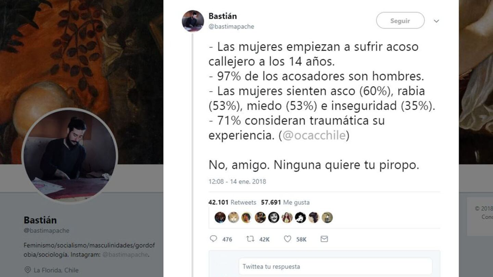

::: {.foto .centrar}

:::

> Las mujeres empiezan a sufrir acoso callejero a los 14 años; 97% de los acosadores son hombres; Las mujeres sienten asco (60%), rabia (53%), miedo (53%) e inseguridad (35%); 71% consideran traumática su experiencia. No, amigo. Ninguna quiere tu piropo"

Mensaje en Twitter que alcanzó más de 36.000 retuits y 50.000 likes.

El tweet apareció en varios medios de comunicación:

::: {.centrar}
<iframe class="iframe" style="width:100%; height: 700px;"  src="https://www.huffingtonpost.es/entry/el-tuit-que-arrasa-que-hara-que-mas-de-uno-se-lo-piense-antes-de-soltar-un-piropo_es_5c8a50d1e4b0f489d2b20018.html"></iframe>
:::

::: {.centrar}
<iframe class="iframe" style="width:100%; height: 700px;"  src="https://tn.com.ar/tecno/internet/2018/01/17/un-tuit-sobre-acoso-callejero-reabre-el-debate-sobre-los-piropos/"></iframe>
:::
