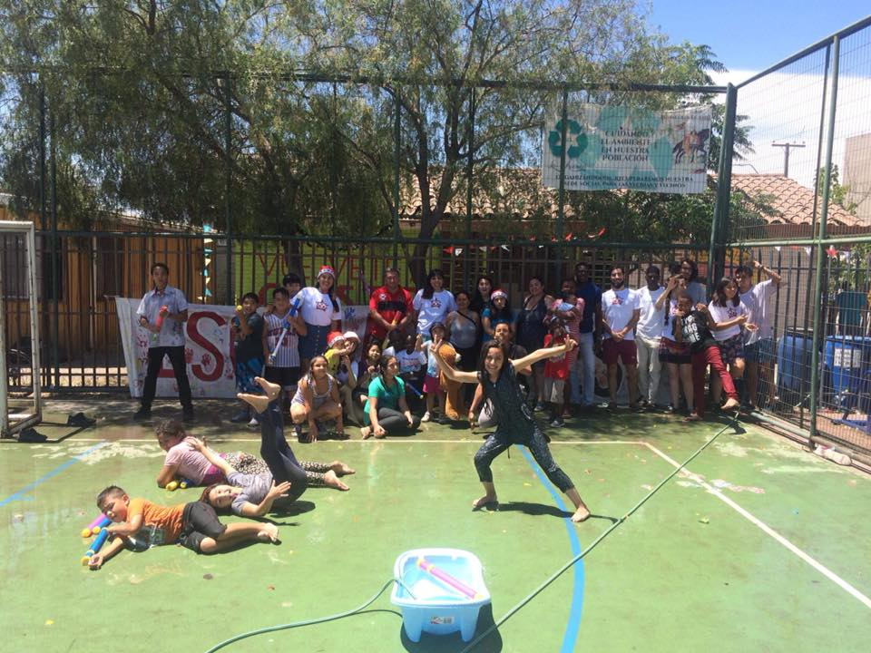
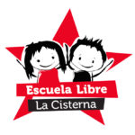

> “Vivimos en una sociedad tecnológica altamente organizada y racionalizada en la cual es raro que el individuo halle espacio para crecer y desarrollar su libre albedrío. La sociedad industrial urbana está tan altamente organizada que los niños tienen escasa oportunidad de explorar y construir su propio mundo. El movimiento de la Escuela Moderna (también conocido como el Movimiento de Escuelas Libres) del último siglo ha sido un intento de representar parte de esta preocupación. _Un intento de establecer un ambiente de autodesarrollo en un mundo superestructurado y racionalizado. Un oasis, libre del control autoritario, y un medio de pasar el conocimiento para ser libres.”_
> 
> ([«¿Por qué la educación libertaria?»,](http://www.rebelion.org/hemeroteca/cultura/educacion_libertaria230401.htm) por Pauline McCormack)

Es fuerte ver cómo tantas patologías de nuestra sociedad se expresan como síntomas en la infancia popular. En un espacio pequeño, autogestionado, que alberga en promedio a una docena de niñas y niños, es posible evidenciar las realidades familiares y socioeconómicas que viven, marcadas en sus ideas, prácticas, y cuerpos. Violencia, ausencia, adicción, incertidumbre. Son fenómenos sociales materializados en sus tempranas vidas, que dejan profundas huellas en su forma de enfrentarse al mundo. Los problemas estructurales de esta sociedad modelan las vidas y las realidades de las personas que los viven.

Nadie puede procurar llegar y sencillamente solucionar los problemas que viven las y los niños en la población. Ni la cantidad más enorme de caridad podría lograrlo. Pero sí podemos construir junto a ellas y ellos un espacio distinto, que rompa las dinámicas de poder a las que son expuestas y expuestos cotidianamente, y que les ofrezca una voz y una oportunidad distinta. No se trata de _darles_ algo, sino de que construyamos algo _juntos._<!--more-->

Con este texto quiero compartir mi interpretación personal de lo que ha sido el participar en la Escuela Libre La Cisterna, intentando exponer –en mi opinión– qué somos, qué hacemos y qué es lo que queremos.

## La escuelita libre

\[caption id="attachment\_184" align="aligncenter" width="480"\] Navidad Popular 2017\[/caption\]

La Escuela Libre La Cisterna es un organización social de educación popular en la que cada sábado un puñado de jóvenes impartimos a niñas y niños pequeños distintos contenidos valóricos, culturales, y artísticos, mediante técnicas pedagógicas participativas y críticas.

La escuelita se ubica en la sede vecinal de la población La Aurora: una construcción amarilla, de madera con techo de lata, ubicada detrás de una cancha de fútbol enrejada, a un costado de los negocios del barrio y los juegos de la pequeña plaza de cerámica. A ella asisten cada sábado aproximadamente 15 niñas y niños, cuyas edades actualmente rondan los 2 y los 13 años, con un promedio entre los 6 y 7. La escuelita opera desde el año 2010 en la población, por lo que varias de las niñas y niños participan con nosotres desde temprana edad, incluso antes de aprender a hablar, y por lo tanto tenemos también una estrecha relación con las familias y el entorno, siendo reconocidos en el sector por las demás organizaciones sociales y vecinos. A través de estos casi 8 años, hemos pretendido abrir un espacio de seguridad, creatividad, experimentación y cariño para las niñas y niños de la población (aunque vale aclarar que este texto retrata sólo la experiencia de los años recientes, ya que antes se operaba bajo otras lógicas).

La sede está íntimamente ligada con su entorno gracias a su apropiación por parte de las niñas y niños. Procuramos que el desarrollo de nuestras distintas actividades en cada jornada tenga un relato que una a niños y niñas con este espacio, de manera que puedan sentirlo como propio, siendo dueños del mismo. El objetivo es que la escuelita no sea un espacio utilitario –donde acudan a buscar algo por mera conveniencia– ni un espacio alienante –donde tengan que volverse en otra cosa (alumnos, por ejemplo) para desenvolverse correctamente–, sino un espacio de libertad por y para los niños. La escuela tiene características, lugares, historias, y simbolismos que les entrega una identidad, relacionándoles con el lugar en tanto éste ha sido construido y dotado de sentido por ellxs en el día a día. La escuela es tanto de las niñas y niños como de las tías y tíos.

Quienes participamos en este proyecto tenemos una estrecha relación afectiva con la escuelita. Como tratamos con niñas y niños en situación de vulnerabilidad, y con historias de vida complejas, reconocemos un compromiso especial con la causa, participando disciplinadamente en el proyecto e intentando dar lo mejor de nosotrxs, aún teniendo escasos recursos, poco tiempo, y poca formación. En virtud de ello, no participamos del proyecto como meros _voluntarios,_ sino como _militantes,_ pues entendemos el compromiso que conlleva el trabajar en estas condiciones con nuestras niñas y niños, haciendo propia la causa de la educación popular con disciplina y perseverancia. No nos consideramos _monitores,_ pues nos comprometemos con un proyecto político de horizontalidad, participación, cooperación y democracia, y por consiguiente, operamos como iguales ante las niñas y niños de la población. Tampoco somos sus _profesores,_ ya que buscamos distanciarnos totalmente de las lógicas de la educación formal. En la escuela militamos aproximadamente seis _tías_ y _tíos_ (como han decidido llamarnos afectivamente las chicas), en su gran mayoría mujeres, donde ninguna ostenta un cargo más alto que las demás, y todas compartimos las labores y el poder de decisión dentro del proyecto. Todos nuestros recursos los autogestionamos, ya sea haciendo actividades para recolectar fondos (como completadas), o bien, distribuyendo los gastos entre las tías y tíos de acuerdo a su capacidad de aportar.

La escuelita es nuestra militancia política, donde buscamos hacer realidad un proyecto colectivo que da cara a las desigualdades e injusticias producidas en por el capitalismo, sufridas con mayor intensidad en los sectores vulnerables, caracterizados por la pobreza feminizada, la delincuencia, la drogadicción, la inmigración (que atrae el racismo y la explotación), la prostitución, el machismo y la violencia, todos estos intersectados en un territorio que ha sido engendrado entre estas complejas relaciones de poder.

\[spacer height="1px"\] \[facebook url="https://www.facebook.com/escuelalibrelacisterna/videos/1967898323468556/"\]

## Nuestros objetivos como educadoras y educadores populares

Dadas las escasas herramientas que tenemos, nos propusimos emprender un cambio discursivo –o contrahegemónico, si podemos llamarlo así– en la experiencia de los niños y las niñas que viven en La Aurora. Esto significa, en abstracto, trabajar para contrarrestar los valores neoliberales, individualistas, y patriarcales que impregnan nuestra realidad. Queremos asistir en el desarrollo de niñas y niños que sean sujetos críticos, conscientes de su entorno. La capacidad de desafiar lo determinado es clave como herramienta para superar las desigualdades naturalizadas. En este sentido, la cooperación es primordial, pues nos remite a una forma de entender el mundo y ubicarse en el territorio que es opuesta al individualismo neoliberal, desde la cual se pueda gestar la organización comunitaria de carácter emancipatorio. En otras palabras, lo que buscamos es romper –muy de a poquito– con el esquema ideológico que la cultura hegemónica nos inculca: las expectativas de competitividad económica de carácter individualista, que deshumanizan la vida al volverla un ciclo de trabajo y consumo fundado en la subsistencia egoísta; o las formas patriarcales de relacionarse con los demás y con el espacio, que incentivan la violencia, la opresión, y la inferiorización de los demás como estrategia de supervivencia, en lugar de la comunidad, la igualdad y el apoyo mutuo.

\[spacer height="1px"\] \[Best\_Wordpress\_Gallery id="3" gal\_title="Escuelita 1"\]

\[spacer height="1px"\]

Buscamos que nuestras y nuestros niños puedan apartarse, si tan solo un momento, de la injusta realidad que viven. Tenderles una mano para desenredarse del entramado de las relaciones de poder que los ubican en los márgenes y la inferiorización social. Ofrecemos la _horizontalidad_ en lo que de otra manera sería una relación de autoridad, la _cooperación_ en lugar de un ambiente estricto de superación en clave personal, la _afectividad_ y el _apoyo emocional_ en vez de la frialdad del aula o los problemas domésticos, el _respeto a la diversidad_ y el _amor propio_ para superar la discriminación sistemática, la _participación_ que contrarreste la ausencia de espacios que reconozcan la voz de la infancia, y el _feminismo_ como el conjunto de ideas que nos lleva a superar las inequidades y la rigidez represiva de los roles que nos han determinado.

A través de la socialización en este espacio distinto, donde ponemos en práctica estos nuevos valores y formas de relacionarnos, construimos un espacio de resistencia mediante la educación popular. Pero antes que lo abstracto, urge comprender que las niñas y niños no son receptores pasivos de ideas políticas, ni tabulas rasas abiertas a valores contrahegemónicos. La educación popular, debido a sus bases libertarias intransables, rechaza el componente disciplinar de la educación formal, el componente autoritario presente en los discursos dominantes, y con mayor razón prescinde del componente coercitivo que podría existir en la dimensión familiar. Por lo tanto, ni la imposición ni el adoctrinamiento son métodos válidos para los educadores populares. En este sentido, lo primero siempre será incentivar un interés y una capacidad de participación genuinas acerca de las nuevas formas de relación y aprendizaje conjunto que se buscan implementar, pues entendemos la educación popular como una una dinámica pedagógica que no puede ser forzada.

## La experiencia de la escuelita

No es sencillo llevar a la práctica ideas que van contra la corriente de la educación formal y la socialización neoliberal, más aún en un contexto social complejo. La experiencia política que se adquiere en el contexto universitario, entre estudiantes privilegiados y académicamente formados, resulta prácticamente inútil para tratar con gente real. Traducir ideas políticas a la realidad, para ser capaces de interpelar sustantivamente a las niñas y niños, es un trabajo lento y que se aprende en el día a día, y que no siempre genera los resultados que se esperan. ¿Cómo hacer que los nuevos valores contrahegemónicos (la cooperación, la democracia, la horizontalidad, etc.) resuenen entre las niñas y niños, si resultan tan opuestos a las lógicas que se viven cotidianamente en la población?, ¿Cómo explicar –por ejemplo– la igualdad de género a niños que han formado su criterio y personalidad en contextos de machismo?, ¿De qué manera invitar a pensar en los mundos que queremos construir sin quedarnos en el mero discurso?

Tratar con niños de tú a tú, sin los dispositivos que generan un desnivel entre adultez e infancia, los revela como iguales, sujetos íntegros con historias y motivos detrás de su actuar, y por sobre todo, como interlocutores válidos. Este es uno de los primeros aprendizajes que se obtienen al acercarte a la infancia en una modalidad horizontal. La educación popular, a diferencia de la educación formal, busca que tanto educadores como educandos sean _sujetos,_ en contraposición a considerar a los estudiantes como objetos pasivos, meros receptores del saber impartido por el o la docente. Al valorarse equitativamente a todas las partes involucradas, significa que estamos todxs en un proceso de aprendizaje, reconociendo que también las _tías_ y _tíos_ tenemos mucho que aprender de las niñas y niños. Este es un proceso educacional dialógico, donde la interpelación es constante, y los puntos de vista en juego son tantos como subjetividades presentes en el aula. Así, evitamos la jerarquía en el conocimiento al reconocer que el niño o la niña tiene tanto que compartir con nosotros los tíos que nosotros con ellos, sobre todo cuando se refiere a la realidad que viven y sus experiencias; por ejemplo, las del racismo, al tratar con niños hijos de inmigrantes. Mediante el diálogo conocemos diversas realidades, y en conjunto entrelazamos nuestras perspectivas.

\[spacer height="1px"\] \[facebook url="https://www.facebook.com/escuelalibrelacisterna/videos/1950756685182720/"\]

## Nuestras jornadas

Cada sábado tenemos nuestras jornadas, que se extienden desde las 10:30 a las 15:00 horas. Apenas llegamos a la sede, abrimos los candados y hacemos el aseo para prepararnos a recibir a nuestras niñas y niños. Distribuimos rotativamente las tareas necesarias, o bien, de acuerdo a la capacidad de cada unx. Así, algunas nos quedamos ordenando y armando el desayuno, y las demás nos dividimos para ir a buscar a sus hogares a las niñas y niños.

\[spacer height="1px"\] \[Best\_Wordpress\_Gallery id="5" gal\_title="Escuelita 2"\]

\[spacer height="1px"\]

 

Hay algo especial en ir a buscar a las niñas y niños a sus casas, y es que los vemos en otros contextos: con sus familias, chascones en piyama, corriendo emocionados de vernos. Además de notar las diferencias en el comportamiento en la casa y en la escuelita, intentamos retroalimentarnos con las madres/abuelas/cuidadoras de las niñas y niños para saber cómo han estado, y cuáles son sus necesidades escolares. Conociendo el contexto familiar de las niñas y niños se vuelve posible comprender sus personalidades: las historias de violencia, abandono, alcoholismo, abuso y pobreza dejan su marca, y es algo terrible.

El dinero que manejamos de las actividades de autogestión lo usamos para costear los desayunos. No entendemos estos como asistencialismo, sino como una instancia de compañerismo para compartir, ponernos al día con la vida de cada una y cada uno, y reír un rato junto a una comida que procuramos sea saludable y rica. Celebramos los cumpleaños, conversamos de cómo nos sentimos y cómo nos está yendo, y a medida que terminamos nuestra comida vamos saliendo a jugar, para que cuando ya estemos todes listas y listos pasemos a las siguiente actividad: _la mística._

### La mística

\[spacer height="1px"\] \[Best\_Wordpress\_Gallery id="7" gal\_title="Escuelita 3 Mística"\]

Intentamos darle una identidad a las jornadas que tenemos a la escuelita. Nuestra primera actividad cada sábado, luego de reunirnos y haber desayunado, es la _mística._ En ella, abrimos la jornada mediante una especie de asamblea realizada en nuestro pequeño patio, en cuyo centro plantamos un canelo, en torno al cual participamos de una especie de acto ritual que esté relacionado al tema principal de la jornada, finalmente cerrando con _el grito_ de la Escuela Libre. La idea de esta asamblea es iniciar un diálogo en torno a alguna inquietud o temática en particular que surja desde el interés que hemos percibido entre las niñes y tíos/as, o bien tratamos alguna efeméride o hecho de la contingencia nacional. Traducimos las palabras e ideas compartidas en un ritual que usualmente toma la forma de adornar uno a uno nuestro canelo con mensajes, dibujos, deseos, o reflexiones, a la vez que lo regamos para que siga(mos) creciendo. Las dinámicas que realizamos en la mística tienen como objetivo introducirnos a la temática de la jornada, pero también reforzar nuestro sentido de pertenencia e identidad dentro de la Escuela Libre, por lo cual la dinámica siempre remite a algo del territorio concreto: enterrar deseos, plantar semillas, adornar la sede, pensar el espacio, pensarnos a nosotres. La participación es clave, porque entre palabra y palabra, ya sea de la asamblea o de lo que las niñas quieren compartir (mediante papeles o dibujos) en la dinámica, podemos sondear las actitudes y nociones que manejamos sobre la temática que trataremos en la jornada, y así generamos un conocimiento común para poder dar pie a la actividad principal de mejor manera.

Las temáticas que tratamos son diversas y contingentes. Hemos hablado sobre ecología, sobre lo que es la solidaridad, sobre la diversidad de cuerpos e ideas, sobre la no violencia, sobre la violencia de género, e incluso sobre el sistema de AFP, la drogadicción, y las elecciones presidenciales. Cuando nos olvidamos de los estereotipos sobre lo que es o no es tema “para niños”, damos con sus reales capacidades.

\[spacer height="1px"\] \[facebook url="https://www.facebook.com/escuelalibrelacisterna/videos/1987535958171459/"\] \[spacer height="1px"\]

Finalizando la mística, una tía o tío ordena el mesón dentro de la sede para que, al culminar la dinámica y hacerse el grito de la escuelita, entremos a hacer nuestras tareas. Las niñas y niños traen sus materiales desde sus hogares (libros de ejercicios, cuadernos, etcétera), y cada tía dedica su atención en un par de niñas o niños según criterios de afinidad o de habilidad para la tarea en cuestión. Quienes no tengan tareas se quedan preferentemente dibujando en el mismo mesón, o bien saliendo a jugar, pero también hay algunxs que prefieren quedarse ayudando a otres niñes en sus tareas.

### Las actividades

Como generar interés es lo primordial en una pedagogía que no se basa en la jerarquía ni la coerción, y considerando las bajas edades de nuestras niñas y niños, no sirve llegar y hablar directamente de un concepto en abstracto. Nuestra pedagogía se desarrolla en la práctica y la didáctica, y no en el pizarrón.

\[spacer height="1px"\] \[Best\_Wordpress\_Gallery id="9" gal\_title="Escuelita 4 Actividades"\]

\[spacer height="1px"\]

Las temáticas que introducimos en la mística son planificadas con antelación en reuniones periódicas de tías y tíos, donde preparamos una calendarización de temáticas, místicas, juegos y dinámicas para ir usando durante los meses venideros. La actividad es el momento principal de cada jornada, donde tratamos de forma práctica la temática del día. En general, se trata de juegos, manualidades, o dinámicas que aludan indirectamente al tema a tratar, de manera que el contenido sea percibido por la niña o el niño según su propia experiencia de la actividad, sin que nosotres tengamos que depositar conocimiento en ellxs.

A continuación tenemos varios ejemplos de actividades que hemos realizado en distintas jornadas a través de los años recientes. Cada ejemplo es un enlace a un álbum de fotos de dicha actividad en [nuestra página de Facebook.](www.facebook.com/escuelalibrelacisterna)

- [Hacer votaciones con urna para enseñar de qué se trata votar y cuál es la importancia de participar en procesos de decisión de mayorías.](https://www.facebook.com/pg/escuelalibrelacisterna/photos/?tab=album&album_id=1988208021437586)
- [Conocer los derechos de los niñ@s a través de una búsqueda del tesoro.](https://www.facebook.com/pg/escuelalibrelacisterna/photos/?tab=album&album_id=1879310125660710)
- [Escribir nuestras biografías para reconocer nuestras diferencias y reflexionar sobre nuestras historias.](https://www.facebook.com/pg/escuelalibrelacisterna/photos/?tab=album&album_id=1953428414915547)
- [Disfrazarnos de trabajadores y trabajadoras, para entender distintos roles y cómo todos son importantes para vivir colectivamente.](https://www.facebook.com/pg/escuelalibrelacisterna/photos/?tab=album&album_id=1900235500234839)
- [Reconocer la diversidad y nuestras diferencias con juegos, inventando personajes de dibujo con sus propias historias.](https://www.facebook.com/pg/escuelalibrelacisterna/photos/?tab=album&album_id=1967889873469401)
- [Hacer títeres con estos personajes para utilizarlos en juegos de roles.](https://www.facebook.com/pg/escuelalibrelacisterna/photos/?tab=album&album_id=1975601469364908)
- [Aprender lo que es una constitución llevando a cabo nuestro propio proceso constituyente.](https://www.facebook.com/pg/escuelalibrelacisterna/photos/?tab=album&album_id=1721401524784905)
- [Un pasacalles para concientizarnos acerca de la violencia de género.](https://www.facebook.com/1636627599928965/photos/?tab=album&album_id=1793081090950281)
- [Compartir experiencias sobre la población recorriéndola.](https://www.facebook.com/pg/escuelalibrelacisterna/photos/?tab=album&album_id=1900231653568557)
- [Aprender sobre teatro popular como herramienta para expresar distintas situaciones.](https://www.facebook.com/pg/escuelalibrelacisterna/photos/?tab=album&album_id=1735707583354299)
- [Recrear situaciones vividas en nuestra población mediante el teatro para luego analizarlas de forma crítica.](https://www.facebook.com/pg/escuelalibrelacisterna/photos/?tab=album&album_id=1741253602799697)
- [Reconocernos unos con otros dibujando retratos contra el tiempo.](https://www.facebook.com/pg/escuelalibrelacisterna/photos/?tab=album&album_id=1636760126582379)
- [Usar el teatro foro para identificar en conjunto problemáticas y sus soluciones.](https://www.facebook.com/pg/escuelalibrelacisterna/photos/?tab=album&album_id=1950759631849092)
- [Aprender matemáticas mediante técnicas alternativas.](https://www.facebook.com/pg/escuelalibrelacisterna/photos/?tab=album&album_id=1807919866133070)
- [Conocer el periodismo haciendo nuestras propias entrevistas y revistas.](https://www.facebook.com/pg/escuelalibrelacisterna/photos/?tab=album&album_id=1645345752390483)
- [Aprender de cosmovisión mapuche conociendo su lengua y ceremonias.](https://www.facebook.com/pg/escuelalibrelacisterna/photos/?tab=album&album_id=1917462488512140)
- [Reflexionar sobre el cuidado del medio ambiente haciendo cajitas de reciclaje.](https://www.facebook.com/pg/escuelalibrelacisterna/photos/?tab=album&album_id=1967887510136304)
- [Carreras de obstáculos para reconocer y rechazar distintas formas de violencia.](https://www.facebook.com/pg/escuelalibrelacisterna/photos/?tab=album&album_id=1797029897222067)

En todas estas actividades buscamos desarrollar distintas habilidades que puedan servir para conocernos y aceptarnos, aprender a expresar nuestras opiniones y sentimientos, para problematizar el mundo que nos rodea, y para aprender a convivir en respeto y armonía: conocernos, expresarnos, criticarnos, y cuidarnos. La idea de la actividad no necesariamente es dejar claramente delimitados estos aprendizajes, sino compartir una experiencia que nos pueda hacer sentido mediante dinámicas atractivas e inclusivas, donde las tías y tíos no tan sólo guíen las actividades, sino que también participen e incentiven la participación, y donde las niñas y niños de las edades más diversas puedan participar activamente.

\[spacer height="1px"\] \[facebook url="https://www.facebook.com/escuelalibrelacisterna/videos/2004582679800120/"\]

## Educación popular

Buscamos dar una voz a quienes han sido marginados –ya sea por su condición, posición o identidad– de la producción de saberes y las tomas de decisiones. La educación popular es el ejercicio horizontal, participativo, y comunitario de la auto-educación y la auto-organización. Mediante la educación popular facilitamos el aprendizaje y la concientización bajo los términos y las necesidades de las propias niñas y niños. La autogestión de este espacio (auto)educativo nos permite recuperar el control de nuestras comunidades al volvernos los agentes y gestores, dirigiendo al proyecto de manera democrática y bajo los lineamientos que nos parezcan propicios, que son, en términos generales, una oposición al asistencialismo y la verticalidad, y un ejercicio de resistencia en cada oportunidad.

### Fines políticos de la Educación Popular

Desde nuestra experiencia, entendemos que la educación popular tiene fines políticos, en tanto no se trata de ofrecer educación de forma asistencialista o como un fin en sí mismo, sino como un ejercicio con metas que van más allá de la formación de sujetos.

\[spacer height="1px"\] \[Best\_Wordpress\_Gallery id="11" gal\_title="Escuelita 5"\]

\[spacer height="1px"\]

Un primer fin político sería el de (1) dar voz a quienes actualmente no la tienen. Y es que la educación popular pretende trabajar con quienes se encuentran en los márgenes y las identidades históricamente negadas: en nuestro caso, la infancia popular en contextos de pobreza y vulnerabilidad social. Una aproximación dialógica al trabajo con niñas y niños permite que la práctica de la educación popular, sean cuales sean los temas que se estén tratando, devenga en un proceso de validación de la infancia como sujetos válidos, que se desenvuelven en un espacio que les es propio, donde pueden expresarse de manera abierta y libre, sin las trabas de la jerarquía escolar, la sociedad adulto centrista, o la familia absorbida en sus propias dinámicas.

En segundo lugar se encontraría (2) la producción de conocimiento territorializado y contextualizado como fin político, entendido como el conjunto de prácticas y afectos que sitúan a las niñas y los niños como sujetos de saber en su territorio, dando un lugar a sus conocimientos, ideas, teorías, inquietudes y percepciones propias en el proceso de aprendizaje, en tanto saberes y aprendizajes que han surgido de una experiencia particular y rica que suele ser vulnerada sistemáticamente al descalificarla como inocente, ignorante, simplista, vulgar, errónea… infantil.

Un tercer objetivo político de la educación popular sería (3) la producción de conocimiento “desde abajo”, es decir, en un contexto de horizontalidad situado al nivel de las niñas y niños, desde el cual el conocimiento infantil recogido en el diálogo y la experiencia compartida pueda ser levantado y reconocido, dejando atrás la concepción de los niños y las niñas como receptores de conocimiento, para pasar a una lógica donde la infancia sea reconocida como sujetos de saber, reformando nuestros criterios de objetividad para integrar perspectivas otrora invisibilizadas a nuestra comprensión del mundo.

Estos tres fines políticos se acercan a una noción feminista en torno al conocimiento y la ciencia, la cual reconoce que todo conocimiento proviene desde un lugar de enunciación situado en matrices de opresión cargadas de poder, y que por lo tanto, aquello que conocemos como objetividad responde a un proceso de producción de conocimiento que ha impuesto ciertas nociones por sobre otras de manera sistemática. Reconocer a las niñas y los niños como sujetos de saber constituye una respuesta política a una noción hegemónica del conocimiento y la ciencia que valida sólo ciertos saberes (los producidos por sujetos situados en una matriz neoliberal, urbana, adulta, blanca, masculina y occidental), y esto se hace a través de una revalidación de conocimientos históricamente acallado, ofreciendo nuevas perspectivas situadas desde los márgenes, y que por lo tanto son capaces de levantar saberes y contenidos que han sido ignorados por el conocimiento hegemónico.

A través de este humilde espacio de organización social, lo que pretendemos no es hacer un cambio radical en la visión de mundo de niñas y niños, ni tampoco ejercer una resistencia significativa a las desigualdades sociales que se materializan en el territorio y las vidas de las niñas y niños. Ambos objetivos se escaparían con creces de nuestras capacidades. Quizás, simplemente lo que intentamos hacer es _prefigurar_ una forma educación configurada bajo una lógica distinta, una _otra_ educación, tal y como esperaríamos que fuese la educación y el trato que damos a la infancia en la sociedad del futuro.

\[spacer height="1px"\] \[facebook url="https://www.facebook.com/escuelalibrelacisterna/videos/1917459951845727/"\] \[spacer height="1px"\]

La Escuela Libre La Cisterna pretende ser un espacio por y para lxs niñxs, donde existan las garantías de poder participar, aprender y experimentar de forma libre, donde la infancia sea reconocida como protagónica, donde y todas y todos seamos iguales en derechos y valor, y donde la autoridad y la racionalización que norma nuestras vidas se suspenda –al menos por unas horas– para construir un espacio propio desde abajo, dotado de _nuestro_ sentido y afecto, sin preocuparnos por reglas, verdades, o notas.

En este sentido, esperamos que los niños y niñas se sientan reconocides gracias al apoyo que nos entregamos, del cual nacen lazos de afecto recíprocamente provechosos para nuestro desarrollo conjunto. Si bien el apoyo docente, como el estudio de las materias escolares que les cuestan más o hacer las tareas juntxs, representa una prioridad para las familias, es tan sólo una entre las actividades que realizamos, y que para nosotres es tan importante como conocernos, escucharnos, jugar, y aprender de lo cotidiano.

Entendemos esta experiencia holística de reunirnos, dialogar, y aprender en conjunto como una forma de _recuperar el control de nuestras comunidades,_ en el sentido de que con recursos mínimos damos vida a un espacio literalmente asolado por la drogadicción, el tráfico, el alcoholismo y la violencia. Con el esfuerzo y la perseverancia de grandes y chicos construimos este espacio seguro para la infancia donde abundan los valores con los que pretendemos combatir los anti-valores de una sociedad altamente desigual y dañada, recuperando así, también, el control sobre nuestras vidas.

Juntando nuestras manos con nuestras ganas y esperanza, procuramos dar a las niñas y niños un espacio al margen de las instituciones y las distintas formas de autoridad, y protegido de las violencias y estigmatizaciones, para producir un cambio positivo en sus vidas (y en las nuestras también).

_Bastián Olea Herrera._

