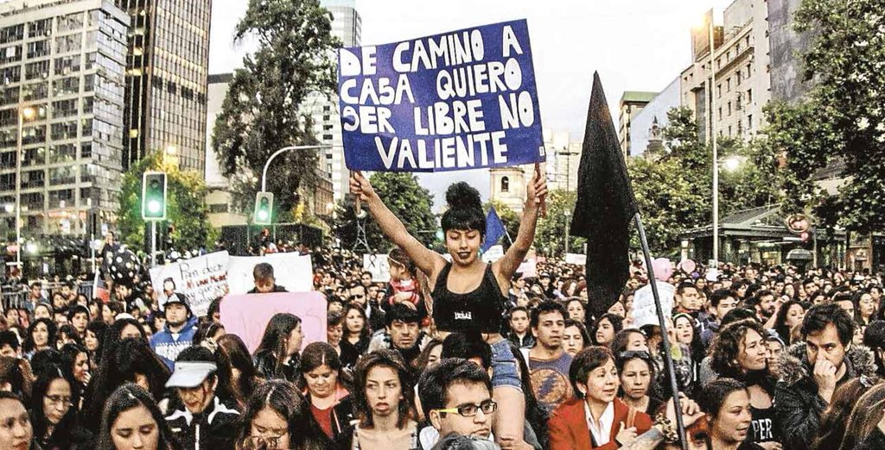

El tema del _acoso callejero_ empezó a discutirse en redes sociales y medios comunicacionales luego de que ciertos sucesos puntuales plantearan al _piropo_ como algo permisible, parte de la coquetería o galantería masculina, o incluso, como algo que puede ser deseado por algunas mujeres. [Miles de testimonios de acoso callejero](https://twitter.com/i/moments/953156389374976001) fueron tuiteados por mujeres hartas de la normalización de esta forma de violencia. Muchos de estos testimonios fueron plasmados en [el libro digital “Somos muchas: Historias de acoso callejero y otras malas yerbas”](https://www.dropbox.com/s/gumnjiraxrf8ivw/somos_muchas..pdf?dl=0), donde se exponen temáticamente algunas de las historias más representativas.

La discusión sobre piropo y acoso callejero tomó diversas aristas: desde discusiones semánticas sobre lo que es o no un piropo, sobre si el piropo es o no acoso callejero, o sobre si existe un supuesto piropo aceptable; hasta casos de mujeres que sí gustan de los piropos, pasando por tantas situaciones de piropo como piropos mismos han sido recibidos por mujeres.

Entendamos el _piropo_ como un comentario no solicitado sobre la apariencia o cuerpo de una persona, en su mayoría enunciado por hombres hacia mujeres. Un piropo no es sinónimo de acoso callejero, sino que es uno entre muchos otros componentes del acoso callejero. Un piropo también puede darse en un contexto privado, como en el lugar de trabajo o el lugar de estudios. En ambos casos (en el ámbito público y privado), un piropo constituye una forma de acoso sexual, en tanto refiere a un avance sexual no solicitado de tipo verbal, ya sea una invitación, solicitud, opinión, comentario, o expresión de naturaleza sexual que usualmente refiere al cuerpo o apariencia de las mujeres.

En un nivel más abstracto de análisis, fuera de casuística, anécdotas o excepciones, lo cierto es que el piropo es machismo.<!--more-->

\[tweet https://twitter.com/bastimapache/status/951249250217791493\]

Desglosemos el tuit anterior para comprender a fondo por qué piropear es una expresión de machismo.

## Abordar mujeres sexualmente sin su consentimiento

No hay problema alguno con un elogio consentido, emitido hacia alguien con quien existe confianza, complicidad romántica, o bien algún tipo de relación sexoafectiva. Pero algo totalmente distinto es abordar verbalmente a una mujer sin su consentimiento. Si bien el piropo generalmente se piensa como dicho en la vía pública, la realidad es que también son dichos en lugares de trabajo y estudio, por compañeros de oficina, jefes y superiores, colegas, y compañeros. Debido a lo anterior, lo negativo en el piropo no es el hecho de ejercerlo _en la calle o la vía pública_, sino hacerlo _sin el consentimiento de la mujer_, sea en el lugar que sea. Esto debido a que el piropo contiene componentes sexualizantes y cosificantes: es decir, un hombre aborda de forma sexual a una mujer con la cual no tiene relación/confianza previas, ya sea mediante la expresión de una intención o invitación, reduciéndola a un objeto con el cual sólo tiene una intención o relación de tipo sexual; o bien, un hombre se refiere a una mujer solamente a partir de su apariencia o los aspectos de su corporalidad que él guste, reduciéndola a un objeto, un mero cuerpo que suscita interés únicamente por su belleza. Ambos recursos (sexualización y cosificación) son formas de reducir a las mujeres a factores que la remueven de subjetividad y la tornan en un objeto dispuesto al gusto, voluntad, y consumo masculino. Eso es machismo.

En estos aspectos, el piropo es una forma de transgredir no sólo los derechos de las mujeres, sino también su dignidad. Ejercido en la vía pública como acoso callejero, el piropo hostiga a las mujeres, produciendo temor, inseguridad, e incomodidad (incluso asco), al ser intimidada mientras ejerce su libertad de transitar. Ejercido en el lugar de trabajo o estudio, el piropo reafirma la concepción machista de que la mujer es un objeto de disfrute y deseo para el hombre, al tratarla como un mero cuerpo o una mera potencial pareja sexual, invisibilizando las capacidades profesionales de las mujeres. En otras palabras, tratar con piropos a las mujeres (así como tratarlas con diminutivos o con términos distintos a los que se usan para referir a varones del mismo estatus, como corazón, chiquilla, o anteponer artículos al nombre), corresponde a una forma de desmerecer discursivamente los avances y logros de las mujeres en el ámbito laboral o académico, y reducirlas a la concepción machista de la mujer como un objeto normativamente bello, dispuesto al disfrute sexual masculino, de comportamiento sumiso, e inferior en múltiples aspectos a los hombres (que no son piropeados en la calle ni en sus lugares de estudio o trabajo, y en general son tratados con el respeto que les corresponde).

## Sexualización de una mujer desconocida

El acoso callejero empieza a ser sufrido por mujeres desde apenas los 10 años. En otras palabras, hay hombres que piropean a niñas de 10 años de edad. Los hombres en general (y no sólo un puñado de ellos, ni un grupo específico de desviados) _sexualizan_ abiertamente a las mujeres –es decir, las ven y se refieren a ellas sólo desde un dimensión sexual– muchas veces sin importar si ellas son menores de edad. Ello no lo hacen únicamente porque las encuentren atractivas, pues si así fuera, perfectamente podrían guardárselo y quedarse en silencio. Si enuncian su atracción abiertamente, debe ser porque estos hombres sienten la urgencia de hacerle saber públicamente a las mujeres que les resultan atractivas, con implicancias implícitas o explícitamente sexuales. Es decir: no contentos con sexualizarlas en sus mentes, incurren en hacer pública y directa su sexualización de las mujeres.

¿De dónde viene esta necesidad? Los hombres no piropean y sexualizan mujeres por alguna suerte de masculinidad innata, ni existe justificación hormonal o evolutiva alguna para este comportamiento masculino reprochable. Los hombres piropean (y luego acosan, abusan, agreden y violan mujeres) debido a que son criados bajo una cultura patriarcal que los valida e insta a realizar estos comportamientos y tratar de dicha manera a las mujeres. Se trata de un problema sociocultural, en el cual los hombres son formados como tales (es decir, internalizan una determinada forma de masculinidad) a través del machismo y el sexismo presentes en nuestra cultura y sociedad, entendiendo al _machismo_ como un determinado conjunto de actitudes que posiciona a los hombres por sobre las mujeres, y al _sexismo_ como un sistema que perpetúa las diferencias entre los géneros, a su vez subordinando a las mujeres.

Una cultura machista forma a los varones bajo expectativas de masculinidad que implican demostrarse viriles (es decir, competitivos por tener sexo a temprana edad, de forma frecuente, de ciertas –misóginas– maneras, y con la mayor cantidad de parejas posible), deseantes de aquello que es _de hombres_ (es decir, de culos, tetas, y de sólo cierto tipo de mujeres: las normativamente bellas que aparecen en la pornografía y la televisión), y superiores a sus pares en lo que supuestamente los define como hombres (el curioso y hasta patético fenómeno de _demostrar hombría_). Este tipo de masculinidad es conocida como masculinidad patriarcal o hegemónica (por ser socialmente amparada), y naturaliza en los hombres ideas, deseos y comportamientos misóginos hacia las mujeres, además de comportamientos tóxicos, agresivos, egocéntricos y competitivos entre los hombres.

Una sociedad patriarcal tiene al sexismo en sus cimientos. Por ello, se configura de tal manera que las diferencias entre los géneros sean interpretadas como diferencias naturales derivadas del sexo biológico. En otras palabras, se naturalizan la correspondencia directa entre el sexo (biológico) y el género (social), así como la heterosexualidad como norma de las relaciones de pareja, del gusto, y del deseo. Por consiguiente, ambas esencializaciones (binarismo de género y heteronorma) sustentan y reproducen la idea de que las mujeres _son_ de cierta manera y gustan de determinadas cosas (pensemos en las "cosas de mujeres", el "ser señorita", el "verse como una dama", los ideales de belleza), y que los hombres _deben ser_ de otra manera y que también gustan de otras cosas (distintas a las de las mujeres, "cosas de hombres"), junto a la creencia de que las mujeres deben responder a ciertos roles y comportamientos subyugados, ya sea en la casa, en el trabajo, o en la cama.

Este conjunto de complejos fenómenos sociales (que sin duda no traté exhaustivamente) constituyen al sistema denominado _patriarcado,_ bajo el cual los hombres son social, discursiva, representacional, institucional, y cuasi-legalmente amparados para oprimir a las mujeres, figurándolas como su propiedad, y por ende apropiándose de su trabajo (productivo, reproductivo, doméstico, de cuidados) y de sus cuerpos, otorgando un contexto sociocultural en el que acosar mujeres es algo que puede llegar a ser justificado e incluso normalizado.

Comprendiendo lo anterior, no cabe duda alguna de que un piropo "inverso", dicho por una mujer a un hombre, _no_ se realiza en el mismo contexto de opresión que un piropo dicho por hombres a mujeres, el cual es una forma de violencia de género más ubicada en el continuo de violencias propias del patriarcado. En efecto, cuando se habla de temas de género, "dar vuelta" las situaciones o empatarlas nunca es apropiado, ya que el contexto sociocultural en el que ocurren dichas situaciones es inherentemente desigual.

## Imposición unilateral de opiniones y deseos

En la enorme mayoría de los casos, [las mujeres no quieren ser piropeadas.](https://twitter.com/i/moments/953155328421646338) En general, esto es debido a que nadie querría que un hombre desconocido interrumpiera su trayecto por la vía pública con el comentario innecesario de una opinión no solicitada. A pesar de esto, los hombres insisten en su _derecho_ a piropear mujeres y tratarlas de manera machista. Y es que piropear a una mujer es una expresión de machismo, pues implica considerar al cuerpo femenino como un cuerpo público, dispuesto al escrutinio masculino y a su interpretación abierta. El cuerpo de una mujer sería un cuerpo dispuesto a la validación masculina, que los hombres hacen explícita mediante el piropo. A pesar de que los hombres saben que no encontraran respuesta a su –simbólicamente violento– halago, se complacen habiendo expresado su deseo en lugar de reprimirlo. La sociedad patriarcal ampara la impunidad masculina de carecer de un imperativo de represión acerca de impulsos sexuales con desconocidas, ya que lo considera propio de la masculinidad, parte de la galantería, de un supuesto mayor líbido masculino (el mito de que “los hombres son más calientes”), o simplemente de un “favor” que se le hace a la mujer para “subirle la autoestima” o “reconocer la belleza de la mujer chilena”.

Pero el piropo no es coqueteo ni cortejo, porque es por definición unilateral. Como ya mencionamos, se basa en la necesidad de hacer público un deseo por parte del hombre, y esto se lleva a cabo en bajo relación desigual de poder: en la seguridad del anonimato callejero, abusando de una posición de autoridad (laboral, universitaria, familiar), o bajo la amenaza implícita de una intención más turbia que la mera verbalización del deseo. Debido a ello, el piropo es una imposición unilateral y no un diálogo, pues no concibe a la mujer como sujeto, sino como un objeto de deseo al cual se le impone de forma no consensuada e impune una intención, opinión, o deseo, forzando en ella la imagen de un deseo sexual no solicitado, con repercusiones emocionales y psicológicas negativas.

La unilateralidad del piropo es grave, ya que es sabido que responder negativamente a un piropo es arriesgarse a que el agresor escale dicha forma de acoso verbal hacia la violencia directa. Este riesgo real y reconocido por las mujeres hace que un “inocente” piropo callejero refiera sutilmente al temor de ser abusada sexualmente. Esta unilateralidad de un supuesto halago que al ser rechazado se vuelve en insulto o violencia nos indica que, para el piropeador, su objeto de deseo (la mujer) es sólo tal al ser absolutamente sumisa. Es decir, el piropo no se trata únicamente de manifestar atracción o deseo, sino de hacerlo de forma impositiva y en un rol de dominancia, donde cualquier resistencia sea encontrada con la violencia correctiva de un macho incapaz de tolerar el desacato de lo que inconscientemente considera como su propiedad. El acosador-piropeador no acepta un no por respuesta, porque en su mente machista las mujeres deben someterse a su voluntad, y su _palabra de hombre_ es siempre la última palabra.

## Ignorar lo que la mujer puede llegar a sentir

Desde el punto anterior se desprende que el piropo, en tanto acoso callejero y/o acoso sexual, se ubica dentro del continuo de violencias de género.

\[tweet https://twitter.com/bastimapache/status/952557941885939713\]

La violencia de género es un continuo, pues el machismo es un factor común a todas sus expresiones. Basta que este machismo se ejerza sin resistencia para que un hombre se sienta en la posición de ejercer estas violencias, justificándose ideológicamente desde su machismo para ir subiendo el grado de violencia, terminando en el femicidio. Todo puede empezar con un simple piropo, que es una transgresión, una cosificación, una sexualización, y una deshumanización de la mujer. Lo que sigue, para el machista, es (de manera escalofriante) algo contextual. El hombre machista progresa por el continuo de violencias que ejerce: un hombre que se sienta con el derecho de abordar sexualmente a una mujer con un piropo –transgrediendo su dignidad– también puede sentirse con derecho de correrle mano a otra, o de robarle un beso, de manipularla psicológicamente para hacerla cumplir sus deseos, que ejerza coerción para tener sexo con ella, que amenace a quienes se le nieguen, que violente físicamente a quienes se resistan, que viole a aquella que no lo desee, o que finalmente asesine a la mujer que transgredió su posición como Hombre.

El piropo de un desconocido provoca miedo, asco, inseguridad, rabia, y genera traumas en las mujeres. Es un acto machista que gatilla el temor del continuo de violencia. Dado esto, el solo hecho de que una mujer pueda recibir negativamente un piropo debiese ser razón suficiente para no piropear mujeres.

## Piropo como fantasía de poder sobre las mujeres

Finalmente, el acoso callejero, o en nuestro caso, el piropo, no es más que una forma de reafirmar el poder patriarcal sobre las mujeres: el poder de expresión impune y unilateral que vulnera sexual y emocionalmente a las mujeres, que valida socioculturalmente a los hombres a abordar sexualmente a cualquier mujer que deseen, como si éstas fueran de su propiedad. Es un acto de demostración de su posición (superior) como hombres dentro de una sociedad patriarcal, que al realizarse reproduce performativamente los roles de género patriarcales.

Piropeando, los hombres machistas reproducen los cuerpos femeninos como cuerpos públicos, y reafirman su propiedad sobre estos cuerpos. Subyugan a las mujeres al gusto masculino, manteniéndolas bajo la amenaza implícita de que no son más que objetos para su consumo. El hombre sabe que la mujer no quiere su piropo, pero igual la piropea. Sabe que la intimida. Sabe que le falta el respeto. Sabe que ella seguirá cuadras más adelante pensando en el piropo, con temor, asco. Que llegará a contarlo a su casa o a sus amigas. El hombre lo hace porque le excita esa reafirmación de su poder masculino sobre las mujeres que desea. Recibe placer de su fantasía de poder sobre las mujeres. Les hace sentirse superiores.

Bastián Olea Herrera.

* * *

# Epílogo: ¿Cómo acabar con el acoso callejero?

¿Cómo acabar con el acoso callejero? No se acaba culpando a las mujeres de vestirse, moverse, o mostrarse de tal o cual manera. Las mujeres debiesen ser libres de ser como deseen, y recibir el respeto y los derechos que merecen como seres humanos. Quienes vulneran el respeto y los derechos de las mujeres son los hombres, específicamente aquellos hombres que viven masculinidades de tipo patriarcal o hegemónicas, que son las masculinidades inculcadas en los hombres por la cultura patriarcal. Por consiguiente, acabar con la masculinidad hegemónica y proponer nuevas formas de masculinidad –críticas con el patriarcado, antipatriarcales– llevaría a acabar con los acosadores que vulneran mujeres como si fueran objetos de su propiedad.

Los hombres tenemos demasiada cercanía con machistas, acosadores y agresores. Son nuestros amigos, compañeros, otros varones, y hasta nosotros quienes reproducen/reproducimos estas prácticas propias de la masculinidad hegemónica, y que sustentan al patriarcado como sistema.

[Los hombres debemos acabar con nuestra complicidad en la violencia de género.](https://twitter.com/i/moments/942276336693010433) Debemos interrumpir y criticar a nuestros pares cuando los veamos caer en actitudes machistas, como el acoso callejero, para así intentar romper con la impunidad que existe gracias a los hombres que encubren y validan las actitudes machistas de otros hombres.

Como acto seguido, debemos comprometernos a aportar a la lucha feminista desde la lucha antipatriarcal. Denunciar, educar, formar, y criticar entre varones. Al patriarcado se le derrota acabando con sus cómplices machistas. Y eso también es responsabilidad de los varones.

Bastián Olea Herrera.
