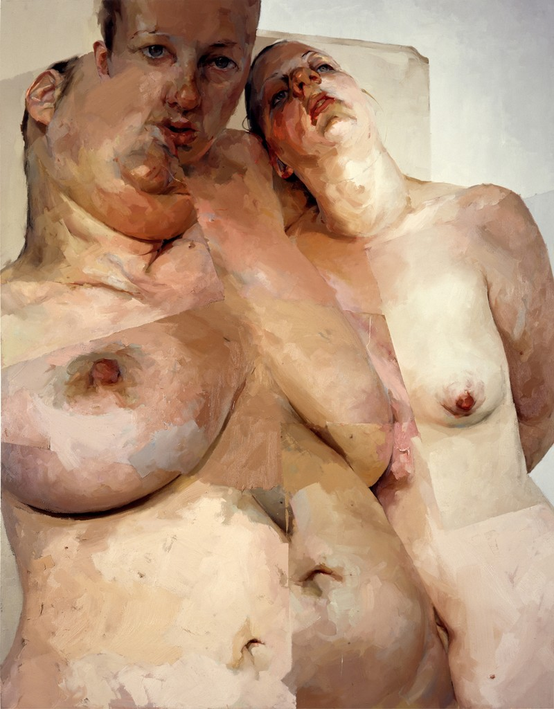
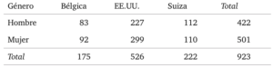
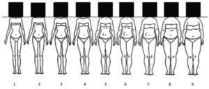
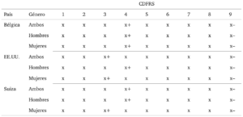
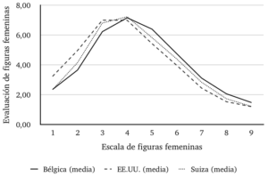
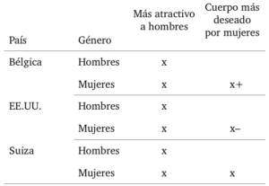
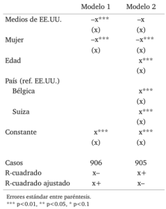
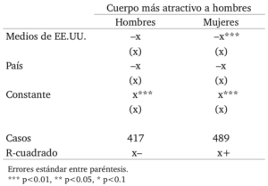
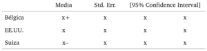
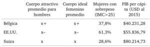

Este artículo pretende analizar el efecto que tiene la exposición a medios comunicacionales en la evaluación de la imagen corporal femenina, utilizando datos empíricos mediante una perspectiva comparada que abarcará muestras de origen universitario de Bélgica, Estados Unidos, y Suiza. El estudio se basa en un marco teórico que comprende la internalización de ideales de belleza de acuerdo a teorías de _aprendizaje social, comparación social,_ y _disatisfacción corporal_; así como una reseña de los procesos de _cultivación_ y _resonancia_ a partir de la exposición a medios masivos de comunicación.

Las hipótesis puestas a prueba son: (H1) una mayor exposición a medios comunicacionales de origen estadounidense aumentará la valoración de corporalidades femeninas delgadas, y (H2) ésta mayor exposición a medios generará mayor disatisfacción corporal en mujeres.

Los datos provienen de los resultados del la encuesta _International Body Project_ (IBP-I), un levantamiento de datos acerca de ideales corporales y disatisfacción corporal que abarcó 26 países en 10 regiones del mundo, publicados por primera vez en 2010 por Viren Swami et. al. en _The Attractive Female Body Weight and Female Body Dissatisfaction in 26 Countries Across 10 World Regions._ Lamentablemente, y por solicitud de Swami, no estoy autorizado a compartir los datos, a pesar de haberlos obtenido directamente desde las y los académicos que los levantaron. Esto produjo que el artículo (que fue desarrollado como investigación final para el ramo de Sociología Comparada del Magíster en Sociología UC el 2017) fuese imposible de publicar, por lo que lo reproduzco –con los datos censurados– a continuación.

<!--more-->

- [Leer/descargar en PDF.](http://bastian.olea.biz/wp-content/uploads/2018/08/Imagen-corporal-y-exposición-a-medios-de-comunicación-censurado-Olea.pdf)
- [Ver en ResearchGate.](https://www.researchgate.net/publication/326720310_Efecto_de_los_medios_comunicacionales_en_la_evaluacion_de_la_corporalidad_femenina_en_Belgica_Suiza_y_Estados_Unidos)
- Citar como: Olea, B. (2017). Efecto de los medios comunicacionales en la evaluación de la corporalidad femenina en Bélgica, Suiza y Estados Unidos. _Bastián Olea H. Sociología, género, y la estigmatización de la gordura femenina._ Disponible en: [http://bastian.olea.biz/efecto-de-los-medios-comunicacionales-en-la-evaluacion-de-la-corporalidad-femenina-en-belgica-suiza-y-estados-unidos/](https://wp.me/p5E5dC-3O)

* * *

## **1\. Introducción**

Los cuerpos pueden ser entendidos como superficies sobre las cuales la cultura se inscribe. La percepción del cuerpo propio acontece mediante procesos mentales individuales, que fluctúan y devienen en distintas disposiciones en respuesta a los discursos y contenidos enunciados por múltiples fuentes socioculturales, entre ellas los medios comunicacionales (Myers & Biocca, 1992, p. 108).

La percepción que los individuos se forman acerca de su propia corporalidad –y la de los demás–  acontece mediante procesos de socialización convencionales, los cuales comprenden, entre otros mecanismos, la internalización de una amalgama de discursos sobre la corporalidad a los que los sujetos se encuentran expuestos. Ella produce una _imagen_ corporal, en tanto esta puede diferir de la apariencia física, variando según múltiples factores sociales (Ibíd., p. 116), emocionales o culturales a los que se esté expuesto/a. La imagen corporal constituye un aspecto íntegro del bienestar físico y mental de los individuos (Dittmar, 2009, p. 1), pues un desarrollo negativo de la misma puede ser causa de graves trastornos psicológicos (Grabe, Ward, & Hyde, 2008, p. 460; Mellor et al., 2013, p. 550).

A partir de estas ideas preliminares, el presente texto analizará el efecto que tiene la exposición a medios comunicacionales en la evaluación de la imagen corporal femenina, poniendo a prueba dicho cuestionamiento mediante una perspectiva comparada que abarcará muestras de origen universitario de tres países: Bélgica, Estados Unidos, y Suiza.

Durante décadas, los movimientos feministas han denunciado una y otra vez la manera en que los mensajes culturales hegemónicos –imbuidos naturalmente de contenidos de corte patriarcal y sexista– determinan la valoración o desvalorización arbitraria de los cuerpos femeninos bajo distintas categorías. La categorización social de los cuerpos femeninos de acuerdo a sus tamaños y formas, adjudica valoraciones implícitas a cada corporalidad, donde la gordura suele ser interpretada como indeseable y poco femenina, la obesidad catalogada como una epidemia, y la delgadez idealizada y celebrada en tanto supuesta simbolización de belleza y salud. En otras palabras, se plantea la existencia de imágenes corporales femeninas interpretadas positiva o negativamente. Para fines de este texto, nos abocaremos a las dimensiones del _tamaño corporal_, entendidas como el peso, talla, o tamaño de los cuerpos femeninos, comúnmente distribuidos desde lo delgado a lo gordo (u obeso, bajo el concepto médico).

Desde la teoría de género se ha argumentado que la constitución de lo socialmente positivo, en cuanto a lo femenino concierne, ha sido implantado históricamente por medio de la amenaza de sanción respecto de imágenes normativas de comportamientos y apariencias generizadas (Butler, 2014). El discurso hegemónico, permeado de categorías patriarcales, acepta y refuerza cierta imagen de corporalidad femenina, mientras sanciona a las que se desvían de ella en la forma de discriminación y estigmatización de aquellos cuerpos que difieren de la norma: los cuerpos sexual, estética, racial y genéricamente _otros_. La feminidad como discurso normativo deviene, entonces, en un conjunto de prácticas femeninas necesarias de enactar en pos de la adscripción a la imagen normativa (Bartky, 1988).

En efecto, lo occidentalmente femenino se define en gran medida por la categoría de _apariencia_, probablemente debido a su relevancia como marcador para expresar e interpretar la pertenencia a un género. Que la preocupación por el peso, apariencia y tamaño corporal sea mucho mayor en la población femenina que la masculina es muestra de ello (Rothblum, 1992).

Como el concepto indica, los _ideales de belleza_ corresponden a características físicas socialmente valorizadas que en la dimensión corporal remiten a la delgadez femenina bajo un criterio cultural de distribución de características sexuales secundarias específicas, las cuales a pesar de ser prácticamente imposibles de alcanzar para el general de las mujeres (Fallon, 1990), se mantienen como el referente estético socialmente enactado para el género femenino (Heinberg & Thompson, 1995, p. 325).

Las múltiples y constantes fuentes de presión social respecto del ideal de delgadez y belleza a las que las mujeres se ven expuestas han acabado _erosionando_ la imagen corporal en términos generales (Feingold & Mazzella, 1998, p. 190), derivando en una tendencia global hacia la _disatisfacción corporal_ (Nasser, 2005). Esta transnacionalización de los ideales de belleza aconteció en función de la globalización de los medios comunicacionales occidentales (Orbach, 2010), puesta en movimiento por la masificación de la televisión, que procuró a cada rincón del globo con imágenes y discursos homogéneos sobre feminidad y belleza femenina (Mellor et al., 2013; Swami, 2015, p. 46; Swami & Tovée, 2007). Esto se ve expresado en el aumento paulatino de la disatisfacción corporal en países no occidentales (Mellor et al., 2013, p. 552).

Existe amplia evidencia acerca de (1) el efecto de la exposición a medios occidentales en la preferencia por cuerpos delgados (Dittmar, 2009; Harrison & Cantor, 1997, p. 41; Irving, 2001, p. 259; Swami et al., 2010, p. 320), (2) el efecto de la publicidad que incluye cuerpos delgados en la generación de disatisfacción corporal (Bordo, 2003a; Myers & Biocca, 1992) y la adscripción al ideal de delgadez (Bermúdez et al., 2009; Saa Espinoza, 2014), y (3) del efecto de la exposición a imágenes mediáticas de cuerpos adscritos al ideal de delgadez en el aumento de la preocupación corporal en mujeres (Grabe et al., 2008; Groesz, Levine, & Murnen, 2002).

Entre las multiples influencias que juegan un rol en la difusión y transnacionalización de ideales corporales femeninos y la disatisfacción corporal, se encuentran los medios masivos de comunicación, dominados por un ideal de delgadez. La prevalencia de una preferencia generalizada por corporalidades femeninas delgadas podría, entonces, ser interpretada como síntoma de una hegemonía occidental en la definición y reproducción de imágenes normativas respecto de lo femenino (Becker & Hamburg, 1996, p. 163; Bordo, 2003b). En vista de ello, nuestro enfoque en los medios comunicacionales busca esclarecer la relación de los mismos con la reproducción de estos ideales de belleza femenina.

## **2\. Marco teórico**

### 2.1. Internalización de ideales corporales femeninos

Dittmar (2004, p. 770) plantea que la exposición a imágenes de cuerpos femeninos idealizados _(thin-ideal),_ sea cual sea la fuente, afecta más significativamente a mujeres que presentan insatisfacción corporal de forma previa al estímulo, mientras que Irving (2001) acota el efecto negativo a mujeres que han internalizado el ideal de delgadez en una determinada medida. De forma similar, Heinberg (1995) concluyó que el efecto de estímulos relacionados a la apariencia afecta negativamente sólo a mujeres con mayores niveles de alteración de imagen corporal, propensión a internalizar discursos, y conciencia sociocultural _(sociocultural awareness)_. Ello sugiere la existencia de factores individuales capaces de modular el efecto de la exposición a medios comunicacionales. Inversamente, pero en apoyo a esta hipótesis, Ricciardelli (2000, p. 3) sostiene que mayores niveles de satisfacción corporal, relacionados con mayor autoestima, habilita que las y los espectadores ignoren o resistan los mensajes mediáticos, y en este sentido, abren la posibilidad a un mecanismo de “alivio” que opere inversamente; es decir, que aumente la satisfacción con la imagen corporal al exponerse a imágenes de cuerpos no-normativos (Dittmar & Howard, 2004).

En este sentido, las mujeres expuestas a discursos acerca del ideal de belleza tienden a hacer propias estas ideas (Hendriks, 2002), en tanto absorben significados socialmente representados acerca de qué es considerado bello y valioso en términos corporales (Myers & Biocca, 1992, p. 116), pero siempre en la consideración de moderadores de este proceso, como los anteriormente ejemplificados. En otras palabras, la internalización de ideales de belleza o disposiciones respecto de la corporalidad femenina no procede de manera lineal debido a la mera exposición a discursos, sino que múltiples mecanismos complejizan la transferencia de contenidos. A continuación, repasaremos algunas herramientas teóricas que permitirán analizar el fenómeno contextualizado, para posteriormente aplicarlas al análisis comparado.

#### **2.1.1. Aprendizaje social:**

De acuerdo a la teoría del aprendizaje social, las conductas personales pueden ser adquiridas desde medios comunicacionales, existiendo distintos incentivos sociales que modulan la inhibición o estimulación de dichas conductas (Bandura, 1977). La repetición sistemática de discursos reafirma performáticamente la realidad social imperante.

Los sujetos son socializados, en parte, por su exposición a discursos provenientes de enunciantes privilegiados y otros-significativos. Entre los primeros, consideramos los medios masivos de comunicación como enunciantes que difunden conceptos sobre valoraciones, interpretaciones y expectativas sociales relacionadas a las corporalidades femeninas (Myers & Biocca, 1992, p. 116), donde la frecuencia y prevalencia de la repetición de discursos aumenta la posibilidad de que los sujetos los acepten como representaciones de la realidad (Grabe et al., 2008, p. 460): _“It is believed that the media’s consistent depiction of a thin ideal leads women to see this ideal as normative, expected, and central to attractiveness”_ (Ídem).

De acuerdo a lo anterior, se plantea como hipótesis (H1) que una mayor exposición a los discursos mediáticos, en tanto portadores de una conceptualización de la belleza femenina en clave delgada, influirá en la evaluación corporal ejercida por las y los sujetos, prefiriendo corporalidades delgadas (en otras palabras: a mayor exposición a medios estadounidenses, mayor valoración  de corporalidades femeninas delgadas).

#### **2.1.2. Comparación social:**

La teoría de la comparación social sostiene que los individuos se encuentran constantemente motivados a comparar y evaluar sus propias habilidades y opiniones con las de los demás, otorgándoles validación social (Festinger, 1954). Las comparaciones sociales se ejercerían en base a las marcas corporales identificables en los cuerpos de los demás (comparación social) o las imágenes a las que el sujeto se expone (auto-comparación), donde en el caso del ideal normativo de belleza femenina destacaría la marca de la gordura en contraposición a la de la delgadez.

La identificación de marcas corporales permite que los sujetos interpreten cualidades sociales de los demás a partir de los estereotipos o categorizaciones que discursivamente son asignados a dichas marcas, posibilitando la realización de comparaciones sociales que vayan más allá de la dimensión visualmente identificada (en este caso, la belleza), sino que se extrapolen a las dimensiones de la moralidad, la capacidad de consumo, el estatus social, el esfuerzo y la ética laboral, entre otros.

La tendencia general observada en la literatura acerca de análisis de contenidos de medios comunicacionales es la representación de la gordura –en tanto corporalidad femenina no-normativa– a través de características asociadas a personajes negativizados (Bordo, 2003b; Braziel & LeBesco, 2001; Cooper, 2010; Eller, 2014; Giovanelli, Ostertag, & Sondra Solovay, 2009; Moorti & Ross, 2005; Owen & Laurel-Seller, 2000; Pausé, Wykes, & Murray, 2014; Puhl & Heuer, 2009; Regan, 1996; Rothblum & Solovay, 2009; Stearns, 2002; Swami, 2015; Wolf, 2009). En específico, los cuerpos gordos suelen representarse como objetos de burla, (Puhl & Heuer, 2009), como personajes de mayor edad, dueñas de casa, de raza negra, u otros roles de estatus social bajo (Rothblum, 1992); poseedores de características negativas (Giovanelli et al., 2009; Regan, 1996); o bien, en la programación infantil, como personajes malignos (Puhl & Heuer, 2009). En muchas otras instancias, dichas corporalidades son simplemente invisibilizadas al no representarse (Grabe et al., 2008, p. 460). Estas formas negativas de representación producen la estigmatización social de las corporalidades no-delgadas, que devienen en estereotipos corporales negativos (Ídem).

El proceso de comparación social provee el mecanismo mediante el cual la exposición a imágenes produce efectos negativos (Tiggemann & Slater, 2003, p. 50), debido a que el compararse con figuras mediáticas delgadas idealizadas (Dittmar, 2009, p. 6) e imposibles de igualar genera disatisfacción corporal (Van Vonderen & Kinnally, 2012, p. 44). Basta una exposición breve a imágenes mediaticas del ideal de delgadez para que se produzcan efectos adversos de corto plazo en la imagen y preocupación corporal de mujeres (Grabe et al., 2008, p. 461), probablemente debido a que dicha exposición actualiza el ideal a seguir, reforzándolo y gatillando la comparación social. En última instancia, las comparaciones corporales son explicativas del sufrimiento de desórdenes alimenticios (Harrison & Cantor, 1997; Johnston & Taylor, 2008; Nasser, 2005) como la bulimia (Rayón, García, Díaz, Arévalo, & Téllez-Girón, 2013), y al efectuarse respecto de cuerpos en extremo delgados como los de modelos o similares, son capaces de despertar en mujeres la idea de sufrir sobrepeso (Rothblum, 1992).

De acuerdo a esta teorización, planteamos una segunda hipótesis (H2): la exposición a medios comunicacionales, con sus representaciones reiteradas de cuerpos femeninos simbólicamente cargados y sesgados hacia la delgadez, dará lugar a comparaciones corporales, las cuales aumentarán la disatisfacción corporal de las mujeres. (Es decir: a mayor exposición a medios estadounidenses, mayor disatisfacción corporal).

#### **2.1.3. Disatifacción corporal:**

Disatisfacción corporal refiere a la autoevaluación negativa de la figura corporal y/o el peso propios (Mellor et al., 2013, p. 550), operacionalizada como la discrepancia entre el tamaño corporal actual y el ideal. Las mujeres experimentan mucha más disatisfacción corporal que los hombres (Tiggemann & Rüütel, 2001), y la cifra va en aumento con mayor fuerza para mujeres que hombres (Feingold & Mazzella, 1998). Hoy en día, se trata de un fenómeno común tanto en culturas occidentales como no occidentales (Swami et al., 2010), alcanzando niveles _normativos_ en países como Estados Unidos (Grabe et al., 2008, p. 460).

Tanto la exposición experimental como natural al ideal de delgadez determina su internalización por parte de las mujeres, produciendo disatisfacción (Grabe et al., 2008, p. 460). La disatisfacción corporal en mujeres crece con: (1) la exposición a medios comunicacionales occidentales (Dittmar, 2009; Heinberg & Thompson, 1995; Mellor et al., 2013; Swami et al., 2010), (2) la recepción de mensajes persistentes acerca de la necesidad de adscribir a una corporalidad más delgada (Bermúdez et al., 2009, p. 15), y (3) la exposición a imágenes de cuerpos socialmente considerados como ideales (Brown & Tiggemann, 2016; Meier & Gray, 2014; Van Vonderen & Kinnally, 2012).

Como ya vimos, una de las fuentes más comunes de disatisfacción corporal se basa en comparaciones entre el cuerpo actual del sujeto/a con un cuerpo ideal visto en representaciones gráficas (Bailey & Ricciardelli, 2010; Brown & Tiggemann, 2016; Schooler, Monique Ward, Merriwether, & Caruthers, 2004). Percibir aquella corporalidad ideal como una corporalidad posible de alcanzar (ya sea mediante ejercicio físico, dietas, o consumo en sus diversas formas) también produce disatisfacción (Holmstrom, 2004), en tanto la realidad suele colisionar con la ilusión del cuerpo ideal alcanzable. En este sentido, la disatisfacción también surge cuando se racionaliza la incapacidad personal de llegar al ideal con el que el/la sujeto/a se comparó (Tantleff-Dunn & Gokee, 2002).

La disatisfacción corporal puede provocar diversos trastornos psicosociales y psicológicos, tales como: depresión, desórdenes alimenticios, pensamientos suicidas e intentos de suicidio (Mellor et al., 2013, p. 550; Stice, Spangler, & Agras, 2001), baja autoestima, obesidad, bulimia y otros desórdenes alimenticios (Grabe et al., 2008, p. 460), y desorden de dismorfia corporal (Dittmar, 2009), entre otros.

### 2.2. Medios comunicacionales

Los mensajes sobre ideales corporales de belleza femeninos difundidos por los medios comunicacionales no son de su creación, ni se originan en ellos. Los medios comunicacionales son meramente uno entre múltiples promotores de ideales corporales, junto otros actantes como la familia, el discurso médico, o las instituciones locales, así como influencias socioculturales como la religión, el género, los ideales nacionales, etcétera. Entre ellos, los medios comunicacionales se posicionan como promotores particularmente importantes (Dittmar, 2009, p. 2; Myers & Biocca, 1992, p. 110).

El consumo de medios comunicacionales, entendido como la exposición, voluntaria o involuntaria, a mensajes comunicacionales por un individuo, es interpretado por diversos autores como una fuente de conciencia común y socialización (Gerbner, 1998); es decir, una forma en que los públicos de dichos medios se familiarizan con un conjunto de símbolos culturales, consumidos en distinta frecuencia y consistencia, que son capaces de influir en cierta medida en las concepciones acerca de la realidad social que tienen los sujetos (Van Vonderen & Kinnally, 2012, p. 43).

Aquello que figura en la conciencia común como lo positivo o bello en términos corporales remite a una construcción discursiva y sociocultural (Fallon, 1990), donde los medios comunicacionales enuncian discursos imbuidos de contenidos ideológicamente producidos por las relaciones de poder locales. En nuestro caso, estos discursos harían referencia al concepto de belleza femenina y a la categoría de la apariencia en el concepto de feminidad, ambos en clave estadounidense; es decir, cuyos contenidos se han gestado dentro de las características de dicha sociedad, la cual ha relacionado la corporalidad femenina con ideas de moralidad, responsabilidad y autocontrol relacionadas al consumo, creencias derivadas de la ética protestante y el individualismo liberal, y represión ante los placeres y pecados (Crandall, 1994; Crandall & Martinez, 1996; Stearns, 2002). Los contenidos mediáticos estadounidenses, representantes de una lógica occidental de interpretación de la corporalidad y belleza femeninas, interactúan con los propios contenidos de las culturas receptoras, enfrentándose a los factores moduladores de la raza, el género, la clase social, y otras diferencias socioculturales que distinguen las naciones, generando un sincretismo que deriva en distintas reacciones a la exposición a medios comunicacionales occidentales.

#### **2.2.1. Cultivación y resonancia:**

Se entiende como _cultivación_ a las contribuciones efectuadas por el consumo mediático en las concepciones de la realidad social de su público (Gerbner, 1998). Se trata del efecto medible de la influencia de un medio comunicacional en las concepciones de la realidad social de sus espectadores. Los mensajes mediáticos reiterados ejercen un efecto acumulativo en las personas: _“…each of these body image messages is just one strike on a chisel sculpting the ideal body inside a young woman’s mind”_ (Myers & Biocca, 1992, p. 111).

Ergo, los sujetos que estén más expuestos a medios comunicacionales percibirán el mundo en mayor medida a través de las categorías representadas en los medios. A esto se le conoce como procesamiento heurístico (Van Vonderen & Kinnally, 2012, p. 43): una exposición a conceptos reforzados más frecuentemente (como las representaciones corporales ejemplificadas más arriba) posibilita que su uso en la interpretación de la realidad social sea más probable. Aplicado al tema presente, la repetición mediática de ideas sobre cuerpos ideales y no-normativos femeninos las torna más accesibles a la memoria, posibilitando los juicios que los sujetos ejercen acerca de sus cuerpos y los de los demás (Shrum & Bryant, 2002, p. 74).

Pero el producto de la cultivación no es un determinismo lineal de los contenidos mediáticos. La repetición de contenidos _refuerza_ prenociones, y contribuye a la internalización de ideales corporales y estereotipos junto a las demás fuentes de enunciación discursiva. Así, los mensajes difundidos por los medios afectan de forma distinta a los distintos públicos, pues sus experiencias de vida moderan la percepción de los discursos mediáticos. El concepto de _resonancia_ introduce una variable moderadora, al plantear que la experiencia personal juega un rol clave en la percepción mediática, donde ciertos mensajes “resuenan” sobre las prenociones de los sujetos, amplificando la cultivación (Gerbner, 1998, p. 182). Es decir, si las experiencias o nociones de los espectadores son similares o relacionadas a las que perciben desde los medios, entonces estos discursos se potenciarán (Van Vonderen & Kinnally, 2012, p. 43).

Esta conceptualización permite considerar los diferentes grados en que los discursos de delgadez son internalizados por la población, dando lugar a factores socioculturales específicos a cada nación como moderadores, como por ejemplo, el vivir en comunidades donde cuerpos de tallas grandes son más comunes  o donde el ideal de delgadez sea culturalmente apoyado (Mellor et al., 2013), la seguridad de recursos y el nivel socioeconómico (Swami, 2015), o nivel de urbanización (Swami & Tovée, 2007), entre otros. En el nivel personal, características individuales o experienciales también moderan las respuestas a las imágenes mediáticas que les son expuestas, tales como el nivel de disatisfacción previo en mujeres (Grabe et al., 2008, p. 461), los niveles de predisposición a actitudes depresivas, ansiosas, o de enojo en hombres y mujeres (Heinberg & Thompson, 1995, p. 325), y aceptación del ideal de delgadez (Ídem).

## **3\. Problema de investigación**

La pregunta que este trabajo plantea es acerca del efecto de la exposición a medios comunicacionales en la evaluación de la imagen corporal femenina, y busca responderla en una perspectiva comparada, entre muestras de Bélgica, Estados Unidos y Suiza.

Las hipótesis ya planteadas, diseñadas en concordancia con la revisión bibliográfica, versan acerca de que (H1) una mayor exposición a medios comunicacionales de origen estadounidense aumentará la valoración de corporalidades femeninas delgadas, y que (H2) esta mayor exposición a medios generará mayor disatisfacción corporal en mujeres.

## **4\. Datos y metodología**

Los datos provienen de los resultados del la encuesta _International Body Project_ (IBP-I), un levantamiento de datos acerca de ideales corporales y disatisfacción corporal que abarcó 26 países en 10 regiones del mundo (n=7.434). Fueron publicados por primera vez en 2010 por Viren Swami et. al. en _The Attractive Female Body Weight and Female Body Dissatisfaction in 26 Countries Across 10 World Regions: Results of the International Body Project I_, y para fines del presente trabajo, se trabajará en base a una sub-muestra de dicho levantamiento (n=923, dividida en 422 hombres y 501 mujeres), que considera a Bélgica (la ciudad de Bruselas), Estados Unidos (Holland, Michigan, y Moscow, Idaho; ambas localidades universitarias), y Suiza (Zurich, localidad universitaria).

\[caption id="attachment\_238" align="aligncenter" width="300"\] Tabla 0: distribución de la muestra según género y país.\[/caption\]

La muestra contiene escasas variables demográficas (país, edad \[media: 23,5\], género, altura, peso), y el instrumento aplicado se dividió en dos partes: la _Contour Drawing Figure Rating Scale_ (CDFRS) (1), y ocho ítemes de exposición mediática (2).

\[caption id="attachment\_239" align="aligncenter" width="300"\] Figura 1: Escala Contour Drawing Figure Rating (CDFR) (obtenida de Swami et al., 2010)\[/caption\]

(1) La escala CDFR consiste de nueve ilustraciones lineales de figuras femeninas que van en aumento de tallas desde el 1 al 9, desde _muy delgada_ a _muy gorda_. A participantes de ambos géneros se les solicitó evaluar entre 1 y 9 cada una de las 9 figuras según lo que ellas o ellos perciben como atractivas al gusto masculino. A los participantes hombres se les solicitó, además, elegir la figura que consideraron más atractiva entre las 9, y a las participantes mujeres la figura femenina que percibieron como más atractiva a hombres de su edad. Además, mujeres respondieron la figura que más se aproximó a su cuerpo actual, y la figura que más desearían tener (Swami et al., 2010, p. 314). Este instrumento se ciñe a la conceptualización de Myers (1992, p. 116) sobre la imagen corporal, que comprende en su constitución en base a los modelos de referencia del cuerpo socialmente representado como ideal, su imagen corporal propia y figura objetiva, y su cuerpo internalizado como ideal.

(2) La exposición mediática fue reportada por las y los participantes a través de cuatro ítemes: televisión, películas, revistas y música. Las y los participantes respondieron su exposición a cada ítem entre 1 y 7. Las y los participantes de Estados Unidos respondieron los cuatro ítemes acerca de medios estadounidenses, mientras que las muestras de Bélgica y Suiza respondieron su exposición tanto a medios estadounidenses como a medios locales, con un total de ocho ítemes. Desde la conceptualización de Viren Swami (2010), se subentiende que los medios estadounidenses son sinónimo de medios occidentales.

## **5\. Análisis de datos**

A continuación, se presentan las evaluaciones promedio, desagregadas por país y por género, de cada una de las nueve figuras femeninas de la escala CDFRS, evaluadas de acuerdo a lo que hombres y mujeres de Bélgica, Estados Unidos y Suiza consideraron más atractivas para los hombres:

\[caption id="attachment\_240" align="aligncenter" width="300"\] Tabla 1: Medias de evaluación de figuras femeninas, según país y género.\[/caption\]

Las figuras evaluadas más alto (y, por tanto, consideradas más atractivas para hombres) en cada sub-grupo se encuentran marcadas con un signo positivo (+). Ellas muestran una cierta tendencia entre los tres países: Bélgica valora más positivamente figuras en el 4º puesto a través de las tres categorías de género; las mujeres en Suiza optan por la 3ª figura, pero los hombres y el promedio suizo suben a la 4ª, levemente menos delgada; y los hombres de Estados Unidos valoran en primer lugar a la 4a figura, mientras que mujeres y el promedio estadounidense entre ambos géneros optan por la 3a. Preliminarmente, puede decirse que Bélgica reporta una percepción sobre el gusto masculino acerca de cuerpos femeninos menos adherida al ideal de delgadez en comparación a Estados Unidos y Suiza, en vista de su preferencia por el cuerpo número 4.

\[caption id="attachment\_241" align="aligncenter" width="300"\] Gráfico 1: Histograma de medias de evaluación de figuras femeninas, según país.\[/caption\]

Las cifras promedio con que se evaluaron a las _figuras femeninas mejor evaluadas_ en cada país difieren, en tanto los _cuerpos femeninos mejor evaluados_ en EE.UU. son comparativamente _peor_ evaluados que los _cuerpos femeninos mejor evaluados_ en los otros dos países. Ello puede ser indicativo de ideales de belleza femeninos más estrictos.

El gráfico 1 expone la tendencia de la tabla 1 a la infravaloración absoluta de los cuerpos más gordos de la escala, donde los nueve sub-grupos evaluaron con notas con un mínimo de _x_ (mujeres estadounidenses) y un máximo de _x_ (mujeres belgas). Nuevamente podemos ver una tendencia en la estricta evaluación estadounidense, donde destaca visualmente la mayor valoración que hacen de las tres figuras más delgadas en comparación con los otros dos países, y a su vez una valoración inferior al resto de los cuerpos no delgados, demostrando la idealización estadounidense de la delgadez femenina y su rechazo de la gordura femenina. Bélgica surge como aparente contraparte a EE.UU., con evaluaciones consistentemente superiores desde la figura 4 en adelante, significando un ideal de belleza más permisivo de corporalidades no delgadas, pero que a su vez es más estricto con las mujeres delgadas de las primeras cuatro figuras. Por su parte, Suiza se ubica casi perfectamente en el medio de estas dos tendencias, coincidiendo en el límite inferior con Bélgica y en el superior con Estados Unidos.

\[caption id="attachment\_242" align="aligncenter" width="300"\] Tabla 2: Promedios nacionales por género acerca de la figura que hombres consideraron más atractiva y que mujeres percibieron como más atractiva a hombres de su edad, y la figura que las mujeres más desearían tener.\[/caption\]

La tabla 2 resume los cuerpos promedio de la escala CDFR que cada sub-grupo consideró como ideales. En la primera columna, vemos el cuerpo femenino ideal de acuerdo a lo que hombres y mujeres (por separado) consideraron más atractivos para hombres, mientras que en la segunda columna se encuentra la figura promedio que las mujeres reportaron desear tener; es decir, su cuerpo ideal independiente del gusto masculino.

Resulta interesante notar que, de forma consistente y a través de los tres países, los cuerpos considerados más atractivos por hombres son menos delgados que los que las mujeres consideraron, lo cual indica que las mujeres en general sobre-estiman la delgadez que los hombres consideran atractiva. Esto puede reflejar las presiones estéticas a las que están sometidas, que se expresan en imágenes corporales sobre ideales de delgadez más estrictos que lo que los hombres esperan.

Nuevamente, las medias más bajas en todos los indicadores son las estadounidenses, y las más altas las belgas, marcando la fuerte prevalencia del ideal de delgadez estadounidense, expresada en la preferencia consistente por cuerpos femeninos más delgados, lo cual ocurre en menor medida en Bélgica y Suiza.

A pesar de existir ciertas tendencias y coincidencias con los supuestos teóricos anteriormente abarcados, se desarrollaron modelos de regresión a partir de los datos de la IBP-1, con el objetivo de indagar en las variables que expliquen la variación en el cuerpo femenino ideal de acuerdo al gusto masculino reportado por las y los participantes.

\[caption id="attachment\_244" align="aligncenter" width="239"\] Tabla 4: Modelos de regresión 1 y 2 para cuerpo femenino ideal de acuerdo a hombres.\[/caption\]

El modelo de regresión 1 expresa efectos estadísticamente significativos (p<0.01) de las variables _mujer_ y _consumo de medios de origen estadounidense_. Esta última variable promedia la exposición mediática a televisión, películas, música y revistas de origen estadounidense en una sola variable, con mayor coeficiente explicativo que la variable _televisión estadounidense_ (la cual también resultó significativa a un 99% de confianza). La direccionalidad negativa de la variable _mujer_ indica que pertenecer al género femenino disminuye en casi medio punto la figura femenina en la escala CDFR que se percibe como más atractiva para hombres, en comparación a los hombres. El efecto de los medios comunicacionales es también negativo, indicando que mayor exposición a medios comunicacionales también disminuye el tamaño corporal de la figura predicha por mujeres según el gusto masculino, pero el efecto es bastante bajo. En resumidas cuentas, el modelo 1 indica que, de acuerdo a los datos de la IBP-1, las mujeres predicen gustos masculinos considerablemente más ceñidos al ideal de delgadez que los hombres, y que la exposición a medios comunicacionales estadounidenses incide también –aunque levemente– en esta tendencia hacia la preferencia por la delgadez.

El modelo 2 introduce las variables _edad_ y _país_. La inclusión de dichas variables anula la significancia estadística de los medios comunicacionales, mientras que el efecto del género mantiene su significancia y relevancia sustantiva con un muy leve descenso en su coeficiente. La variable _país_ es estadísticamente significativa para sus dos categorías, Bélgica y Suiza (con EE.UU. como categoría de referencia). Con el aumento en la edad, la tendencia por la percepción de gustos masculinos más delgados disminuye, lo cual es explicado por Feingold (1998, p. 193) por la pérdida de relevancia del atractivo físico en la competencia por parejas y el logro de metas personales, acontecida por la estabilidad familiar y laboral que conlleva el aumento de edad. De forma congruente con las tendencias anteriormente mostradas, la nacionalidad belga tiene un efecto positivo de medio punto en la figura femenina percibida como atractiva para hombres en comparación con ser estadounidense, mientras que la nacionalidad suiza tiene un efecto menor pero igualmente positivo, de _x_. Esto significa que, en comparación con Estados Unidos, las personas de Bélgica y Suiza perciben en menor medida un ideal de delgadez respecto del gusto masculino, siendo Bélgica el efecto más fuerte en dicha dirección.

Destaca el pequeño efecto de los medios comunicacionales en el ideal percibido. Al respecto, se realizaron dos nuevas regresiones en modelos separados por género, en virtud de la relevancia de dicha variable (siguiendo metodológicamente a Mellor et al., 2013, p. 556):

\[caption id="attachment\_245" align="aligncenter" width="300"\] Tabla 5: Modelos de regresión 3 para cuerpo femenino ideal de acuerdo a hombres, por género.\[/caption\]

A diferencia con el modelo 1, el efecto de los medios comunicacionales estadounidenses adquieren significancia estadística al 99% de confianza sólo en el grupo de las mujeres cuando las poblaciones son segregadas por género, y su coeficiente resulta mayor en casi el doble. Ello indica que el efecto significativo de _x_ que el modelo 1 reportó estaba siendo mediado por género. Las mujeres, al exponerse a medios comunicacionales estadounidenses, adquieren una noción acerca del gusto masculino que incorpora ideales corporales femeninos más delgados, mientras que este efecto no es estadísticamente significativo en hombres. Las mujeres tendrían una relación particular con los medios comunicacionales.

Investigaciones anteriores ya han reconocido la relevancia clave de la variable género en el ideal de delgadez corporal. Algunos han planteado que la diferencia comparativa en la disatisfacción corporal es mayor según género que según las diferencias nacionales; es decir, que el efecto del género es mayor que el efecto de pertenecer a un país u otro (Mellor et al., 2013; Tiggemann & Rüütel, 2001, p. 741). Este parece ser también nuestro caso, sugiriendo consistencias interculturales del género que sobrepasan el efecto de las diferencias históricas y culturales entre países (Ídem).

\[caption id="attachment\_246" align="aligncenter" width="300"\] Tabla 6: Disatisfacción corporal promedio en mujeres, según país.\[/caption\]

La disatisfacción corporal fue calculada como la diferencia entre el cuerpo actual y el cuerpo ideal de las mujeres, tal como se argumentó teóricamente. Pero al analizar estos datos nos encontramos con un interesante quiebre en la tendencia: la disatisfacción corporal promedio es mayor en las mujeres de Bélgica (es decir, desean poseer un cuerpo en promedio _x_ figuras más delgado en la escala CDFR), seguida por Estados Unidos _(x)_, y Suiza en tercer lugar _(x)_. Aquello que pareciera un contrasentido según la información ya presentada se explica porque las mujeres belgas, a pesar de tener ideales corporales femeninos menos delgados que las otras dos naciones, cuenta con mujeres de mayor peso: el cuerpo actual reportado por las belgas se ubica en promedio en la figura _x+_, en comparación con un _x–_ en EE.UU. y un _x_ en Suiza. Naturalmente, una figura actual más elevada en la escala CDFR reportará una distancia mayor de la figura ideal, aun cuando la ideal sea menos delgada que en los demás países.

Según estos datos, la hipótesis H2 sobre el aumento en la disatisfacción corporal respecto a la exposición de medios no se cumple, ya que si bien la exposición a medios estadounidenses total se distribuye en concordancia a los resultados anteriores para Bélgica y Suiza si se excluye Estados Unidos (_x,_ _x–_, y _x+_ puntos de exposición respectivamente), al calcular las medias sólo para mujeres –en tanto la operacionalización de la variable disatisfacción es exclusivamente femenina por limitaciones de la base de datos– no existirían diferencias significativas entre los promedios de Bélgica y Suiza (_x–_ y _x,_ con _x+_ para EE.UU.), ni significación estadística en modelos de regresión que expliquen disatisfacción por exposición mediática.

## **6\. Conclusiones**

#### **Bajos coeficientes de efecto:**

Dittmar (2009, p. 3) concluyó que la evidencia acerca del efecto negativo de los medios comunicacionales en la imagen corporal femenina es robusta y consistente con la teoría, a pesar de que sus efectos sean débiles, tal como los obtenidos en el presente trabajo. Grabe (2008, p. 462) problematizó la poca consistencia entre los coeficientes de efecto recopilados por los meta-análisis de estudios sobre exposición mediática y corporalidad femenina realizados por Groesz (2002) y Holmstrom (2004), cuyos promedios fueron de -0.31 a -0.08 respectivamente. Comparando ambos extremos, el efecto reportado en el presente texto se ceñiría al límite inferior, siendo así consistente con la literatura. Por ende, los resultados tienden al escepticismo respecto del efecto real de la variable, abriendo la problemática a nuevas variables explicativas y moderadoras de la correlación tratada. Pero, a pesar de estas deficiencias, Grabe (Op. Cit.) concluye que la baja magnitud de estos efectos no son distintas a las de otros estudios correlacionales acerca de disposiciones adquiridas por los medios comunicacionales, apelando no a problemas metodológicos o de correlación espuria, sino a una característica propia del fenómeno.

#### **Diferencias en el efecto por país:**

Se percibieron diferencias significativas en la valoración de corporalidades femeninas delgadas en cada país. La curva de valoración corporal del gráfico 1 expone las diferencias nacionales, donde la fijación con la delgadez estadounidense resulta patente, en contraposición al distinto ideal corporal belga y suizo. En efecto, las curvas aparecen prácticamente en sucesión, con EE.UU. más apegado al límite inferior (delgadez), mientras Suiza y Bélgica avanzan en la escala, en ese orden.

No es una sorpresa que el ideal de belleza femenino sea más estricto en Estados Unidos, pues nuestro modelo buscaba probar, justamente, cómo los mensajes mediáticos originados en dicho país transnacionalizan el ideal por la delgadez femenina hacia otros países. Pero el modelo de regresión 2 de la tabla 4 no nos permite adjudicar estadísticamente dicho efecto a la exposición mediática cuando se controla el efecto por país. A pesar de ello, el efecto sí estaría presente al enfocarnos en los distintos géneros en lugar de los distintos países. Esto indica que, a nivel internacional, existen factores que explican más fuertemente las evaluaciones corporales femeninas y la disatisfacción corporal que la exposición a medios estadounidenses, pero que en la dimensión de género sí sería pertinente hablar de este efecto (tabla 5). En consideración de lo anterior, nuestra hipótesis H1 sólo sería válida para el género femenino, y no para la comparación entre países, mientras que la hipótesis H2 se mantiene sin validez, sugiriendo factores no controlados en la explicación de la disatisfacción corporal.

Algún grado de la varianza entre países podría ser explicado teóricamente, volviendo a la argumentación sobre las distintas características socioculturales que moderan el efecto de los ideales de belleza occidentales en cada país. Entre ellos, destaca el índice de masa corporal (IMC) promedio de cada país (Mellor et al., 2013) y el nivel socioeconómico (Swami et al., 2010).

\[caption id="attachment\_247" align="aligncenter" width="300"\] Tabla 7: Comparación nacional de sobrepeso y producto interno bruto per cápita\[/caption\]

Comparar el IMC de los países presupone que la abundancia de cuerpos no-delgados o no-normativos moderaría el efecto mediático de los mensajes estrictos de delgadez (Dittmar & Howard, 2004; Mellor et al., 2013); es decir, una mayor diversidad de cuerpos o mayor abundancia de cuerpos no-delgados afectaría el ideal corporal nacional en dirección positiva, i.e. hacia cuerpos menos delgados. Comparar los niveles promedio de mujeres con sobrepeso (IMC>25) confirma nuestros resultados: Bélgica con un 37,8% y Suiza un 28,6%, donde la mayor cantidad de mujeres menos delgadas contribuiría al “alivio” de la presión de los ideales de delgadez. La cifra para Estados Unidos, de un 61,3%, es fuertemente contrarrestada por la presión estético/ideológica que caracteriza a los ideales corporales femeninos en Estados Unidos, y responde a un caso extremadamente particular en el campo.

Desde la psicología evolutiva, existe evidencia que asocia los ideales corporales femeninos con la seguridad económica y de recursos de cada cultura (Mellor et al., 2013; Sobal & Stunkard, 1989; Swami, 2015; Swami et al., 2010), argumentando que un menor nivel socioeconómico da lugar a preferencia por cuerpos menos delgados, mientras que con un mayor nivel ocurre lo inverso (Tovée, Furnham, & Swami, 2007). Si nos referimos a la tabla 7, vemos que lo anterior podría explicar la tendencia de Bélgica a diferencia de Suiza, considerando nuevamente el factor ideológico preponderante en el caso de Estados Unidos.

#### **Relevancia de la variable género:**

Pudimos evidenciar que las presiones estéticas a las que se exponen las mujeres son mayores en comparación a hombres. En ellas, los medios comunicacionales sí ejercen efectos sustantivos. Esto puede entenderse mediante el contenido de los medios cuando refieren a tópicos sobre apariencia, belleza, o cuerpo, pues en su gran mayoría los mensajes –tanto incitaciones al consumo, cuerpos ideales que gatillan comparación, e interpretaciones de cuerpos que refuerzan la norma– van dirigidos a las mujeres. La feminidad, como se argumentó, tiene una estrecha relación a la apariencia y, por lo tanto, se ve constituida parcialmente respecto a la valía en dicha categoría. De esta forma, se comprende que las mujeres tengan una relación particular con los mensajes difundidos por los medios comunicacionales, provocando una resonancia de sus contenidos ideológicos en ellas, finalmente potenciando la internalización del ideal y la disatisfacción.

Dado que la cultivación de contenidos mediáticos respecto del ideal de delgadez en las personas constituye sólo una fracción del fenómeno total, desde las teorías del aprendizaje social y la cultivación mediática podemos entender dicha fracción vuelta _mainstream_ como una reverberación (para continuar la metáfora sonora de Gerbner) en un conjunto de influencias sociales que lo reproducen, tales como las interacciones entre pares, las parejas, la crianza generizada y la mirada de los otros experimentada por las mujeres (Myers & Biocca, 1992, p. 112). En un modelo tal, el contenido del ideal de belleza sería enunciado por múltiples fuentes en las que resuenan los contenidos mediáticos, reflejándolos y conformando así numerosas fuentes de reforzamiento social del ideal. Estas repeticiones sociales del discurso de la delgadez constituyen, en conjunto, la performatividad del ideal como sentido común internalizado por personas que no necesariamente consumen medios comunicacionales de forma directa.

El producto de este fenómeno, que pareciera apuntar hacia una determinación sistémica del concepto occidental de feminidad y de fracción considerable del bienestar femenino, son presiones estéticas gravemente cargadas contra las mujeres, disponiéndolas a evaluarse a sí mismas y a actuar en función de un ideal de belleza diseñado con la mirada masculina en mente, y que a pesar de ello, resulta más estricto que lo que las expectativas de los mismos hombres. Urge, en conclusión, continuar la investigación en este campo para identificar las distintas variables y mecanismos sociales que dan lugar al fenómeno de la disatisfacción corporal y los ideales de belleza femeninos, en pos de superar las limitaciones investigativas existentes, colaborando hacia la construcción de una sociedad liberada de prejuicios, discriminaciones y opresiones de género.

Bastián Olea Herrera

## **Referencias bibliográficas:**

- Bailey, S. D., & Ricciardelli, L. A. (2010). Social comparisons, appearance related comments, contingent self-esteem and their relationships with body dissatisfaction and eating disturbance among women. _Eating Behaviors_, _11_(2), 107–112. http://doi.org/10.1016/j.eatbeh.2009.12.001
- Bandura, A. (1977). Social learning theory. Prentice Hall ; Toronto : Prentice-Hall of Canada.
- Bartky, S. L. (1988). Foucault, Feminity, and the Modernization of Patriarchal Power. In _Feminism and Foucault: Reflections on Resistance_ (pp. 25–45).
- Becker, A. E., & Hamburg, P. (1996). Culture, the Media, and Eating Disorders. _Harvard Review of Psychiatry_, _4_(3), 163–167. http://doi.org/10.3109/10673229609030540
- Bermúdez, S., Franco, K., Álvarez, G., Vázquez, R., López, X., Ocampo, M., et al. (2009). El rol de la insatisfacción corporal e influencia de grupo de pares sobre la influencia de la publicidad, los modelos estéticos y dieta. _Revista Mexicana De Investigación en Psicología_, _1_(1), 9–18.
- Bordo, S. (2003a). Hunger as Ideology. In _Unbearable Weight: Feminism, Western Culture, and the Body_ (pp. 99–134). Berkeley: University of California Press.
- Bordo, S. (2003b). Unbearable Weight: Feminism, Western Culture, and the Body (10 ed., pp. 1–362). Berkeley: University of California Press.
- Braziel, J. E., & LeBesco, K. (2001). Bodies out of Bounds: Fatness and Transgression (pp. 1–369). University of California Press.
- Brown, Z., & Tiggemann, M. (2016). Attractive celebrity and peer images on Instagram: Effect on women's mood and body image. _Body Image_, _19_, 37–43. http://doi.org/10.1016/j.bodyim.2016.08.007
- Butler, J. (2014). Bodies That Matter. Routledge.
- Cooper, C. (2010). Fat Studies: Mapping the Field. _Sociology Compass_, _4_(12), 1020–1034. http://doi.org/10.1111/j.1751-9020.2010.00336.x
- Crandall, C. S. (1994). Prejudice against fat people: Ideology and self-interest. _Journal of Personality and Social Psychology_, _66_(5), 882–894. http://doi.org/10.1037//0022-3514.66.5.882
- Crandall, C. S., & Martinez, R. (1996). Culture, Ideology, and Antifat Attitudes. _Personality and Social Psychology Bulletin_, _22_. http://doi.org/10.1177/01461672962211007
- Dittmar, H. (2009). How do “body perfect” ideals in the media have a negative impact on body image and behaviors? Factors and processes related to self and identity. _Journal of Social and Clinical Psychology_, _28_(1), 1–8. http://doi.org/10.1521/jscp.2009.28.1.1
- Dittmar, H., & Howard, S. (2004). Thin-Ideal Internalization and Social Comparison Tendency as Moderators of Media Models“ Impact on Women”s Body-Focused Anxiety. _Journal of Social and Clinical Psychology_, _23_. http://doi.org/10.1521/jscp.23.6.768.54799
- Eller, G. M. (2014). On Fat Oppression. _Kennedy Institute of Ethics Journal_, _24_(3), 219–245. http://doi.org/10.1353/ken.2014.0026
- Fallon, A. (1990). Culture in the mirror: sociocultural determinants of body image.
- Feingold, A., & Mazzella, R. (1998). Gender differences in body image are increasing. _Psychological Science_. http://doi.org/10.1086/659309?ref=search-gateway:3b5df55131a627a9a6ca83795a993931
- Festinger, L. (1954). A theory of social comparison processes. _Human Relations_.
- Gerbner, G. (1998). Cultivation analysis: An overview. _Mass Communication and Society_, _1_(3-4), 175–194. http://doi.org/10.1080/15205436.1998.9677855
- Giovanelli, D., Ostertag, S., & Sondra Solovay, M. W. (2009). Controlling the Body. _Media Representations, Body Size, and Self-Discipline_. In _The Fat Studies Reader_ (pp. 289–296). New York: New York University Press.
- Grabe, S., Ward, L. M., & Hyde, J. S. (2008). The role of the media in body image concerns among women: A meta-analysis of experimental and correlational studies. _Psychological Bulletin_, _134_(3), 460–476. http://doi.org/10.1037/0033-2909.134.3.460
- Groesz, L. M., Levine, M. P., & Murnen, S. K. (2002). The effect of experimental presentation of thin media images on body satisfaction: a meta-analytic review. _International Journal of Eating Disorders_, _31_(1), 1–16.
- Harrison, K., & Cantor, J. (1997). The relationship between media consumption and eating disorders. _Journal of Communication_, _47_, 40–67. http://doi.org/10.1111/j.1460-2466.1997.tb02692.x
- Heinberg, L. J., & Thompson, J. K. (1995). Body image and televised images of thinness and attractiveness: A controlled laboratory investigation. _Journal of Social and Clinical …_, _14_(4), 325–338. http://doi.org/10.1521/jscp.1995.14.4.325
- Hendriks, A. (2002). Examining the effects of hegemonic depictions of female bodies on television: a call for theory and programmatic research\* This article was accepted by the previous …. _Critical Studies in Media Communication_. http://doi.org/10.1080/07393180216550
- Holmstrom, A. J. (2004). The Effects of the Media on Body Image: A Meta-Analysis. _Journal of Broadcasting & Electronic Media_, _48_(2), 196–217. http://doi.org/10.1207/s15506878jobem4802\_3
- Irving, L. M. (2001). Media Exposure and Disordered Eating: Introduction to the Special Section. _Journal of Social and Clinical Psychology_, _20_(3), 259–269. http://doi.org/10.1521/jscp.20.3.259.22305
- Johnston, J., & Taylor, J. (2008). Feminist Consumerism and Fat Activists: A Comparative Study of Grassroots Activism and the Dove Real Beauty Campaign. _Journal of Women in Culture and Society_, _33_(4), 941–966.
- Meier, E. P., & Gray, J. (2014). Facebook Photo Activity Associated with Body Image Disturbance in Adolescent Girls. _Cyberpsychology, Behavior, and Social Networking_, _17_(4), 199–206. http://doi.org/10.1089/cyber.2013.0305
- Mellor, D., Fuller-Tyszkiewicz, M., McCabe, M. P., Ricciardelli, L. A., Skouteris, H., & Mussap, A. J. (2013). A test of the resource security and the body mass index reference point hypotheses of body dissatisfaction amongst adolescents in eight countries. _Ethnicity & Health_, _19_(5), 548–564. http://doi.org/10.1080/13557858.2013.857761
- Moorti, S., & Ross, K. (2005). Introduction: Gender and the plus-size body. _Feminist Media Studies_, _5_(2), 237–260. http://doi.org/10.1080/14680770500112368
- Myers, P. N., Jr, & Biocca, F. A. (1992). The Elastic Body Image: The Effect of Television Advertising and Programming on Body Image Distortions in Young Women. _Journal of Communication_, _42_. http://doi.org/10.1111/j.1460-2466.1992.tb00802.x
- Nasser, M. (2005). Culture and weight consciousness (pp. 1–132). Routledge.
- Orbach, S. (2010). Bodies. Profile Books.
- Owen, P. R., & Laurel-Seller, E. (2000). Weight and Shape Ideals: Thin Is Dangerously In. _Journal of Applied Social Psychology_, _30_. http://doi.org/10.1111/j.1559-1816.2000.tb02506.x
- Pausé, C., Wykes, J., & Murray, S. (2014). Queering Fat embodiment. Routledge.
- Puhl, R. M., & Heuer, C. A. (2009). The Stigma of Obesity: A Review and Update. _Obesity_, _17_. http://doi.org/10.1038/oby.2008.636
- Rayón, G. A., García, M. de L. N., Díaz, J. M. M., Arévalo, R. V., & Téllez-Girón, M. T. O. (2013). Interiorización del ideal de delgadez, imagen corporal y sintomatología de trastorno alimentario en mujeres adultas. _Psicología Y Salud_, _17_(2), 251–260.
- Regan, P. C. (1996). Sexual Outcasts: The Perceived Impact of Body Weight and Gender on Sexuality. _Journal of Applied Social Psychology_, _26_. http://doi.org/10.1111/j.1559-1816.1996.tb00099.x
- Ricciardelli, L. A., McCabe, M. P., & Banfield, S. (2000). Sociocultural influences on body image and body change methods. _Journal of Adolescent Health_, _26_, 3–4. http://doi.org/10.1016/s1054-139x(99)00107-x
- Rothblum, E. D. (1992). The Stigma of Women's Weight: Social and Economic Realities. _Feminism & Psychology_, _2_. http://doi.org/10.1177/0959353592021005
- Rothblum, E., & Solovay, S. (2009). The Fat Studies Reader. New York: New York University Press.
- Saa Espinoza, M. (2014). Jóvenes delgadas, bellas y blancas: la producción del cuerpo juvenil en la publicidad. El caso de revista Margarita (1930-1940). _Última Década_, _22_(41), 71–87. http://doi.org/10.4067/S0718-22362014000200004
- Schooler, D., Monique Ward, L., Merriwether, A., & Caruthers, A. (2004). Who“s That Girl: Television”s Role In The Body Image Development Of Young White And Black Women. _Psychology of Women …_, _28_(1), 38–47. http://doi.org/10.1111/j.1471-6402.2004.00121.x
- Shrum, L. J., & Bryant, J. (2002). Media consumption and perceptions of social reality: Effects and underlying processes. In _Media Effects: Advances in Theory and Research, Second Edition_. Media effects: Advances in theory and ….
- Sobal, J., & Stunkard, A. J. (1989). Socioeconomic status and obesity: A review of the literature. _Psychological Bulletin_, _105_. http://doi.org/10.1037/0033-2909.105.2.260
- Stearns, P. (2002). Fat History: Bodies and Beauty in the Modern West. New York University Press.
- Stice, E., Spangler, D., & Agras, W. S. (2001). Exposure to Media-Portrayed Thin-Ideal Images Adversely Affects Vulnerable Girls: A Longitudinal Experiment. _Journal of Social and Clinical Psychology_, _20_. http://doi.org/10.1521/jscp.20.3.270.22309
- Swami, V. (2015). Cultural Influences on Body Size Ideals. Unpacking the Impact of Westernization and Modernization. _European Psychologist_, _20_(1), 44–51. http://doi.org/10.1027/1016-9040/a000150
- Swami, V., & Tovée, M. J. (2007). Perceptions of female body weight and shape among indigenous and urban Europeans. _Scandinavian Journal of Psychology_, _48_(1), 43–50. http://doi.org/10.1111/j.1467-9450.2006.00526.x
- Swami, V., Frederick, D. A., Aavik, T., Alcalay, L., Allik, J., Anderson, D., et al. (2010). The Attractive Female Body Weight and Female Body Dissatisfaction in 26 Countries Across 10 World Regions: Results of the International Body Project I. _Personality and Social Psychology Bulletin_, _36_, 309–325. http://doi.org/10.1177/0146167209359702
- Tantleff-Dunn, S., & Gokee, J. L. (2002). Interpersonal influences on body image development. Body image: A handbook of theory.
- Tiggemann, M., & Rüütel, E. (2001). A cross-cultural comparison of body dissatisfaction in Estonian and Australian young adults and its relationship with media exposure. _Journal of Cross-Cultural Psychology_, _32_(6), 736–742. http://doi.org/10.1177/0022022101032006007
- Tiggemann, M., & Slater, A. (2003). Thin ideals in music television: A source of social comparison and body dissatisfaction. _International Journal of Eating Disorders_, _35_(1), 48–58. http://doi.org/10.1002/eat.10214
- Tovée, M. J., Furnham, A., & Swami, V. (2007). Healthy Body Equals Beautiful Body? Changing Perceptions of Health and Attractiveness with Shifting Socioeconomic Status. In _The Body Beautiful_ (Vol. 13, pp. 108–128). London: Palgrave Macmillan UK. http://doi.org/10.1057/9780230596887\_7
- Van Vonderen, K. E., & Kinnally, W. (2012). Media effects on body image: Examining media exposure in the broader context of internal and other social factors. _American Communication._
- Wolf, N. (2009). The Beauty Myth: How Images of Beauty Are Used Against Women (pp. 1–375). HarperCollins.
