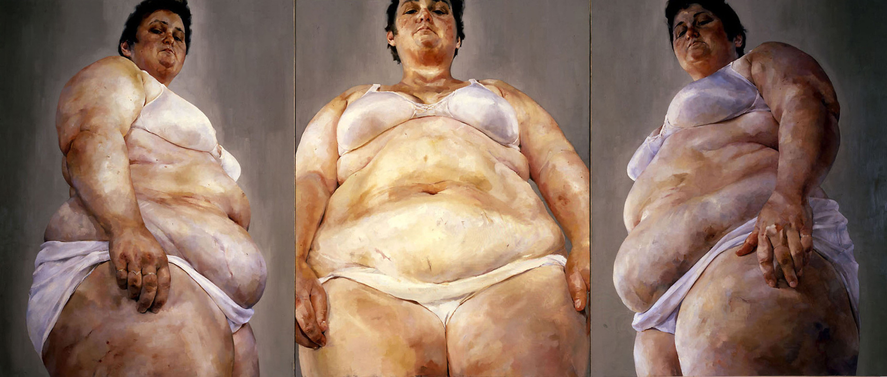

Cada vez que vemos alguna foto de una mujer gorda, ya sea posando, haciendo deporte, mostrando su _outfit,_ o cualquier otra actividad que involucre a su cuerpo de talla grande, ocurre lo mismo: aparece alguien con la necesidad de decir lo obvio: que esa mujer es gorda, que su peso no se ve bien, que debería cuidar su salud, o que con esa inocente foto está “promoviendo la obesidad”. Esto puede verse en cualquier situación donde se represente un cuerpo que supere la norma de delgadez, y particularmente en internet, donde abundan las opiniones ofensivas amparadas en el anonimato y la impunidad de lo digital.

¿Por qué tanta gente siente la necesidad de expresar su opinión –mayoritariamente negativa– sobre los cuerpos gordos? ¿Cual es el objetivo de decirle a una persona gorda que es gorda, o de volver a decir una y otra vez que la gordura es poco atractiva, indeseable, y/o una _enfermedad_ necesaria de erradicar? **¿Cuál es el motivo detrás del rechazo a la gordura?**

Este texto reflexionará acerca de las posibles motivaciones detrás de este fenómeno (conocido como [gordofobia](http://bastian.olea.biz/que-es-la-gordofobia/)), identificando el rechazo a los cuerpos de talla grande según tres dimensiones: la belleza, la moral, y la salud.

<!--more-->A modo de resumen:

1. _Belleza:_ La gordura suele ser tachada como una corporalidad estéticamente indeseable y, por lo tanto, diametralmente opuesta a la delgadez, que sería la corporalidad correspondiente al ideal de belleza dominante. Rechazar la gordura desde la dimensión de la belleza –a través de la descalificación y discriminación de los cuerpos no-delgados– sería una estrategia para reproducir el ideal de belleza y el privilegio que éste conlleva, sancionando a las mujeres que no se adecúen al ideal como forma de reafirmar el valor de las apariencias para la identidad femenina en clave patriarcal.
2. _Moral:_ El rechazo a la gordura desde una dimensión moral pareciera fundamentarse en la necesidad de _sancionar_ los cuerpos supuestamente _fallidos;_ haciéndole saber a estos sujetos disidentes que –de acuerdo a los prejuicios imperantes– sus cuerpos representan irresponsabilidad, inmoralidad, enfermedad, descuido y pereza. Por lo tanto, se configura a la gordura como el opuesto del conjunto de comportamientos e ideales propios del _sujeto neoliberal:_ aquél individuo que internaliza el imperativo neoliberal de productividad, mérito y esfuerzo individual, el cual sería simbolizado en la belleza/salud/moralidad de la apariencia delgada, en contraposición al fracaso de “los otros” evidenciado en sus cuerpos gordos.
3. _Salud:_ Finalmente, quienes rechazan la gordura bajo cualquier precepto suelen fundamentarse en la idea de que la gordura es una enfermedad, apropiándose del discurso médico para justificar sus prejuicios y actitudes discriminatorias. Esta perspectiva suele relacionar la gordura con mala salud, basándose en formas superficiales de interpretar el bienestar que relacionan la delgadez con la salud, dando lugar a una alianza entre el consumismo, la primacía de las apariencias, y la necesidad de un punto de comparación para validar los esfuerzos que las personas hacen por “verse bien”, en una cultura donde los conceptos de lo “bueno” y lo “bello” se entrecruzan.

Desde estas tres dimensiones de rechazo a la gordura resulta posible pensar este fenómeno como una pieza clave en el ordenamiento de la sociedad neoliberal y patriarcal, como será sugerido en las conclusiones.

### 1\. Belleza: reiteración del rechazo a la gordura como forma de constituir la delgadez como privilegio

#### La gordura como una corporalidad indeseable

La mayoría de los comentarios más superficiales y simplistas en rechazo a la gordura refieren a que la gordura es fea, antiestética e indeseable, descalificando la apariencia de lo gordo desde una dimensión estética. Este rechazo se expresa como burlas, insultos, comentarios negativos, o bien “consejos” para superar la gordura y así adecuarse a lo que es socialmente considerado bello, y por ende, _deseable._ Afirmando que la gordura es estéticamente reprochable, el sujeto gordofóbico pareciera sentir la necesidad de reiterar acerca de qué puede –o no puede– _desearse_ en nuestra sociedad, reproduciendo un ideal hegemónico de belleza que profesa un culto a la delgadez.

La imagen del ideal de belleza occidental está en todos lados. Diariamente podemos ver expresiones de este ideal de belleza reflejados en televisión, cine, videoclips, pornografía, publicidad, e internet. Los medios de comunicación tienen una importante responsabilidad en la globalización de los ideales de belleza femeninos basados en el culto a la delgadez, logrando desarrollar una hegemonía cultural respecto de lo que es socialmente considerado como bello. El caso paradigmático de la estrecha relación entre medios de comunicación e ideales de belleza es el de las islas Fiyi en la década de los ’80, donde los ideales de delgadez surgieron junto a la llegada de la televisión; en otras palabras, culturas que no tenían problema alguno con la gordura adquirieron ideas negativas sobre ella –a la par de desórdenes alimenticios– sólo al ser expuestas a medios comunicacionales occidentales.

#### El ideal de delgadez

El ideal reproducido incansablemente por los medios de comunicación nos ha hecho internalizar la idea de _lo bello_ como lo delgado, blanco, liso, pulido, terso, carente de imperfección, visiblemente sano, sexualizado, y homogéneo. De estos componentes de lo bello destaca la delgadez, pues [la gran mayoría de los cuerpos considerados como bellos y representados mediáticamente son efectivamente delgados](http://bastian.olea.biz/la-estigmatizacion-de-la-gordura-femenina-reproduccion-simbolico-cultural-del-estatus-social-de-la-delgadez/), mientras existen ciertos puntos de variación en los demás aspectos de la apariencia idealizada. Es por esto que la reiteración de mensajes de rechazo a la gordura parece algo curioso: ¿por qué resultaría necesario repetir algo que es sabido por todas y todos?

Resulta innegable que la belleza –particularmente la femenina– [está íntimamente relacionada al ideal de delgadez.](http://bastian.olea.biz/la-gordura-femenina-como-una-problematica-social-genero-deseo-y-diferencia/) Basta con entrar a internet o salir a la calle para empaparnos de los discursos culturales, publicitarios y mediáticos sobre el concepto de _lo deseable_ que nuestra cultura consumista y patriarcal profesa, donde reina lo delgado y lo gordo no es más que una ausencia ubicada fuera de lo representable (en palabras de Jana Evans Braziel, en _Bodies out of Bounds: Fatness and Transgression_ \[2001\]), cuya ausencia se vuelve presente como _temor implícito,_ justamente debido a la invisibilización activa realizada contra las corporalidades disidentes.

Pero además de la idealización de la delgadez, existen otros componentes del ideal de belleza dominante, tales como que la mujer bella suele ser blanca y de rasgos europeos, su cuerpo debe mantenerse entre ciertas proporciones, es expuesta en ropa a la moda o bien de forma reveladora, su piel es lisa y depilada, su cabello está estupendamente cuidado, a menudo su apariencia es acentuada con cosméticos y retocada digitalmente para agudizar ciertos rasgos y eliminar toda “imperfección”… y una inacabable lista de técnicas de _embellecimiento_ que la mayor parte del tiempo damos por sentado. La enorme cantidad de_trabajo corporal_ que define a los cuerpos femeninos socialmente considerados _bellos_ es normalizada en las representaciones culturales, mediáticas y publicitarias que vemos, y corresponde a una parte íntegra del ideal de belleza y de la feminidad en clave patriarcal.

#### Dinámicas de oposición y exclusión

Así como ya sabemos qué es considerado bello y qué no lo es, también somos capaces de identificar las apariencias no-normativas, es decir, aquellos cuerpos que se desvían del rígido canon de belleza. Efectivamente, pareciera que el ideal de belleza ha sido concebido de tal manera que sus contenidos –particularmente la delgadez– resulten difíciles (sino imposibles) de alcanzar, y por lo tanto, dependan de criterios excluyentes para calificar dentro de la categoría de la belleza. En este sentido, la belleza puede interpretarse como un recurso de escasez artificial, pues los grupos que históricamente han definido _lo bello_ buscan siempre restringir su adopción masiva, para así valorizarla como privilegio (como dijo Foucault: “Quien controla el discurso, domina el poder, y quien domina el poder, controla el discurso”). Como resultado, los criterios que definen la belleza son cada vez más restrictivos, y en conclusión, pareciera que la necesidad de reiterar activamente que ciertos cuerpos se encuentran _fuera_ de la norma de belleza (mediante comentarios y burlas en rechazo de la gordura) cumpliría la función de _explicitar el privilegio de la belleza,_ cristalizándolo en una reiteración performativa basada en la sanción y el rechazo de la contraparte de _lo bello:_ lo gordo. En otras palabras: _se necesitan feos para que hayan bellos,_ y denigrar a las y los feos es una forma efectiva de reproducir el discurso que valoriza socialmente a la delgadez.

La razón para que los gordofóbicos sientan la necesidad de hacer eco de los ideales de belleza que el sistema de jerarquías estéticas nos inculca, al parecer, correspondería a una estrategia discursiva para reproducir las ideas de _lo deseable_ y _lo indeseable,_ buscando posicionarse desde _lo deseable_ (lo delgado), que sería la posición valorizada mediante el rechazo de _lo indeseable_ (lo no-delgado). Dicho de otra manera, el ideal de belleza reiterado por las y los gordofóbicos reproduce una _dinámica oposicional_ entre lo deseable y lo indeseable, lo delgado y lo gordo, donde el rechazo de la gordura da lugar a la valorización de lo delgado, excluyendo del _privilegio de la belleza_ a los cuerpos no-normativos. Así, _rechazar lo gordo_ provoca que la corporalidad delgada se torne positiva y deseable –debido la cualidad de belleza que socialmente se le adjudica– pero además, esta lógica oposicional basada en la sanción de lo no-normativo resulta en la internalización del _temor a la gordura:_ la delgadez se desea como una medida para evitar volverse víctima de la sanción social que recae sobre quienes se desvían del ideal de delgadez y belleza, sometiendo a las mujeres a una inseguridad que propicia el consumo y la sumisión al dictamen de _lo socialmente deseable._

#### Belleza como un tema de género y clase

Pero el problema con la belleza no acaba simplemente en la determinación de lo bello y lo indeseable. La existencia de un rígido y privilegiado ideal de belleza no es meramente un capricho que algunas personas busquen alcanzar, sino que se trata de un referente de un _deber ser_ respecto del cual muchas personas que, siendo incapaces de alcanzar los criterios de lo _deseable,_ terminan cayendo en una profunda _inseguridad_ y _disatisfacción corporal,_ que en nuestra sociedad actual tiene características epidémicas gracias a la extensión casi omnipresente de imágenes de cuerpos ideales/irreales producidas por el mercado, los medios comunicacionales y la publicidad.

Las víctimas de esta insegurización son en su gran mayoría mujeres, puesto que [la constitución de la feminidad patriarcal dictamina una fijación con las apariencias que deriva en la prescripción femenina de mantener una corporalidad, apariencia, y estilo apropiados,](http://bastian.olea.biz/feminidad-y-gordofobia-ideales-de-belleza-como-estrategias-de-opresion-femenina/) lo cual no afecta en la misma magnitud a los hombres. En este sentido, la existencia de ideales de belleza produciría la imposición social de prácticas y exigencias estéticas que recaen sobre las mujeres, marcándolas como cuerpos _insuficientes_ que deben ser adornados, maquillados, y “arreglados” para ser valorizados de acuerdo a la feminidad de corte patriarcal.

El ideal de belleza femenino deviene una desigualdad de género a partir de la prescripción social de belleza femenina que radica en la insegurización de las mujeres y en la potencial descalificación de aquellas que no adopten el ideal normativo. En este punto, el rechazo a la gordura opera como una forma de descalificar a las mujeres que no se adecúen a las expectativas sociales de belleza dictadas por el patriarcado, reafirmando la idea de que la feminidad se fundamenta en la apariencia normativa; es decir, el parámetro estético considerado deseable por la sociedad, que en general corresponde al gusto masculino. Las mujeres son figuradas por el patriarcado como falencia en términos estéticos, de lo cual surge la expectativa de incurrir en prácticas de embellecimiento (de las que los hombres están libres) que consumen sus energías vitales y emocionales, así como sus recursos económicos y su tiempo, eventualmente desviando los intereses normativamente femeninos hacia prácticas políticamente inocuas.

Entonces, el ideal de belleza deviene opresivo, en tanto configura el _deber ser_ femenino como la búsqueda constante por alcanzar un ideal inalcanzable. El carácter excluyente del ideal de belleza resulta aún mayor si consideramos que lo normativamente bello suele hacer referencia a las apariencias de las clases altas en contraposición a las corporalidades de las clases bajas y de los grupos sociales racializados y étnicos, y que por consiguiente, el logro del cuerpo ideal supone cantidades de tiempo, saberes y recursos que son inaccesibles para muchas. Así, la dificultad de calzar con el ideal de belleza termina ligando a la identidad femenina con el consumismo como forma de validación básica: la de poseer un cuerpo aceptado socialmente.

* * *

### 2\. Moral: rechazo de la gordura como forma de sancionar cuerpos fallidos

Familiares, compañeros de estudios y trabajo, e incluso desconocidos en internet, son algunos de los sujetos que _reiteran_ de diversas maneras la gordura en los demás, ya sea mediante comentarios, consejos, malos tratos, u otros actos implícitos o explícitos. La obviedad que reitera que _lo gordo es gordo_ se acumula, y los comentarios acaban siendo el eco de un sermón que carece de novedad: cada palabra contra la gordura ha sido escuchada una y mil veces, y esta reiteración de mensajes negativos sobre el cuerpo gordo vuelve a la talla y la silueta en los atributos _esenciales_ de los gordos y las gordas. En otras palabras, estos actos _focalizados_ en la gordura de los demás _marcan_ al cuerpo gordo como tal, de la misma manera que las acciones racistas y sexistas que otorgan demasiado énfasis al tono de piel o al género de otra persona. Nuestras actitudes ante las personas gordas, determinadas por posibles sesgos fundados en diversos prejuicios contra la gordura, reproducen la _estigmatización_ de dichos prejuicios en estos cuerpos: _marcamos_ negativamente a la gordura.

#### Prejuicios contra la gordura

Así, el cuerpo gordo resulta marcado como _esencialmente distinto_ a los demás, lo cual deriva un trato diferencial y a menudo negativo para la gente gorda. Los contenidos de los prejuicios se imprimen en los cuerpos con cada interacción. Al marcarse la gordura como _atributo esencial_ de las personas gordas, dichos cuerpos pasan a volverse referentes de determinadas características; es decir, su gordura los delataría de _ser_ de cierta manera. Se trata de prejuicios que configuran la gordura como la corporalidad de _sujetos fallidos, negativizados,_ a partir de diversos estereotipos que prevalecen en el inconsciente colectivo aún mucho después de los procesos históricos que les dieron lugar.

Peter Stearns, en _Fat History: Bodies and Beauty in the Modern West_ (2002), analiza históricamente el surgimiento del rechazo a la gordura en la sociedad estadounidense, e identifica su génesis a grandes rasgos como una reacción a los avances sociales acontecidos a principios del siglo XX en materia de consumo, libertades sexuales, desregulación laboral, y acceso al placer y los excesos (introduciéndose la _dieta_ como especie de contrapeso o compensación moral ante estas nuevas libertades), así como una forma de expresar rechazo contra los nuevos estilos de vida sedentarios, propiciados por las formas modernas de trabajo de la sociedad post-industrial (donde los cuerpos gordos empiezan a simbolizar el tedio y la pereza del trabajo de oficina y del sector de servicios, ante lo cual se incentivan la mantención de apariencias y pesos “normales” –previos al sedentarismo– mediante la agudización de los estándares corporales y de belleza). Finalmente, Stearns también identifica la manera en que las preocupaciones morales y luego estéticas que surgen en la población son finalmente llevadas al campo de la medicina, donde las y los profesionales procuran responder ante el interés social por la delgadez como una corporalidad moral y estéticamente apreciable, respaldando médicamente dichos ideales. En otras palabras, el interés médico sobre el peso corporal surge históricamente a partir de preocupaciones de apariencia y moda llevadas a la medicina, y no al revés.

De esta forma, surgen discursos sociales a partir de distintos _mitos_ sobre la gordura, tales como que ésta es causada por excesos, que es propia de sujetos perezosos, que es síntoma de falta de disciplina, que representa gula y otros deseos insaciables, que las gordas son poco femeninas y que los gordos –paradójicamente– son poco masculinos, o que la gordura es la corporalidad propia de las clases bajas y otros grupos marginados, como los afroamericanos. Estos discursos radican en _prejuicios_ que propician la sanción de los cuerpos gordos. En otras palabras, la gente intuye múltiples características negativas a partir de la gordura, dando lugar a tratos discriminatorios.

#### Sanción y regulación de los cuerpos gordos

El cuerpo gordo pareciera suscitar la necesidad de reiterar su rechazo, en tanto se trataría de una corporalidad que merece ser _sancionada_ debido a las faltas en que incurre por su mera existencia, y que son de común conocimiento gracias a la difusión de estereotipos y prejuicios. Estos prejuicios permiten intuir que las personas gordas tienen algún problema inherente a su ser, lo cual vuelve al cuerpo gordo en un objeto de hostigamiento y exclusión. Ello constituye una forma de _sanción social_ sufrida por un grupo que es interpretado por el colectivo como _nocivo_ para el equilibrio social.

Las situaciones donde se dan estas sanciones son perfectamente reconocibles por personas que han sido gordas o han sufrido discriminación por su cuerpo: _hostigamiento_ por parte de familiares, amigos y colegas que los vuelven objeto de burla; _exclusión social_ por obra de personas que se niegan a compartir con cuerpos que consideran indeseables; _rechazo_ sexual y romántico en manos de quienes sienten _asco_ con las corporalidades no-normativas, o bien _vergüenza_ de relacionarse públicamente con estas personas; _acoso callejero_ que sufren al volverse blanco fácil para burlas y para que los hombres demuestren a otros hombres que tienen el_deseo correcto,_ alineado a la heteronorma y a la competitividad masculina; y finalmente, la _subestimación_ de las capacidades académicas, laborales y profesionales que sufren las personas gordas por parte de sujetos prejuiciosos. Todas estas actitudes son actos discriminatorios que “castigan”, de una manera u otra, a la persona gorda meramente por ser gorda, comunicándole que su figura es abiertamente rechazada.

Los cuerpos gordos también son expuestos a formas sutiles por medio de las cuales se les _exige,_ de cierta manera, a renunciar a los comportamientos que supuestamente dan lugar a su gordura, con el objetivo de “encausarlos” dentro de la norma: normalizarlos, en tanto cuerpos _desviados._ Algunos ejemplos de este tipo de _regulación_ de la gordura son la forma en que las familias pretenden “cuidar” a sus familiares gordos con preguntas inocentes como _¿subiste de peso?_ (implicando que hay algo mal con ellxs) o sugiriendo dietas (como forma de ayudar a “mejorar”); la manera en que se insiste en que el peso no se ve bien, presionando con comentarios como _“te veías mejor antes”_ (introduciendo culpabilidad respecto del aumento de peso); la tendencia a vigilar la alimentación de las personas gordas, mediante comentarios como _“no deberías comer eso”, “¿no crees que te serviste mucho?”_ (que refuerzan la idea de que algo se está haciendo mal, en este caso, una supuesta alimentación excesiva); y otras formas de preocupación genuinas, pero que tienen efectos emocionales y psicológicos altamente negativos, como el infame _“deberías bajar unos kilitos si quieres encontrar pareja”…_

Sin embargo, es relevante considerar que toda forma de sanción de la gordura (es decir, de su rechazo explícito) es también una forma de regulación, pues cada denostación contiene implícitamente el mensaje de que la gordura sería la fuente del maltrato que sufre, de lo cual puede inferirse que adelgazar mejoraría el trato que recibiría de sus pares y de la sociedad en su conjunto. La sanción opera como una forma de internalizar la regulación de la gordura en tanto deseo de cambiar(se) con tal de evitar mayor sanción.

La regulación de la gordura se trata de maneras de _corregir_ a estos cuerpos distintos, _disidentes,_ insistiendo en que “algo deben estar haciendo mal”, en que sus vidas están fallando, y que por lo tanto, deben ser enmendados hacia la supuesta “solución” a todos sus problemas: la delgadez. Pero el objetivo no es tan solo una medida altruista para redimir a estos cuerpos pecaminosos, invitándolos a enmendar su camino, sino que la motivación subyacente a la sanción y regulación de los cuerpos gordos pareciera ser la figuración de la gordura como fracaso, en pos del enaltecimiento del estilo de vida neoliberal basado en el extremo individualismo y el imperativo de rendimiento.

#### Neoliberalismo y cuerpos fallidos

Lo que se logra con la reiteración –implícita y explícita– de la gordura es _inferiorizar_ a las personas gordas, naturalizando características negativas como si éstas fuesen intrínsecas a la corporalidad no-normativa. Estas características “inherentemente negativas” que son _representadas_ por la gordura refieren en gran medida a una supuesta _inferioridad moral._ El rechazo de la inferioridad moral es, en última instancia, una forma de enaltecer el propio éxito. En otras palabras, la sanción es una estrategia para crear un referente negativo de lo que _no se debe ser,_ respecto del cual se valida la _propia forma de ser._ Esta forma correcta o _normativa_ de ser refiere al _imperativo neoliberal de rendimiento,_ según Byung-Chul Han en _La expulsión de lo distinto_ (2017) y otros de sus ensayos recientes.

La sociedad neoliberal hace recaer en el individuo la responsabilidad por su propio bienestar, en el sentido de que su éxito, estabilidad y seguridad sólo pueden ser alcanzadas mediante el esfuerzo propio. El tamaño y la forma de los cuerpos gordos, de acuerdo a los prejuicios gordofóbicos imperantes, expresarían nociones negativas acerca de las características e historia de vida del sujeto gordo, constituyendo a los cuerpos gordos como cuerpos “fracasados”, por ejemplo, en la medida que la gordura suele ser interpretada como pereza, como un _dejarse estar,_ como ausencia de disciplina, o como el producto de un estilo de vida de excesos.

El sujeto neoliberal sólo cuenta con su cuerpo y su propiedad privada para valerse, por lo que el cuerpo se torna el espacio de expresión de estatus por excelencia: todas nuestras aptitudes, nuestra opulencia e identidad, son expresadas por las formas en que caminamos, hablamos, nos vestimos, y nos vemos. Nuestros cuerpos, en tanto _objetos funcionales_ al sistema económico, sucumben ante el imperativo neoliberal de rendimiento, el cual nos presiona ideológicamente a ser _la mejor versión posible de nosotrxs mismxs,_ trasladando el disciplinamiento social en torno a la productividad desde lo externo hacia lo más interno de la psique, como una ideología que nos presiona a optimizarnos en pos de volvernos funcionales al sistema explotándonos a nosotros mismos, como plantea Han en _Psicopolítica_ (2014). Dado que cada detalle de nuestras apariencias expresa nuestra nuestro grado de optimización y nuestra posición social, y dada una sociedad de mercado y consumismo absolutos, cualquier _marca_ de “fracaso” e inadecuación en nuestros cuerpos pasa a considerarse solucionable mediante _más_ esfuerzo, consumo, y trabajo corporal. Es decir: siempre hay posibilidad de aumentar la intensidad de la auto-explotación y sometimiento al criterio de rendimiento.

El neoliberalismo nos vuelve a cada una y cada uno en únicos responsables de quienes somos, pues la atomización de la sociedad en el individualismo torna la culpa del fracaso –laboral, económico, e incluso en términos de salud mental– a la agencia individual: el pobre debe esforzarse para salir adelante, el marginado debe dar la vida por ascender las ilusorias escalas de la meritocracia, e incluso quienes sufren de depresión deben “pensar positivo” y seguir medicándose para optimizar su rendimiento. Por esto, la apariencia se vuelve un medio crucial para expresar nuestro valor como sujetos — y no se trata sólo de tener el último celular o un buen auto como suele reconocerse popularmente, sino que la expresión del éxito en la sociedad neoliberal se vale de marcas corporales aún más sutiles: nuestra forma de hablar, de vestir, de movernos, y sin duda alguna, nuestra silueta y peso corporal. La delgadez representa el éxito, pues expresa la capacidad del sujeto para _comportarse como es deseable:_ esforzarse, disciplinarse, medirse, y rechazar los excesos.

Ser bello es _haber sido_ de cierta manera, pero también es un _poder ser:_ la oferta de una belleza futura, potencialmente alcanzable si se siguen patrones de comportamiento _adecuados._ La delgadez, en tanto ideal de belleza, se vuelve no sólo un proyecto corporal, sino un _proyecto de ser,_ donde mantenerse dentro de los patrones de consumo precisos _podría_ resultar en el cuerpo idealmente “bello” (y ante dicho escenario, la vida suele ser postergada hacia el idílico momento en el que la delgadez ideal sea por fin alcanzada). Pero este proyecto de adelgazamiento existe sumido en incertidumbre, pues no siempre resulta posible: el ideal es difícilmente alcanzable, y aún cuando se alcanza, suele intensificarse de tal manera que nunca se está satisfecho. El ideal de belleza se basa en una inseguridad y evanescencia que mantiene al consumo y la disciplina en movimiento.

Según el discurso neoliberal, cada individuo tiene dentro de sí la potencialidad de surgir. Nuestro éxito dependería del esfuerzo individual dado en tanto rendimiento personal, y por ende, el bienestar resultaría una situación para quienes “libremente” han hecho _lo correcto_ en pos de surgir, a diferencia de quienes “libremente” han quedado marginados de las lógicas imperantes. En este sentido, la _belleza_ –no sólo como encarnación de la apariencia socialmente deseable, sino también como expresión de éxito y estilo de vida laudable– refiere a una potencialidad cuya realización recaería en el sujeto neoliberal, siendo realizable a través de determinado patrón de consumo y comportamiento. La “libertad” del sujeto de rendimiento es, en realidad, la esclavitud de la explotación voluntaria meramente funcional a la lógica neoliberal. Por ende, mantenerse o alejarse de la normativa de belleza sería resultado de la propia _responsabilidad_ del individuo, en tanto éste mediaría su libertad en consonancia con las expectativas sociales. Quien deviene gordo es, según la interpretación neoliberal, el sujeto que ha fallado en agenciar su libertad en pos del rendimiento, habiendo sido incapaz de trabajar sobre su carácter y su cuerpo para satisfacer al ideal de delgadez, en tanto expresión del éxito neoliberal.

El imperativo neoliberal de rendimiento relacionado a la búsqueda por el adelgazamiento se traduce en prácticas que implícitamente buscan expresar superioridad moral, tales como el _ejercitarse_ (en tanto esfuerzo focalizado en el cuerpo que beneficia el desempeño físico y el carácter, y que además implica que se cuenta con tiempo, dinero y energía de sobra al final de la jornada laboral para practicar algún deporte o ir al gimnasio), y el _hacer dieta_ (como expresión de la disciplina suficiente para rechazar los excesos de consumo que son tan accesibles y abundantes en una sociedad de mercado, diferenciando así a quienes poseen este carácter de responsabilidad individual versus quienes sucumben ante los placeres desmedidos). No es que cosas tan comunes como el deporte o la dieta sean explícitamente expresiones de superioridad moral, sino que la presión social por realizar estas prácticas (fuertemente relacionadas a ciertos patrones de consumo) responde a un imperativo que va en consonancia con la construcción del sujeto neoliberal ideal: individualista, abocado a su proyecto personal de vida, esforzado, apto, disciplinado, reprimido, agotado física y mentalmente para someterlo a la jornada laboral, y consumista pero dentro de márgenes que no afecten su productividad. Como menciona Byung-Chul Han: _“el imperativo neoliberal de rendimiento, atractivo y buena condición física acaba reduciendo el cuerpo a un objeto funcional que hay que optimizar.”_

El rechazo a la gordura desde una dimensión moral busca regular al sujeto para que tome la responsabilidad de su corporalidad y “mejore” al unirse al eterno camino de adecuarse a los ideales de belleza irreales y de expresar corporalmente un estilo de vida adecuado. Simultáneamente, esta presión –ejercida mediante sanciones basadas en prejuicios– logra justificar los esfuerzos en que las personas incurren para mantener identidades estrechamente ligadas a sus apariencias, a través de una sumisión completa a la superficialidad consumista de un capitalismo donde la salud, la moda, y hasta el deporte son simples excusas para la venta desmedida de productos y servicios bajo la presión social de tener que optimizar nuestros propios cuerpos para ser aceptados (y básicamente, para sobrevivir en una sociedad extremadamente individualista). Sancionar a los “sujetos fallidos” es una estrategia efectiva de la sociedad neoliberal para incentivar ciertas formas de ser, reproduciendo criterios de consumismo y rendimiento, mientras se validan los esfuerzos de los sujetos bien encaminados en el ideal neoliberal al ofrecerles un referente para denostar y enaltecerse.

* * *

### 3\. Salud: rechazar la gordura basándose en el discurso médico

La relación entre salud y gordura es delicada. Las complicaciones producidas por la obesidad son innegables, y constituyen un problema de salud pública. Pero el discurso médico sobre la obesidad a menudo es apropiado por los sujetos gordofóbicos como un recurso para fundamentar su rechazo a la gordura. Lo médico, por muy científico que parezca, no debería poder volverse una justificación para la discriminación social. La recurrente referencia al discurso médico por parte de los sujetos que rechazan a la gordura vuelve necesario el poner bajo mirada crítica a la patologización médica de la gordura, pues no es casual que exista tanta complicidad entre la dimensión de la salud y otras dimensiones desde las que se ejerce gordofobia.

#### La salud superficial

La mayoría de la gente que descalifica, corrige o “aconseja” a la gente gorda se justifica en su preocupación por la salud de las y los gordos. Es decir, los comentarios que suelen basarse en el rechazo a su físico, a sus supuestos estilos de vida, o a las características prejuiciosas, se ven luego fundamentados por argumentos médicos, que relacionan directamente la salud con el peso corporal. Reducir la salud a lo meramente visual; es decir, suponer una causalidad directa entre el peso aparente de una persona y su estado de salud, corresponde a una perspectiva que supone que el _verse_ bien equivale al _sentirse_ bien, y que, por consiguiente, bastaría con mirar a alguien para saber si esa persona goza de una buena salud. Esta perspectiva, que profesa una _salud superficial,_ es la promovida por múltiples intereses económicos (industrias farmacéuticas, del _fitness_ y _wellness_, cosméticas y de belleza), que pretenden comunicarnos que la gente socialmente valorable –moral, estética, y médicamente– _es bella,_ y que _lo visible_ es más importante que lo invisible, o mejor dicho, lo _invisibilzado._ Efectivamente, aquello que la _salud superficial_ invisibiliza son las emociones y sentimientos de las personas insegurizadas por las normas de belleza y “salud”, así como el sufrimiento que suele derivar del proceso –a menudo imposible– de alcanzar el _cuerpo perfecto_ (“para ser bella hay que ver estrellas”). Si se considera que la delgadez es un indicador fidedigno de salud, se invisibilizan los riesgos a la salud en que incurren quienes buscan adelgazar a toda costa, ya sea consumiendo fármacos, negándose a comer, cayendo en comportamientos bulímicos y anoréxicos, recurriendo a tratamientos de seguridad y eficacia no probadas (purgas, pastillas, dietas, desintoxicaciones, etc.), optando a operaciones quirúrgicas riesgosas, ignorando los posibles problemas de salud detrás del adelgazamiento, sufriendo tras ciclos de dietas que destruyen cuerpos y autoestimas, y ocultando las toneladas de trabajo y preparación necesarias para simplemente _verse bien_ y ser reconocida como una persona sana y apta.

#### La gente gorda ya lo sabe

El comentario en rechazo de la gordura basado en la salud presupone que la persona gorda es ignorante, o bien no cuida su propia salud. Pero lo cierto es que la gente gorda está perfectamente pendiente de su salud: toda una vida de comentarios despectivos contra sus cuerpos les ha informado de antemano de que la sociedad los considera _enfermos_ sin importar cómo se sientan realmente consigo mismos. La cantidad de gente que hace dietas para “solucionar” sus “problemas” de peso es abrumadora, y la proporción dentro del grupo de gente con sobrepeso es aún mayor, pero los resultados de estas dietas suelen ser temporales o francamente decepcionantes.

Considerando que todo el mundo se “preocupa” de reiterarle a la gente gorda que está enferma (pues los comentarios de rechazo a la gordura se van tornando críticas hacia su salud), además del hecho que la misma gente gorda se siente –o es llevada a sentirse– insatisfecha con sus propios cuerpos en el plano estético y médico (al ser informadas de que sus problemas corporales, que derivan en rechazo estético y moral, son en realidad problemas médicos), no tiene sentido “iluminar” a la gente gorda reiterándoles una vez más que supuestamente sufren o sufrirán problemas de salud. Presuponer que los y las gordas son ignorantes respecto a este tema es reflejo del egocentrismo del sujeto gordofóbico que se cree portador de la verdad y la correctitud, encargado de llevarle la novedad (¿el evangelio?) a las y los gordos.

El rechazo de la gordura pareciera ser cíclico: empieza como una reacción estética contra cuerpos considerados indeseables, y luego pretende fundamentar médicamente dicha reacción negativa, para finalmente volver a degenerarse en una preocupación estética (ahora consumista) de acuerdo el criterio que considera que lo saludable puede ser medido según la apariencia de una persona. La salud se torna un criterio de justificación para el ideal de belleza hegemónico, instalando en el sentido común la idea de que ser gordo es incompatible con ser sano, y que adelgazar a toda costa es una forma de cuidar la salud. Las dos últimas afirmaciones son categóricamente falsas, en tanto no es el peso ni la reducción del mismo lo que disminuye la mortalidad y los riesgos médicos, sino la actividad física y la dieta balanceada, las cuales no siempre se corresponden con el adelgazamiento ni con la delgadez, como evidencia de forma contundente Paul Campos en _The Obesity Myth: Why America's Obsession with Weight is Hazardous to Your Health_ (2004).

#### Patologización de la gordura

El discurso médico en contra de la gordura entiende la _obesidad_ como una enfermedad (el término _obesidad_ en sí mismo es un diagnóstico médico), de lo cual se desprende que ésta no sería una corporalidad válida ni una condición posiblemente transitoria, sino una _patología_ de la que uno puede curarse (a pesar de que, paradójicamente, actualmente no existan métodos efectivos para bajar de peso de forma segura y consistente, y que hay certeza de que más del 90% de las dietas fallan y los pacientes recuperan el peso perdido).

El rechazo (social) de la gordura a partir de una preocupación médica resulta inquietante, debido al sencillo hecho de que otros sujetos “enfermos” no son tratados de la misma forma que los y las personas obesas. Nadie osaría discriminar o excluir socialmente a una persona con cáncer, humillar a una persona con enfermedades respiratorias, o ejercer prejuicios contra una persona diabética, independientemente de las razones que hayan llevado a dichas condiciones. Esto ocurriría debido a que la gordura es considerada una “enfermedad” que arraiga lo moral directamente en la carne: en el caso de la patologización de la gordura, se presupone que el cuerpo es un reflejo directo de los comportamientos de la persona, y por lo tanto, su sobrepeso sería causado por alguna acción u omisión personal. Esto significa que el sujeto gordo posee una _responsabilidad_ respecto de su propia gordura, lo cual calza perfectamente con el discurso neoliberal de responsabilidad individual frente al cuerpo y al propio destino. Ello no deja de ser una noción problemática, ya que incentiva la idea de que la gordura es algo directamente accesible a la agencia individual, abriendo las puertas al discurso de que la delgadez puede obtenerse con esfuerzo y consumo, siendo que la evidencia indica que ello no siempre es así: la corporalidad no es directamente _maleable_ (debido a determinantes genéticos, limitaciones socioeconómicas, tendencias raciales y sexuales como que los cuerpos negros y femeninos tienden más a la adiposidad, etcétera).

#### Justificación del rechazo a partir de la patologización

Dejando a un lado los riesgos de salud que puedan estar relacionados a la obesidad, el sostener que la gordura corresponde a una _enfermedad_ refiere a la _patologización_ de un tipo de cuerpo, a partir de lo cual se vuelve posible validar en términos médicos y científicos la discriminación de las personas gordas en tanto poseedoras de dicho tipo de cuerpo. En otras palabras, estamos hablando de los _efectos sociales_ de la patologización del tipo de cuerpo de millones de personas, cuyo estado de salud es puesto en cuestión automáticamente al caer dentro del concepto arbitrario de obesidad, basado en una medida de índice de masa corporal de 30 puntos.

Tratar una corporalidad como enfermedad, desestimando la variedad de experiencias y condiciones físicas posibles, es a lo menos problemático, pues transforma a todo un grupo social en “los enfermos”, sustentando en la autoridad médica las dimensiones de discriminación estética y moral. Y esto resulta bastante conveniente, ya que las personas intolerantes siempre han buscado justificaciones biológicas para validar comportamientos discriminatorios: basta con pensar en la justificación pseudo-científica del racismo mediante la idea de razas biológicas, o las pretensiones naturalistas del sexismo que busca plantear diferencias inherentes a los sexos, para notar que el rechazo a la gordura sigue este patrón de explicar una supuesta inferioridad de acuerdo a cualidades físicas que derivarían en cualidades de personalidad, desempeño, y comportamiento.

Patologizar la gordura como un discurso que afecta a todo un grupo social de acuerdo a sus características físicas resulta una forma de legitimar científicamente el rechazo abierto de la gordura. Esta legitimación, al interceptarse con el poder de los ideales de belleza y la fuerza de los prejuicios imperantes contra los cuerpos no-delgados, potencia el discurso social contra la gordura, posibilitando la extrapolación de los riesgos y problemas propios de la obesidad mórbida a otros niveles menos agudos de gordura. Ejemplo de lo anterior son los abundantes casos de personas delgadas que temen engordar unos pocos kilos sobre el límite del sobrepeso “por razones de salud”; es decir, el extremo de justificar el rechazo a la gordura como si se tratara de un acto responsable y de cuidado de uno mismo y del otro, basado en información errónea acerca de la relación entre gordura y salud, a partir de la extrapolación de riesgos propios de los niveles más altos de obesidad hacia cualquier peso por sobre la delgadez. De esta manera, se racionaliza el rechazo a la gordura apuntando a que ésta es médicamente indeseable, potenciando la idea de que la “cura” a la gordura es imprescindible. ¿Y cuál es la “cura” actual a la gordura, obviando los miles de tipos de dietas que van y vienen con cada temporada? Es [el consumismo en sus infinitas facetas:](http://bastian.olea.biz/discriminacion-de-la-gordura-y-su-relacion-con-el-capitalismo-el-genero-y-la-clase/) productos dietéticos y reductivos, fármacos (quemadores de grasa, inhibidores de apetito, suplementos para apoyar la ayuna, remedios caseros milagrosos), el enorme mercado del _fitness,_ etcétera.

La alianza entre la preocupación de salud ante la gordura y el consumismo queda en evidencia cuando podemos ver cómo las farmacias venden gran cantidad de productos de belleza sin pudor alguno, relacionando directamente las preocupaciones por la salud y la belleza como una sola: la necesidad de _mostrarse_ “saludable”, independiente de la _real_ condición física y de salud de la persona. Es decir, realmente se trata de justificar la búsqueda de la delgadez haciéndola pasar como búsqueda de la salud: la excusa es la salud, pero el real objetivo es la apariencia, lo superficial.

* * *

## Conclusiones: causas y efectos del rechazo a la gordura

Reflexionar sobre estas tres dimensiones del rechazo a la gordura devela un mecanismo común que motiva estas actitudes. Pareciera ser que el _sujeto gordofóbico_ busca justificar su propia valía mediante la inferiorización del otro: para justificar su belleza, su hombría, sus esfuerzos personales, su estilo de vida, o su competitividad en el mercado sexual, se recurre a generar las condiciones discursivas para que _otros_ no le superen, lo cual logra mediante la reiteración de la inferioridad del otro hasta volverla real mediante la reproducción de prejuicios y sanciones sociales que inferiorizan en la práctica a las personas no-delgadas. Bajo estos términos, no es el individuo por sí mismo quien reproduce la inferioridad social de la gordura, sino que sería la sociedad en su conjunto –particularmente mediante el poder discursivo de los medios de comunicación– la que refuerza ideas en el sentido común desde las cuales se validan sujetos a costa de la negativización de otros. La gordura se vería inmersa en una lógica oposicional, donde su existencia como grupo sancionado (bajo criterios de belleza, moral, y salud) posibilita la validación y valoración social de determinados individuos, a quienes les resulta conveniente reproducir el rechazo de aquella corporalidad que deviene la fuente de su posición social superior.

Recapitulando las tres dimensiones (belleza, moral, y salud), un resumen esquemático sería el siguiente:

| **Dimensión** | **Fundamento del rechazo** | **Sustento argumentativo** |
| --- | --- | --- |
| 1\. _Rechazo estético_ | Indeseabilidad de la gordura | Ideal de delgadez |
| 2\. _Rechazo moral_ | Sanción al sujeto fallido | Imperativo neoliberal |
| 3\. _Rechazo médico_ | Patologización | Salud superficial |

### Motivaciones detrás del rechazo a la gordura

A partir de lo reflexionado, a continuación se presentan algunos de los motivos que los individuos tienen para rechazar la gordura (sin orden en particular):

#### 1\. Aptitud:

Afirmar la sensación de pertenencia al grupo social minoritario de los que se adecúan a un modelo corporal altamente restrictivo, mediante el rechazo de las personas gordas en tanto grupo social que concentra a los _outsiders_ del grupo minoritario. Dicho de otro modo, se rechaza la gordura para sentirse _fuera_ del grupo de los gordos (es decir, sentirse libre de la amenaza de sanción), mientras se busca con urgencia el mantenerse _dentro_ de alguno de los grupos privilegiados. Esta sensación de aptitud personal hacia un grupo social determinado comprende aspectos de las tres dimensiones analizadas: pertenencia al grupo de quienes son considerados socialmente como bellos, pertenencia al grupo de quienes expresan una moralidad y estilo de vida correctos de acuerdo al statu quo, y pertenencia al grupo de quienes son considerados saludables debido a su apariencia. Todas estas aptitudes son construidas mediante el discurso de que las personas gordas no califican para ser bellas, moralmente válidas, ni saludables, y por lo tanto, el rechazo a la gordura es un mecanismo vital para reproducir dicho discurso.

#### 2\. Auto-validación:

Los cuerpos gordos expresan un fracaso respecto de las directrices de consumo y estilo de vida socialmente esperadas, por lo que el rechazo de estos cuerpos permite que los sujetos gordofóbicos validen el hecho de haber incurrido correctamente en estas prácticas propias del canon de belleza, como por ejemplo hacer dietas, no comer ciertas comidas, e ir al gimnasio: esfuerzos cuya recompensa social no existiría si los cuerpos gordos fuesen aceptados. Por lo tanto, se rechazan los cuerpos gordos para justificar el valor de estas prácticas, para así sentir que los esfuerzos realizados no fueron en vano. Otro aspecto de esta auto-validación como motivo para rechazar la gordura es el deseo de estar en lo correcto, de ser el sujeto de conocimiento capaz de aleccionar a los demás, en muchos casos co-optando la autoridad médica para sentir que el estilo de vida propio es válido.

#### 3\. Sanción:

Rechazo de la gordura como castigo (directo o discursivo) sobre los cuerpos que se consideran indeseables. Se trata de una forma de comunicar el trato que puede recaer sobre quienes no cumplan con la norma corporal, presionando a que ésta sea cumplido, o bien, que quienes se desvíen de ella sean abiertamente rechazados y excluidos. El rechazo de la gordura, entonces, es una forma de castigarlas debido a su corporalidad y la plétora de significados negativos relacionada a ella. En definitiva, se trata de oponerse a aceptar los cuerpos distintos buscando excusas para rechazarlos y marcar su inferioridad, probablemente por temor a que se normalice la “desviación”, y que esta normalización desmorone la estructura de privilegios que se ha erigido sobre el rechazo de los cuerpos gordos.

#### 4\. Superioridad:

Se pretende demostrar superioridad al marcar los defectos del otro mediante la inferiorización de la gordura. El otro se vuelve el punto de comparación para el yo, y gracias al discurso gordofóbico, algo tan sencillo como participar de la sanción social a la gordura inmediatamente genera la sensación de encontrarse por sobre los sujetos inferiorizados, generando una autoestima frágil, en tanto no es auto-afirmativa, sino que depende de un discurso respecto a un otro.

#### 5\. Privilegio de la belleza:

Se rechaza a las corporalidades no-delgadas como medio para controlar la “escasez” de la belleza, constituyéndola como privilegio. En términos simples: se requiere que existan feos para que existan bellos, y si el grupo de las y los bellos cumplen con criterios altamente restrictivos y difíciles de alcanzar, como el ideal de delgadez, esta belleza deviene privilegio. Esto produce que el rechazo a la gordura desde una dimensión de belleza sea una especie de competencia por la apariencia, donde denostar al otro es una técnica para afirmar el propio privilegio.

#### 6\. Gusto masculino:

El rechazo de las mujeres gordas por parte de los hombres puede responder a una forma de expresar que el propio deseo es apropiado; es decir, que la preferencia personal del varón respecto de la apariencia de las mujeres se alinea con las expectativas de deseo masculino, afirmando la propia masculinidad en tanto el deseo propio se encuentra en consonancia con el deseo de los demás hombres (i.e., no es un deseo _desviado,_ y es aprobado por los demás varones). Esto se traduce en que una pareja femenina que calce con el ideal de delgadez resulte una especie de “trofeo” valorizado por el resto de los hombres, quienes interpretan esa “conquista” como un éxito que expresa hombría.

#### 7\. Internalización:

La gordura puede ser rechazada simplemente por haber sido socializados en una cultura gordofóbica. Una cultura gordofóbica es aquella en que excluye a las personas gordas de los puestos de representación y otros espacios visibles, donde la mera idea de gordura suscita ideas negativas, donde los cuerpos que vemos cotidianamente son extremadamente delgados, donde activamente se nos presiona para calzar con ciertas expectativas corporales y de estilo de vida, y donde se nos inculcan profundas inseguridades respecto de nuestras siluetas que radican en una lucha interminable contra la propia disatisfacción corporal y la falta de autoestima. En una cultura gordofóbica, rechazar la gordura es lo normal, lo esperado, y como hemos visto, múltiples mecanismos se ponen en funcionamiento para institucionalizar el rechazo de lo distinto.

* * *

### Gordofobia como control social sobre los cuerpos

El rechazo a la gordura, en tanto sanción, es la amenaza viva de lo que ocurre cuando los sujetos transgreden los límites socialmente instituidos, y pasan a formar parte de los _desviados._ Por este motivo, la sanción de los cuerpos desviados y disidentes (estos últimos entendidos como aquellos que transgreden la normatividad como un acto político) es una medida necesaria para restringir las libertades que pueden poner en cuestión el aparato de mecanismos de exclusión e inferiorización que validan parte del sistema neoliberal y patriarcal (el consumismo, la inseguridad epidémica, el imperativo de rendimiento, las expectativas y roles de género, el deseo masculino, la inferiorización de distintos grupos sociales para su explotación capitalista o genérica).

La gordofobia, en tanto rechazo sistemático de la gordura, surge y opera a la par de sistemas mayores de opresión, tales como la clase y el género, actuando como una dimensión de opresión por sí misma que obra íntegramente en función de _componentes esenciales_ para la reproducción de las dinámicas de poder prevalecientes, como son el consumismo como sustento de identidades insegurizadas, la internalización de la explotación mediante el imperativo de rendimiento, la reproducción de privilegios de clase y género, y a grandes rasgos, una dinámica oposicional entre grupos privilegiados y oprimidos.

Bastián Olea Herrera.

* * *

_Apuntes y ensayos sobre estudios de género, sociología del cuerpo y teoría feminista por Bastián Olea Herrera, licenciado y magíster en sociología (Pontificia Universidad Católica de Chile)._ bastimapache mapache
