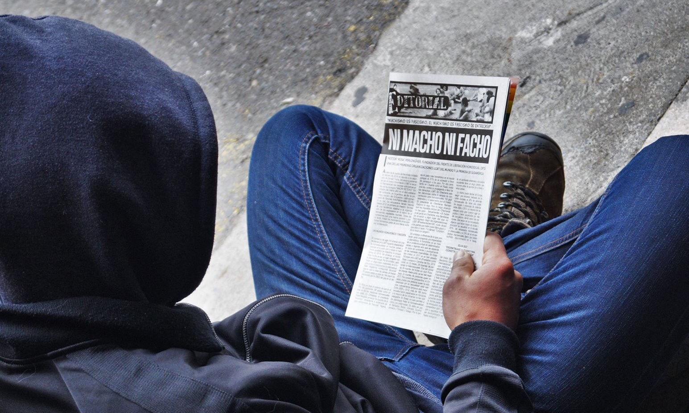

Los hombres tenemos un lugar clave en la lucha contra el machismo, pues somos quienes principalmente lo ejercemos. Son representantes del género masculino quienes discriminan, humillan, acosan, abusan, violan, y matan mujeres por razones de género. Por lo tanto, cualquier intento en disminuir las alarmantes cifras de violencia y desigualdad de género debe focalizarse en **erradicar los comportamientos patriarcales en los varones.** En otras palabras, para acabar con la violencia de género, y en gran medida con la desigualdad de género, necesitamos hombres _nuevos,_ comprometidos con una lucha antipatriarcal que llegue hasta las expresiones más recónditas del machismo que hemos internalizado.<!--more-->

## ¿Qué podemos hacer?

No basta con decir que “estamos a favor de la igualdad de género” o que “no somos machistas”. **Debemos demostrar nuestro compromiso de forma práctica.** Esto implica un extenso ejercicio de auto-análisis, para así identificar y luego reformar los aspectos patriarcales de nuestras propias masculinidades. Debemos tomar esta tarea como una responsabilidad política de los hombres: **nuestra responsabilidad con el fin del patriarcado, empezando por el que tenemos arraigado.**

> El patriarcado se define como un sistema de dominación sexual que es, además, el sistema básico de dominación sobre el que se levantan el resto de las dominaciones, como la de clase y raza. El patriarcado es un sistema de dominación masculina que determina la opresión y subordinación de las mujeres. (Nuria Varela)

Un proceso critico, reflexivo y reformativo de las masculinidades no puede sino basarse en el feminismo, ideología que ha problematizado en profundidad las actitudes patriarcales que los hombres ostentamos, y que son sustento de este orden social patriarcal, caracterizado por la opresión de las mujeres y otras identidades no-masculinas.

## Reconozcamos nuestros privilegios

Para que las mujeres recobren el lugar que históricamente les ha negado la sociedad patriarcal, es necesario **ceder los privilegios** que hemos tenido en su lugar los hombres.

> ...Privilegio \[es el\] poder que siempre habían ejercido los hombres sobre las mujeres de forma “natural”, es decir, como si fuera un mandato de la naturaleza. (Nuria Varela)

Cuando se habla de _privilegio masculino,_ significa que los hombres nos encontramos libres de situaciones que sólo las mujeres sufren, y que las constituyen como sujetas en situación de inferioridad, o bien, como sujetas determinadas por su género. Estas prescripciones sociales son presentadas como propias de las mujeres o inherentes a la feminidad, eximiendo a los hombres de su ejercicio. La maternidad y crianza de hijxs, el cuidado de familiares y otras personas, el trabajo doméstico que no es remunerado, la violencia de género de la que mujeres son víctimas en mayor medida y con mayor intensidad, el acoso sexual al que son expuestas (ya sea en la calle en forma de piropos, o en el lugar de trabajo y estudios, donde toma forma de abuso de poder), el sexismo que produce prejuicios y tratos desiguales hacia las mujeres, las brechas socioeconómicas (de sueldo, pensiones, y oportunidades) que experimentan por ser mujeres, etc., son algunas de las expresiones de desigualdad de género que los hombres no experimentamos, lo cual constituye un **privilegio que disfrutamos por el mero hecho de ser hombres,** que nos pone en situación de “ventaja”.

Por lo tanto, toda crítica a nuestra posición como hombres en una sociedad patriarcal debe partir con el ejercicio retrospectivo de **reconocer nuestros privilegios** y “desnaturalizarlos”, para así tener una noción sobre qué hacer (y qué dejar de hacer) para evitar seguir reproduciendo estas injusticias.

En cierta medida, esto implica _ceder_ nuestros privilegios, pues se trata de interrumpir las prácticas que, en su conjunto, constituyen una cultura y un orden social donde las mujeres son inferiorizadas para que el hombre domine a costa de ellas.

Por ejemplo, esto puede traducirse en **aprender a cuidar a otros** y dedicarnos a ello. Los cuidados históricamente han sido una actividad no remunerada y relegada a las mujeres, sin embargo, del _trabajo de cuidados_ (que involucra la alimentación, el afecto y el trabajo emocional, el tratamiento de enfermedades, etc.) depende todo el trabajo productivo. **Sin cuidados no hay trabajo remunerado.** Tal como nosotros fuimos cuidados por nuestras madres o abuelas, aprendamos a cuidar a otros. Entreguemos afecto y apoyo en cada momento. El _trabajo reproductivo_ es otra actividad que suele ser entendida como propia de las mujeres, lógicamente debido a su capacidad biológica para reproducirse, pero ello no debiese significar que el resto de trabajo que implica la crianza deba quedar exclusivamente en manos femeninas. En la familia, **volvámonos parte activa de la crianza.** Basta de padres ausentes o que estén sólo para jugar y salir. Aprendamos a cuidar a niños pequeños, a gente enferma, y a adultos mayores, y no esperemos que sean las mujeres quienes se ofrezcan primero para esas tareas. **La _corresponsabilidad_ en la crianza es crucial para desnaturalizar la maternidad como una responsabilidad únicamente femenina.**

## Enfrentemos a los hombres machistas

Los hombres a menudo nos desenvolvemos en espacios “de hombres”. A esto se le denomina _homosocialización,_ es decir, socializacion entre pares varones, donde se le puede dar rienda suelta al machismo y la discriminación de género, derivando en comportamientos de objetualización o cosificación de la mujer, la reduccion de la mujer a meros cuerpos para el consumo sexual, la radicalización de estereotipos femeninos y homofóbicos, y la validación de conductas machistas entre varones que pretenden ser vistos como _machos._

Si nos concientizamos de estas prácticas machistas propias de espacios de hombres, podemos **usar nuestros privilegios estratégicamente en contra del machismo,** volviéndonos capaces de interrumpir estas prácticas realizadas por nuestros amigos o colegas y cuestionarlas, haciéndoles ver su origen opresivo y el efecto que pueden tener en las compañeras.

En el trabajo, el carrete, o en el grupo de WhatsApp, los varones podemos tomar un rol activo en llamar la atención a nuestros pares que están siendo machistas.

**Cuestionemos** siempre los chistes y dichos sexistas que repiten inconscientemente para que dejen de encontrar gracia en la denigración de mujeres y personas LBTIQ. **Enfrentemos** el comentario de que la colega “anda con la regla”, **respondamos** al compañero que tira tallas machistas u homofóbicas, **intercedamos** si alguien desprecia de forma machista a una mujer en una conversación, y **denunciemos** al jefe que acosa a nuestras compañeras.

Estos actos constituyen un **uso estratégico del privilegio,** puesto que nuestra condición como varones nos pone en una igualdad ante otros varones machistas que posibilita enfrentarlos de forma directa y segura, sin necesidad de someter a una compañera al desgaste y riesgo de enfrentar a otro machista más. Así, podemos intentar **concientizar a nuestros pares contra el machismo que ejercen.**

## Alcemos la voz contra el machismo

**Callar ante el machismo es ser cómplice del mismo.** Interrumpamos su reproducción, y plantemos la semilla de la crítica en otros hombres. Debemos acabar con toda complicidad: no importa si se trata de un amigo cercano, familiar, un reconocido académico, o un colega. La violencia de género es inadmisible, y debemos denunciarla a toda costa. **Que ninguna actitud machista quede impune.**

Esto se puede traducir en apoyar las luchas y denuncias feministas, ayudando a reverberar sus mensajes entre nuestros pares. Podemos **apoyar el repudio** a las distintas expresiones de machismo en nuestros propios círculos, desde nuestra posición particular como varones, y **sin necesidad de apropiarnos del espacio de las compañeras** ni de esperar aplausos a cambio.

## Basta de toda forma de acoso sexual

El acoso sexual es una práctica machista _demasiado_ común. Muchos varones llegan a justificarla diciendo que se trata de “galantería”, “cortejo”, “caballerosidad”, y otras formas de justificar sus aproximaciones sexuales no solicitadas.

> Hay acoso sexual cuando se produce un comportamiento verbal, no verbal o físico no deseado de índole sexual que tenga por objeto o efecto violar la dignidad de una persona o crear un entorno intimidatorio, hostil, degradante, humillante, ofensivo o perturbador. (Nuria Varela)

La definición de acoso sexual contempla –desafortunadamente para los machitos “galanes” sueltos por ahí– al acoso callejero o _piropo._ Todos los comportamientos involucrados en el acoso, tales como contacto físico excesivo con compañeras de trabajo, mensajes desubicados en tonos sexuales, solicitudes inapropiadas, miradas lascivas, envío de fotos exóticas sin consentimiento, opiniones o comentarios no solicitados sobre el cuerpo o la apariencia, y otras formas menos sutiles, constituyen formas de machismo, pues vulneran la dignidad y autonomía de las mujeres al constituir actividades sexoafectivas ejercidas en contra de su voluntad, imponiéndoles el deseo masculino.

Por ello, además de **oponernos categóricamente a toda forma de acoso,** los varones debemos **practicar la empatía y el consentimiento.**

_Empatía,_ pues es necesario entender que lo que para algunos pueden ser solo “halagos”, “bromas”, o “un cariñito”, para ellas puede ser acoso. Sobre todo si nos ponemos en su lugar, ya que lo más probable es que antes que a ti hayan aguantado a decenas de otros hombres insistentes, molestos, o violentos. Muchos hombres necesitan aprender a dejar de comportarse como animales, y controlarse al estar frente a mujeres.

_Consentimiento,_ ya que tenemos que grabarnos la idea de que _no_ significa _no._ Toda actividad sexual requiere, sin excepción, del consentimiento de la otra persona; es decir, su aprobación explícita sobre la actividad en cuestión. Los hombres debemos de dejar de actuar unilateralmente sobre las mujeres, y empezar a respetarlas como sujetos libres de decidir si participar o no de una situación de cualquier tipo. Así como tú no tolerarías un comentario degradante o una tocación por parte de un desconocido, no seamos quienes pongan a las mujeres en situaciones incómodas y degradantes como esas, y apoyemos, siempre que sea posible, en interrumpir dichas situaciones.

## Creer, apoyar, denunciar

Muchos hombres suelen desconfiar de los testimonios de acoso, abuso sexual, y violación. Pero estos testimonios son una de las pocas formas de hacer justicia contra quienes históricamente han sometido a las mujeres a vejámenes. Dudar de las víctimas de violencia sexual es una forma de negar las experiencias femeninas del machismo.

Una de las formas de desconfiar de los testimonios es responsabilizar a las mujeres por su experiencia de violencia sexual, ya sea por la ropa que llevaba puesta, cuánto alcohol bebió, o a qué hora de la noche iba caminando. Lo cierto es que las víctimas de violencia sexual no son las culpables, sino que los únicos culpables son sus agresores. Algo tan lógico como lo anterior sigue resultando difícil de entender para algunos hombres que, por diversas razones, no tienen idea de las experiencias que conlleva el ser mujer bajo una cultura patriarcal. Por eso, **creamos los testimonios, apoyemos a las compañeras, y denunciemos a los agresores.**

## Formémonos en feminismo

Si los hombres no nos interesamos en el feminismo, es porque la desigualdad social nos beneficia. **Si nos restamos de las luchas de mujeres y disidencias sexuales, es porque vivimos tranquilos en el privilegio del ser hombres heterosexuales.**

Dicho de otro modo: si hemos pasado toda una vida sin adentrarnos siquiera un poco en feminismo –el movimiento social y político que denuncia la opresión sufrida por la mujer y exige su superación– es porque sencillamente toda esta opresión nos deja indiferentes. Esta indiferencia nos vuelve en cómplices del machismo que perpetuamos sin darnos cuenta.

> Los hombres no tienen el derecho a esperar que las feministas les eduquen. El cambio real sólo ocurrirá cuando los hombres acepten que la responsabilidad de la educación recae sobre ellos y no sobre las mujeres. (Cecilia Winterfox)

Contrario a lo que muchos hombres creen, el feminismo no pretende la superioridad de la mujer sobre los hombres, ni constituye un machismo inverso.

> El feminismo es un discurso político que se basa en la justicia. El feminismo es una teoría y práctica política articulada por mujeres que, tras analizar la realidad en la que viven, toman conciencia de las discriminaciones que sufren por la única razón de ser mujeres, y deciden organizarse para acabar con ellas, para cambiar la sociedad. (Nuria Varela)

El feminismo es una herramienta teórica y práctica para superar las desigualdades de género, y así alcanzar la igualdad social en un sentido amplio, puesto que involucra tanto la emancipación de hombres como de mujeres. Ello, al reconocer que el patriarcado determina a ambos géneros mediante roles sociales que dictan lo que podemos y debemos hacer. Por esto, cuando algunas personas opuestas al feminismo hablan sobre la “discriminación de género” que sufren los hombres (como mayor carga laboral, mayores tasas de suicidio, pérdida de tuición de los hijos, y otras), en realidad están hablando de los roles de género que la sociedad patriarcal prescribe para los hombres, que constituyen una contracara dañina y autodestructiva a su posición dominante en las esferas económicas y políticas.

Resulta crucial que los hombres empecemos a **concientizarnos sobre la opresión femenina y formarnos en feminismo.** No basta con nociones generales sobre igualdad de género. Y a su vez, es políticamente relevante que esta concientización sea mediante la autoformación:

> Cuando se espera que las personas de color eduquen a las personas blancas sobre su humanidad, cuando se espera que las mujeres eduquen a los hombres, a las lesbianas y a los gays se espera que eduquen al mundo heterosexual, la opresión mantiene su posición y evade la responsabilidad por sus acciones. (Audre Lorde)

**Dejemos de esperar que las compañeras nos expliquen las cosas.** Basta de exigir material formativo o pedir infinitas charlas de introducción al feminismo. Pretender ser educados por las feministas es exigirle a las compañeras que gasten su tiempo y energía de forma gratuita en los hombres, quienes perfectamente podríamos recurrir a la **autoformación** como expresión de un compromiso mínimo con la causa. _“Las feministas no son responsables de educar a los hombres”,_ como bien dijo Cecilia Winterfox. Así que **formémonos en feminismo y apliquemos lo aprendido a nuestra vida diaria.**

Algunos libros introductorios al feminismo son:

- _[Feminismo para principiantes,](https://mujerfariana.org/images/pdf/Varela-Nuria---Feminismo-Para-Principiantes.pdf)_ de Nuria Varela.
- _[Querida Ijeawele: Cómo educar en el feminismo,](http://bibliotecafeminista.com/querida-ijeawele-educar-feminismo/)_ de Chimamanda Ngozi Adichie.
- _[No nacemos machos,](https://edicioneslasocial.files.wordpress.com/2017/03/masculinidades-web.pdf)_ por Ediciones La Social.
- _[El segundo sexo,](https://femyso.files.wordpress.com/2017/01/el-segundo-sexo.pdf)_ de Simone de Beauvoir.

Luego, resulta indispensable que **hablemos con otros hombres sobre feminismo.** Probablemente nuestros pares no lo tomen en serio, tengan prejuicios o nociones equivocadas, o insistan en llamarlo “feminazismo”, pero de a poco podemos cambiar eso. Formando a otros hombres sobre feminismo no sólo aportamos a expandir la aceptación de la causa, sino que también ahorramos a las compañeras el tedio de tener a otro hombre más diciendo “feminazis”, o peor, siendo un machista de mierda.

Los privilegios que tenemos como varones podemos usarlos para concientizar a otros hombres en contra del machismo. Formémonos sobre feminismo. Reflexionemos críticamente sobre nuestra masculinidad basándonos en las criticas feministas. **Aportemos a la lucha antipatriarcal erradicando al patriarcado en nosotros y en nuestros pares.**

## Cedamos la palabra

Las mujeres han visto su voz históricamente acallada. El mundo se ha perdido de un lado de la historia, y con ello, ha contribuido a invisibilizar la experiencia femenina, tornando lo masculino en sinónimo de lo universal.

Una forma muy práctica de **machismo** es negarle la voz a las mujeres. Suele ocurrir (sobre todo en espacios políticos y académicos) que los hombres se apropian de la palabra, hablan por encima, y se creen dueños del saber. Necesitamos entender que **la palabra no nos pertenece,** y que democratizar la palabra, abriéndola a discursos que generalmente han sido acallados, es un acto político de máxima importancia. Hay muchas más perspectivas que la masculina-blanca-cis-heterosexual.

Acabemos con los grupos únicamente conformados por hombres, o grupos separados por género. **Demos lugar a la inclusión y la paridad.** Pongamos la crítica cuando nos encontremos con “paneles de hombres”, pues siempre hay mujeres interesadas o capacitadas en toda área, y su exclusión de foros o conversatorios constituye discriminación. De la misma manera, exijamos que las bibliografías de cursos universitarios incluyan un mínimo de autoras para **acabar con la invisibilización que ha aquejado a mujeres en las ciencias, las artes, y la academia.** Buscando acabar con la representación desigual de los géneros, podemos apoyar a romper el sesgo cultural sexista: también hay música, cine, libros, y series producidas por mujeres. Escuchemos y potenciemos sus voces.

Si alguien habla encima de una compañera, llamémosle la atención y démosle la palabra a ella. **No cerremos las conversaciones entre hombres.** Tampoco monopolicemos la palabra: respetemos, incluyamos al resto, seamos breves, demos la oportunidad, y no nos apropiemos del tiempo de las/los demás. Finalmente, **evitemos a toda costa invadir o apropiarnos de espacios de mujeres,** ya que los hombres ya tenemos suficiente plataforma para expresarnos en otras instancias. En ese sentido, nuestra alianza con el feminismo debiese darse idealmente desde la vereda antipatriarcal, **sin colonizar con protagonismo masculino a las organizaciones feministas ya existentes.**

## Evitemos la inferiorización y la exclusión

**Dejemos de mirar en menos a las mujeres. Ellas son tan capaces como los hombres en todo orden de cosas.** Punto. Todo lo demás es sexismo.

> \[El sexismo se define como\] el conjunto de todos y cada uno de los métodos empleados en el seno del patriarcado para poder mantener en situación de inferioridad, subordinación y explotación al sexo dominado: el femenino. (Victoria Sau)

En el cotidiano, los métodos del patriarcado para **inferiorizar** a las mujeres están por todas partes. Los varones hacen bromas y comentarios sexistas todo el día (“eso es de mujeres”, “pareces niñita”, “hazlo como hombre”), reproduciendo la idea de que las mujeres son más débiles, frágiles, o incapaces. Inconscientemente, consideramos más aptos y experimentados a los hombres, poniendo en duda las capacidades femeninas. Otras veces, los anterior se traduce en que adjudicamos ciertas tareas a hombres, y otras, las de menos relevancia, a las mujeres, reproduciendo roles sexistas. A menudo, quienes tiene la voz o la última palabra son los hombres, o en otros casos, quienes participan de una actividad son en su mayoría hombres, pues las mujeres fueron excluidas directamente o a través de las oportunidades que se les han negado durante sus carreras (o bien, se excluyeron a sí mismas por la inseguridad que han internalizado).

Finalmente, las ideas sobre lo que “es de hombres” (lo político, lo público, lo activo, lo peligroso, lo complejo, lo racional) y lo que “es de mujeres” (lo orgánico, lo privado, lo pasivo, lo sensible, lo natural, lo emocional); es decir, los _roles de género,_ dan lugar a la **segregación** (muchas veces “voluntaria) de ambos generos en distintas actividades, donde generalmente las actividades masculinas resultan ser las de mayor prestigio y capacidad de incidencia política y económica. Debido a la existencia de roles de género, existen brechas en la participación de mujeres en carreras STEM (ciencia, tecnología, ingeniería y matemáticas), en puestos de liderazgo laboral, y en política.

> La desigualdad de los sexos en la representación cuestiona los fundamentos de la democracia representativa; la paridad debería contribuir a refundar un sistema democrático que es todavía deficiente, ya que no ha podido integrar a la mitad de los ciudadanos, esto es, a las ciudadanas. (Nuria Varela)

La **exclusión** de mujeres de su participación en posiciones de poder es resultado del conjunto de los métodos que usa el patriarcado para remover a las mujeres de los campos donde se juega el poder político y económico, dejando dichas posiciones libres para los hombres, mientras las mujeres son sometidas a tareas infravalorizadas o derechamente no remuneradas. Es por ello que urge un **trato igualitario entre los géneros,** que no determine prescripciones a ninguno de ellos, **garantizando igualdad de oportunidades, la inclusión, y la paridad.** Ello pasa, en cierta medida, por el trato cotidiano que tenemos los hombres con las mujeres, que debe ser absolutamente igualitario y carente de sexismo, para dejar de reproducir la inferiorización de la mujer.

Existen otras formas de inferiorizar a las mujeres que debemos evitar.

Cuando tildamos a las mujeres de locas, exageradas, o decimos que andan con la regla para explicar sus reacciones, descalificamos sus reclamos y demandas, al apelar a una cierta **irracionalidad** inherente a lo femenino (reproduciendo la idea de que la racionalidad es una cualidad masculina).

También es muy común el **infantilizar** a las mujeres, apelando a una supuesta inocencia, ternura, o inexperiencia que en cierta medida son percibidas como femeninas. Presentemos y llamemos por sus nombres y títulos, no por apodos ni ignorando su estatus. Las mujeres merecen el mismo respeto y trato que merece cualquier otro ser humano.

Esto también significa que **dejemos de criticar a las mujeres por su vida sexual.** Las mujeres son sujetos autónomos y soberanos sobre sus cuerpos y deseos. Tal como nosotros vivimos nuestra propia sexualidad, que ellas vivan la suya como quieran, **sin imponer criterios morales y conservadores que restringen sus libertades.**

Las mujeres también sufren una gran presión social sobre sus cuerpos y apariencias. Sobre ellas recae la exigencia patriarcal de verse de acuerdo a normas de belleza que absorben su tiempo, energía y recursos: además de ser todo lo que son, a ellas además se les exige ser bonitas, sonrientes, y _señoritas._ Por eso, **dejemos de evaluar a las mujeres por su apariencia, peso, o vestimenta.** Las mujeres no son objetos, y su apariencia no debiese ser la cualidad respecto a la que se les mida y compare con otras. Las mujeres son mucho más que objetos de deseo masculino. Paralelamente, abrámonos a otros tipo de belleza fuera de lo que dictan los ideales del gusto masculino, para así colaborar a **romper con los ideales de belleza irreales** que afectan negativamente la autoestima y seguridad de las mujeres. Apoyemos el empoderamiento de cuerpos disidentes, diversos, y fuera del canon de belleza patriarcal que restringe el espectro de lo deseable.

## Avancemos hacia las masculinidades críticas

Los hombres _no nacemos machos,_ sino que somos criados y educados bajo una masculinidad de tipo patriarcal, que opera en consonancia con la opresión de la mujer y las disidencias sexuales.

Debemos entender que los conceptos que conforman la masculinidad hegemónica no derivan de la biología ni son propios del sexo masculino, sino que se trata de un constructo social funcional a un determinado orden social.

> La supremacía masculina, al igual que los demás credos políticos, no radica en la fuerza física, sino en la aceptación de un sistema de valores cuya índole no es biológica. La robustez física no actúa como factor de las relaciones políticas (basta recordar las relaciones entre razas y clases). La civilización siempre ha sabido idear métodos (la técnica, las armas, el saber) capaces de suplir la fuerza física, y ésta ha dejado de desempeñar una función necesaria en el mundo contemporáneo. (Kate Millet)

Las actitudes patriarcales propias de la supremacía masculina sustentan una cultura de dominación, competitividad e individualismo. En tanto constructo social, **podemos des-aprender la masculinidad hegemónica y sus actitudes patriarcales,** y desarrollar masculinidades que rehúyan de la opresión femenina y de la homofobia.

¿Qué significa ser hombre? **Pensemos por qué los hombres somos así, y con qué motivos.** Qué provocamos y a quiénes afectamos. ¿Por qué los hombres rechazan tanto a los homosexuales? ¿Por qué se nos exige reprimir nuestras emociones? ¿Por qué se espera que seamos proveedores económicos? ¿Cuales son las “cosas de hombres”? ¿Por qué somos tan competitivos? ¿Por qué accedemos tan fácilmente a la violencia? ¿Por qué los hombres rechazan todo lo femenino? ¿Por qué resulta tan importante que un hombre _sea hombre?_

**Dejemos de reprimirnos bajo una idea rígida de masculinidad.** La masculinidad hegemónica sólo nos reprime, causando daño a las mujeres, diversidades sexuales, y a otros hombres. Este tipo de masculinidad construye nuestras identidades en base a la inseguridad de tener que validar nuestra _hombría_ una y otra vez ante otros hombres y ante las mujeres.

Podemos ser distintos, podemos ser libres de vivir como queramos. Partamos el cambio por nosotros mismos, y seamos de una forma que no dependa del machismo, sexismo, homofobia y transfobia.

Dejemos de atacar y burlarnos de hombres que no viven o expresan masculinidades hegemónicas. **No definamos nuestra masculinidad denostando a otros/as.** Basta de inculcar estereotipos represivos de masculinidad y feminidad a niñas y niños. Llorar no es de niñitas, el fútbol no es de hombres: todas y todos debemos ser libres de desarrollarnos plenamente, sin determinaciones sexistas que limiten nuestras capacidades. Aprendamos a gestionar y vivir nuestras emociones, sin miedo de expresarlas. Transparentar nuestros sentimientos, admitir el fracaso, y sentir debilidad no nos hace ser _menos hombres._

Vivir masculinidades críticas significa analizar críticamente lo que la cultura exige que seamos, y **desarrollar formas de vivir nuestra masculinidad que se opongan a la estructura de opresión patriarcal y neoliberal.** Podemos ser mejores hombres.

* * *

> El **patriarcado** es una forma de organización política, económica, religiosa y social basada en la idea de autoridad y liderazgo del varón, en la que se da el predominio de los hombres sobre las mujeres, el marido sobre la esposa, del padre sobre la madre y los hijos e hijas, y de la línea de descendencia paterna sobre la materna. El patriarcado ha surgido de una toma de poder histórico por parte de los hombres, quienes se apropiaron de la sexualidad y reproducción de las mujeres y de su producto, los hijos e hijas, creando al mismo tiempo un orden simbólico a través de los mitos y la religión que lo perpetuarían como única estructura posible. (Dolors Reguant)

Luchar contra todo lo patriarcal que llevamos dentro es un proyecto de largo aliento. Despatriarcalicemos nuestra masculinidad. Seremos más libres, menos dañinos, y estaremos haciendo lo mínimo por construir una sociedad mejor para todas y todos.

Bastián Olea Herrera  
(Créditos de la foto: [Colektivo Tue-Tue](https://www.facebook.com/colektivotuetue/))

* * *

_Apuntes y ensayos sobre estudios de género, sociología del cuerpo y teoría feminista por Bastián Olea Herrera, licenciado y magíster en sociología (Pontificia Universidad Católica de Chile)._ bastimapache basti mapache
