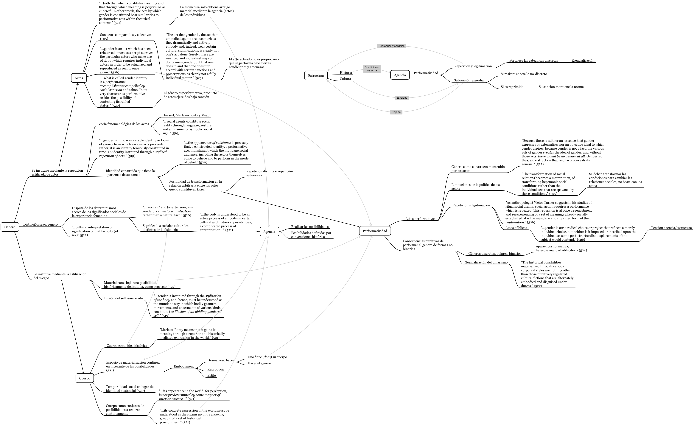

[Toca sobre este enlace o en el mapa conceptual para descargarlo:](http://bastian.olea.biz/wp-content/uploads/2018/03/Género-y-actos-performativos-Butler-1988.pdf)

Butler, J. (1988). Performative acts and gender constitution: An essay in phenomenology and feminist theory. _Theatre Journal_.

* * *

_Apuntes y ensayos sobre estudios de género, sociología del cuerpo y teoría feminista por Bastián Olea Herrera, licenciado y magíster en sociología (Pontificia Universidad Católica de Chile)._ Bastimapache
