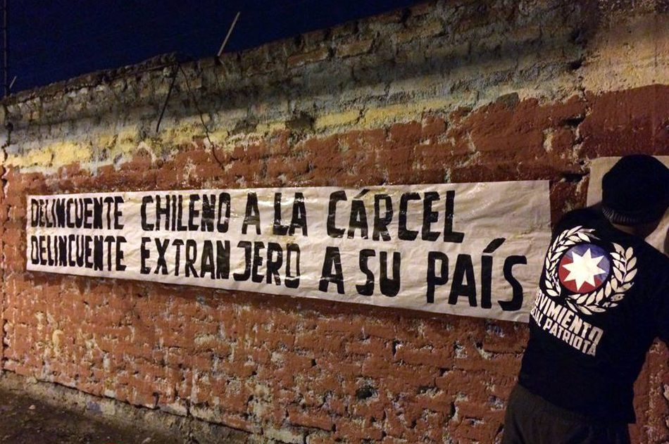

El presente ensayo esbozará teóricamente los conceptos de racismo, xenofobia y nacionalismo, para concluir con la aplicación de dichos conceptos a un análisis de caso, que referirá a un documento político del Movimiento Social Patriota (MSP), polémica organización social asociada a corrientes neonazis y fascistas chilenas.<!--more-->

## El concepto de raza

_Raza_ es un concepto que simboliza conflictos sociales e intereses que refieren a las diferencias y similitudes biológicas o fenotípicas entre los cuerpos humanos, a partir de las cuales se producen _significaciones raciales_ (Omi y Winant, 2015, p. 110). En otras palabras, mediante la identificación visual de marcadores corporales, se adjudican significados simbólicos, asociaciones, y prácticas sociales correspondientes a las categorías sociales construidas en torno a determinados marcadores fenotípicos (Ibíd., p. 111).

El concepto posee un origen biosocial, haciendo referencia en su génesis a la caracterización tipológica de supuestas variaciones fisiológicas y cognitivas entre distintos grupos humanos (Martínez, 2016), pretendiendo conceptualizar las similitudes y diferencias humanas mediante categorías raciales, surgidas a la par de procesos sociohistóricos propios del colonialismo europeo (Wade, 2012).

En la actualidad, el contenido que poseen las categorías raciales no se extrae desde diferencias biológicas o genéticas, sino que surgen socialmente, siendo análogos a los de la raza y el género. El posicionamiento de los sujetos en la _estructura racial_ no se deriva de su pertenencia racial, sino que, desde la teoría racial crítica _(critical race theory),_ se postula que la posición de los sujetos en la estructura social ha sido dispuesta de acuerdo a características que han sido socialmente definidas como raciales (Bonilla-Silva, 1996, p. 472). Bajo esta lectura, la raza resulta socialmente construida, puesto que las características que designan la pertenencia a un grupo racial no brotan desde una dimensión objetiva, ya sea somática o biológica (Ibíd., p. 469). Un análisis de las significaciones raciales que tenga como fuente las diferencias biológicas entre los sujetos demostraría que los significados sociales atribuidos a las diferencias fenotípicas no son más que meras arbitrariedades (Omi y Winant, 2015, p. 110), puesto que resulta imposible que el contenido de las categorías raciales emerja desde diferencias genéticas que son mínimas o derechamente inexistentes (Martínez, 2016).

A pesar de que la raza corresponda a un constructo social devenido ideológico, dicha estructuración adquiere autonomía, y por consiguiente, produce efectos reales en el sistema social (Bonilla-Silva, 1996, p. 469), dando lugar a jerarquizaciones sociales que se fundan en la categorización de sujetos bajo criterios raciales.

### Formación y proyectos raciales

El proceso mediante el cual las diferencias físicas o fenotípicas entre los sujetos son proveídas de significados sociales, o dicho de otro modo, el mecanismo mediante el cual los significados raciales se extienden hacia determinados grupos o prácticas sociales, se denomina _racialización_ (Omi y Winant, 2015, p. 111). Los grupos racializados, sobre los cuales se esencializan criterios raciales de diferencia, son ordenados jerárquicamente en base a prácticas y relaciones que constituyen su posicionamiento en un regimen racial (Bonilla-Silva, 2015, p. 77; 1996, p. 473).

Como se argumentó anteriormente, la relación entre significados raciales y características fenotípicas/físicas/biológicas son arbitrarias, y se encuentran en constante articulación y disputa (Winant, 2000, p. 182). Esta articulación entre aspectos biológicos de la dimensión somática de los sujetos y los elementos simbólicos y sociales en la construcción de _sujetos racializados_ se denomina _formación racial_ (Omi y Winant, 2015, pp. 125, 109). Éste concepto refiere a la conjugación entre los significados sociales que son atribuidos a los individuos racializados, de acuerdo a la significación dominante en la configuración actual de la estructura racial (Bonilla-Silva, 1996, p. 473). Así, los significados raciales se construyen de manera contingente a los intereses de distintos agentes, los cuales iteran las categorías raciales resultantes (Winant, 2000, p. 182) en base a determinados _proyectos raciales._ Los proyectos raciales articulan conscientemente determinadas _formaciones raciales,_ conectando de manera práctica y discursiva los significados raciales con los cuerpos racializados –es decir, insertando los significados raciales en la estructura social– en base a intereses económicos, políticos, o culturales que son expresados en términos raciales (Omi y Winant, 2015, p. 125).

En tanto los _proyectos raciales_ pretenden imponer una manera determinada de interpretar y posicionar estructuralmente a los cuerpos racializados, retornamos al concepto de raza como la simbolización de conflictos e intereses que hacen referencia a las diferencias corporales entre los individuos (Winant, 2000, p. 172); es decir, _raza_ como la esencialización intencionada de conflictos sociopolíticos en los significados designados a ciertas características corporales (Omi y Winant, 2015, p. 111). En este sentido, el extendido fenómeno del _racismo_ no debiese interpretarse como un conjunto de ideas propias de desvaríos individuales, problemas psicológicos o sencilla estupidez, sino como la racionalización de las interacciones sociales, políticas y económicas entre las distintas _razas_ (Bonilla-Silva, 1996, p. 473), entendiendo como “razas” a los grupos sociales que son categorizados como parte de un conjunto demarcado social e históricamente bajo criterios demográficos, identitarios y culturales (Omi y Winant, 2015, p. 125).

El concepto de _raza,_ entonces, implica la cristalización de categorías sociales derivadas de los procesos históricos de dominación de ciertas razas por sobre otras, en un contexto global colonialista, donde las categorías resultantes han adquirido capacidades propias para reproducir las asimetrías raciales. A pesar de que los constructos que dieron lugar a las desigualdades y conflictos raciales originarios se cimentaran en pseudo-ciencia y otras dinámicas de deshumanización autorizadas por discursos investidos de autoridad ad hoc, su constitución como significados socialmente reproducidos en la forma de _categorías raciales_ tiene repercusiones reales para las experiencias vividas de los sujetos posicionados en los estratos inferiores de la estructura social racializada (Omi y Winant, 2015, p. 110).

### Racismo

El _racismo_ es, brevemente, la ideología racial de un sistema social racializado (Bonilla-Silva, 1996, p. 467). Esto significa que, en tanto ideología, el racismo es la estructura ideológica que cristaliza las significaciones raciales (Bonilla-Silva, 1996, p. 473), y por ende, la justificación o reforzamiento de la diferenciación social basada en dichas significaciones (Omi y Winant, 2015, p. 111). El racismo surge como una forma extrema de etnocentrismo, históricamente representada como la conclusión inevitable de las aproximaciones sociobiológicas acerca de las diferencias humanas (Wimmer, 1997, p. 23), pero también responde a un conjunto de ideas o una determinada disposición psicológica que es contemporánea, dinámica y contingente (Bonilla-Silva, 2015, p. 76).

El racismo no opera sólo desde una dimensión de las ideas, sino que se organiza fundamentalmente en torno a una base material (Ídem) y constituye _sistemas sociales racializados_ (Bonilla-Silva, 1996, p. 474), en tanto del racismo surgen relaciones y prácticas sociales basadas en distinciones raciales que, a nivel estructural, devienen en una distribución económica, política y social de los recursos que responde al _proyecto racial_ dominante. En este sentido, ciertos sujetos y grupos sociales (en su mayoría blancos o en una posición colonizadora) pueden adherirse a una racionalidad racista, dado que la organización racializada del sistema social puede resultarles benéfica en relación a su posicionamiento dentro de dicho sistema social racializado (Bonilla-Silva, 2015, p. 76).

Las ideas racistas se reproducen mediante la socialización de concepciones negativas respecto los individuos racializados negativamente, lo cual da lugar a la asociación entre marcas raciales o étnicas y ciertas cualidades negativas, o bien, entre dichas marcas y la posición en la esfera económica en la que suelen ubicarse estos grupos. Desde una aproximación sociocultural (Telles, 2013, p. 1568), los sujetos racistas adquieren una interpretación racista de la sociedad al esencializar las relaciones entre estos elementos, como si dichas cualidades y posiciones fueran inherentes a las marcas raciales que son destacadas por la formación racial en lo cuerpos de los grupos sociales racializados. Pero las ideas y actitudes raciales, en tanto forma de interpretar la sociedad y la nación, no necesariamente responden a mecanismos individuales, donde cada sujeto desarrolle o no una actitud racista o no racista de acuerdo a sus circunstancias o experiencias propias, sino que se encuentran enraizadas en la historia de la región (Ibíd., p. 1592), y por ende, cristalizadas en su cultura e instituciones, produciendo una realidad social cimentada sobre el terreno conflictivo e injusto provocado por la desigualdad estructural (reificada mediante procesos históricos de colonialismo, esclavismo, y explotación).

Mediante el proceso de _racialización_ se crean grupos sociales “desde arriba” (Hacking, 1999) de acuerdo a sus características raciales, distinguiendo entre la pertenencia a cada categoría racial a través de las distinciones físicas que se relacionan a cada grupo racializado. Ciertos grupos devienen _otrorizados_ a través de este proceso (Omi y Winant, 2015, p. 112), al definirse su categoría en base a una marca racial negativizada de acuerdo al proyecto racial imperante. Lo anterior, debido a que, sin duda, y como menciona Eduardo Bonilla-Silva parafraseando a Marx, las ideas de la “raza dominante” son las ideas dominantes de la formación social (2015, p. 79). En tanto las categorías raciales son dispuestas jerárquicamente en la estructura racial (Bonilla-Silva, 1996, p. 473), los grupos indígenas, afrodescendientes, negros, y de color son posicionados al fondo de la _estructura de alteridad_ (Wade, 2013, p. 214), en concordancia con la herencia de la colonialidad que aún se mantiene vigente en las instituciones y relaciones sociales contemporáneas (Grosfoguel, 2004). La definición “desde arriba” de los grupos racializados como _otros,_ de acuerdo al proyecto racial dictado por la “raza dominante”, facilita la justificación y racionalización de la opresión, subordinación, y discriminación de sus integrantes marcados por la corporalidad racializada (Omi y Winant, 2015, p. 105), construyendo así categorías sociales que albergan a dominantes y dominados en la estructura racial, y que son funcionales al sistema capitalista. La _formación racial_ posibilita la clasificación de las razas oprimidas mediante la otrorización ejercida por las razas dominantes, colectividad que procurará asegurar que los contenidos negativos sean impresos en las marcas raciales que caracterizan a los grupos racializados, de esta manera objetivando su otredad (Bennet, 2009) y esencializando la articulación de la estructura de dominación racial.

## Xenofobia

El fenómeno de la xenofobia puede entenderse como la transferencia de los constructos que jerarquizan los cuerpos hacia un plano nacional, a través del concepto de _comunidades imaginadas._ Las comunidades imaginadas remiten a la idea de un origen común y una experiencia histórica paralela en la conformación de la nación, así como el sentimiento de compartir un destino colectivo que compartirían los distintos grupos sociales que pactan la conformación de un estado-nación común (Wimmer, 1997). La idea de comunidad imaginada como seno del concepto de nación produce una relación identitaria entre las y los ciudadanos con respecto al territorio que delimita los alcances administrativos del Estado, así como la percepción de un modo de vida común dentro de sus límites, y un conjunto de derechos relacionados a la ciudadanía dentro del mismo. Por oposición, y siguiendo con Wimmer (1997), ello implica un cierre social con respecto a las demás naciones, y por lo tanto, una _etnización_ del Estado en torno al acceso al poder, recursos y servicios que éste ofrece para sus miembros/ciudadanos. La nación, entonces pasa de ser una comunidad imaginada a una comunidad de intereses, que comprende una promesa de participación, seguridad, y solidaridad dentro de sus límites, y por ende, su facticidad es condicional a la membresía nacional (Ibíd., p. 29). La xenofobia, entonces, remitiría a una postura respecto al funcionamiento del Estado-nación basada en un orden social hermético, sostenido sobre una idea de comunidad imaginaria con implicancias identitarias, y se expresaría, según Wimmer (1997), como una estrategia política respecto a la distribución de los roles, atribuciones, beneficios y servicios ofrecidos por la nacionalidad, los cuales se encontrarían virtualmente en riesgo ante la inmigración.

Desde esta concepción de xenofobia, los grupos inmigrantes serían rechazados al interpretarse como un obstáculo respecto del rol del Estado como garante del bienestar social (Ibíd., p. 31). De acuerdo a la idea de comunidad imaginada, los grupos inmigrantes no calificarían como integrantes de la nación, y por lo tanto, no serían beneficiarios (ni competidores) legítimos de los recursos y derechos proveídos por el estado-nación (Ídem). Bajo estos términos, la xenofobia correspondería a una especie de rivalidad o competencia contra grupos que coincidentemente son racializados, tales como grupos étnicos, inmigrantes, e indígenas, versus los grupos no-inmigrantes, que serían legítimos integrantes de la comunidad imaginaria constituida en el proceso de surgimiento del estado-nación. En esta competencia están en juego los recursos escasos de la nación y sus receptores, legítimos o “ilegítimos” (Ibíd., p. 19). Los sujetos integrantes de grupos que carecen de marca racial, es decir, los “legítimos” integrantes de la comunidad imaginaria y, por tanto, merecedores de la solidaridad nacional, percibirían la posesión de un derecho que les resultaría inherente respecto de los recursos en disputa por los grupos racializados (Quillian, 1995). Así, la xenofobia adquiere un aspecto económico, gatillándose ante la amenaza atribuida a la incursión de grupo racializados dentro de los límites de la comunidad imaginaria. El grupo “legítimo”, no-marcado, coincide con la “raza dominante”, pero sus estrategias no son meramente económicas, sino que corresponden a una apelación al _pacto de solidaridad_ de un estado-nación que ha pasado por un proceso de etnización y se encuentra en una etapa de conflicto social (Wimmer, 1997, p. 32). En este sentido, la xenofobia se alimenta del aspecto ideológico propio de una estructura social racializada, de acuerdo a la otrorización de los grupos inmigrantes bajo líneas raciales y de pertenencia nacional, pero también de otras retóricas racistas, tales como las ideas de incompatibilidad cultural e imposibilidad de asimilación, a su vez ambas provenientes de la idea de que las culturas “inherentes” a los grupos racializados serían incompatibles con la cultura hegemónica, procurando una noción de incompatibilidad cultural entre la cultura hegemónica y las culturas inmigrantes. En consecuencia, las retóricas raciales agudizan la idea de que los sujetos “ilegítimos” deben ser excluidos de la comunidad imaginaria, y por ende, del pacto de solidaridad nacional.

Pasamos, entonces, desde la mera competencia por recursos, hacia una concepción identitaria de la pertenencia a una determinada comunidad, que legitima ciertos derechos y servicios de los cuales los grupos sociales otrorizados se ven excluidos, ya sea por encontrarse fuera de los límites de la nación, o bien, por corresponder a los _otros_ que no pertenecen a esta comunidad, e ingresan ilegítimamente al territorio poniendo en disputa los “derechos” de los grupos locales. Este ideario identitario acerca de la nación se ve potenciado por la circulación de imágenes acerca del carácter humano de la nación, que son construidas bajo una determinada formación y proyecto racial, y validadas por el discurso científico, reproduciendo la exclusión de los “otros” de la identidad nacional en base a las marcas raciales que residen en sus cuerpos (Wade, 2013, p. 232), y otras retóricas que se valen de referencias a la nación como “cuerpo nacional”, el bienestar como “salud”, y el cuerpo como territorio (Wodak, 2015).

## Nacionalismo

El concepto de xenofobia resulta pertinente en su íntima relación con el surgimiento y desarrollo del estado-nación, y obtene sentido a partir de determinadas ideas racistas que fundamentan la diferenciación de grupos sociales a escala nacional. En este sentido, el _nacionalismo_ adquiere relevancia y fuerza como significante identitario en tiempos de crisis (Skey, 2010, p. 721), tales como las crisis percibidas por los grupos de movilidad social descendente respecto de su lugar dentro del pacto de solidaridad nacional dada la incursión de grupos migratorios y/o racializados (Wimmer, 1997, p. 19).

A través del nacionalismo, los grupos sociales que se perciben a sí mismos como integrantes legítimos de la comunidad imaginada que conforma al estado-nación se validan como una identidad concreta, reificada en la imagen de la nación. Esto da lugar a la unión de la comunidad imaginaria en tanto unidad de parentesco ampliada, íntimamente ligada a las ideas de origen común, experiencia histórica, y destino nacional (Ibíd., p. 28). La conformación de un “nosotros” alineado a los intereses comunes de la comunidad nacional se contrapone al “ellos” extranjero, la amenaza externa que atenta contra la capacidad del estado para asegurar el bienestar de sus ciudadanos (Ibíd., p. 31). De dicha forma, el racismo y la xenofobia operan en conjunto bajo el nacionalismo, con el fin de reafirmar la identidad nacional en contextos de crisis, ya sea en contra de enemigos extranjeros, o de la crisis de identidad colectiva propiciada por el aumento de población extranjera (Ibíd.). A través del nacionalismo, los sujetos se afianzan al proyecto de una legítima jerarquización social dentro del estado-nación que privilegia a los miembros de la comunidad imaginaria por sobre sus amenazas internas o externas, asegurándoles una seguridad comunitaria e identitaria basada en la idea relativamente estable de la identidad nacional (Skey, 2010, p. 721).

## Categorización social

Las categorías sociales en las que se basan el racismo, la xenofobia y el nacionalismo, no existen por sí mismas. Como se argumentó anteriormente, las categorías sociohistóricas que han pretendido representar grupos racialmente diferenciados carecen de cualquier sustento biológico, y por ende, devienen arbitrarias (Winant, 2000; Omi y Winant, 2015). Las categorías sociales actualmente existentes, y que son resultado de proyectos raciales particulares, poseen un peso discursivo de acuerdo su constante enunciación. Dicho de otro modo: _nombrar es constituir,_ y las numerosas categorizaciones sociales que contienen formaciones raciales funcionales a proyectos raciales de corte racista circulan a través del sentido común debido a la existencia social que les confiere su nombramiento.

_Nombrar_ corresponde a lo que Foucault llama la “constitución de los sujetos”, ejercida a través de “una multiplicidad de organismos, fuerzas, energías, materiales, deseos, pensamientos, etc.” (Foucault, 1980, p. 97). Quienes constituyen a los sujetos racializados son las clases y razas dominantes, quienes guardan un interés por oprimir determinados grupos sociales bajo argumentos raciales, o bien, por parte de sujetos que ven en el sujeto marcado racialmente una amenaza a su forma de vida o sus oportunidades individuales. En ambos casos, la categorización viene _desde arriba_ (Hacking, 1999, p. 168), nombrando una realidad respecto de los grupos sociales racializados que repercute institucional e interaccionalmente en las experiencias vividas de inmigrantes, indígenas, y personas de color. En virtud de la agrupación de individuos de acuerdo a sus marcas corporales, la categorización refiere a similitudes que supuestamente simbolizan determinados contenidos respecto de estos grupos sociales, y en base a esta asimilación “desde arriba”, se produce una base para la diferenciación social (Jenkins, 2000, p. 22). Ninguna afiliación puede describir a un _nosotros_ sin un _otro._ Definir al _otro_ es definir a lo que no se es: lo _indígena_ viene del colonizador, lo _extranjero_ viene de lo local, lo _negro_ de lo blanco, lo _marcado_ de lo “no marcado”. Son dinámicas de exclusión políticas expresadas discursivamente.

La estructura social se organiza según nuestra capacidad de reconocer en el otro un posicionamiento social determinado, a partir de sus marcas, estilos, figuras, colores. Así, los marcadores visuales, físicos, fenotípicos, o corporales, producen efectos en la interacción social al gatillar categorizaciones. La categorización de los cuerpos nunca es mera clasificación, sino que es ejercida por un otro dispuesto en una escala superior de la estructura social (Jenkins, 2000, p. 21), que moviliza recursos (institucionales, ideológicos) para extender las categorizaciones raciales a la organización general de la sociedad (Ibíd., p. 19). En este sentido, lo “marcado” es únicamente lo que posibilita “desmarcar” al opresor o colonizador, tematizando únicamente las diferencias que otrorizan a los grupos racializados (y feminizados, explotados, etc.).

## Análisis de caso

Racismo y xenofobia no son sinónimos. El primer concepto, _racismo,_ alude a una construcción social basada en diferencias fenotípicas que contribuyen a la categorización de ciertos grupos sociales que son dispuestos en una jerarquía social. El segundo concepto, _xenofobia,_ refiere a una postura respecto al funcionamiento del estado-nación basada en un orden social hermético, sostenido sobre una idea de comunidad imaginaria que legitima la relación entre ciertos individuos y la solidaridad social enmarcada en límites territoriales. Ambos conceptos, racismo y xenofobia, tienen relación con el _nacionalismo,_ en vista de que éste engloba una extensión de ideas de esencialismos raciales a una escala geopolítica, sustentando ideas de particularismo nacional que propician la constitución de una identidad a escala nacional, a su vez construida mediante la oposición a factores foráneos a su comunidad ideal. Llevados a un extremo, la xenofobia lleva a ideas nacionalistas, donde el _nosotros_ nacional es posicionado simbólicamente por sobre otros constructos culturales y nacionales externos, y el racismo lleva hacia el supremacismo racial (blanco), donde la naturalización de las diferencias entre grupos raciales dispuestas en un orden racial califica a determinadas categorías (racializadas) como inherentemente inferiores.

A pesar de que los tres conceptos son distintos, y poseen diferentes gradaciones, suelen coincidir en movimientos sociales que ostentan intereses políticos particulares. A continuación, se analizará de forma breve –y a la luz de los conceptos esbozados– el caso del _Movimiento Social Patriota_ (MSP), un movimiento político y social chileno con presencia nacional, a través del análisis del texto “Documento de orientación Nº1: Manifiesto ideológico” [(disponible en línea).](http://www.movimientosocialpatriota.cl/doctrina)

El Movimiento Social Patriota (en adelante MSP) plantea basar su doctrina política en “los ideales políticos de la _identidad nacional_ y la justicia social” (p. 1), siendo su “imperativo moral (…) la lucha por la existencia del pueblo de Chile” (p. 9). El único referente al cual aluden en el texto refiere a la _Unión Nacionalista,_ partido fundado en 1913, el cual, junto a _Vanguardia Popular Socialista_ (movimiento que a su vez surge en 1939 a partir del _Movimiento Nacional Socialista de Chile_), convergen en 1943 en el _Partido Unión Nacionalista de Chile,_ un partido de ideología abiertamente fascista, nacionalista, y corporativista.

La primera idea que destaca en el contenido político del Manifiesto es la proposición de una identidad que no remite a una clase o estrato social, como suele darse en otros movimientos políticos, sino que se plantea una _identidad chilena,_ de escala nacional. Esta idea de _identidad nacional_ se ciñe sobre una identidad individual definida en base a la “pertenencia a esferas más amplias de la comunidad, como la familia, _la región de nacimiento_ y la _nación”_ (p. 4); es decir, lo individual queda inmediatamente supeditado a lo nacional, y lo nacional no remitiría solamente a un criterio administrativo, sino que hace alusión explícita a la _región de nacimiento,_ es decir, una adscripción nacional basada –a grandes rasgos– en la sangre.

Para el MSP, la _nación_ es uno de sus conceptos centrales, siendo descrita como “una de las formaciones comunitarias más exitosas de la historia” (p. 1). El movimiento la define como “conformadas por individuos unidos en una _etnia y cultura común”,_ y surgen “fruto de largos períodos de tiempo, desarrollando una idea comunitaria bajo objetivos históricos acordes a la _realidad biológica_ y _dinámicas propias del entorno”_ (p. 1). La retórica utilizada hace referencia casi explícita al proceso de etnización del estado-nación anteriormente descrito, mediante el cual la comunidad imaginada da lugar a la institucionalización de una forma de vida común bajo criterios étnicos de pertenencia, pero la idea es llevada más adelante al incorporar factores biologicistas y del entorno a la ecuación, integrando las ideas de que la población nacional posee una correspondencia innata con su territorio que se ha desarrollado a través de su historia, y que por lo tanto, constituiría un criterio de cierre social biológico. Continuando el párrafo, se explicita que “pueblo, tierra, nación y destino son una y la misma cosa” (p. 1), dando a entender que la población está inherentemente ligada a su territorio, y continuando con la idea implícita de comunidad imaginada, sus integrantes comparten un _destino_ común, un _proyecto._

En tanto “la nación es la conciencia de un pueblo o comunidad de su _particularidad y destino”_ (p. 6), y surge desde “la _tendencia natural_ de los grupos humanos a formar culturas y entidades comunitarias _diferenciadas, únicas y auténticas”_ (p. 2), se refuerza la idea de un particularismo que concierne a la comunidad unida bajo un destino en potencia, marcando su cohesión interna, la existencia de características que agrupan en torno a la similitud (la _identidad nacional_), y la diferenciación respecto de otras comunidades _diferentes._ De este modo, una definición particularista de la nación distingue a los “otros” extranjeros que no serían legítimos pertenecientes.

El énfasis en lo nacional desemboca en la abierta defensa del _nacionalismo_ como causa política, siendo definido nuevamente en términos identitarios, como una tendencia que “fomenta la más genuina buena convivencia entre las naciones, aquella propia de las _agrupaciones humanas seguras de su identidad_ y _respetuosas de las diferencias_ que permiten el surgimiento de la diversidad de los pueblos” (p. 3). La _identidad nacional,_ como objetivo político, entonces, resulta en la concepción de que las naciones poseen (o deben poseer) identidades sólidas e internamente homogéneas, y que esto a su vez marca las diferencias esenciales entre distintas naciones, que constituyen una “diversidad” que resultaría natural a los procesos particulares de la historia de cada pueblo. El origen de esta idea, que naturaliza las diferencias entre las poblaciones, se encuentra bajo una retórica de racismo biologicista, presente en párrafos como el que se cita en extenso a continuación:

> “…la etnia de un pueblo está constituida por el conjunto de características heredables biológicas y psíquicas comunes, características que permitieron el surgimiento del pueblo y la mantención de su cultura. Hombres y mujeres de características biológicas determinadas interactuando en un entorno concreto dieron como resultado las particulares características de la nación chilena.” (p. 5)

En otras palabras, se sostiene que cada nación atraviesa procesos individuales de desarrollo, los cuales darían lugar a características biológicas entre las poblaciones, las cuales son heredables y se relacionan con la cultura nacional. En este punto de su Manifiesto ideológico, el MSP incorpora ideas abiertamente racistas acerca de la conformación del estado-nación, no sólo al fijar las diferencias sociales entre las naciones en factores biológicos, sino que al sostener que dichas “características heredables biológicas” constituyen un criterio a partir del cual surgen una cultura y orden social particulares.

La biologización de la diferencia se sustenta en reiteradas alusiones a “las leyes naturales”, por ejemplo, en el enunciado: “las sociedades deben ser un _reflejo del orden natural_” (p. 8), a partir de lo cual se racionaliza el proceso de ordenamiento social bajo criterios raciales a escala nacional. De este modo, los criterios básicos de la identidad son representados como “categorías _surgidas de la biología_ y de su _interacción con el suelo”_ (p. 3); es decir, la retórica del MSP se sustenta en recursos cientificistas, a partir de los cuales su postura es puesta en contraposición a las “abstracciones o narrativas inventadas por el hombre _como se ha querido hacer creer”_ (Ídem).

Sin embargo, las posturas racistas racionalizadas, expresadas por el “progresismo (…) futurista y naturalista, siempre bajo los límites de la sustentabilidad ecológica y de las insondables leyes naturales” (p. 7) del MSP, resultan más claras en la noción de crisis presente a través del texto. El discurso utilizado para referirse a la nación a lo largo del documento utiliza distintos conceptos que parecieran suscitar ideas de crisis y una multiplicidad de enemigos, “internos y externos” que asechan a la nación.

Lo anterior se encuentra implícito en la constitución de su concepto de _identidad nacional,_ la cual “afianza, cohesiona y fortalece las sociedades”, pues “las comunidades sin identidad son fácilmente divisibles y sujetas a poderes de dominación por parte de grupos internos y externos de interés particular” (p. 3); es decir, el pilar básico de la ideología del MSP se irgue sobre un miedo al otro que atentaría a dividir la cohesión nacional a través del a ataque a la identidad y la cultura. Este punto es un lugar común en la retórica neonazi, usada también por la _alt-right_ estadounidense, a partir de la cual se argumenta el rechazo a determinados grupos sociales (inmigrantes y racializados, pero también de tendencias progresistas como el izquierdismo radical y el feminismo) en función de que atentan contra la identidad nacional al pretender integrar elementos culturales e ideológicos externos, _ajenos_ a la identidad _natural_ de la comunidad nacional. De este modo, la nación se enfrentaría a la “disolución, debilitamiento, decadencia e igualitarismo”, propiciados por la _“globalización cultural,_ el mundialismo financiero, los _descontrolados procesos migratorios_ y la tendencia a _diluir las identidades”,_ todo lo anterior siendo una amenaza de “desarticular las sociedades nacionales.” (p. 2). Nos encontramos ante una xenofobia matizada, donde todo lo externo a la comunidad imaginada representa un riesgo para el funcionamiento del estado-nación, ya sea bajo criterios de incompatibilidad cultural, de diferencias inherentes a los grupos sociales otrorizados, o a la amenaza de disolución de la identidad nacional(ista). La retórica construida en torno a la identidad nacional adquiere un tono casi bélico:

> _“…Diluir la identidad nacional_ representa un gran peligro para la concreción de logros comunitarios ya que, pese a lo que dicen los apóstoles del globalitarismo, (…) sólo las _naciones fuertes y cohesionadas_ logran superar los desafíos de un mundo hostil.” (p. 3)

En este sentido, el factor clave será el control migratorio. El MSP, fiel a sus principios nacionalistas y racistas, pero también víctima de la correctitud política del discurso público contemporáneo, evita rechazar abiertamente la inmigración, admitiendo que “durante los siglos posteriores a su creación, la _etnia chilena_ ha _incorporado inmigrantes_ de diversas partes del mundo” (p. 5), pero inmediatamente añadiendo una condición: “Este proceso es positivo en la medida en que _el aporte de sangre nueva sea pausado, selectivo y funcional”_ (Ídem). En otras palabras, la inmigración es tolerada únicamente bajo criterios de selección y funcionalidad que, se intuye, sean funcionales a la _identidad nacional chilena,_ o mejor dicho al _proyecto racial_ promovido por el MSP. Entonces, sólo _cierta inmigración_ resulta deseable, planteando la noción de que sólo ciertos grupos sociales son aptos para integrarse a la comunidad nacional, mientras que otros son indeseables. Esta idea presenta ciertos paralelos con las ideas eugenésicas, a partir de las cuales se utilizan criterios técnicos –en retrospectiva, racistas– para “perfeccionar” la especie. Al referirse a la integración de culturas foráneas, el MSP simplemente reitera la lógica selectiva.

A través del análisis del breve Manifiesto ideológico del Movimiento Social Patriota, es posible identificar que las ideas racistas y xenófobas, al alero de una retórica eminentemente nacionalista, siguen en boga en Chile. El MSP ha sido un movimiento político polémico, debido a las actividades políticas que protagonizan, donde utilizan retórica abiertamente racista y anti-inmigración en distintos puntos de la capital y regiones mediante manifestaciones anti-inmigración, pega de carteles y “chacones” con mensajes en contra de la inmigración y la diversidad sexual, e incluso se les atribuyen “limpiezas” o “barridas” callejeras, en las cuales sus militantes golpean a inmigrantes, homosexuales, y a otras identidades otrorizadas por su retórica racista y fascista. En este contexto, donde existen atentados contra las vidas de distintos grupos sociales propiciados por organizaciones racistas y xenófobas, urge comprender la proliferación moderna de estas ideas y la forma en que configuran ideologías sustentadas en la opresión del _otro,_ para evitar que se repitan las calamidades llevadas a cabo por estas tendencias extremistas a costa de las inseguridades vividas por la clase trabajadora.

### Referencias

- Bennet, J. (2009). Vibrant Matter: A Political Ecology of Things. London: Duke University Press.
- Bonilla-Silva, E. (1996). Rethinking Racism: Toward a Structural Interpretation. American Sociological Review, 62(3), 465-480.
- Bonilla-Silva, E. (2015). More than prejudice: Restatement, reflections, and new directions in critical race theory. Sociology of Race and Ethnicity, 1(1), 73-87.
- Foucault, M. (1980). Power/Knowledge, ed. C. Gordon (London and New York, 1980), p. 97.
- Grosfoguel, R. (2004) “Race and Ethnicity or Racialized Ethnicities?: Identities within Global Coloniality”, Ethnicities, 4(3): 315-336
- Hacking, I. (1999). Making up people. The Science Studies Reader.
- Jenkins, R. (2000). Categorization: Identity, Social Process and Epistemology. Current Sociology, 48(3), 7–25.
- Martínez, F. (2016). Patrimonio bioantropológico genético: genómica y construcción de identidad cultural. In: Alvarado y Cols (2016). Patrimonio y pueblos indígenas: Reflexiones desde una perspectiva interdisciplinaria e intercultural. Pehuén Editores.
- Quillian, L. (1995). Prejudice as a response to perceived group threat: Population composition and anti-immigrant and racial prejudice in Europe. American Sociological Review, 586-611.
- Skey, M. 2010 “A sense of where you belong in the world: national belonging, ontological security and the status of the ethnic majority in England”, Nations and Nationalism 16(4):715-733. Stoll, L. 2014. “Constructing the color-blind classroom: teachers’ perspectives on race and schooling”, Race ethnicity and education, 17(5): 688-705.
- Telles, E., & Bailey, S. (2013). Understanding Latin American Beliefs about Racial Inequality. American Journal of Sociology.
- Wade, P. (2002). Race, Kinship and the Ambivalence of Identity. In: Schramm, K., Skinner, D., & Rottenburg, R. (eds.). (2002). Identity Politics and the New Genetics: Re/Creating Categories of Difference and Belonging. (pp. 79-96). Oxford: Berghahn Books.
- Wade, P. (2013). Blackness, indigeneity, multiculturalism and genomics in Brazil, Colombia and Mexico”. Journal of Latin American Studies, 45(2): 205-233.
- Wimmer, A. (1997). Explaining racism and xenophobia. A critical review of current research approaches. Ethnic and Racial Studies, vol. 20(1):17-41.
- Winant, H. (2000). Race and Race Theory. Annual Review of Sociology, 26, 169-185.
- Wodak, R. (2015). Language and Identity: The Politics of Nationalism. En The Politics of Fear. What Right-Wing Populist Discourses Mean. Londres: SAGE.
