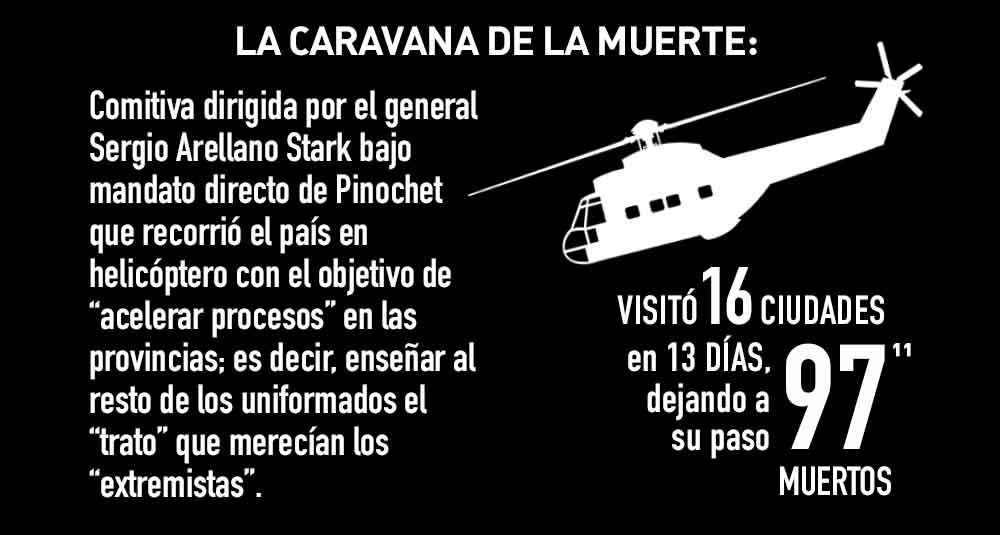
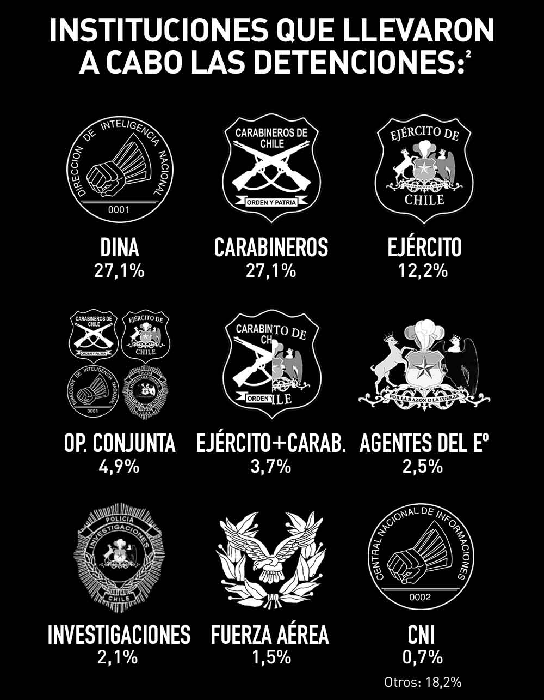

#### [Existe una nueva versión de esta infografía en su propio sitio web, con más datos, nueva información y más gráficos. Has clic aquí para visitar la nueva versión.](https://bastianolea.github.io/violaciones_ddhh_chile/)

Esta infografía resume cifras de las violaciones a los Derechos Humanos cometidas por los diferentes aparatos represivos que compusieron y apoyaron la dictadura cívico-militar chilena, que tomó el control del país en 11 de septiembre de 1973 mediante un golpe de Estado.

La infografía sintetiza estadísticas provenientes de diferentes fuentes (principalmente los informes Rettig y Valech), con el objetivo de recopilar de manera simplificada y accesible la información existente acerca de las consecuencias de la violencia estatal, terrorismo de Estado y represión política que se ejerció sistemáticamente entre los años 1973 y 1989.

Esperamos que este insumo sea un aporte a la memoria nacional, capaz de volver patente la frialdad con que operó la dictadura cívico-militar chilena en su afán por obliterar a toda oposición para adueñarse del poder político y económico. Estas cifras representan cómo la derecha chilena, respaldada por empresarios, militares y el gobierno estadounidense, se apoderó del país por medio de las armas, la violencia, y el terrorismo estatal, manteniendo su legado hasta el día de hoy mediante el modelo neoliberal que impusieron dictatorialmente.

<!--more-->

![VIOLACIONES A LOS DERECHOS HUMANOS COMETIDAS POR LA DICTADURA CÍVICO-MILITAR CHILENA Amplio es el prontuario en materia de derechos humanos que aún pesa sobre la dictadura militar. El uso de violencia durante tal periodo se volvió política de Estado, y la eliminación selectiva de ciudadanos específicos benefició directamente los objetivos político-económicos del régimen de Pinochet. La consecuencia directa de esto ha sido un sufrimiento permanente para las familias y redes más cercanas de las víctimas, y un profundo sentimiento de injusticia e impunidad para nuestro país, en tanto el sistema que se alimentó con tanta sangre chilena continúa más vivo que nunca.](images/1.b-Título-infografía-violaciones-a-los-derechos-humanos-dictadura.jpg)![33.221 CIVILES DETENIDOS POR MOTIVOS POLÍTICOS Al disolverse los derechos de libre reunión de grupos de personas en las calles, aplicarse un toque de queda que duraría 14 años, y llevarse a cabo una constante lucha contra determinadas agrupaciones sociales e ideas políticas, el régimen dictatorial hizo amplio uso de detenciones policiales como forma de represión directa y amedrentamiento. A través de las detenciones se nutrían las organizaciones de inteligencia y se reprimía la oposición, generando así condiciones para la consolidación política del régimen.](images/3.-Detenciones-infografía-violaciones-a-los-derechos-humanos-dictadura.jpg) ![33.221 CIVILES DETENIDOS POR MOTIVOS POLÍTICOS Al disolverse los derechos de libre reunión de grupos de personas en las calles, aplicarse un toque de queda que duraría 14 años, y llevarse a cabo una constante lucha contra determinadas agrupaciones sociales e ideas políticas, el régimen dictatorial hizo amplio uso de detenciones policiales como forma de represión directa y amedrentamiento. A través de las detenciones se nutrían las organizaciones de inteligencia y se reprimía la oposición, generando así condiciones para la consolidación política del régimen.](images/4.-Detenciones-por-periodo-infografía-violaciones-a-los-derechos-humanos-dictadura.jpg) ![9.794 PRISIONEROS POLÍTICOS apresados en 1.132 centros de detención y tortura Los centros de detención tuvieron un rol vital en la política de represión dictatorial. Estos lugares serían establecidos con el solo propósito de llevar a cabo, en forma sistematizada y en total impunidad, delitos de terrorismo de Estado. Comisarías, regimientos, escuelas, edificios públicos y casas particulares son algunos de los lugares que serían utilizados con estos fines. Algunos de los más iconicos conocidos son el Estadio Nacional, Isla Dawson, Villa Grimaldi, Londres 38, la Venda Sexy, Londres 38, entre otros miles.6](images/5.-Prisioneros-políticos-infografía-violaciones-a-los-derechos-humanos-dictadura.jpg) ![9.794 PRISIONEROS POLÍTICOS apresados en 1.132 centros de detención y tortura Los centros de detención tuvieron un rol vital en la política de represión dictatorial. Estos lugares serían establecidos con el solo propósito de llevar a cabo, en forma sistematizada y en total impunidad, delitos de terrorismo de Estado. Comisarías, regimientos, escuelas, edificios públicos y casas particulares son algunos de los lugares que serían utilizados con estos fines. Algunos de los más iconicos conocidos son el Estadio Nacional, Isla Dawson, Villa Grimaldi, Londres 38, la Venda Sexy, Londres 38, entre otros miles.6](images/6.-Prisioneros-políticos-datos-infografía-violaciones-a-los-derechos-humanos-dictadura.jpg) ![24.529 PERSONAS TORTURADAS Una enorme cantidad de los detenidos durante la dictadura fueron sometidos sistemáticamente a terribles vejámenes, tormentos y humillaciones por sus captores. El objetivo de estos actos inhumanos (cometidos en su mayoría por ciudadanos que hoy siguen en libertad) fue principalmente el obtener información, pero más allá de este criterio funcional, la consecuencia directa de la tortura era el ejercer gobierno a través del terror, tanto sobre las víctimas directas como en el general de la población que poco a poco tomaba conocimiento de lo que podía costarles el oponerse a la dictadura. 229 mujeres embarazadas fueron torturadas. 11 embarazadas fueron violadas durante la tortura. 15 bebés nacieron en presidio por las torturas. 20 mujeres sufieron abortos por las torturas sufridas. 9,73% mujeres confesaron](images/7.-Torturados-infografía-violaciones-a-los-derechos-humanos-dictadura.jpg) ![24.529 PERSONAS TORTURADAS Una enorme cantidad de los detenidos durante la dictadura fueron sometidos sistemáticamente a terribles vejámenes, tormentos y humillaciones por sus captores. El objetivo de estos actos inhumanos (cometidos en su mayoría por ciudadanos que hoy siguen en libertad) fue principalmente el obtener información, pero más allá de este criterio funcional, la consecuencia directa de la tortura era el ejercer gobierno a través del terror, tanto sobre las víctimas directas como en el general de la población que poco a poco tomaba conocimiento de lo que podía costarles el oponerse a la dictadura. 229 mujeres embarazadas fueron torturadas. 11 embarazadas fueron violadas durante la tortura. 15 bebés nacieron en presidio por las torturas. 20 mujeres sufieron abortos por las torturas sufridas. 9,73% mujeres confesaron](images/8.-Torturados-datos-infografía-violaciones-a-los-derechos-humanos-dictadura.jpg)  ![2.279 ASESINADOS Y EJECUTADOS POR EL ESTADO Y LAS FUERZAS DE LA DICTADURA Numerosas operaciones llevadas a cabo durante la dictadura involucraron la ejecución a sangre fría de civiles. En los centros de detención, se llamó entre las multitudes a determinados individuos para su ejecución pública. En allanamientos de viviendas o redadas en poblaciones, el uso de fuerza letal también era común. Dirigentes sindicales o agrarios, militantes políticos, activistas o manifestantes eran blancos recurrentes. El resultado de esta brutal tendencia al abuso del poder militar es un amplio prontuario de ejecutados políticos que califican como violaciones a los derechos humanos. sólo entre el 11 de septiembre](images/10.-Ejecutados-infografía-violaciones-a-los-derechos-humanos-dictadura.jpg) ![2.279 ASESINADOS Y EJECUTADOS POR EL ESTADO Y LAS FUERZAS DE LA DICTADURA Numerosas operaciones llevadas a cabo durante la dictadura involucraron la ejecución a sangre fría de civiles. En los centros de detención, se llamó entre las multitudes a determinados individuos para su ejecución pública. En allanamientos de viviendas o redadas en poblaciones, el uso de fuerza letal también era común. Dirigentes sindicales o agrarios, militantes políticos, activistas o manifestantes eran blancos recurrentes. El resultado de esta brutal tendencia al abuso del poder militar es un amplio prontuario de ejecutados políticos que califican como violaciones a los derechos humanos. sólo entre el 11 de septiembre](images/11.-Ejecutados-gráfico-infografía-violaciones-a-los-derechos-humanos-dictadura.jpg)  ![OPERACIÓN ALBANIA: 12 MILITANTES DEL FPMR LOCALIZADOS Y EJECUTADOS. Se produjo entre el 15 y 16 de junio de 1987. La CNI hizo uso minucioso de inteligencia obtenida luego del frustrado magnicidio de 1986 y de otras operaciones reprimidas, lo cual –junto a extensos seguimientos de las víctimas– posibilitó a la institución dar con los domicilios, sedes operativas o rutas de desplazamiento de los doce militantes del Frente Patriótico Manuel Rodríguez. Los hechos fueron encubiertos por las autoridades como “enfrentamientos”.](images/13.-Operación-Albania-infografía-violaciones-a-los-derechos-humanos-dictadura.jpg) ![2.279 ASESINADOS Y EJECUTADOS POR EL ESTADO Y LAS FUERZAS DE LA DICTADURA Numerosas operaciones llevadas a cabo durante la dictadura involucraron la ejecución a sangre fría de civiles. En los centros de detención, se llamó entre las multitudes a determinados individuos para su ejecución pública. En allanamientos de viviendas o redadas en poblaciones, el uso de fuerza letal también era común. Dirigentes sindicales o agrarios, militantes políticos, activistas o manifestantes eran blancos recurrentes. El resultado de esta brutal tendencia al abuso del poder militar es un amplio prontuario de ejecutados políticos que califican como violaciones a los derechos humanos. sólo entre el 11 de septiembre](images/14.-Ejecutados-por-año-infografía-violaciones-a-los-derechos-humanos-dictadura.jpg) ![MÁS DE 200.000 EXILIADOS REPARTIDOS ENTRE CASI 50 PAÍSES Miles de personas optaron por escapar del país para proteger su vida o la de sus seres queridos. Otros pudieron conmutar sus condenas por el exilio, con la condición de no poder regresar al país. Pero también la dictadura usó el exilio como mecanismo para remover a sus opositores y enemigos políticos: en 1973 se instaura el decreto 81, que faculta a la autoridad para expulsar del país a sus ciudadanos arbitrariamente. Desde 1974, el decreto 604 “prohíbe el ingreso al territorio nacional a las personas (...) que a juicio del Gobierno constituyan un peligro para el Estado”.](images/15.-Exiliados-infografía-violaciones-a-los-derechos-humanos-dictadura.jpg) ![1.193 DETENIDOS DESAPARECIDOS 127 extranjeros 79 mapuche 54 menores 9 embarazadas Padres y madres, hijos e hijas, hermanos y hermanas, compañeros y compañeras, fueron secuestrados desde sus casas (28,6%), lugar de trabajo (11,3%) o de la vía pública (24,3%) por agentes de la dictadura, para nunca más volver a ser vistos por sus seres queridos. Esta práctica de eliminación selectiva también se constituyó en un método recurrentemente usado por organismos represores para llevar a cabo asesinatos y ejecuciones y posteriormente ocultar toda evidencia, encubriendo los hechos a través de la desaparición del cadáver y la manipulación de informes y pericias, para así salir impunes de los crímenes. 31% de ellos NO tenía MILITANCIA POLÍTICA la gran mayoría de los detenidos desaparecidos eran de sexo masculino. Los detenidos desaparecidos que sí tenían militancia se distribuyen de la siguiente manera: Obreros y campesinos Estudiantes Trabajadores independientes Profesionales y funcionarios DISTRIBUCIÓN DE DETENIDOS DESAPARECIDOS POR REGIONES: DESAPARICIONES POR AÑO:](images/17.-Detenidos-desaparecidos-infografía-violaciones-a-los-derechos-humanos-dictadura.jpg) ![1.193 DETENIDOS DESAPARECIDOS 127 extranjeros 79 mapuche 54 menores 9 embarazadas Padres y madres, hijos e hijas, hermanos y hermanas, compañeros y compañeras, fueron secuestrados desde sus casas (28,6%), lugar de trabajo (11,3%) o de la vía pública (24,3%) por agentes de la dictadura, para nunca más volver a ser vistos por sus seres queridos. Esta práctica de eliminación selectiva también se constituyó en un método recurrentemente usado por organismos represores para llevar a cabo asesinatos y ejecuciones y posteriormente ocultar toda evidencia, encubriendo los hechos a través de la desaparición del cadáver y la manipulación de informes y pericias, para así salir impunes de los crímenes. 31% de ellos NO tenía MILITANCIA POLÍTICA la gran mayoría de los detenidos desaparecidos eran de sexo masculino. Los detenidos desaparecidos que sí tenían militancia se distribuyen de la siguiente manera: Obreros y campesinos Estudiantes Trabajadores independientes Profesionales y funcionarios DISTRIBUCIÓN DE DETENIDOS DESAPARECIDOS POR REGIONES: DESAPARICIONES POR AÑO:](images/18.-Detenidos-desaparecidos-datos-infografía-violaciones-a-los-derechos-humanos-dictadura.jpg) ![1.193 DETENIDOS DESAPARECIDOS 127 extranjeros 79 mapuche 54 menores 9 embarazadas Padres y madres, hijos e hijas, hermanos y hermanas, compañeros y compañeras, fueron secuestrados desde sus casas (28,6%), lugar de trabajo (11,3%) o de la vía pública (24,3%) por agentes de la dictadura, para nunca más volver a ser vistos por sus seres queridos. Esta práctica de eliminación selectiva también se constituyó en un método recurrentemente usado por organismos represores para llevar a cabo asesinatos y ejecuciones y posteriormente ocultar toda evidencia, encubriendo los hechos a través de la desaparición del cadáver y la manipulación de informes y pericias, para así salir impunes de los crímenes. 31% de ellos NO tenía MILITANCIA POLÍTICA la gran mayoría de los detenidos desaparecidos eran de sexo masculino. Los detenidos desaparecidos que sí tenían militancia se distribuyen de la siguiente manera: Obreros y campesinos Estudiantes Trabajadores independientes Profesionales y funcionarios DISTRIBUCIÓN DE DETENIDOS DESAPARECIDOS POR REGIONES: DESAPARICIONES POR AÑO:](images/19.-Detenidos-desaparecidos-mapa-infografía-violaciones-a-los-derechos-humanos-dictadura.jpg) ![1.193 DETENIDOS DESAPARECIDOS 127 extranjeros 79 mapuche 54 menores 9 embarazadas Padres y madres, hijos e hijas, hermanos y hermanas, compañeros y compañeras, fueron secuestrados desde sus casas (28,6%), lugar de trabajo (11,3%) o de la vía pública (24,3%) por agentes de la dictadura, para nunca más volver a ser vistos por sus seres queridos. Esta práctica de eliminación selectiva también se constituyó en un método recurrentemente usado por organismos represores para llevar a cabo asesinatos y ejecuciones y posteriormente ocultar toda evidencia, encubriendo los hechos a través de la desaparición del cadáver y la manipulación de informes y pericias, para así salir impunes de los crímenes. 31% de ellos NO tenía MILITANCIA POLÍTICA la gran mayoría de los detenidos desaparecidos eran de sexo masculino. Los detenidos desaparecidos que sí tenían militancia se distribuyen de la siguiente manera: Obreros y campesinos Estudiantes Trabajadores independientes Profesionales y funcionarios DISTRIBUCIÓN DE DETENIDOS DESAPARECIDOS POR REGIONES: DESAPARICIONES POR AÑO:](images/20.-Desaparecidos-por-año-infografía-violaciones-a-los-derechos-humanos-dictadura.jpg) 

![Realizado y diseñado por Bastián Olea. 1: Informe de la Comisión Nacional sobre Prisión Política y Tortura (Informe Valech). 2: Informe de la Comisión Nacional de Verdad y Reconciliación (Informe Rettig). 3: Comisión Chilena de Derechos Humanos. 4: Amnistía Internacional. 5: Comisión de Derechos Humanos de las Naciones Unidas. 6: Memoria Viva. 7: Asociación de Familiares de Detenidos Desaparecidos, 1995. 8: Vicaría de la Solidaridad, 1993. 9: Informe de la Comisión ética contra la tortura (CECT) a Ricardo Lagos (2001) y CODEPU. 10: Ejecuciones en Chile septiembre-diciembre 1973: El circuito burocrático de la muerte, ArchivosChile, 2012. 11: La misión era matar: el juicio a la caravana Pinochet-Arellano. Jorge Escalante Hidalgo. Lom Editores. 2000. 12: Según el informe Valech, el número corresponde a mujeres que confesaron espontáneamente durante interrogaciones que no estaban directamente dirigidas a la violencia sexual. Esto, sumado a la complejidad de confesar el sufrimiento de una violación sexual, sugiere que el número real es mucho mayor.](images/22.-Referencias-y-créditos-infografía-violaciones-a-los-derechos-humanos-dictadura.jpg)
