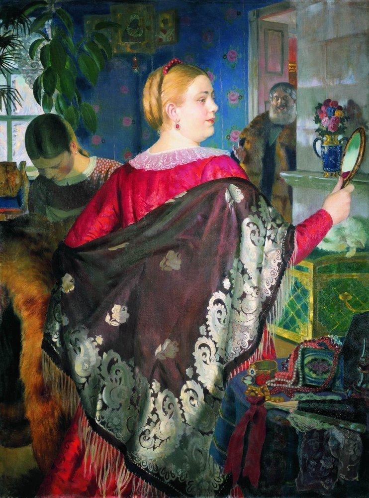

La _belleza_ es una forma de _capital_ que se expresa a través de nuestros cuerpos, específicamente mediante la silueta o figura corporal, y la apariencia en términos generales. Si entendemos como _capital_ a cualquier recurso esencial para obtener beneficios en un cierto campo, y cuya posesión a su vez puede definir nuestra posición en dicho campo, entonces el _capital corporal;_ es decir, el capital asociado al atractivo de nuestros cuerpos, es el valor que la sociedad le atribuye a las apariencias. Como sociedad, asignamos significados positivos a determinados atributos estéticos y corporales, en consecuencia abriendo ciertas oportunidades (o _privilegios)_ a los cuerpos que expresen determinado nivel de belleza, pero simultáneamente cerrando estas oportunidades a los cuerpos que no cumplan determinados criterios estéticos. Este proceso social de valorización del cuerpo, que posibilita que la apariencia sea interpretada como un recurso, ocurre en las interacciones sociales cotidianas, como cuando juzgamos a las personas por su apariencia, cuando percibimos que una persona pertenece a un determinado grupo social por cómo se ve o se viste, o cuando somos prejuiciosos por razones estéticas. Es en la interacción entre nuestras miradas y las prenociones sobre los significados de los cuerpos que socialmente reproducimos esquemas de valorización corporal.

<!--more-->Alcanzar la belleza es un proceso donde coinciden una diversidad de trabajos ejercidos sobre el cuerpo. La definición marxista de _trabajo_ considera la transformación de la naturaleza mediante las capacidades humanas, y en su versión alienada (neoliberal), el objetivo del trabajo es la producción de un _valor_ dispuesto al intercambio en la forma de _mercancía,_ figurada en base a su deseabilidad social (que se traduce en su intercambio por otros recursos). Entonces, el _trabajo corporal_ comprende al conjunto de actividades que esculpen la corporalidad humana hacia formas socialmente determinadas como deseables, y es guiado por la valorización mercantil de los cuerpos en base a su posesión de capital corporal en la forma de belleza.

### Privilegio de la belleza

El acceso al _capital corporal,_ en tanto forma estética de capital, es regulado por la _industria de la belleza._ Toda forma de capital es válida dentro de un campo social específico, y los actores que luchan dentro de dicho campo para apropiarse de los beneficios materiales o simbólicos derivados de la acumulación de capital intentarán regular el flujo de dicho capital para mantener sus privilegios. Por ejemplo, la competencia y regulación económica en la economía de mercado, o el credencialismo en el campo educacional que enfatiza la posesión de títulos académicos, etc. En el caso de la belleza, la industria de la moda –entendida como las marcas, empresas, tendencias, celebridades, y personajes relevantes en dicho campo– pretende imponer múltiples barreras o criterios, con el objetivo de que sólo una élite pueda acceder al _privilegio de la belleza;_ es decir, a los beneficios derivados de la posesión de capital corporal. Algunas de estas barreras son los precios elevados, la exclusividad de ciertos productos, los cambios frecuentes de temporadas y modas, las altas exigencias de _trabajo corporal_ (las técnicas aplicadas al cuerpo necesarias para “ser bella”), ideales difíciles o imposibles de alcanzar (como determinados tipos de cuerpo, tonos de piel, facciones faciales, etc.), manejo de conocimientos y técnicas especializadas, etcétera. De este modo, la condición de belleza se torna dependiente de la capacidad de mantenerse en la vanguardia de quienes pueden permitirse ser bellas. Siguiendo la noción bourdesiana de _capital,_ el capital es intercambiable o transmutable, por lo que el capital económico puede (y suele) ser transmutado a capital corporal, literalmente posibilitando el _comprar la belleza_ a través de una capacidad de consumo que permita acceso a los mejores productos, fármacos, tratamientos y cirugías.

De este modo, un cuerpo “normativamente bello” –es decir, que se adecúa a los ideales de belleza– es un cuerpo que expresa su capacidad de acceso a la vanguardia de la belleza. Esto equivale al _vestir_ una apariencia y una corporalidad que se adecúe a lo socialmente considerado como _bello_ en un momento y contexto social dado.

La regulación del campo de la belleza implica que ésta corresponda a un _privilegio:_ no todos pueden tener acceso a los mejores y más nuevos productos, el cuerpo ideal debe costar cientos de horas de gimnasio, productos adelgazantes y cirugías, la prenda de moda no puede verse bien en todos los cuerpos, no todos los fenotipos serán considerados atractivos, etcétera. La exclusividad permite conceder un prestigio al acto de consumir apariencias. De este modo, siempre existirán mecanismos para excluir y limitar el acceso a la belleza, pues si la belleza fuera democrática, entonces perdería el valor que deriva de su condición de escasez y lujo, o pensando nuevamente en términos de capital, una “democratización” de la belleza significaría una “inflación” del valor de la belleza, y por lo tanto, la devaluación de los atributos que se adecúan al ideal de belleza. Así, la belleza es considerada un _privilegio,_ debido a que son pocas las que realmente pueden cumplir con los parámetros que definen _lo bello._ Pocas personas son las privilegiadas de poseer un capital corporal significativo, y ésta exclusividad lo vuelve en un recurso codiciado.

Si todas las personas tuvieran autos deportivos y carteras de diseñador, entonces dejarían de ser artículos lujosos. Son considerados artículos lujosos justamente por su exclusividad. Ocurre lo mismo con la belleza: en una sociedad patriarcal, los cuerpos femeninos son considerados objetos e incluso mercancías, por lo que una ampliación del ideal de belleza para incluir la diversidad de cuerpos y siluetas femeninas acabaría con el privilegio de la delgadez, y por consiguiente, con los beneficios sociales y el estatus que se le atribuye.

### Belleza y género

La belleza también es una marca de género, en tanto el binarismo heteronormativo dictamina apariencias rígidamente diferenciadas para hombres y para mujeres, así como la feminidad hegemónica determina una fijación por la apariencia como cualidad inmanente a la condición femenina (la confinación de las mujeres a sus cuerpos o –de acuerdo a Rosi Braidotti– su _sobrecorporeización)._ Si el conjunto de marcadores corporales (o atributos de belleza) calzan con la norma de género y el ideal de belleza (lo cual significa que calzan con el deseo masculino heteronormativo), las mujeres son identificadas y tratadas _como mujeres._ El fracaso en la percepción de una feminidad “apropiada” o “válida”, es decir –entre otros– _ser fea,_ da lugar a la denigración y el rechazo social de una mujer patriarcalmente percibida como “fallida” respecto a la feminidad hegemónica, siendo sancionada doblemente: una vez como mujer, y una segunda como _mala mujer._

El ideal de belleza femenino no sólo es deseado por los varones, sino que es prácticamente exigido por la sociedad patriarcal en su conjunto. Se ha vuelto un _deber ser_ para las mujeres socializadas en la feminidad hegemónica. Además de comprender apariencias heteronormadas, incluye prescripciones de comportamiento, deseos permitidos y prohibidos, y mecanismos que posibilitan que las mujeres internalicen su dominación y la reproduzcan de forma inconsciente. Esto se traduce en una mayor aceptación de las mujeres que calzan con el ideal, lo cual es recompensado en el mercado de las relaciones de pareja, en el mercado laboral, y prácticamente en cualquier interacción social; mientras que la desadaptación respecto del ideal normativo carece de dichos refuerzos, y más aún, suele encontrar rechazo.

Conectando con lo anterior: la reproducción de la belleza como un privilegio resulta en que la imagen de la _mujer ideal_ comprenda demasiados parámetros por cumplir, muchos de los cuales son difícilmente alcanzables para la mujer promedio. En muchos casos no importa cuánto empeño se ponga en “mejorar” el cuerpo: siempre existirá una falencia capaz de producir insatisfacción con la apariencia, incitando nuevos intentos por hacer calzar al cuerpo con el patrón ideal destinados a fallar, cayendo una y otra vez en el fracaso (como es la realidad de las dietas de adelgazamiento que fallan el 95% de las veces). Se trata de un círculo vicioso de consumo y disciplinamiento corporal que encierra a las mujeres en un estado de permanente disatisfacción gracias a la existencia de ideales de belleza imposibles, lo cual beneficia a la industria de la belleza.

### Deseo de delgadez

El _ideal de delgadez_ es un factor crucial en la construcción de un ideal de belleza excluyente y que posea un estatus social privilegiado. La delgadez no sólo es valorizada bajo criterios estéticos. Culturalmente, la delgadez es percibida como una buena condición de salud, la cual a su vez significaría características personales positivas, como la responsabilidad, el auto-control, la disciplina, y la buena toma de decisiones. En conjunto, la delgadez también representa una determinada forma de vivir, es decir, un estilo de vida. Los cuerpos delgados y bellos marcan un nivel socioeconómico, la pertenencia a una determinada clase social, e incluso una ascendencia racial. Así, la apariencia y la figura corporal pasan a comunicar una determinada disposición ante la vida, una serie de desiciones personales, un determinado acceso a la moda y a los medios de embellecimiento... en sentido amplio, una _identidad._

La figura, los movimientos, la forma de hablar, los modales, los gustos, y el uso del tiempo. Todos estos elementos expresan un cierto estilo de vida y una identidad, determinado en última instancia por factores materiales (nuestro capital, lugar de nacimiento, diner, etc.). A través del incesante, desgastante y caro trabajo corporal, se pretende alcanzar a los cuerpos idealizados. Estos cuerpos coinciden con los de las clases altas y aristocráticas, cuya posición social ha dictado _lo deseable_ durante siglos. Así, las personas que no tuvieron la fortuna de nacer en cuna de oro buscan imitar los privilegios de las élites vistiéndose como ellos, caminando como ellos, hablando como ellos, adelgazando como ellos, operándose como ellos, y derrochando como ellos. Pero como naturalmente no tenemos sus mismos recursos, vivimos vidas vacías, basadas en la imitación, donde reinan conductas autodestructivas (el rechazo de sí mismo) y de autoexplotación (dañarnos para cambiarnos) que nos impulsan a pretender ser algo que nunca seremos. Comprar el teléfono que no nos alcanza, endeudarnos por un auto ostentoso, perder el sueldo en cosméticos, sufrir y privarnos del placer por bajar efímeramente un par de kilos, y dar la vida por cambiar nuestros cuerpos, son algunos síntomas de la lucha que damos por vivir vidas que nunca viviremos. La realidad es que terminamos destruyéndonos emocional y económicamente en el intento. Sublimamos nuestras insuficiencias materiales en logros meramente estéticos.

### El cierre del privilegio de la belleza

Vestir es una necesidad humana. Tener un equilibrio y una paz con la propia apariencia, que es nuestra forma de presentarnos ante el mundo, es un criterio básico para el bienestar humano. La industria de la moda y la industria de la belleza se anteponen a alcanzar este bienestar, pues sus billonarias ganancias dependen de hacernos sentir insatisfechos con nosotrxs mismxs.

Hoy en día nos encontramos constantemente expuestos y expuestas. Las redes sociales, una cultura mediática, y una economía que en gran medida gira en torno al consumo de medios masivos de comunicación, han vuelto a las redes sociales en espacios cruciales para la conformación de nuestras identidades en base a la comparación y la confirmación. Nuestra cultura de la inmediatez y la imagen nos presiona para que demostremos lo que somos y lo que valemos mediante decisiones de consumo y trabajo corporal. El consumo nos define, y en función de ello consumimos productos que expresen nuestro estilo de vida, intereses e ideales. Mostramos lo que somos al mundo a través de una máscara de felicidad, esfuerzos, éxitos, excesos. Nos representamos a nosotrxs mismxs de tal manera que ocultamos todas las asperezas y sinsabores de la vida, porque en el fondo sabemos que tenemos que _vivir al máximo, vivir al límite,_ y nos pesa el reconocer que diariamente fracasamos ante las exigencias sociales de placer que nos impone el capitalismo neoliberal. Vemos cuerpos perfectos, pero ignoramos el trabajo y las fortunas que cuestan lograr dichas apariencias.

La sociedad de consumo construye nuestros cuerpos cada vez más como objetos destinados a ser expuestos como mercancías, de acuerdo a Byung Chul Han en _La sociedad de la transparencia._ En la sociedad de consumo, nuestros cuerpos son mercancías que se valorizan en base a la atención que reciben por parte de los otros. Así, nos vemos bajo la presión de satisfacer a la mirada del otro (el ideal de belleza del patriarcado heteronormativo), y por consiguiente, de _optimizarnos_ bajo dichos criterios de belleza. El cuerpo mercantilizado debe trabajarse y valorizarse constantemente para satisfacer la demanda mercantil de atención. En palabras de Han:

> “El valor de exposición depende sobre todo del aspecto bello. Así, la coacción de la exposición engendra una necesidad imperiosa de belleza y un buen estado físico.”

La sociedad nos presiona a _convertirnos en imagen,_ en exponernos permanentemente en redes sociales, en estar siempre en la condición de apariencia perfecta, como si fuéramos mercancías en vitrinas. Estamos siempre bajo la mirada de un consumidor masculino generalizado, según la cual modificamos nuestros cuerpos para no ser rechazadxs dentro del mercado de la exposición, del erotismo, de lo corporal. ¿A quién queremos satisfacer cuando nos exponemos en redes sociales? ¿En qué nos volvemos al _vitrinear_ en apps de citas? ¿De quién es la mirada que está determinando el valor de nuestros cuerpos, y en qué tenemos que volvernos para complacerla?

### Conclusión

Los problemas estéticos y corporales no son temáticas canales o superficiales. Son asuntos serios, pues involucran la auto-imagen corporal que tienen las mujeres de sí mismas, y por consiguiente, toda la identidad que construyen en torno a su expresión corporal al interactuar con los demás. La vestimenta juega un rol protagónico en la constitución identitaria, en tanto expresión cotidiana del estilo de vida, el ideario personal, la actitud, la identidad de género, y tantos otros componentes identitarios. La negación de la vestimenta ejercida por un mercado de la moda que excluye a los cuerpos no delgados puede ser interpretado como un ataque a las identidades de las mujeres que no calzan con el ideal de belleza y delgadez. La experiencia de comprar ropa se torna en una derrota por negación, la experiencia de ver televisión en la invisibilización por des-representación, y la experiencia de vestir refiere a una sensación de inadecuación e insuficiencia construida por el privilegio de la delgadez, reiterado en la abundancia de tallas pequeñas y mujeres esqueléticas en las pantallas y vitrinas. El hecho de que la industria de la moda se niegue a ofrecer vestimenta para mujeres de cuerpos diversos cierra el círculo del estigma contra la gordura, donde son las marcas de ropa las que directamente se rehúsan a que puedan existir alternativas al ideal de belleza, negándose a permitir que sus prendas quepan en cuerpos que no sean privilegiados.

Si la belleza expresada por el cuerpo es una forma de capital, entonces la inversión de tiempo, dinero y energía que el sujeto realiza sobre su cuerpo necesariamente implica la renuncia a invertir en otros capitales. En otras palabras, dedicarse a la belleza impide dedicarse a otras cosas (en términos de dinero, tiempo, y energía), como el trabajo, el descanso, o el estudio, o bien, dificulta dichas tareas. Esto no debería ser necesariamente problemático, pues cada individuo es libre de invertir sus energías y recursos como desee, y en general, la atención en la apariencia son formas de trabajo en la autoestima, la validación social y la auto-aceptación, que resultan positivas en la construcción de las identidades. El problema se encuentra en el fenómeno de la _sobrecorporeización femenina:_ en nuestra sociedad, las mujeres invierten mucho más tiempo y recursos en su apariencia que los hombres, posibilitando su acumulación de capital corporal, pero a su vez poniéndolas en desventaja en el desarrollo de otras formas de capital. En otros términos, las mujeres tienden a _invertir_ en una forma de capital a la que los hombres (y por consiguiente, la economía dominada por los hombres) otorgan poca validez. El patriarcado incentiva en las mujeres la disatisfacción con sus cuerpos y sus apariencias, y a su vez, un interés y deseo por lo estético, que se traduce en trabajo corporal y estético que a su vez les otorga capital corporal. Esto pone a las mujeres en una situación de desigualdad, pues desvía la atención de las mujeres de los campos que los hombres pretenden dominar. Bajo la forma de feminidad normativa y patriarcal, las mujeres desarrollan trayectorias laborales basadas en su capital corporal, a pesar de que éste tenga fecha de caducidad (pues hacen falta unos “kilos de más” o unos años de envejecimiento para que la sociedad “deseche” su capital corporal). Los intereses de género se distancian, dando lugar a brechas en la elección de carreras universitarias, provocando que las mujeres ocupen puestos laborales “feminizados”, alejados del campo de la política y la economía (donde en su mayoría dominan los hombres, controlando la estructura social). Más aún, el capital corporal no siempre es válido para competir en todos los campos, sino que debe ser reconvertido en otras formas de capital para obtener beneficios, por ejemplo, en campos laborales, económicos y educacionales. La cultura patriarcal incentiva una preocupación con lo corporal exacerbada en las mujeres, lo que facilita la dominación masculina. Pensemos, sencillamente, en el grave fenómeno de la educación sexista: mientras los niños juegan a ser científicos, ingenieros o deportistas, las niñas, mientras juegan a cocinar y a cuidar bebés, ya están preocupadas por su peso a partir de los 4 o 5 años. Es a esa temprana edad que la desigualdad de género adquiere rienda suelta, diferenciando las trayectorias de vida de hombres y mujeres de manera exponencial en función de la exposición al discurso patriarcal.

Bastián Olea Herrera.

_Gracias a Dominique Loyola por hacerme la entrevista en la que me basé para redactar este texto._

* * *

_Apuntes y ensayos sobre estudios de género, sociología del cuerpo y teoría feminista por Bastián Olea Herrera, licenciado y magíster en sociología (Pontificia Universidad Católica de Chile)._
