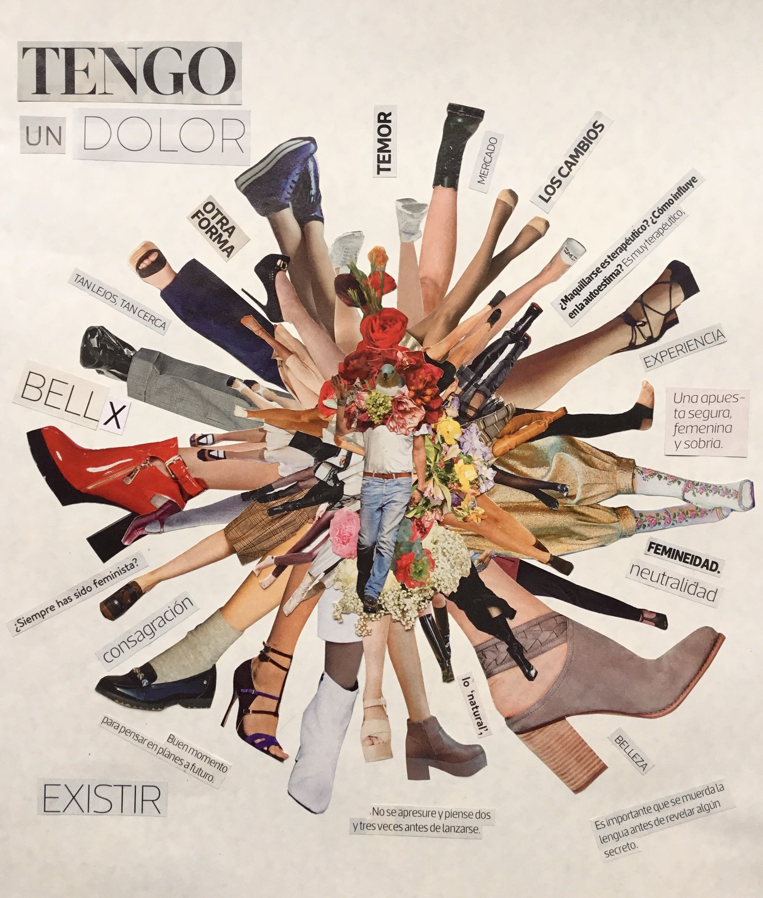
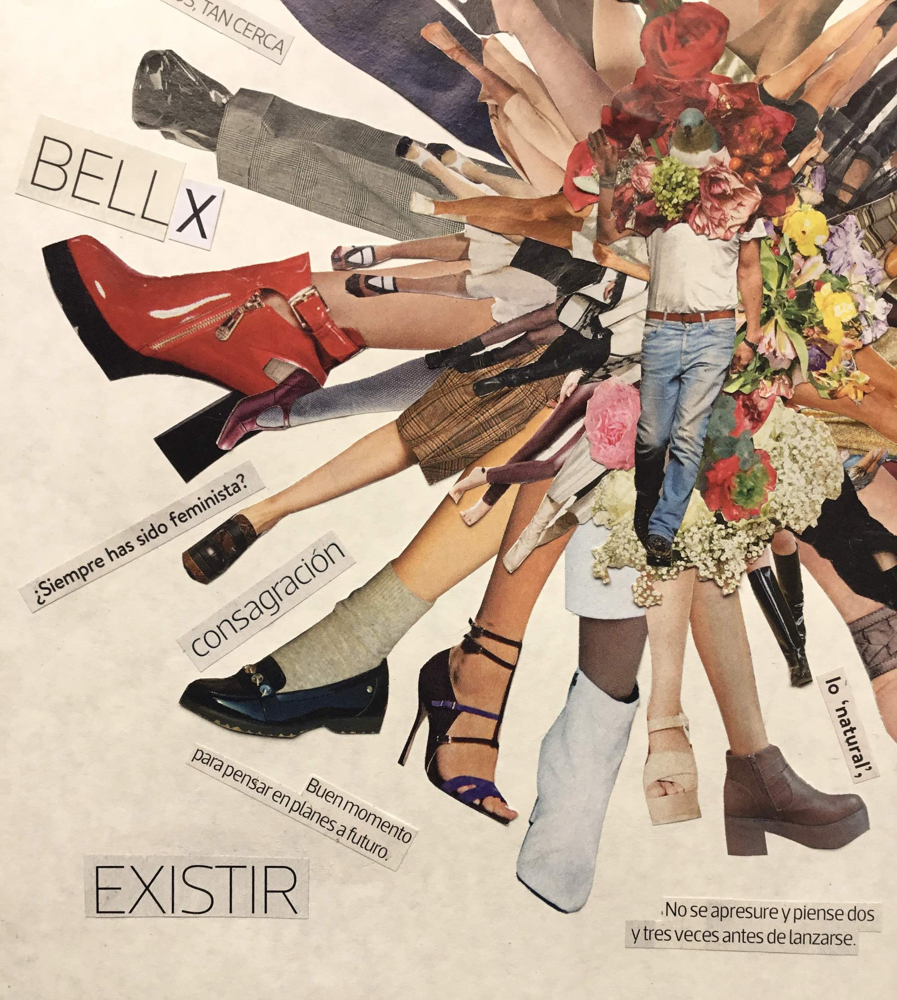
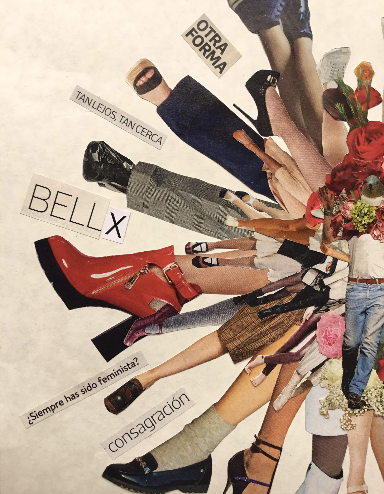
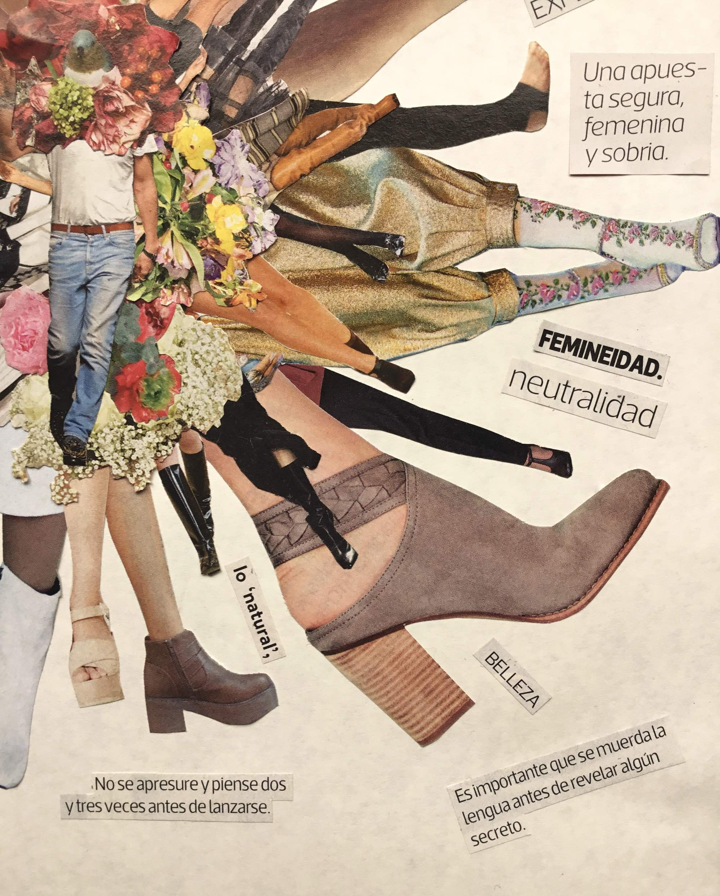
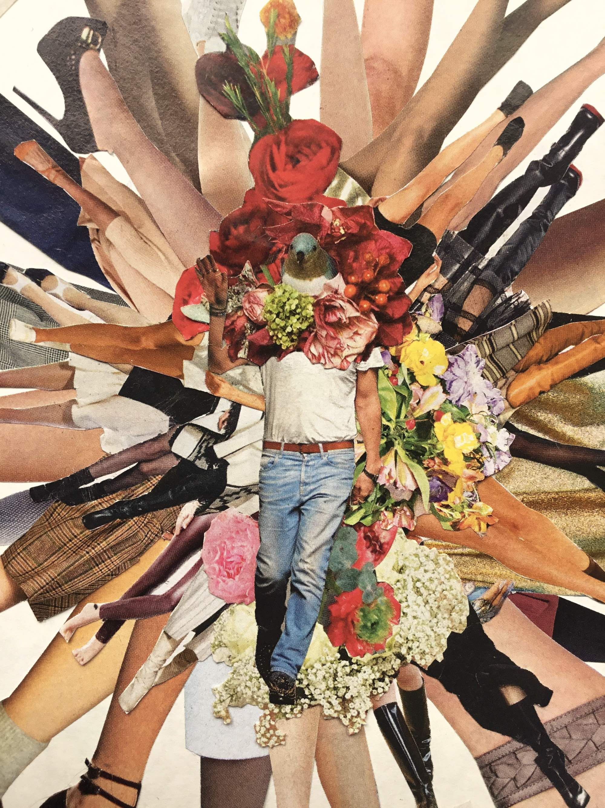
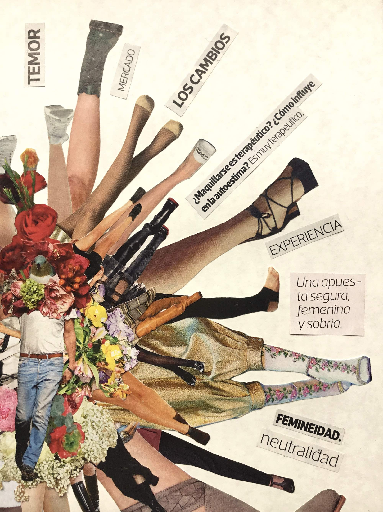

Collage que hice explorando mi disforia de género. 

La pieza muestra un cuerpo masculino con cabeza de pajarito, rodeado de flores y de una especie de corona de piernas, rodeadas de conceptos y frases sacadas de revistas y horóscopos. 

El título es _Tengo un dolor_ como forma de intentar expresar un malestar interno difícil de comprender, que se identifica por partes pero no logra expresarse como un todo sino hasta sufrir ardua reflexión y recostrucción de la identidad. ¿Cómo puede doler el existir? ¿Cómo puede sanar ese dolor simplemente siendo capaz de comprender y aceptar? ¿Dejará de doler, en algún momento, el encarnar una identidad no binaria?

Para más profundidad, leer publicaciones [Autocrítica cultural: la asunción de una identidad](/posts/2022/2022-12-16-autocritica-cultural-la-asuncion-de-una-identidad/) y también [Figurando una subjetividad no binaria desde la performatividad de Butler, el nomadismo de Braidotti, y “Orlando” de Virginia Woolf](/posts/2021/2021-09-13-figurando-una-subjetividad-no-binaria/index.html).

::: {.foto .centrar}
{.lightbox group="collage"}
:::

:::: {.galeria}
{.fotito .lightbox group="collage"}
{.fotito .lightbox group="collage"}
{.fotito .lightbox group="collage"}
{.fotito .lightbox group="collage"}
{.fotito .lightbox group="collage"}
::::