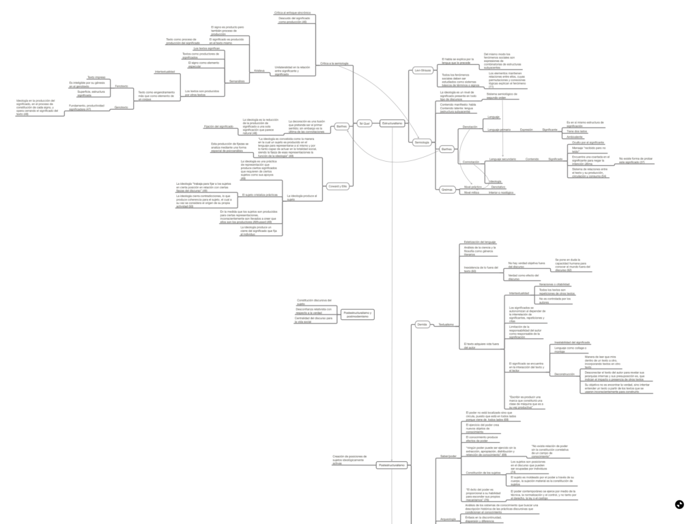

Comparto un mapa conceptual con las ideas principales de los autores y corrientes expuestas en el libro ["El concepto de Ideología, Vol. 4. Postestructuralismo, Postmodernismo y Postmarxismo"](https://www.goodreads.com/book/show/22307879-concepto-de-ideolog-a-el-vol-4-postestructuralismo-postmodernismo-y), de Jorge Larraín (2010, LOM Ediciones)

[Clic para acceder al mapa conceptual](http://bastian.olea.biz/wp-content/uploads/2020/02/Larraín-Concepto-de-ideología-vol.-4.pdf)[Descargar](http://bastian.olea.biz/wp-content/uploads/2020/02/Larraín-Concepto-de-ideología-vol.-4.pdf)
