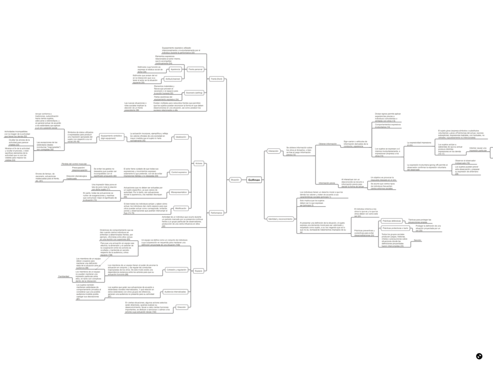

Comparto un mapa conceptual sobre algunos de los conceptos expuestos por Erving Goffman en su clásico ["The Presentation of Self in Everyday Life"](https://www.goodreads.com/book/show/720664.The_Presentation_of_Self_in_Everyday_Life) (1959).

[Clic para acceder al mapa conceptual](http://bastian.olea.biz/wp-content/uploads/2020/02/Goffman.pdf)[Descargar](http://bastian.olea.biz/wp-content/uploads/2020/02/Goffman.pdf)

* * *

_Apuntes y ensayos sobre estudios de género, sociología del cuerpo y teoría feminista por Bastián Olea Herrera, licenciado y magíster en sociología (Pontificia Universidad Católica de Chile)._
