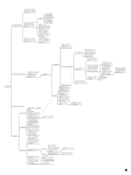

Comparto algunos apuntes sobre conceptos de la _sociología de la crítica_ de Luc Boltanski, contenidos en el libro ["Sociología y crítica social. Ciclo de conferencias en la UDP"](https://www.goodreads.com/book/show/50255597-sociolog-a-y-cr-tica-social-ciclo-de-conferencias-en-la-udp)

[Clic para acceder al mapa conceptual](http://bastian.olea.biz/wp-content/uploads/2020/02/Boltanski-Sociología-y-crítica-social.pdf)[Descargar](http://bastian.olea.biz/wp-content/uploads/2020/02/Boltanski-Sociología-y-crítica-social.pdf)
