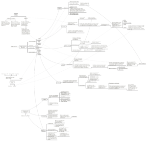

Este mapa conceptual corresponde al prefacio y la introducción (páginas 1 a 20) del libro Feminist Theory and the Body, a Reader (Price y Shildrick, 1999, Routledge).

En el mapa conceptual se resumen algunos conceptos y puntos clave de los argumentos sobre la relación entre el cuerpo y el género femenino desde autores y autoras como Julia Kristeva, Michel Foucault, Maurice Merleau-Ponty, Judith Butler, Donna Haraway, Simone de Beauvoir, entre otras.

Toca la imagen para descargar.

* * *

_Apuntes y ensayos sobre estudios de género, sociología del cuerpo y teoría feminista por Bastián Olea Herrera, licenciado y magíster en sociología (Pontificia Universidad Católica de Chile)._
