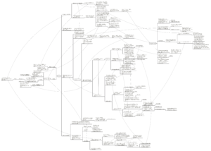

## Cuerpos que importan, Judith Butler

Este mapa conceptual es un resumen del texto _Cuerpos que Importan_ (Judith Butler), donde se expone el funcionamiento de la matriz exclusionaria de la diferencia sexual, desde la cual se forma el sexo/género de los sujetos a partir de la reproducción de la norma heterosexual, de acuerdo a la teoría de la performatividad de Judith Butler y apoyada en el concepto de abyecto o abyección, que Butler trae desde la obra de Julia Kristeva.

La fuente se encuentra en el capítulo “Bodies that Matter” del libro _Feminist Theory and The Body, A Reader_ (Janet Price y Margrit Shildrick, editoras, 1999, Routledge)

_Toca sobre la imagen [o en este enlace](http://bastian.olea.biz/wp-content/uploads/2021/07/Matriz-de-formacion-del-sujeto-Cuerpos-que-importan-Butler-4.3.pdf) para descargar el mapa conceptual._

Esta matriz indica cómo, a partir de una concepción normativa del género (es decir, desde el aparato regulatorio de la heterosexualidad), se produce y reproduce la diferencia sexual por medio de rituales y prácticas performativas. Siguiendo la teoría de Foucault, el poder regulatorio de la norma del sexo produce cuerpos materiales (sexo binario heteronormado) mediante demarcaciones discursivas sobre lo que deben ser (o no) los hombres y mujeres. Entonces, según Butler, la construcción de los sujetos acontece mediante un proceso de identificación performativo, donde la formación de sujetos “válidos” de acuerdo a la norma del sexo heterosexual no sólo depende de una identificación positiva con una imagen sexo/genérica válida, sino que principalmente se sustenta en el repudio y la desidentificación respecto del dominio de lo abyecto: el “afuera” constitutivo de la norma, una zona inhabitable donde vive todo lo que queda “fuera” del binarismo, que son los cuerpos no-válidos y desviados de la norma. Para formar cuerpos válidos, el acto performativo de la continua abyección (repudio, exclusión, discriminación) sería necesario de enactar para mantener el funcionamiento de la norma del sexo/género, y así, el sujeto en formación puede calificar como un cuerpo humanizado, aceptable, o un “cuerpo que importa”.

* * *

_Apuntes y ensayos sobre estudios de género, sociología del cuerpo y teoría feminista por Bastián Olea Herrera, licenciado y magíster en sociología (Pontificia Universidad Católica de Chile)._ bastimapache
