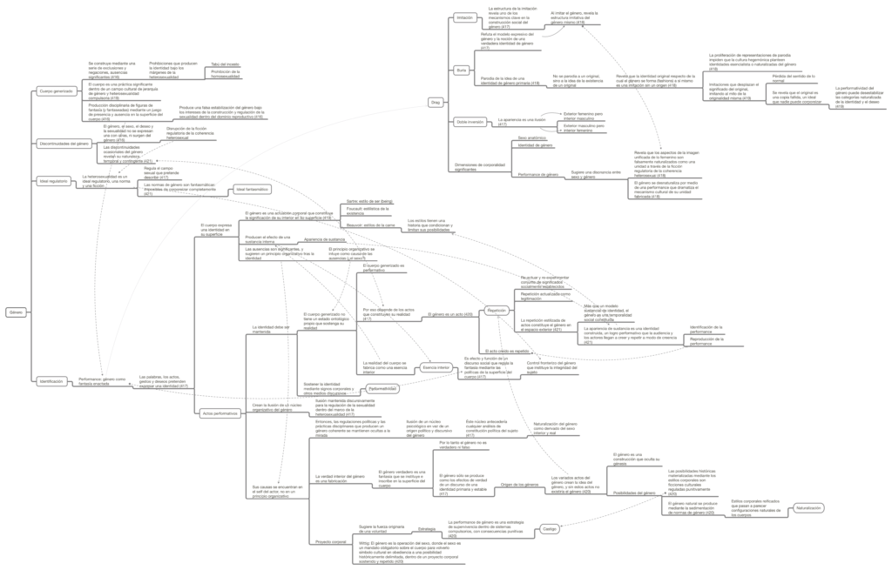

Este es un mapa conceptual que resume el concepto de performatividad de género de Judith Butler. En el mapa conceptual se ponen en relación los aspectos que componen la idea del género como un acto o actuación que produce los efectos que nombra, y que a su vez, da lugar a la idea de una esencia interior expresada mediante los actos (el sexo); todo esto dentro del marco regulatorio de la heteronorma. Al igual que el mapa conceptual anterior que también resume conceptos de Judith Butler, en este puede verse cómo la resistencia y resignificación es parte integral del proceso en que se reproduce el género binario; en este caso, a partir del ejemplo del _drag._

La fuente de este resumen se encuentra en el capítulo “Bodily Inscriptions, Performative Subvertions” de Judith Butler, en el libro _Feminist Theory and The Body, A Reader_ (Janet Price y Margrit Shildrick, editoras, 1999, Routledge)

_Toca en la imagen para_ [_descargar el mapa conceptual._](http://bastian.olea.biz/wp-content/uploads/2020/04/Actos-performativos-Butler-7.1.pdf)

_Apuntes y ensayos sobre estudios de género, sociología del cuerpo y teoría feminista por Bastián Olea Herrera, licenciado y magíster en sociología (Pontificia Universidad Católica de Chile)._
