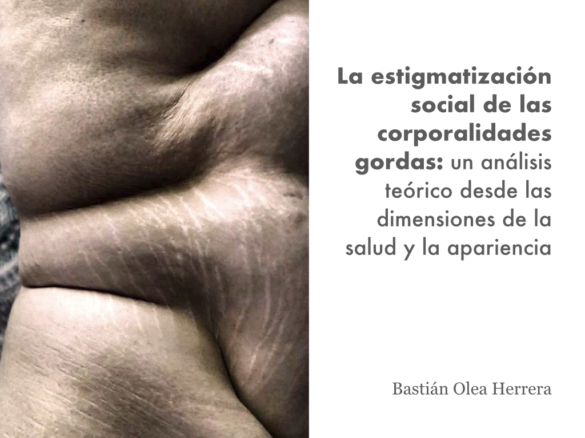

> Este texto es un resumen de una ponencia basada en mi [tesis de magíster,](http://bastian.olea.biz/elementos-teoricos-y-conceptuales-en-torno-a-la-estigmatizacion-social-de-las-corporalidades-gordas-un-analisis-desde-las-dimensiones-de-la-salud-y-la-apariencia/) presentada en el [10° Congreso de Sociología Pre-ALAS 2018](http://sociologia-alas.org/2018/08/21/pre-alas-diciembre-2018-chile/) en la Universidad Arturo Prat, Iquique, en el grupo de trabajo (GT) 17 [Sociología del cuerpo y las emociones.](http://www.facso.uchile.cl/sociologia/investigacion/61718/nucleo-sociologia-del-cuerpo)

Esta ponencia se basa en mi investigación de tesis de magíster, terminada hace pocas semanas. Se trató de una investigación teórica, en la cual se analizó mediante teoría fundamentada un corpus correspondiente a papers y capítulos de libros académicos en búsqueda de elementos teóricos y conceptuales para poder _comprender la producción_ del fenómeno de la estigmatización social de la gordura.

_(Todas las imágenes son de autoría y propiedad de [Shoog McDaniel,](http://www.shoogmcdaniel.com) y fueron utilizadas con su autorización)_

<!--more-->

* * *

## Estigma

Cuando hablamos de la estigmatización social de la gordura, nos referimos a la manera en la cual la gordura, en tanto marca corporal, resulta socialmente estigmatizada.

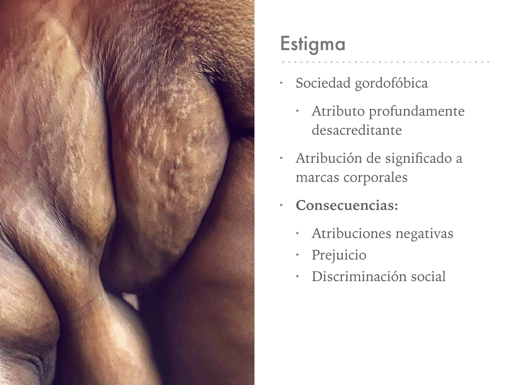

Vivimos en una **sociedad gordofóbica,** donde ya sea en medios de comunicación, en conversaciones, en las imágenes que nos rodean, en redes sociales, y en las producciones culturales, percibimos cómo la gordura se ha vuelto un **atributo profundamente desacreditante,**siguiendo el concepto de Erving Goffman.

Por lo tanto, a partir de la estigmatización se **atribuyen significados** sociales a un atributo físico, **construyéndolo** de manera negativa.

Para el análisis de este fenómeno, se divide la temática en dos dimensiones.

* * *

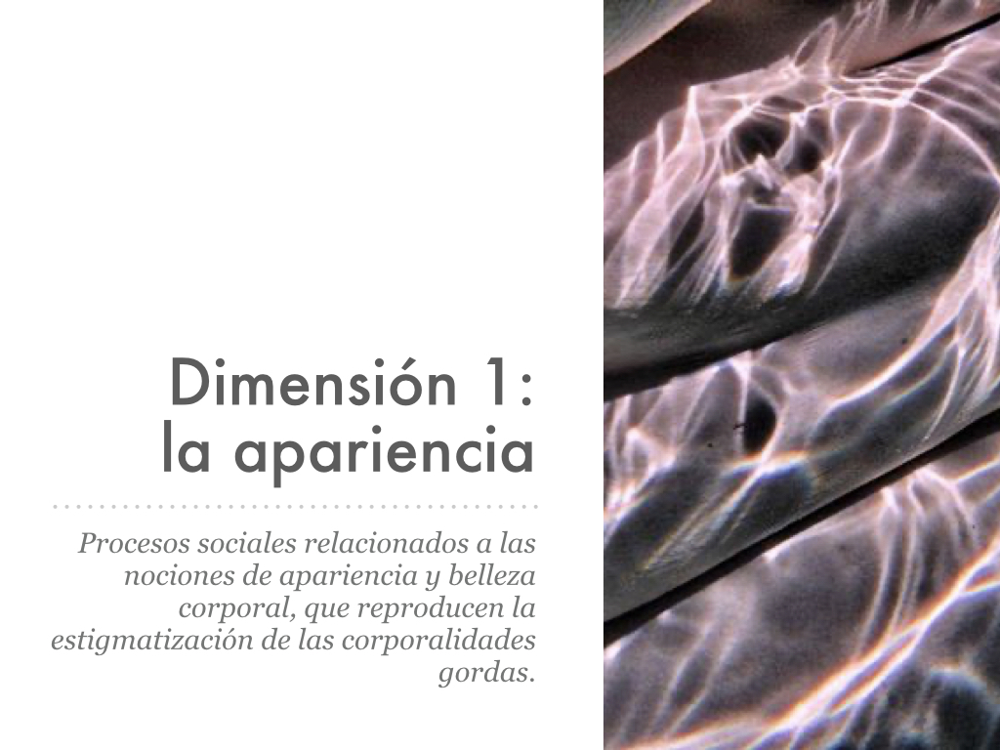

## Apariencia

La primera dimensión es la de la apariencia, entendiéndola como la forma en que el cuerpo aparece o se presenta ante la mirada de los otros.

Siguiendo a Elizabeth Grosz, entendemos la apariencia como la configuración perceptible del cuerpo, como una **superficie inscrita** por significados y codificaciones sociales.

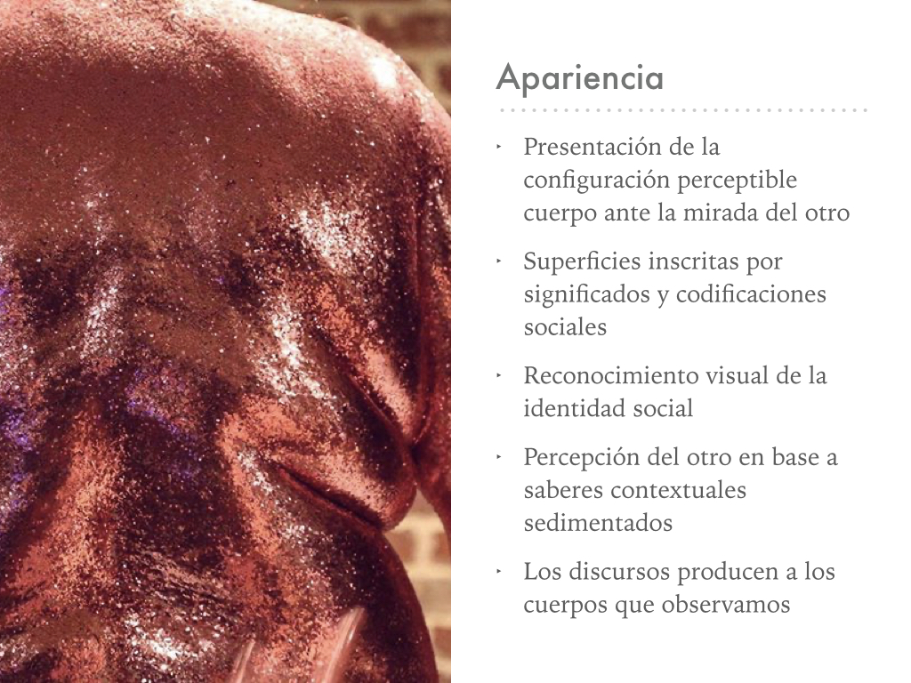

* * *

A través de estas codificaciones distribuidas en la superficie del cuerpo, **anticipamos** la posición social y atributos individuales del otro, volviéndonos capaces de percibir la **identidad social,** en términos de Goffman.

En ese sentido, la capacidad de **percibir** a los cuerpos implica una forma de **lectura** de esta superficie, que no es individual, sino que **compartida**.

Según Linda Alcoff, la **percepción** del cuerpo depende de la circulación de significados y **saberes contextuales sedimentados,** es decir que a través de nuestra socialización en una sociedad gordofóbica, se sedimentan en nuestras conciencias distintos saberes y discursos sobre qué significan los cuerpos gordos, cuáles son los cuerpos ideales, cual es el valor social de la delgadez.

Como planteó Foucault, los **discursos** no solamente describen a los objetos, sino que forman a los objetos que refieren. El discurso construye cuerpos. Gracias a los significados circulantes podemos _hacer sentido_ de los cuerpos que percibimos.

* * *

### BELLEZA

Los cuerpos son **evaluados** de acuerdo a **normas sociales** que valorizan ciertos tipos y formas de apariencia corporal, basándose en **ideales**culturales e históricos de belleza.

Hoy, el ideal corresponde a la **delgadez** y tonificación corporal, donde los cuerpos disciplinados, producidos a través de la restricción y el trabajo corporal son valorizados y deseados socialmente.

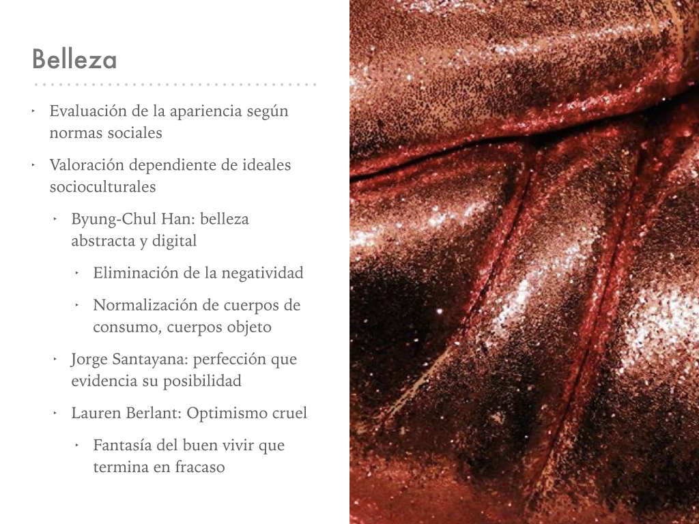

Según Byung Chul Han, el ideal en la modernidad tardocapitalista occidental se remite a los cuerpos **pulcros y lisos;** es decir, la búsqueda de una perfección abstracta, inclusive digital, que se ubica en **antítesis contra las apariencias naturales,** “descuidadas”, carentes de trabajo corporal. En este sentido, la **producción** de cuerpos ideales se basa en la **remoción de toda negatividad, imperfección,** sobra y extrañeza, para producir **cuerpos-objeto** que no desafíen al status quo, que sean completamente positivos, normalizados: _cuerpos de consumo._

En este sentido, el ideal de belleza moderno determina la **modificación y normalización** de los cuerpos gordos, cuya existencia imperfecta y excesiva significa una transgresión al ideal de belleza, y un desafío a sus preceptos.

La belleza también es entendida por Jorge Santayana como manifestaciones de **perfección**, cuyas imágenes percibimos constantemente en la sociedad de consumo, y que a su vez evidenciarían que los cuerpos perfectos son **posibles**. Si la delgadez es posible, entonces _la mera existencia de la gordura resulta cuestionada._

Por lo tanto, la idealización de los cuerpos ultra delgados aumenta la **brecha** entre los cuerpos indeseables y los deseables, **agudizando** al ideal de belleza y extendiendo al estigma de la gordura a cuerpos cada vez menos gordos.

La delgadez se transforma en un **proyecto** para lograr el ideal, que resulta **optimista y cruel,** usando el concepto de Laurent Berlant, puesto que la cultura de consumo nos plantea que es posible adelgazar y lograr el ideal corporal, construyendo a la gordura como cuerpos que podrían ser superables. Pero al mismo tiempo, los intentos de adelgazamiento se reducen constantemente al fracaso, volviendo a estos cuerpos en **minorías privilegiadas,** y extendiendo la disatisfacción corporal.

* * *

### MALEABILIDAD

Denominamos maleabilidad a esta idea donde el cuerpo estaría bajo el **control individual,** y que sería **libremente alterable.**

Según Susan bordo, esto refiere a fantasías de **mejoramiento**ilimitado del cuerpo, que desafían incluso a su propia materialidad, es decir, su posibilidad de devenir.

A partir de esta idea, _los individuos gestionan la presión estética de adecuarse a los ideales socioculturales de belleza,_ a través de valores y habilidades que son neoliberales, como la fuerza de **voluntad**, el **esfuerzo**, y la **elección racional** de consumo.

En base a estos ideales neoliberales, el cuerpo se vuelve un **logro**, y _la apariencia reflejaría significados acerca de las capacidades individuales de los sujetos,_ enmarcados en valores y habilidades neoliberales.

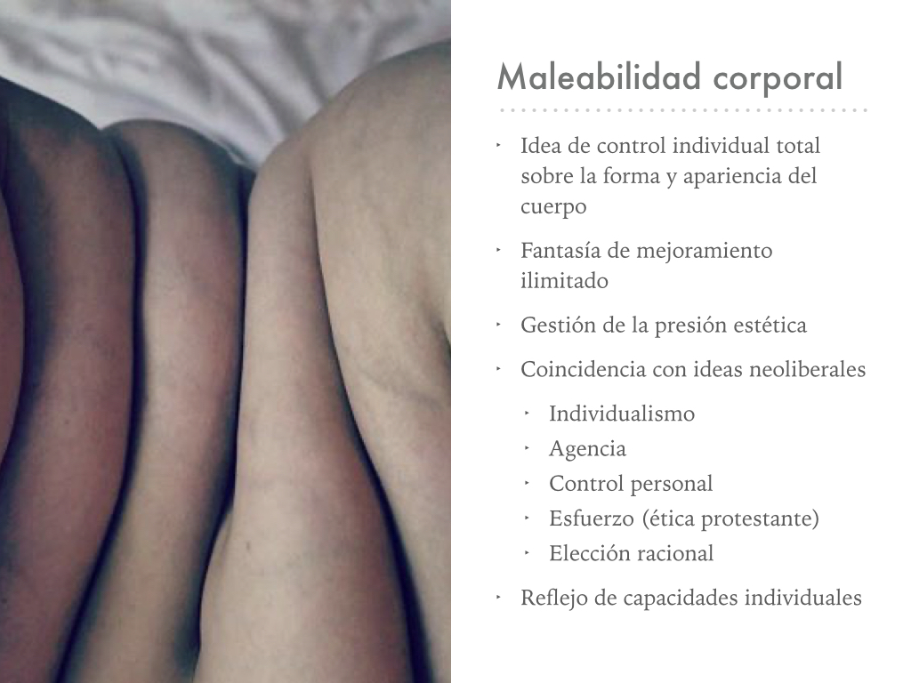

* * *

### INTERPRETACIÓN E INSCRIPCIÓN

Los cuerpos gordos son interpretados desde la dimensión de la apariencia como cuerpos **estéticamente invalidados,** por **desajustarse** al ideal, y que su producción dependería de esta **carencia valores y habilidades neoliberales,** expresada en la suposición de que los cuerpos gordos no incurren, supuestamente, en la práctica de la dieta, que eminentemente producirían estos cuerpos ideales.

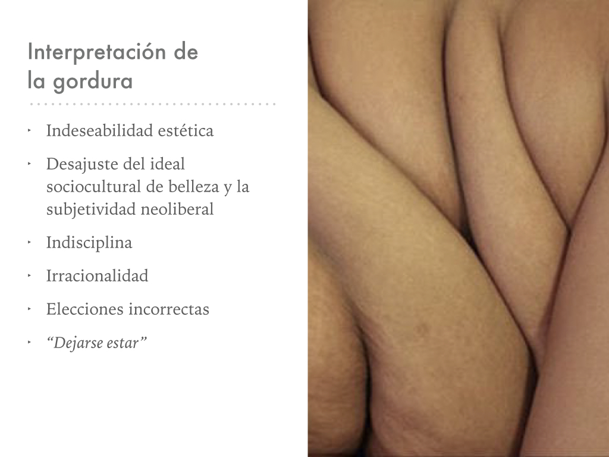

Se interpreta a las personas gordas como sujetos que renuncian al esfuerzo, que son **incapaces de esgrimir la racionalidad neoliberal,**por lo tanto, su raciocinio estaría dominado por el placer, la pasión, los excesos. Serían cuerpos que, como se dice, _“se dejan estar”,_ en vez de optimizarse según los ideales socioculturales.

* * *

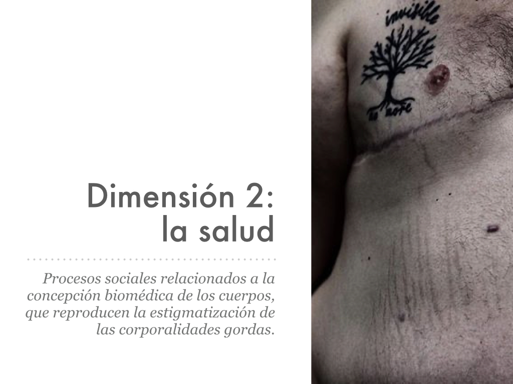

## Salud

Pasando a la segunda dimensión, entonces, nos abocamos a los procesos en que los cuerpos diferentes, desviados de la norma, pasan a ser interpretados por el regimen médico como cuerpos patológicos.

* * *

### BIOMEDICINA

Entre los regímenes médicos, se denomina **biomedicina** al modelo médico hegemónico vigente en las sociedades occidentales. Se trata de un paradigma médico biologicista, individualista, que interpreta a los cuerpos en base a datos biológicos que son clasificados en **categorías de enfermedad.** Es decir, la diferencia corporal es entendida como una **desviación del peso “normal”**, y por ende, como enfermedad. Esto se evidencia en los términos médicos usados para describir a los cuerpos gordos, como sobrepeso, obesidad, y obesidad mórbida, que son etiquetas que transforman totalmente el significado del peso corporal.

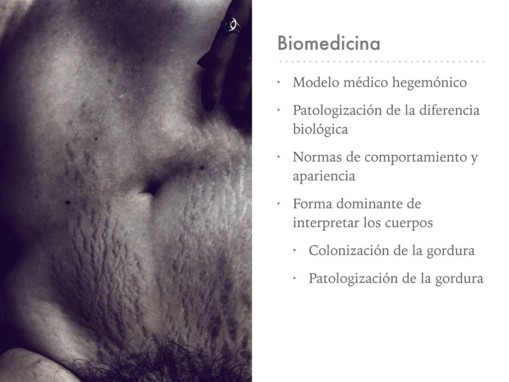

La biomedicina, entonces, plantea **normas** de **comportamiento**legitimadas por su saber científico, y su institucionalidad, y a su vez también plantea normas de **apariencia**, por la importancia de los cuerpos de expresar el verse sano, la apariencia saludable resumida incorrectamente en la delgadez.

Los cuerpos son medicalizados por la biomedicina, dado que la autoridad de su discurso la postula como el **medio de interpretación dominante** de los cuerpos. La biomedicina determina qué somos y qué debemos ser.

Esto lo entendemos como una **colonización**, donde lo cuerpos gordos pasan de ser una mera diferencia corporal a ser interpretados como problemas médicos, transformando al cuerpo gordo en un territorio donde la medicina clama su capacidad de gobierno.

El discurso médico reconfigura a los cuerpos gordos en cuerpos constantemente **diagnosticados** como insalubres, como enfermos, y que llaman a su **normalización** en términos médicos, su adelgazamiento.

La gordura, entonces, es **patologizada** como un cuerpo enfermo, un cuerpo anormal, y que al mismo tiempo estaría **confesando** una desobediencia en torno a la norma de lo que es la salud.

* * *

Por lo tanto, la salud tiene un subtexto importante de control sobre los cuerpos. Se definiría por el control del yo, mantener a la corporalidad dentro de los márgenes de **normalidad**, donde la gordura expresaría una pérdida del control sobre las prácticas de salud y prevención prescritas.

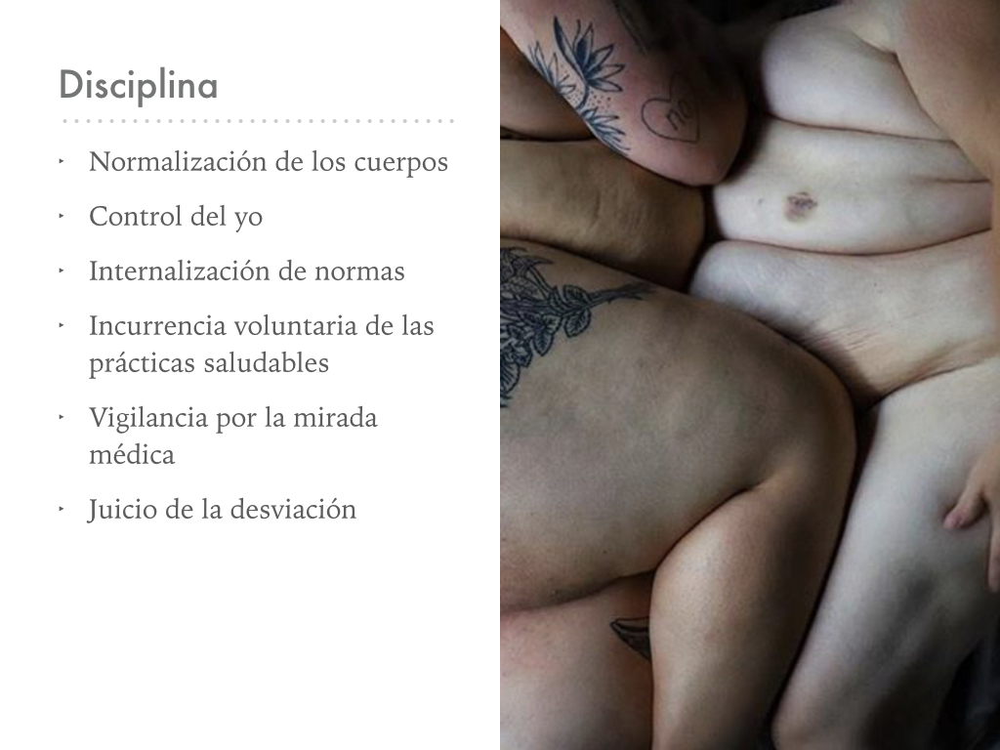

La salud, entonces, requiere de una **disciplina** que haga propia e **internalice** las normas médicas en la forma de deseo.

Esto se reproduce a través de la vigilancia, donde las miradas colonizadas por el discurso médico trasladan al juicio médico hacia lo social, donde la **vigilancia** garantiza el funcionamiento del poder al hacer visibles y transformar en problemas médicos a los cuerpos diferentes, estigmatizados.

* * *

Entonces, a través de la socialización dentro del marco de **vigilancia** médica, _aprendemos_ (se nos enseña) cómo vivir, cómo entender, y también como modificar los cuerpos desde lo que se denomina **biopedagogías**, siempre respecto al saber/poder médico.

La vida diaria resulta regulada por la biomedicina desde el **biopoder**, que es la **regulación y gobierno** del cuerpo y la vida a partir de un regimen de lo deseable y lo legítimo, es decir, esta _idea y prácticas de “lo saludable”_ que regulan nuestras vidas y que se ligan directamente con la delgadez.

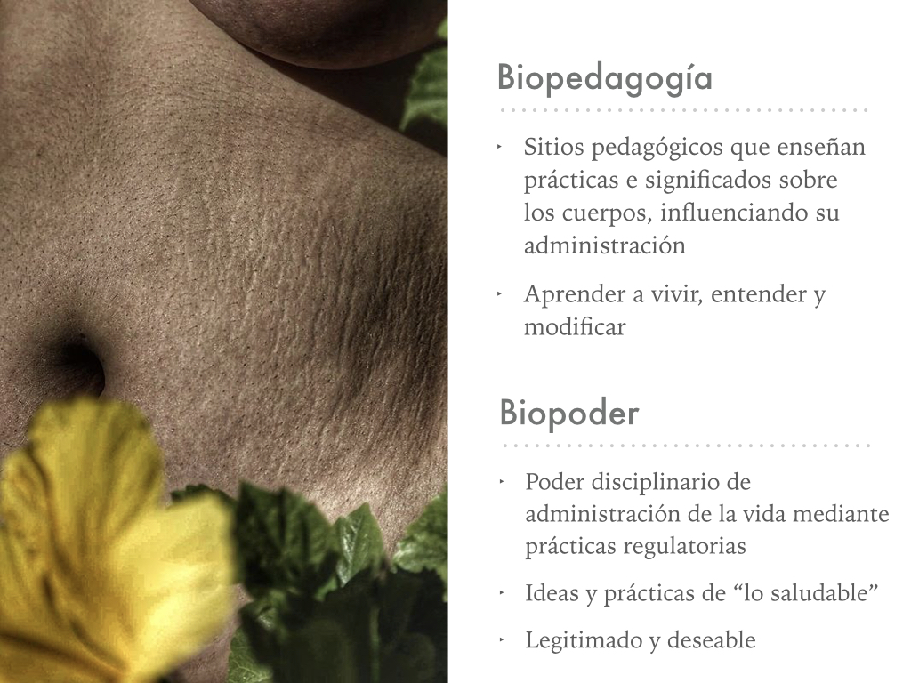

* * *

### GUBERNAMENTALIDAD

Esto relaciona íntimamente a la biomedicina con la idea de gubernamentalidad, que se trata del gobierno de los deseos, donde no se trata de un poder represivo que reprima los deseos, sino que es un poder que causa la **emergencia de los deseos bajo términos específicos**que coinciden con el statu quo, en este caso, lo saludable.

Entonces, como los sujetos se **regulan voluntariamente** en base a la idea de lo saludable, el gobierno de los cuerpos se basa en la reproducción de la **deseabilidad** de la delgadez y la **indeseabilidad** de la gordura, que son **internalizadas** como **ideales** corporales y también como conjuntos de **prácticas** disciplinares, en la forma de conductas normalizadas bajo los criterios de la biomedicina.

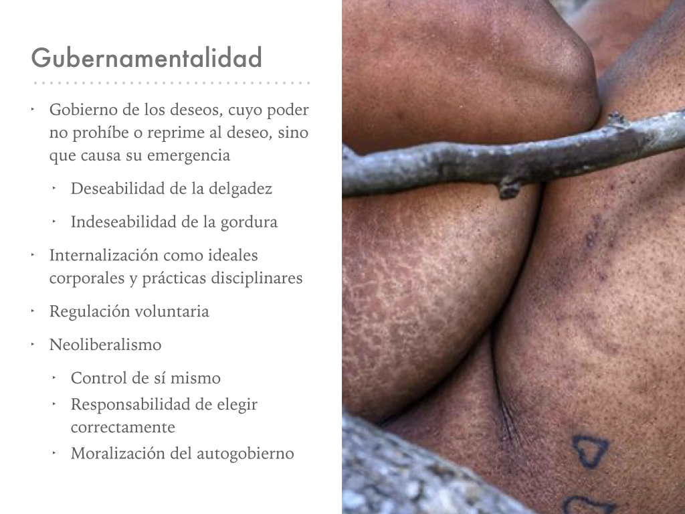

Desde la gubernamentalidad, podemos ver cómo la biomedicina coincide con el **neoliberalismo**, como dos discursos que pretenden gobernar los cuerpos poniendo alto énfasis en el dominio y **control** de sí mismo, en la dependencia de la **voluntad** personal, y en la moralización del **autogobierno** de la conducta individual.

* * *

### INTERPRETACIÓN E INSCRIPCIÓN

El cuerpo gordo es interpretado desde la biomedicina como un cuerpo **enfermo** y en necesidad de **normalización**, que es producido por **elecciones incorrectas** e irresponsabilidades, y que por lo tanto es un cuerpo moralizado en clave negativa, como un cuerpo que sería **irracional**respecto a lo estatuido como deseable; es decir, una subjetividad que poseería deseos incorrectos, y que por ende se desajusta de las normas de salud y subjetividad neoliberal.

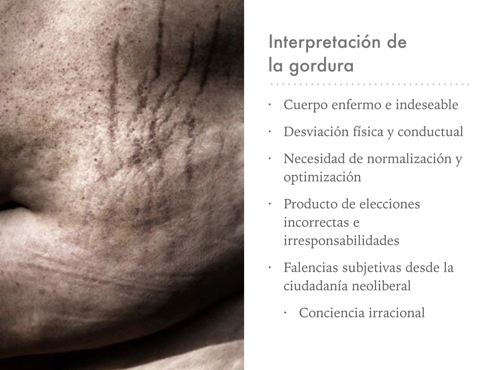

* * *

## Conclusiones

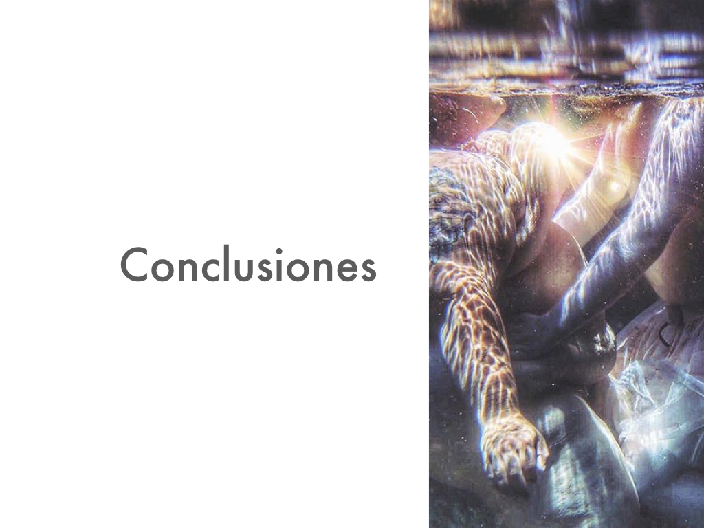

Como conclusiones podemos ver cómo la gordura es construida discursivamente como el **opuesto** del ideal de belleza corporal moderno, y que a su vez este ideal de belleza se condice con el ideal de salud, y con la apariencia del ciudadano responsable en clave neoliberal, todos ellos corporalizados en el cuerpo delgado.

* * *

De acuerdo al discurso hegemónico, la gordura estaría **reflejando** elecciones, voluntades, deseos y capacidades de los individuos a través de sus signos y marcas corporales. Se trataría de una corporalidad **inmoral**, pues estos reflejos indicarían su desajuste respecto de los supuestos de participación en la sociedad neoliberal, expresando falencias inherentes a su subjetividad.

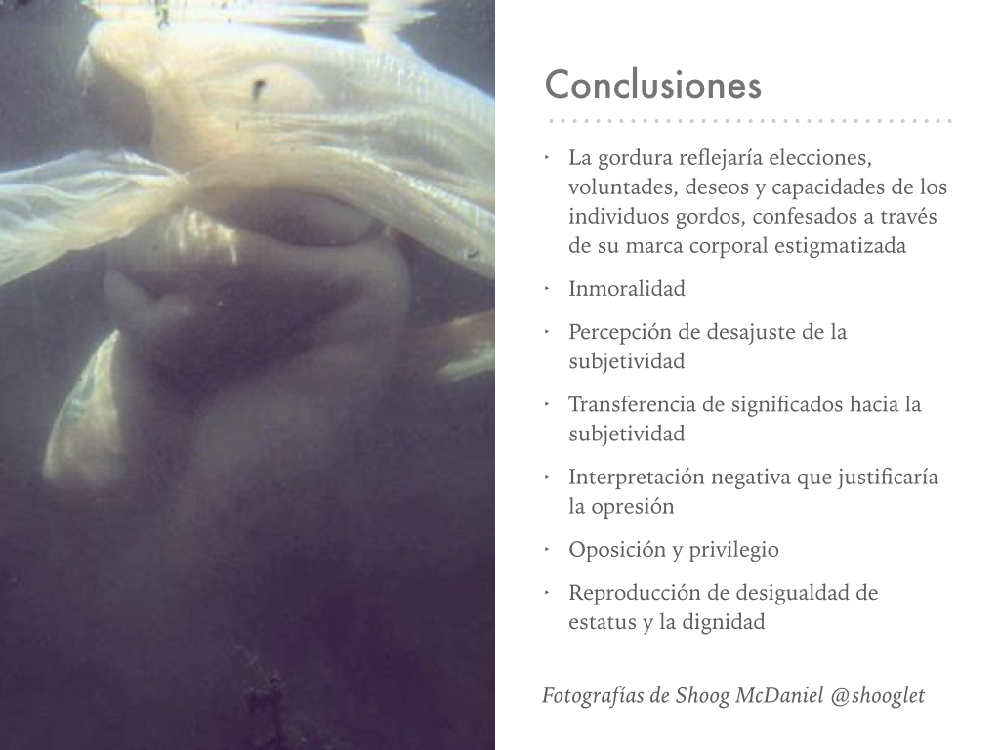

El **estigma** tiene esta capacidad de **posibilitar la percepción** de desajustes de la subjetividad gorda: los significados que se asocian a la gordura, como la indeseabilidad, enfermedad, e irresponsabilidad, son **transferidos hacia el sujeto.** El sujeto estaría expresando estas cualidades a partir la confesión de comportamientos incorrectos a partir de su marca corporal.

Desde la estimatización de una característica física, los individuos son capaces de **interpretar discursivamente** una marca corporal como la simbolización de un amplio **conjunto de características negativas** sobre las personas gordas, **posibilitando su inferiorización y opresión.**

En el ejercicio de esta opresión, la demarcación de la diferencia, de la oposición entre el nosotros y el ellos, posibilita el **privilegio** de unos pocos.

Entonces, la estigmatización es un mecanismo que habilita la reproducción de desigualdad social, a través de la **negación de toda posibilidad de identificación positiva en categorías** de alta significancia social, tales como la salud y la belleza, en función de una **distribución desigual del estatus social** y la dignidad.
