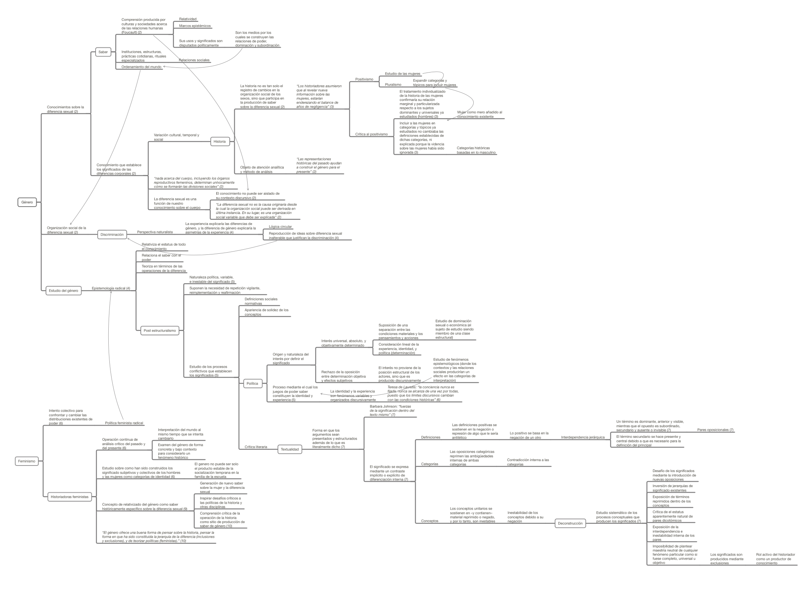

Este mapa conceptual proviene de la lectura de la introducción del libro Género y las políticas de la Historia, de Joan Wallace Scott, eminente teórica del género. Esta introducción es notable, dado que en su corta extensión ofrece certeras definiciones de conceptos como _género, saber, historia_ y similares, una contextualización del concepto de historia y saber desde un marco teórico foucaultiano, y además, un desglose del método de análisis de la textualidad, que deriva en la deconstrucción derrideana como metodología de análisis del género desde una perspectiva histórica.

La fuente de este mapa es: Scott, J., (1988). _Gender and the Politics of History._ Columbia University Press.

[Clic aquí o en la imagen para descargar el mapa conceptual](http://bastian.olea.biz/wp-content/uploads/2021/03/Scott-Gender-and-the-Politics-of-History-Intro.pdf)

