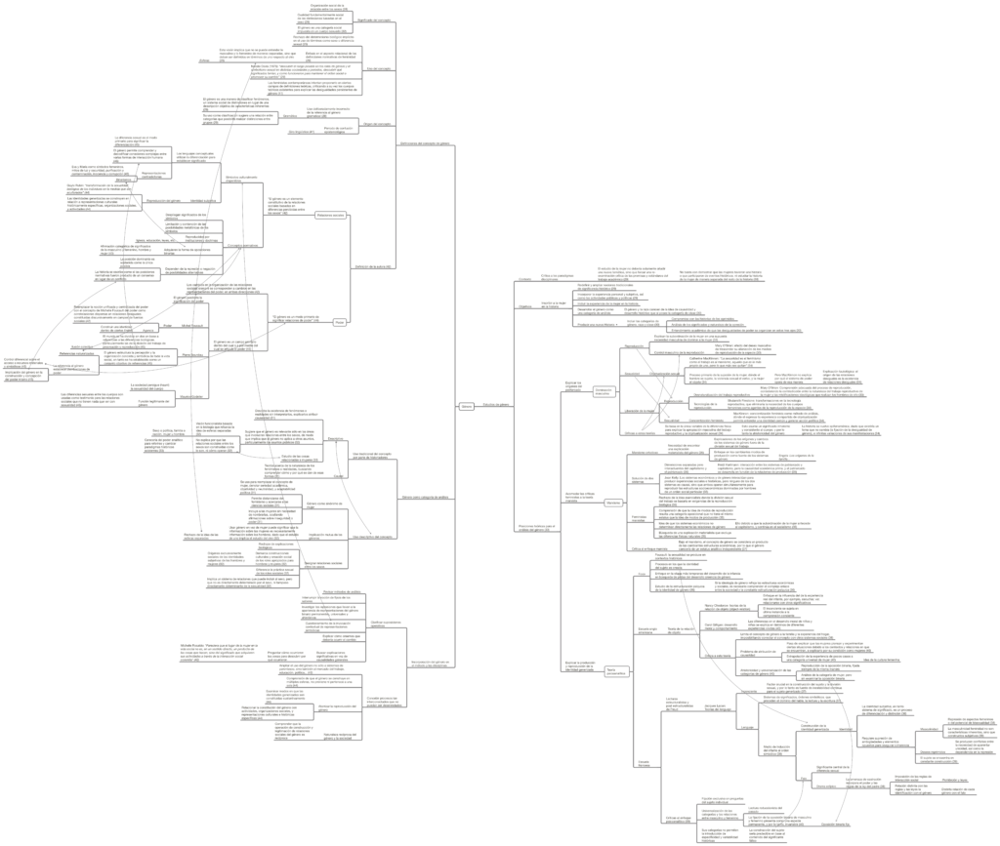

“_El género, una categoría útil para el análisis histórico_”, publicado por primera vez en 1985 por Joan Wallace Scott, es uno de los textos más importantes para comprender el sentido, uso e implicancias del concepto de género. Recuerdo que fue uno de los textos que me recomendó una admirada profesora cuando empecé a interesarme en este campo cuando estudiaba el pregrado.

En el texto, Scott es muy clara en entregar definiciones sucintas del género, y desarrolla estas definiciones en dos ejes principales: las **relaciones sociales** (“El género es un elemento constitutivo de la relaciones sociales basadas en diferencias percibidas entre los sexos” \[p. 42\]) y el **poder** (“El género es un campo primario dentro del cual o por medio del cual se articula el poder” \[p. 45\]).

<!--more-->

Aparte de definiciones, se entregan continuas críticas al quehacer académico, expresadas en claras directrices para realizar estudio y producción de conocimiento en concordancia con las implicancias que entrega el concepto de género y las premisas feministas para con la academia. Por otro lado, se describen varias perspectivas teóricas desde las que se trabaja el concepto de género, principalmente las perspectivas marxista, postestructuralista y del psicoanálisis. De las tres se obtienen características importantes del concepto, pero también críticas profundas a dichos campos del conocimiento.

En general, se trata de un texto excelentemente escrito, ofreciendo claridades sobre el concepto de género que no se agotan en la esfera de la historia, sino que producen, como argumenta que debiese ser la autora, una compleja y útil categoría de análisis que permite identificar procesos altamente interconectados, los cuales son imposibles de desenredar una vez desplegada esta perspectiva analítica.

La fuente de este mapa es: Scott, J., (1988). _Gender and the Politics of History._ Columbia University Press.

[Clic aquí o en la imagen para descargar el mapa conceptual.](http://bastian.olea.biz/wp-content/uploads/2021/03/Scott-Genero-una-categoria-util-de-analisis-historico.pdf)

* * *

_Apuntes y ensayos sobre estudios de género, sociología del cuerpo y teoría feminista por Bastián Olea Herrera, licenciado y magíster en sociología (Pontificia Universidad Católica de Chile)._ bastimapache
