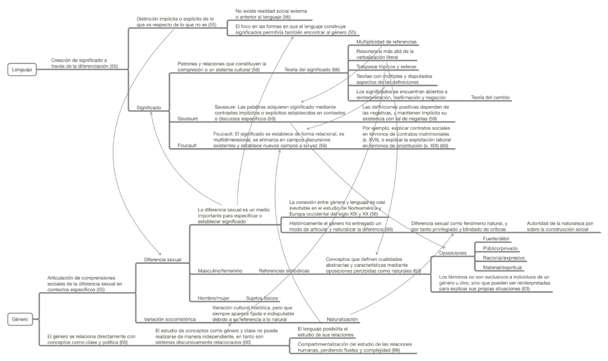

Este mapa conceptual proviene de la lectura del texto de Joan Scott _On Language, Gender, and Working-Class History_ (pp. 53-67), publicado en el libro _Gender and the Politics of History_ (1988).

En este breve mapa conceptual se relacionan líneas de argumentación acerca del lenguaje (sus definiciones desde la teoría postestructuralista y reflexiones sobre el significado desde Saussure y Foucault) y el género (argumentos acerca del concepto de diferencia sexual). Entre ambas líneas se encuentran flechas que relacionan los elementos del género con el lenguaje.

La fuente de este mapa es: Scott, J., (1988). _Gender and the Politics of History._ Columbia University Press.

[Clic en este enlace o en la imagen para descargar el mapa conceptual.](http://bastian.olea.biz/wp-content/uploads/2021/04/Scott-Genero-y-lenguaje-p.-53-67.pdf)

