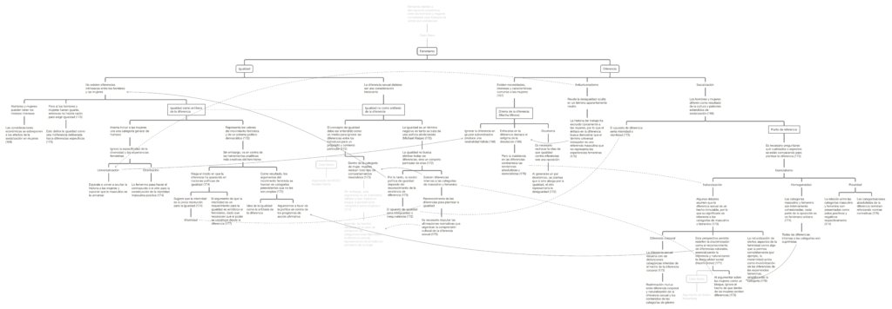

Este mapa conceptual surge de la lectura del capítulo _The Sears Case_ del libro _Gender and the Politics of History_ (1988, pp. 167-178) de Joan Scott; originalmente titulado _Deconstructing Equality vs. Difference; or, The Uses of Post-Structuralist Theory for Feminism_.

En el diagrama se presentan dos polos: _igualdad_ a la izquierda, y _diferencia_ a la derecha. Entre ellos las líneas continuas representan continuidad argumental, mientras que las líneas punteadas representan enfrentamiento de ideas.

<!--more-->

El texto presenta las ideas de un feminismo que aboga por la igualdad, y de un feminismo de la diferencia.

En la concepción de _igualdad_, hombres y mujeres con considerados iguales, ocultando las diferencias de experiencia, o más bien, ignorando deliberadamente las diferencias perceptibles. Esta postura pone el valor político de la igualdad por sobre un análisis crítico de la construcción social del género, obviando las diferencias producidas por la estructura patriarcal para plantear a hombres y mujeres como iguales; sin embargo, en este ejercicio se realiza una universalización de la categoría mujer hacia una categoría universal (lo humano), lo cual puede ser analizado como un análogo al ejercicio patriarcal de considerar lo masculino como normal y lo femenino como una añadidura o un _otro._

En la concepción de _diferencia,_ se reconoce el efecto de la socialización diferencial en hombres y mujeres, y por consiguiente, las diferencias entre ambos géneros. Pero se cae en un dilema: enfocarse en las diferencias puede resultar en una amplificación del estigma de la desviación, mientras que ignorar la diferencia en grupos subordinados implica una proposición de neutralidad (es decir, que el grupo subordinado es equivalente al dominante) que en la mayoría de los casos es inválida.

Pero el debate no acaba ahí, dado que el texto problematiza cada corriente de forma interna:

Dentro del concepto de _igualdad_ se distingue entre (1) la igualdad que toma como su antítesis a la diferencia, donde se propone la _mismidad_ de los géneros como vía hacia la igualdad, negando la diferencia existente como componente de la lucha por la igualdad; y (2) la igualdad que no tiene como antítesis a la diferencia, donde se comprende el concepto de igualdad como un movimiento que no busca eliminar todas las diferencias, sino un conjunto particular de ellas, y que por lo tanto depende del reconocimiento de la existencia de diferencia.

En cuando a la diferencia, se discute también el punto de referencia que se tiene para distinguir entre los géneros, a partir de lo cual se presentan críticas al esencialismo de género, el cual asume que la diferencia sexual (en el fondo, difrencia corporal) es un hecho inmutable, por lo que su significado es inherente a las categorías de masculino o femenino, y por ende cae en presuponer que las categorías masculino y femenino son internamente cohesionadas, cada parte siendo un fenómeno unitario puesto en oposición con respecto a la otra.

La fuente de este mapa es: Scott, J., (1988). _Gender and the Politics of History._ Columbia University Press.

[Clic en este enlace o en la imagen para descargar el mapa conceptual.](http://bastian.olea.biz/wp-content/uploads/2021/04/Scott-Igualdad-vs-diferencia.pdf)

* * *

_Apuntes y ensayos sobre estudios de género, sociología del cuerpo y teoría feminista por Bastián Olea Herrera, licenciado y magíster en sociología (Pontificia Universidad Católica de Chile)._ bastimapache
