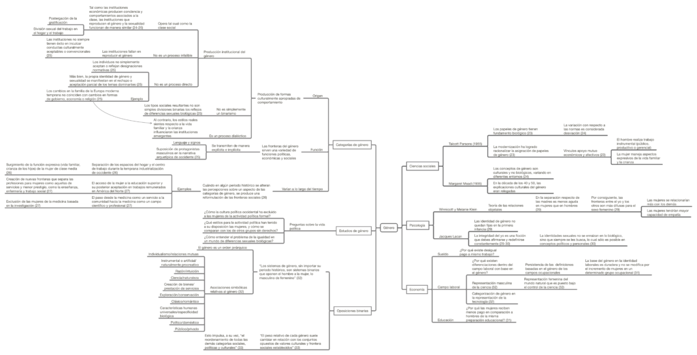

Este breve mapa conceptual presenta algunas líneas sobre el concepto de _género_ y los avances y las preguntas que se plantean sobre éste desde distintas disciplinas, tales como las ciencias sociales, psicología y economía. También se presentan ideas sobre el origen de las categorías de género, y la función de las mismas.

La fuente del texto desde el que realicé el diagrama es _El concepto de género,_ de Jill K. Conway, Susan C. Bourque y Joan W. Scott, publicado en el libro de Marta Lamas (compiladora) (2015), _El género: La construcción cultural de la diferencia sexual._ México: Bonilla Artigas Editores.

[Clic aquí o en la imagen para descargar el mapa.](http://bastian.olea.biz/wp-content/uploads/2021/04/Conway-Susan-Scott-El-concepto-de-genero.pdf)

* * *

_Apuntes y ensayos sobre estudios de género, sociología del cuerpo y teoría feminista por Bastián Olea Herrera, licenciado y magíster en sociología (Pontificia Universidad Católica de Chile)._ bastimapache
