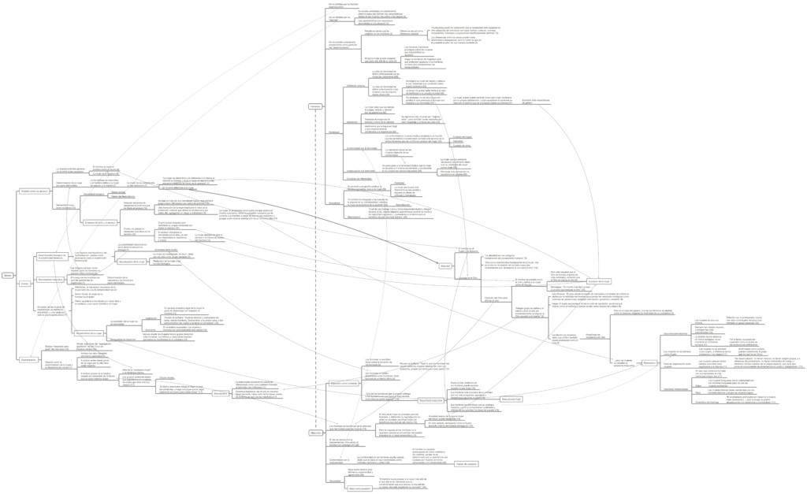

Este mapa conceptual resume las ideas principales de la introducción del libro El Segundo Sexo, de Simone de Beauvoir, originalmente publicado en 1949. En particular, se habla sobre las relaciones entre los géneros, detallándola en términos de la dinámica del amo y el esclavo, y luego se ubican ciertos argumentos sobre el sometimiento de las mujeres en su condición biológica. Luego se describen elementos sobre tanto hombres como mujeres, en especial la pretensión de universalismo de los hombres, y elementos claves de la definición de la feminidad en las mujeres. Finalmente, el punto más interesante es la aplicación de la dinámica de la alteridad entre el “Uno” y el “Otro” a las temáticas de género.

La edición citada es la Vintage Feminism Short Edition, “Extracts from: The Second Sex”, (2015) de la editorial Vintage Classics.

[Clic en la imagen o en este enlace para descargar el mapa conceptual](http://bastian.olea.biz/wp-content/uploads/2021/04/De-Beauvoir-El-segundo-sexo.pdf)

* * *

_Apuntes y ensayos sobre estudios de género, sociología del cuerpo y teoría feminista por Bastián Olea Herrera, licenciado y magíster en sociología (Pontificia Universidad Católica de Chile)._ bastimapache
