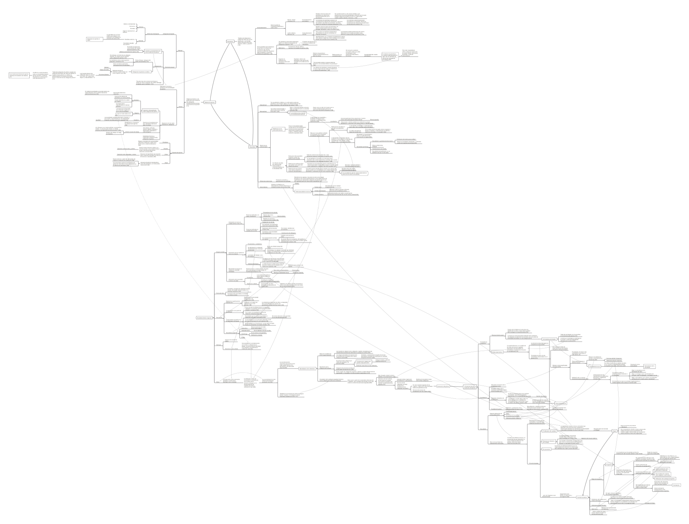

Este mapa conceptual resume las ideas principales del texto _La revolución de género y la transición de la horda bisexual a la banda patrilocal: los orígenes de la jerarquía de género,_ un sugerente ensayo donde el autor, Salvatore Cucchiari realiza un ejercicio especulativo –informado por la antropología y la antropología– alternativo al que suele realizarse: en vez de pensar cómo nace la sociedad del género moderna, el autor intenta imaginar una sociedad pasada sin género. Luego, se pasa a detallar la transición entre esta etapa sin género de la humanidad, hacia los cambios sociales y culturales que devinieron en el establecimiento del parentesco, el matrimonio, la dominación masculina, la heterosexualidad, y otras características de los sistema sexo-género hegemónicos. Mediante este ejercicio, el autor ilumina inesperadamente las bases del funcionamiento del género y sus posibles orígenes.

<!--more-->

[Toca la imagen o este enlace para descargar el mapa conceptual.](http://bastian.olea.biz/wp-content/uploads/2021/05/Cucchiari-La-revolucion-de-genero.pdf)

La fuente del texto desde el que realicé el mapa conceptual es _La revolución de género y la transición de la horda bisexual a la banda patrilocal: los orígenes de la jerarquía de género,_ de Salvatore Cucchiari, publicado en el libro de Marta Lamas (compiladora) (2015), _El género: La construcción cultural de la diferencia sexual._ México: Bonilla Artigas Editores.

* * *

_Apuntes y ensayos sobre estudios de género, sociología del cuerpo y teoría feminista por Bastián Olea Herrera, licenciado y magíster en sociología (Pontificia Universidad Católica de Chile)._ bastimapache
