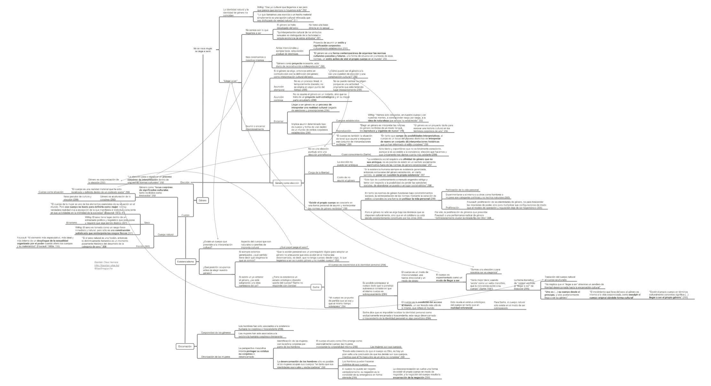

En este texto, Judith Butler toma como punto de partida la frase _“No se nace mujer, se llega a serlo”_ para profundizar sus implicancias filosóficas, desarrollando así la teoría de género presente en Simone de Beauvoir con respecto a los procesos de **asunción y encarnación del género**, así como las complejidades de comprender el **género como una elección**. En general, el texto desarrolla la idea de que el sexo es tan construido como el género, e ideas sobre el género como **estilos corporales** y el género como un **proyecto** corporal en constante actualización.

[Clic aquí o en el mapa conceptual para descargarlo.](http://bastian.olea.biz/wp-content/uploads/2021/06/Butler-Variaciones-sobre-sexo-y-genero.pdf)

<!--more-->

La fuente del texto desde el que realicé el resumen o mapa conceptual es _Variaciones sobre sexo y género: Beauvoir, Wittig y Foucault,_ de Judith Butler, publicado en el libro de Marta Lamas (compiladora) (2015), _El género: La construcción cultural de la diferencia sexual._ México: Bonilla Artigas Editores.

* * *

_Apuntes y ensayos sobre estudios de género, sociología del cuerpo y teoría feminista por Bastián Olea Herrera, licenciado y magíster en sociología (Pontificia Universidad Católica de Chile)._ bastimapache
