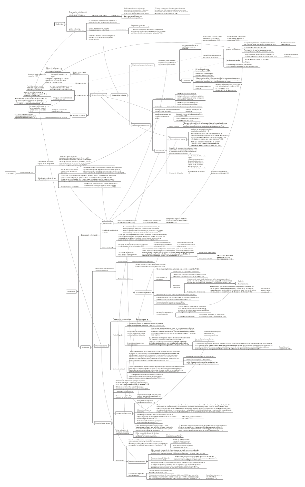

El siguiente es un resumen en forma de mapa conceptual del texto “_Hacia un feminismo descolonial_”, de María Lugones. La fuente es: La manzana de la discordia, Julio - Diciembre, Año 2011, Vol. 6, No. 2: 105-119, originalmente en Hypatia, vol 25, No. 4 (Otoño, 2010). Traducido por Gabriela Castellanos.

[Clic en el mapa o en este enlace para descargar el mapa conceptual](http://bastian.olea.biz/wp-content/uploads/2021/06/Lugones-Hacia-un-feminismo-descolonial-1.pdf)

* * *

_Apuntes y ensayos sobre estudios de género, sociología del cuerpo y teoría feminista por Bastián Olea Herrera, licenciado y magíster en sociología (Pontificia Universidad Católica de Chile)._ bastimapache
