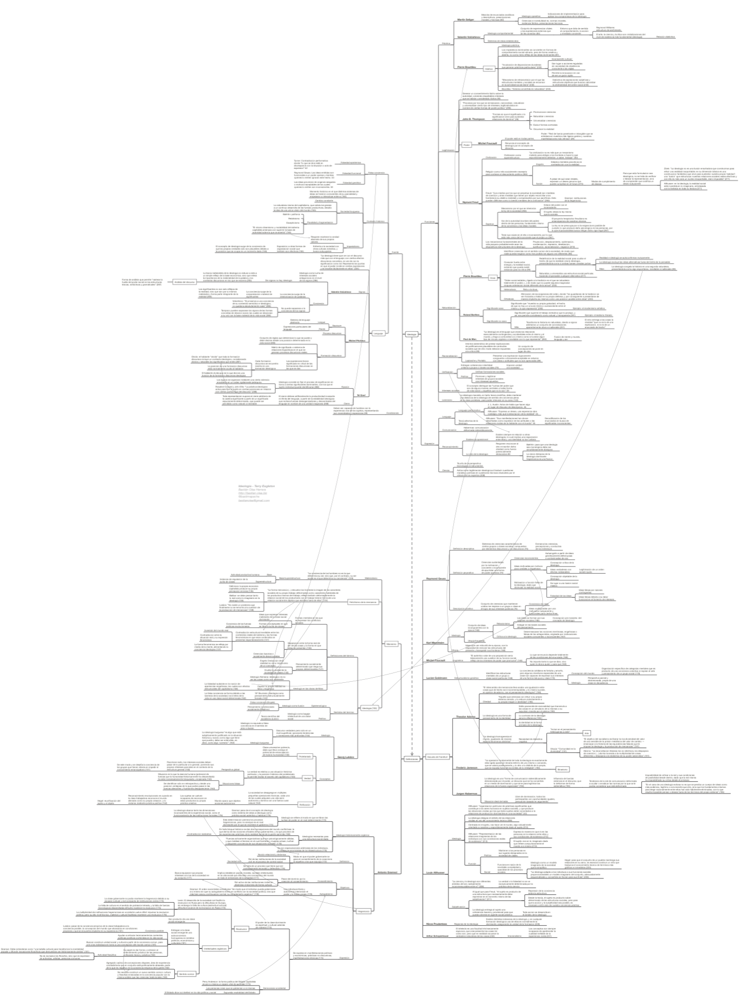

Este mapa conceptual resume el libro _Ideología_ (2019, Paidós), de Terry Eagleton. Principalmente, el mapa conceptual sintetiza las ideas acerca de la ideología de los principales autores referidos en el libro. Entre estos autores, se encuentran: Pierre Bourdieu, Georg Lukács, Michel Foucault, Antonio Gramsci, Louis Althusser, Valentin Volóshinov, Theodor Adorno, entre otros.

[Haz clic aquí o en el mapa conceptual para descargarlo en PDF:](http://bastian.olea.biz/wp-content/uploads/2021/07/Eagleton-Ideologia.pdf)  

* * *

_Apuntes y ensayos sobre estudios de género, sociología del cuerpo y teoría feminista por Bastián Olea Herrera, sociólogo y magíster en sociología (Pontificia Universidad Católica de Chile)._ bastimapache
