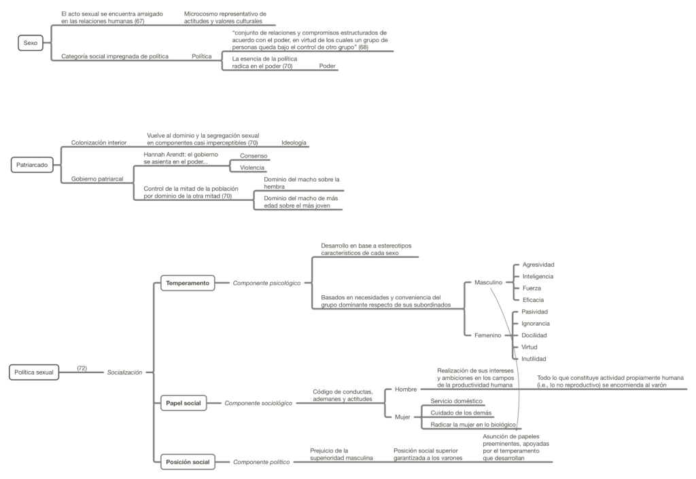

Resumen del capítulo de _Política sexual_ (Madrid: Cátedra, 1995), originalmente publicado en 1970.

[Clic aquí o en la imagen para descargar el mapa conceptual en PDF](http://bastian.olea.biz/wp-content/uploads/2021/07/Kate-Millett-Politica-sexual.pdf)

### Poder y política

**Política:**

> conjunto de **relaciones y compromisos** estructurados de acuerdo con el **poder,** en virtud de los cuales un grupo de personas queda **bajo el control de otro grupo.** 68

### Dominación sexual como ideología

El dominio sexual coloniza nuestros interiores para volverla imperceptible. Como ideología, el dominio sexual cristaliza el concepto más elemental del **poder:**

> Aun cuando los grupos que gobiernan por derecho de nacimiento están desapareciendo rápidamente, subsiste un modelo, arcaico y universal, del dominio ejercido por un grupo natural sobre otro: el que prevalece entre los sexos. 69
> 
> Se ha alcanzado una ingeniosísima forma de «colonización interior», más resistente que cualquier tipo de segregación y más uniforme, rigurosa y tenaz que la estratificación de las clases. Aun cuando hoy día resulte casi imperceptible, **el dominio sexual es tal vez la ideología más profundamente arraigada en nuestra cultura, por cristalizar en ella el concepto más elemental de poder.** 70

### Patriarcado

Todas las vías del poder “se encuentran por completo en manos masculinas”; los “valores, la ética, la filosofía y el arte de nuestra cultura (…) son de fabricación masculina”, y “como la esencia de la política radica en el poder”, deriva de ello el **carácter patriarcal de la sociedad.** (70)

No hay sociedades matriarcales (Marta Lamas también dice esto):

> No se conoce en la actualidad ninguna sociedad matriarcal. La descendencia matrilineal, que, según ciertos antropólogos, constituye un **residuo o una fase transitoria del matriarcado, no excluye el dominio patriarcal,** sino que tan sólo canaliza el poder ejercido por los varones en función de la descendencia femenina (asignándoselo, por ejemplo, a los tios por línea materna). 70

**Gobierno patriarcal:**

> institución en virtud de la cual una mitad de la población (es decir, las mujeres) se encuentra bajo el control de la otra mitad (los hombres), (…) se apoya sobre dos principios fundamentales: el **macho** ha de dominar a la hembra, y el **macho de más edad** ha de dominar al más joven. 70
> 
> se manifiesta en todas las formas políticas, sociales y económicas, ya se trate de las castas y clases o del feudalismo y la burocracia, y también en las principales religiones, 71

**Gobierno:**

> De acuerdo con las observaciones de Hannah Arendt, el gobierno se asienta sobre el poder, que puede estar respaldado por el **consenso** o impuesto por la **violencia.** 71

### Política sexual

> la política sexual es objeto de aprobación en virtud de la **«socialización» de ambos sexos** según las normas fundamentales del patriarcado en lo que atañe al **temperamento, al papel y a la posición social.** 72

**Temperamento:** _componente psicológico_

- Desarrollo en base a estereotipos característicos de cada sexo
- Basados en necesidades y conveniencia del grupo dominante respecto de sus subordinados  
    

**Papel social:** _componente sociológico_

- Código de conductas, ademanes y actitudes
- Realización de los intereses y ambiciones masculinas en los campos de la productividad humana  
    

**Posición social:** _componente político_

- Prejuicio de la superioridad masculina
- Asunción de papeles preeminentes, apoyadas por el temperamento que desarrollan  
    

* * *

### Aspectos biológicos

La **mayor musculatura** del macho es estimulada culturalmente, pero no determina una “categoría adecuada sobre la que pudieran basarse las relaciones políticas en el seno de la civilización” (la autoridad del padre es un efecto, no causa, derivado y establecido por la religión, a diferencia de lo que aseguran las leyes romanas clásicamente estudiadas, donde la familia deriva del poder ejercido por el padre sin explicar cómo se establece ello como institución (73).

**La supremacía masculina no es biológica,** sino que se basa en “la aceptación de un sistema de valores cuya índole no es biológica” (74)

Si el patriarcado es supuestamente inevitable por razones fisiológicas, esto **no explica su origen:**

> De acuerdo con una hipótesis muy difundida, el patriarcado constituye un fenómeno endémico en la vida social humana, inevitable desde un punto de vista fisiológico. Semejante teoría atribuye, pues, al patriarcado un origen lógico e histórico. Pero si, como creen algunos antropólogos, dicha institución fue precedida por otra forma social que calificaremos de prepatriarcal, **el argumento de la fuerza física no basta para explicar sus orígenes** (a menos que la mayor robustez del varón se haya visto ensalzada a consecuencia de un cambio de orientación unido a la adquisición de nuevos conocimientos o valores). 74

Los **cultos a la fertilidad** se orientan hacia el patriarcado en cierto momento de la historia, “subestimando y degradando la función de la mujer en la procreación y atribuyendo el principio vital únicamente al falo.” (75). Luego, la **religión** consolidó:

> La religión patriarcal consolidó esta situación creando uno o varios dioses masculinos, desterrando o desacreditando a las diosas y construyendo una **teología cuyos postulados básicos reforzaban la supremacía del varón** y tenían por mi- sión esencial mantener y justificar la estructura patriarcal. 75

Carácter cultural del género: “estructura de la personalidad conforme a la categoría sexual” (77)

#### Género

Concepto de género es independiente del de sexo.

Stoller: _Sex and Gender,_ 1968:

> Utilizaremos el término **género** para designar algunos de tales fenómenos psicológicos: así como cabe hablar del sexo masculino o femenino, también **se puede aludir a la masculinidad y la feminidad sin hacer referencia alguna a la anatomía o a la fisiología.** Así pues, si bien el sexo y el género se encuentran vinculados entre sí de modo inextricable en la mente popular, este estudio se propone, entre otros fines, confirmar que **no existe una dependencia biunívoca e ineluctable entre ambas dimensiones** (el sexo y el género) y que, por el contrario, su de- sarrollo puede tomar **vías independientes.** 77

Stoller:

> El vocablo género no tiene un significado biológico, sino **psicológico y cultural.** Los términos que mejor corresponden al sexo son “macho” y “hembra”, mientras que los que mejor califican el género son “masculino” y “femenino”; éstos pueden llegar a ser independientes del sexo (biológico). 78

* * *

### Aspectos sociológicos

#### Familia

El patriarcado gravita sobre la familia, la familia es el espejo de la sociedad, y es lazo de unión entre sociedad y patriarcado. La familia suple autoridad. Induce la adaptación de sus miembros a la sociedad, facilita el gobierno patriarcal, dirige a los ciudadanos mediante jefes de familia. (83)

**Socialización** mediante la familia:

> La principal aportación de la familia al patriarcado es la socialización de los hijos (mediante el ejemplo y los consejos de los padres) de acuerdo con las **actitudes dictadas por la ideología patriarcal en torno al papel, al temperamento y la posición de cada categoría sexual.** Si bien distintos padres pueden discrepar ligeramente en su interpretación de los valores culturales, se consigue un efecto general de uniformidad, reforzado por las amistades infantiles, las escuelas, los medios informativos y otras fuentes de educación explícitas o implícitas. 86

* * *

En pos del cambio social, es imperante atacar al patriarcado, en tanto punto de conexión con la propiedad y el conservadurismo:

> **El patriarcado es por necesidad el punto de partida de cualquier cambio social radical.** Y ello no sólo porque constituye la forma política a la que se encuentra sometida la mayoría de la población (las mujeres y los jóvenes), sino también porque **representa el bastión de la propiedad y de los intereses tradicionales.** 88

* * *

_Apuntes y ensayos sobre estudios de género, sociología del cuerpo y teoría feminista por Bastián Olea Herrera, sociólogo y magíster en sociología (Pontificia Universidad Católica de Chile)._ bastimapache
