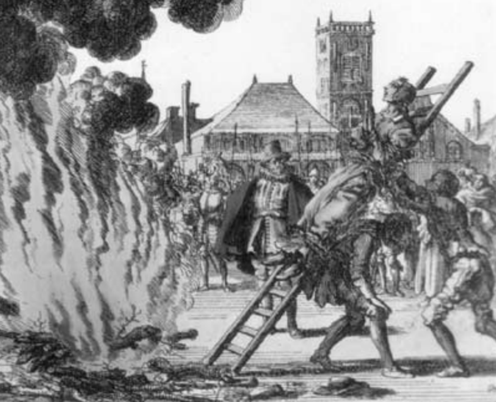
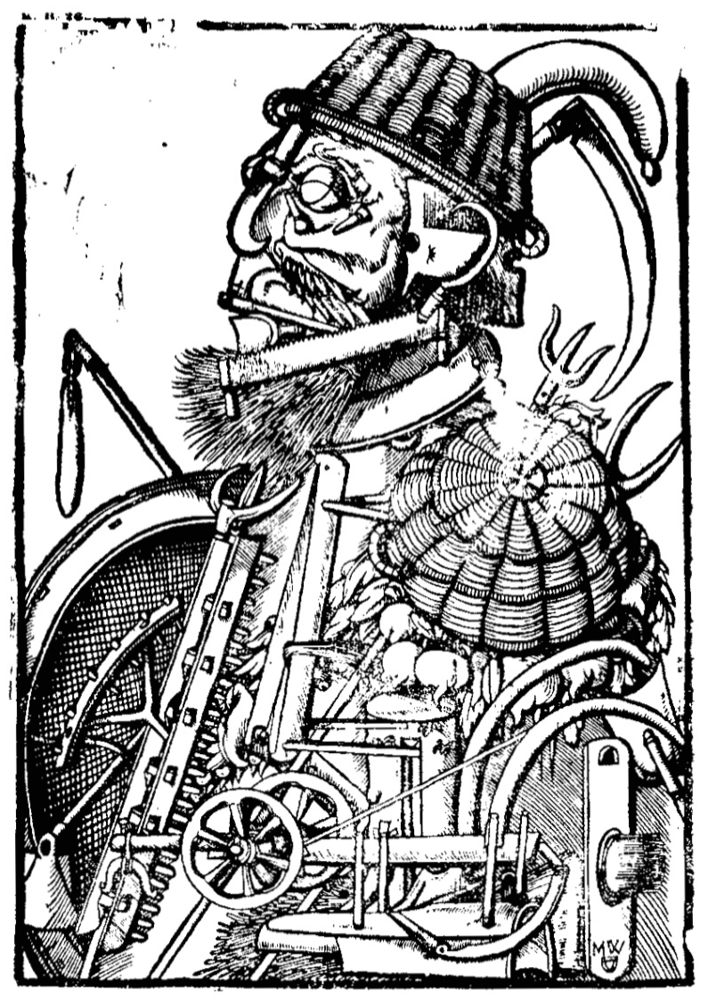

Fuente: _Calibán y la bruja: Mujeres, cuerpo y acumulación originaria,_ 2010, Buenos Aires: Tinta Limón ediciones.

### Disciplinamiento del cuerpo

(Foucault) transformación de las potencias del individuo en fuerza de trabajo. Condición para el desarrollo capitalista. (201)

Siglo XVII: conflicto entre la _Razón_ y las _Pasiones del Cuerpo;_ dentro de la persona se da una batalla entre elementos opuestos: **fuerzas de la razón** (parsimonia, la prudencia, el sentido de la responsabilidad, el autocontrol); **bajos instintos del cuerpo** (lascivia, el ocio, la disipación sistemática de las energías vitales que cada uno posee) (203)

Lutero: evitar que la sabiduría de la carne corrompa los poderes de la mente. “La persona se convierte en un terreno de la lucha de todos contra todos”. (203)

Batalla _contra el cuerpo_ entablada por la burguesía para formar un **nuevo tipo de individuo.** (204)

Cuerpo reformado para que **la adquisición sea el objetivo de la vida:**

> De acuerdo con Max Weber, la **reforma del cuerpo** está en el corazón de la **ética burguesa** porque el capitalismo hace de la adquisición “el objetivo final de la vida”, en lugar de tratarla como medio para satisfacer nuestras necesidades; por lo tanto, **necesita que perdamos el derecho a cualquier forma espontánea de disfrutar de la vida** (Weber, 1958: 53). (204)

Marx concuerda:

> Al transformar el trabajo en una mercancía, el capitalismo hace que los trabajadores subordinen su actividad a un orden externo sobre el que no tienen control y con el cual no se pueden identificar. De este modo, **el proceso de trabajo se convierte en un espacio de extrañamiento:** el trabajador “sólo se siente en sí fuera del trabajo, y en el trabajo fuera de sí. Está en lo suyo cuando no trabaja y cuando trabaja no está en lo suyo” (Marx, 1961: 72). (204)

El trabajador también se vuelve en dueño de su propia fuerza de trabajo, produciendo un sentido de _disociación respecto al cuerpo._ (205)

<!--more-->

* * *

### Resistencia a la proletarización

La primera crisis capitalista.

> la expropiación de las tierras comunes del campesinado– no fue suficiente para **forzar** a los proletarios desposeídos a aceptar el trabajo asalariado (205)
> 
> los trabajadores y artesanos expropiados **no aceptaron trabajar por un salario de forma pacífica.** La mayor parte de las veces se convirtieron en mendigos, vagabundos o criminales. Haría falta un largo proceso para **producir una fuerza de trabajo disciplinada.** Durante los siglos XVI y XVII, el odio hacia el trabajo asalariado era tan intenso que muchos proletarios preferían arriesgarse a terminar en la horca que subordinarse a las nuevas condiciones de trabajo (Hill, 1975: 219-39). (206)

Uso del **terror** para fijar a los trabajadores al trabajo asalariado:

> la respuesta de la burguesía fue la multiplicación de las ejecuciones; la construcción de un verdadero régimen de terror, implementado a través de la intensificación de las penas (en particular las que castigaban los crímenes contra la propiedad); y la introducción de “leyes sangrientas” contra los vagabundos con la intención de fijar a los trabajadores a los trabajos que se les había impuesto, de la misma manera que, en su momento, los siervos estuvieron fijados a la tierra. (207)

<figure>

<figcaption>

“Un ejemplo contundente de la concepción mecánica del cuerpo es este grabado alemán del siglo XVI en donde un campesino es representado exclusivamente como un medio de producción: su cuerpo completamente hecho de implementos agrícolas.” (226)

</figcaption>

</figure>

Proceso paralelo de ingeniería social para atacar al cuerpo:

> transformación radical de la persona, pensada para erradicar del proletariado cualquier comportamiento que no condujera a la imposición de una disciplina de trabajo más estricta (…) nueva concepción sobre el cuerpo y una nueva política sobre éste (…) **ataque al cuerpo como fuente de todos los males** (207)

El cuerpo se ataca usando argumentos morales, pero dirigiéndolo hacia disposiciones productivas y disciplinarias; el objetivo no es respetar una forma de ser, sino evitar deslices que disminuyan la productividad de los cuerpos en tanto trabajadores.

Razones de este cambio de paradigma: **el cuerpo como fuente de valor y trabajo.**

> ¿Por qué el cuerpo fue tan importante para la política estatal y el discurso intelectual? Una se siente tentada a responder que **esta obsesión por el cuerpo refleja el miedo que inspiraba el proletariado en la clase dominante.** Era el mismo miedo que sentían por igual el burgués o el noble, quienes, dondequiera que fuesen, en las calles o durante sus viajes, eran _asediados por una muchedumbre amenazadora que imploraba ayuda o se preparaba para robarles._ Era también el mismo _miedo_ que sentían aquéllos que dirigían la _administración del estado, cuya consolidación se veía continuamente debilitada –pero también determinada– por la amenaza de los disturbios y de los desórdenes sociales._ 208
> 
> No hay que olvidar que el proletariado mendicante y revoltoso –que forzaba a los ricos a viajar en coches de caballos para escapar de sus ataques o a irse a la cama con dos pistolas bajo la almohada– fue el mismo sujeto social que aparecía, cada vez más, como la **fuente de toda la riqueza.** Era el mismo proletariado sobre el que los mercantilistas, los primeros economistas de la sociedad capitalista, nunca se cansaron de repetir (aunque no sin dudarlo) que “mientras más, mejor”, 208
> 
> el **trabajo** (la “industria”), más que la tierra o cualquier otra “riqueza natural”, se convirtiera en la **fuente principal de acumulación** 209
> 
> El cuerpo, entonces, pasó al primer plano de las políticas sociales porque aparecía no sólo como una bestia inerte ante los estímulos del trabajo, sino como un **recipiente de fuerza de trabajo, un medio de producción, la máquina de trabajo primaria.** 210

Los cuerpos empiezan a identificarse como la fuente de la riqueza, y por lo tanto, se focaliza el interés en las formas de sujeción y dominio para poner a los cuerpos en función de la acumulación.

### Esquema cuerpo/mente de Descartes

Primeros apoyos teóricos y filosóficos a una nueva concepción del cuerpo.

> Una tarea fundamental de la empresa de Descartes fue instituir una **divisoria ontológica entre un dominio considerado puramente mental y otro puramente físico.** Cada costumbre, actitud y sensación queda definida de esta manera; sus límites están marcados, sus posibilidades sopesadas con tal meticulosidad que uno tiene la impresión de que el “libro de la naturaleza humana” ha sido abierto por primera vez o, de forma más probable, que **una nueva tierra ha sido descubierta y los conquistadores se están aprestando a trazar un mapa de sus senderos,** recopilar la lista de sus recursos naturales, evaluar sus ventajas y desventajas. 211
> 
> el cuerpo está divorciado de la persona, está literalmente deshumanizado. “No soy este cuerpo”, insiste Descartes a lo largo de sus Meditaciones (1641). 214
> 
> tenemos el modelo cartesiano que, a partir de la suposición de un **cuerpo puramente mecánico,** postula la posibilidad de que en el individuo se desarrollen **mecanismos de autodisciplina, autocontrol** (self-management) y **autorregulación** que hagan posibles las relaciones de trabajo voluntarias y el gobierno basado en el consentimiento. 226
> 
> Las doctrinas de Descartes tienen un doble objetivo: negar que el comportamiento humano pueda verse influido por factores externos (tales como las estrellas o las inteligencias celestiales) y liberar el alma de cualquier condicionamiento corporal, haciéndola capaz así de **ejercer una soberanía ilimitada sobre el cuerpo.** 227
> 
> Con la institución de una relación jerárquica entre la mente y el cuerpo, Descartes desarrolló las premisas teóricas para la **disciplina del trabajo** requerida para el desarrollo de la economía capitalista. La supermacía de la mente sobre el cuerpo implica que la voluntad puede (en principio) **controlar las necesidades, las reacciones y los reflejos del cuerpo;** que puede imponer un orden regular sobre sus funciones vitales y **forzar al cuerpo a trabajar** de acuerdo a especificaciones externas, independientemente de sus deseos. 230
> 
> la contraparte de la mecanización del cuerpo es el **desarrollo de la Razón como juez, inquisidor, gerente (_manager_) y administrador.** Aquí encontramos los orígenes de la subjetividad burguesa basada en el autocontrol (_self-management_), la propiedad de sí, la ley y la responsabilidad, con los corolarios de la memoria y la identidad. Aquí encontramos también el origen de esa **proliferación de “micropoderes”** que Michel Foucault ha descrito en su crítica del modelo jurídico-discursivo del Poder (Foucault, 1977). 230

### Concepción mecanicista del cuerpo

Cuerpo considerado como máquina incapaz de pensar, receptáculo de la mente o el alma, herramienta.

> El “teatro anatómico” expone a la vista pública un cuerpo desencantado y profanado, que sólo en principio puede ser concebido como el **emplazamiento del alma,** y que en cambio es tratado como una **realidad separada** (Galzigna, 1978: 163-64). 14 A los ojos del anatomista, el cuerpo es una fábrica (…) 212
> 
> El cuerpo es concebido como **materia en bruto, completamente divorciado de cualquier cualidad racional:** no sabe, no desea, no siente. El cuerpo es puramente una “colección de miembros” dice Descartes en su Discurso del método de 1634 (1973, Vol. I: 152). 212
> 
> También para Hobbes, el cuerpo es un conglomerado de **movimientos mecánicos** que, al **carecer de poder autónomo,** opera a partir de una **causalidad externa,** en un juego de atracciones y aversiones donde todo está regulado como en un **autómata** (Leviatán, Parte I, Capítulo VI). 213
> 
> Como ha demostrado Foucault, la mecanización del cuerpo no sólo supuso la represión de los deseos, las emociones y las otras formas de comportamiento que habían de ser erradicadas. También supuso el **desarrollo de nuevas facultades** en el individuo que aparecerían como otras en relación al cuerpo y que se convertirían en agentes de su transformación. El producto de esta **separación con respecto al cuerpo** fue, en otras palabras, el desarrollo de la **identidad individual,** concebida precisamente como **“alteridad”** con respecto al cuerpo y en perpetuo antagonismo con él. La aparición de este **alter ego** y la determinación de un conflicto histórico entre la mente y el cuerpo representan el nacimiento del individuo en la sociedad capitalista. **Hacer del propio cuerpo una realidad ajena que hay que evaluar, desarrollar y mantener a raya** con el fin obtener del mismo los resultados deseados, se convertiría en una característica típica del individuo moldeado por la disciplina del trabajo capitalista. 236

Esta es una aproximación nueva respecto del cuerpo, compatible con los intereses burgueses en los cuerpos como fuerza de trabajo. La degradación del cuerpo pasa a tener un fundamento espiritual (lo divino sobre lo carnal) a ser un mecanismo para producir sujeción y aumentar productividad:

Foucault (1977): en la perspectiva del **ascetismo medieval** (s. XVII), el cuerpo era degradado con una ”función puramente negativa, que buscaba establecer la naturaleza temporal e ilusoria de los placeres terrenales y consecuentemente la _necesidad de renunciar al cuerpo mismo.”_ Por el contrario, la **filosofía mecanicista** (s. XVIII) tiene un espíritu burgués “que calcula, clasifica, hace distinciones y _degrada al cuerpo sólo para racionalizar sus facultades,_ lo que apunta no sólo a intensificar su sujeción, sino a maximizar su utilidad social” (213)

#### Objetivo: control sobre el cuerpo:

> Una vez que sus mecanismos fueron deconstruídos, y reducido a una herramienta, el cuerpo pudo ser abierto a la manipulación infinita de sus poderes y posibilidades. 214
> 
> la filosofía mecanicista contribuyó a incrementar el control de la clase dominante sobre el mundo natural, lo que constituye el primer paso, y también el más importante, en el control sobre la naturaleza humana. 214
> 
> el cuerpo, vaciado de sus fuerzas ocultas, pudo ser **“atrapado en un sistema de sujeción”,** donde su comportamiento pudo ser calculado, organizado, pensado técnicamente e “investido de relaciones de poder” (Foucault, 1977: 30). 214
> 
> el cuerpo se convirtió en un término puramente relacional, que ya no significaba ninguna realidad específica, se le identificaba, en cambio, con cualquier **impedimento al dominio de la Razón.** 237

#### Nuevas técnicas sobre el cuerpo:

> En el caso de Descartes, la reducción del cuerpo a materia mecánica hace posible el desarrollo de **mecanismos de autocontrol que sujetan el cuerpo a la voluntad.** 215
> 
> Para Hobbes, por su parte, la mecanización del cuerpo sirve de justificación para la **sumisión total del individuo al poder del estado.** 215
> 
> En ambos, sin embargo, el resultado es una redefinición de los atributos corporales que, al menos idealmente, hacen al cuerpo apropiado para la **regularidad y el automatismo exigido por la disciplina del trabajo capitalista.** 215
> 
> alquimia social que no convertía metales corrientes en oro, sino poderes corporales en fuerzas de trabajo. 217
> 
> Del mismo modo que la tierra, el cuerpo tenía que ser cultivado y antes que nada **descompuesto en partes,** de tal manera que pudiera liberar sus tesoros escondidos. 217

**Destrucción de otros saberes** para imponer la perspectiva mecanicista:

> El “saber” puede convertirse en “poder” solamente haciendo cumplir sus prescripciones. Esto significa que el cuerpo mecánico, el cuerpo-máquina, no podría haberse convertido en modelo de comportamiento social sin la destrucción, por parte del estado, de una amplia gama de creencias pre-capitalistas, prácticas y sujetos sociales cuya existencia contradecía la regulación del comportamiento corporal prometido por la filosofía mecanicista. 217

Esta es la razón del ataque a las perspectivas animistas: eran consideradas **irracionales y contrarias al trabajo asalariado.**

> Así es como debemos leer el ataque contra la brujería y contra la visión mágica del mundo que, a pesar de los esfuerzos de la Iglesia, había seguido siendo predominante a nivel popular durante la Edad Media. El sustrato mágico formaba parte de una concepción animista de la naturaleza que no admitía ninguna separación entre la materia y el espíritu, y de este modo imaginaba el cosmos como un organismo viviente, poblado de fuerzas ocultas, donde cada elemento estaba en relación “favorable” con el resto. De acuerdo con esta perspectiva, en la que la naturaleza era vista como un universo de signos y señales marcado por afinidades invisibles que tenían que ser descifradas (Foucault, 1970: 26-7), cada elemento –las hierbas, las plantas, los metales y la mayor parte del cuerpo humano– escondía virtudes y poderes que le eran peculiares. 218
> 
> **La erradicación de estas prácticas era una condición necesaria para la racionalización capitalista del trabajo,** dado que la magia aparecía como una forma ilícita de poder y un instrumento para obtener lo deseado sin trabajar, es decir, aparecía como la **puesta en práctica de una forma de rechazo al trabajo.** 218
> 
> la magia se apoyaba en una concepción cualitativa del espacio y del tiempo que impedía la normalización del proceso de trabajo (…) Una concepción del cosmos que atribuía poderes especiales al individuo (…) era igualmente **incompatible con la disciplina del trabajo capitalista.** 219

<figure>

<figcaption>

“Jan Luyken. La ejecución de Anne Hendricks por brujería en Ámsterdam en 1571.” (243)

</figcaption>

</figure>

#### Formas en que el animismo y la hechicería han dificultado la instauración del capitalismo

La creencia de encontrar tesoros mediante hechizos “era ciertamente un obstáculo a la instauración de una disciplina del trabajo rigurosa” (220), las profesías durante la revolución inglesa y antes en la edad media “sirvieron para formular un programa de lucha (…) Históricamente han sido un medio por el cual los “pobres” han expresado sus deseos con el fin de dotar de legitimidad a sus planes y motivarse para actuar.“ Pero sobre todo, iban contra el principio de **responsabilidad individual:**

> Pero más allá de los peligros que planteaba la magia, la burguesía tenía que combatir su poder porque **debilitaba el principio de responsabilidad individual,** ya que la magia relacionaba las causas de la acción social con las estrellas, lo que estaba fuera de su alcance y su control. (220-221)

- reemplazo de la profecía por las probabilidades
- fijación espacio-temporal del cuerpo en pos de la regularidad del proceso de trabajo  
    

#### Consolidación de la **hegemonía del mecanicismo**

> Pero estas metáforas mecánicas no reflejan la influencia de la tecnología como tal, sino el hecho de que la máquina se estaba convirtiendo en el modelo de comportamiento social. 224
> 
> Podemos observar, en otras palabras, que **la primera máquina desarrollada por el capitalismo fue el cuerpo humano** y no la máquina de vapor, ni tampoco el reloj. 226
> 
> La mecanización del cuerpo es hasta tal punto constitutiva del individuo que, al menos en los países industrializados, la creencia en fuerzas ocultas no pone en peligro la uniformidad del comportamiento social. También se admite que la astrología reaparezca, con la certeza de que aun el consumidor más asiduo de cartas astrales consultará automáticamente el reloj antes de ir a trabajar. 220
> 
> en este proceso el cuerpo fue progresivamente politizado; fue desnaturalizado y redefinido como lo “otro”, el límite externo de la disciplina social. 242

La disciplina social se forjó en cámaras de tortura y hogueras:

> Las hogueras en las que las brujas y otros practicantes de la magia murieron, y las cámaras en las que se ejecutaron sus torturas, fueron un **laboratorio donde tomó forma y sentido la disciplina social,** y donde fueron adquiridos muchos conocimientos sobre el cuerpo. Con las hogueras **se eliminaron aquellas supersticiones que obstaculizaban la transformación del cuerpo individual y social en un conjunto de mecanismos predecibles y controlables.** Y fue allí, nuevamente, donde nació el uso científico de la tortura, pues fueron necesarias la sangre y la tortura para **“criar un animal” capaz de un comportamiento regular, homogéneo y uniforme,** marcado a fuego con la señal de las nuevas reglas (Nietzsche, 1965: 189-90). 222

Específicamente, el disciplinamiento de los cuerpos de las mujeres:

> la **condena del aborto y de la anticoncepción como _maleficium_,** lo que encomendó el cuerpo femenino a las manos del estado y de la profesión médica y llevó a reducir el útero a una máquina de reproducción del trabajo. 222

* * *

_Apuntes y ensayos sobre estudios de género, sociología del cuerpo y teoría feminista por Bastián Olea Herrera, sociólogo y magíster en sociología (Pontificia Universidad Católica de Chile)._ bastimapache
