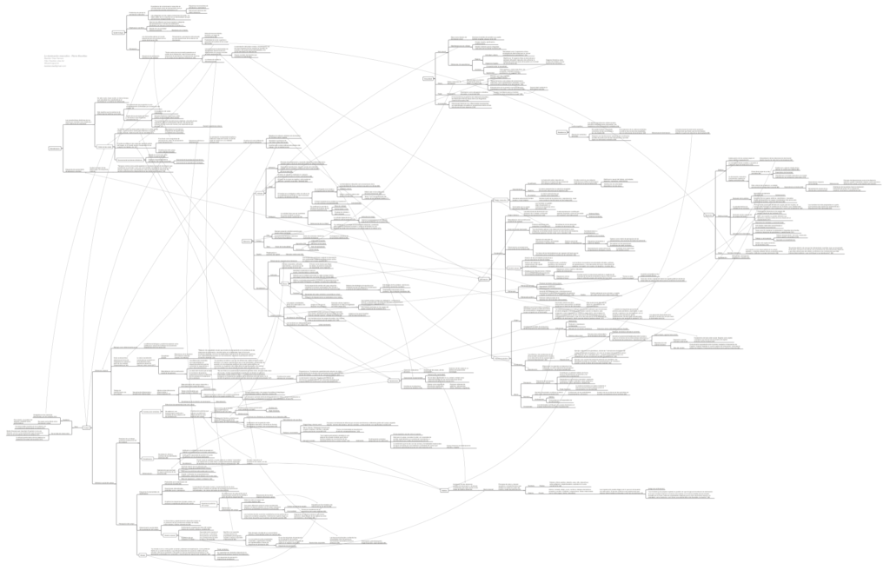

Mapa conceptual que resume esta obra del sociólogo Pierre Bourdieu, la cual ofrece una perspectiva de las relaciones entre géneros y la dominación inherente a ellas desde una particular visión que busca complementar agencia y estructura; es decir, entendiendo al género como disposiciones, hábitos y formas de percibir que vienen dadas desde una visión determinada (la _estructura_ masculina, androcéntrica, dominante), pero que a su vez, por la validez que le damos al percibirlas y actualizarlas en el día a día, resultan en la naturalización. justificación y _estructuración_ de dichas dinámicas.

Se trata de un mapa conceptual enorme, cuyos temas principales son la **masculinidad** (la virilidad, la socialización de lo masculio, el honor), el **cuerpo** (la diferencia corporal, la naturalización del género binario, la transformación de los cuerpos, la percepción del cuerpo, la mirada), y la **dominación** (la violencia simbólica, el orden masculino, la división sexual).

[Haz clic en la imagen o en este link para descargar el resumen de _La dominación masculina_](http://bastian.olea.biz/wp-content/uploads/2021/08/Bourdieu-La-dominacion-masculina.pdf)

Fuente: Bourdieu, P. (2019). La dominación masculina (14ª edición). Barcelona: Editorial Anagrama.

* * *

_Apuntes y ensayos sobre estudios de género, sociología del cuerpo y teoría feminista por Bastián Olea Herrera, sociólogo y magíster en sociología (Pontificia Universidad Católica de Chile)._ bastimapache
