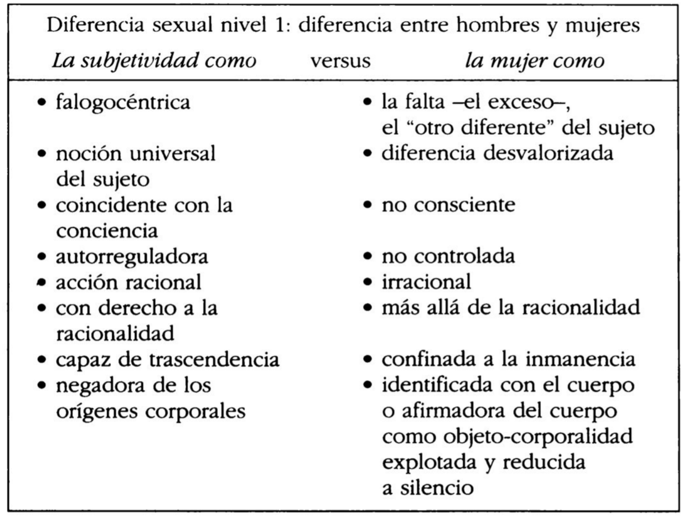
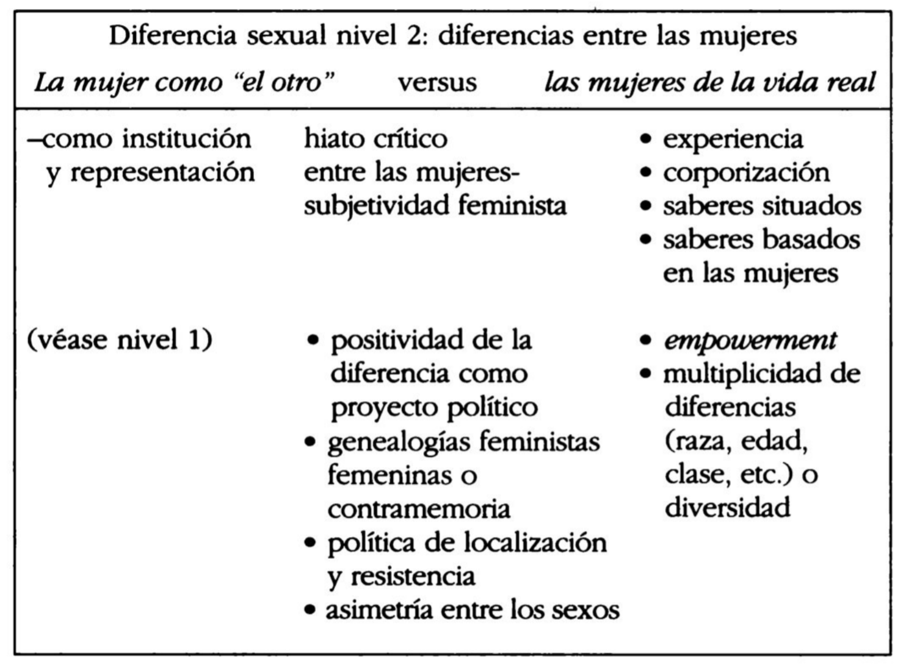
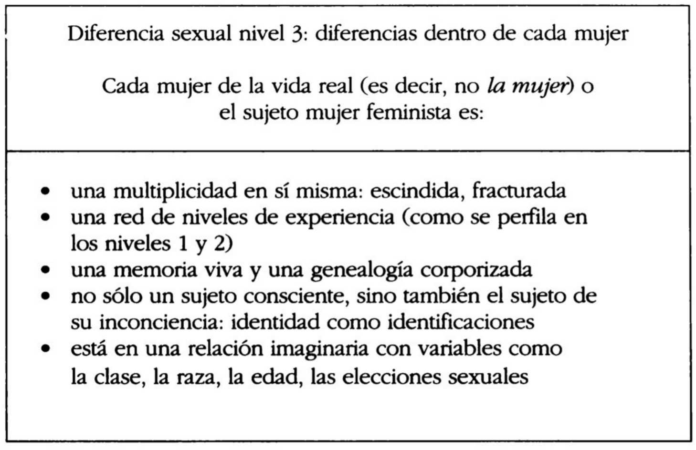

(en _Sujetos nómades. Corporización y diferencia sexual en la teoría feminista contemporánea,_ 2000, Paidós)

**Nómade:** _“nueva figuración de la subjetividad de un modo multidiferenciado no jerárquico.”_

### Origen europeo del concepto de diferencia

Papel de la diferencia en la historia europea, donde hay énfasis en la identidad común y la unificación del continente que deviene al concepto en noción divisoria y antagónica (165)

Diferencia articulada en regionalismos, localismos, relativismos. 166

Raíz del concepto de diferencia en el fascismo europeo, adoptado por modos jerárquicos y excluyentes de pensamiento.

Origen de la diferencia como negativo en relaciones de dominación europeas:

> En la historia europea de la filosofía, la “diferencia” es un concepto central en la medida en que el pensamiento occidental siempre se desarrolló planteando **oposiciones dualistas,** que crearon **subcategorías de alteridad** o “diferente de”. Como en esta historia la “diferencia” se sustentó siempre en **relaciones de dominación y exclusión,** ser “diferente de” llegó a significar ser “menos que”, “valer menos que”. La diferencia fue colonizada por las relaciones de poder que, como señalaba oportunamente Simone de Beauvoir en El segundo sexo, la redujeron a un **sinónimo de inferioridad.** En consecuencia, la diferencia adquirió connotaciones **esencialistas y letales;** construyó categorías enteras de seres descartables, es decir, igualmente humanos pero levemente más mortales. 166

Los totalitarismos y fascismos redefinieron la diferencia en términos de **determinismo biológico.**

### Diferencia desde el feminismo

#### Beauvoir

Análisis del esquema jerárquico de la dialéctica de la conciencia, adaptado desde Hegel; identificando la diferencia como noción central, proponiendo superar el esquema jerárquico de dicha noción, y finalmente uniéndola a la idea de _alteridad desvalorizada._ Cita a Poulain de la Barre sobre la trascendencia del dualismo de género. 168

#### Posmodernismo

Oposición al énfasis de Beauvoir en la racionalidad igualitaria. Planteamiento de la política de la diferencia. 168

> Como lo expresa Marguerite Duras en el epígrafe de este capítulo, las mujeres que continúan midiéndose con la vara de los valores masculinos, las mujeres que sienten que deben corregir los errores masculinos, ciertamente han de malgastar mucho tiempo y energía. En la misma línea de pensamiento, en su polémico artículo titulado “¿Igual a quién?”, Luce Irigaray recomienda apartar el énfasis político de la crítica reactiva y trasladarlo a la **afirmación de contravalores positivos.** (168)

#### Modernidad

Alejamiento de su concepción como inferioridad: Nietzsche, Freud y Marx introducen la idea de que **la subjetividad no se coincide con la conciencia:** crisis de la modernidad:

> El sujeto es excéntrico en relación con su yo consciente, a causa de la **importancia de estructuras** tales como el deseo inconsciente, el impacto de las circunstancias históricas y las condiciones sociales de producción. Al quedar hecha añicos la seguridad ontológica del sujeto cartesiano, se abre también un camino para analizar el vínculo que se estableció convencionalmente entre la **subjetividad y la masculinidad.** En este sentido, la crisis de la modernidad puede entenderse, así lo sostuve en mi Patterns of Dissonance, como la **destrucción de las bases masculinistas de la subjetividad clásica.** (169)

<!--more-->

* * *

**Feminismo de la diferencia antisexual:** subjetividad más allá del género; subjetividad posgénero. Superar el dualismo sexual mediante una subjetividad sexualmente indiferenciada (Wittig, entre otras). La autora se opone a esta vertiente:

> En oposición a lo que considero como un rechazo apresurado de la diferencia sexual, en nombre de una forma discutible de “antiesencialismo” o de anhelo utópico por una posición que esté “más allá del género”, yo quiero **valorizar la diferencia sexual como proyecto.** 170

Proyecto político nómade: énfasis en las diferencias encarnadas por las mujeres que permitiría dar bases a redefinir la subjetividad femenina.

* * *

### Feminismo de los ‘90

Crisis de la noción de género: “…impropiedad teorética como por su naturaleza políticamente amorfa y vaga.” (171)

Crítica al género desde:

- teóricas de la diferencia sexual
- teóricas poscoloniales
- feministas negras
- epistemólogas feministas de las ciencias naturales
- pensadoras lesbianas  
    

Género y lenguas romances:

> pensamiento feminista italiano, del australiano, del holandés y de otros tipos de pensamientos feministas (…) ayudaron a destacar hasta qué punto el concepto de “género” es una vicisitud del idioma inglés, una noción que tiene muy poca o ninguna relevancia en las lenguas romances.? Como tal, este concepto no tuvo mucho eco en los movimientos feministas francés, español e italiano. (…) Esto también significa que la distinción entre sexo y género, que es uno de los pilares sobre los que se construyó la teoría de las feministas de habla inglesa, en muchos contextos europeos occidentales no ingleses, no tiene sentido ni en el plano epistemológico ni en el plano político, cuando en cambio las nociones de “sexualidad” y “diferencia sexual” se usan corrientemente. 172

**Falogocentrismo** como lógica interna del patriarcado que designa lo masculino como universal y lo femenino como otro, responsable de establecer la diferencia:

> el “género” en la teoría feminista, primariamente, cumple la función de **desafiar la tendencia universalista del lenguaje crítico, de los sistemas de conocimiento y del discurso científico en general.** Dicha tendencia consiste en combinar el punto de vista masculino con el punto de vista general, “humano”, y **confinar, por lo tanto, lo femenino, a la posición estructural de lo “otro”.** De ahí que lo masculino entendido como lo humano se tome como la “norma”, y lo femenino como lo “otro” se entienda como **aquello que establece la “diferencia”.** El corolario de esta definición es que la carga de la diferencia sexual recaiga sobre las mujeres y las marque con el rótulo del segundo sexo o del “otro” estructural, mientras los hombres quedan marcados por el imperativo de representar lo universal. La división simbólica del trabajo entre los sexos, que el término “género” contribuye a explicar, es el sistema establecido por el **falogocentrismo,** que es la lógica interna del patriarcado. En otras palabras, este sistema no es necesario, como algo históricamente inevitable, ni es racional como algo conceptualmente necesario. **Sencillamente _ha llegado a ser_ el poderoso fundamento de un sistema** en el cual todos estamos construidos, o bien como hombres, o bien como mujeres, por ciertas condiciones simbólicas, semióticas y materiales. (173-174)

Expresiones corporales y subjetivas del sistema patriarcal:

> Simone de Beauvoir observaba hace cincuenta años que **el precio que pagan** los **hombres** por representar lo universal es un tipo de **pérdida de su corporización;** el precio que pagan las **mujeres,** por su parte, es una pérdida de la subjetividad y el **confinamiento al cuerpo.** Los primeros están descorporizados y, a través de ese proceso, ganan el derecho a la **trascendencia y la subjetividad,** las últimas están sobrecorporizadas y, por lo tanto, **condenadas a la inmanencia.** Esto tiene por consecuencia dos posiciones muy asimétricas y dos áreas problemáticas opuestas. (174-175)

- Hombre - descorporización - trascendencia y subjetividad
- Mujer - sobrecorporización - inmanencia  
    

### _Escritura femenina_ francesa

Lingüística, estudios

literarios, semiótica, filosofía y teorías psicoanalíticas del sujeto.

Foco en las estructuras teoréticas y lingüísticas de las diferencias entre los sexos (175)

Coexistencia de relaciones de poder y conocimiento: el campo social es una red de **intersección de estructuras materiales y simbólicas** (176). Por lo tanto, el análisis de la opresión femenina requiere tanto lenguaje como materialismo.

Plantean que el concepto de género se centra demasiado en factores sociales y materiales en detrimento de aspectos semióticos y simbólicos.

* * *

Nudo:

> hemos llegado a un intercambio de pretensiones: el argumento, reiteradamente sostenido por las teóricas de la diferencia sexual, de que es necesario redefinir el sujeto femenino feminista se repite ahora en el razonamiento contradictorio de las teóricas del género, según el cual lo femenino es un laberinto de absurdo metafísico y lo mejor es descartarlo de plano en favor de una nueva androginia. 177
> 
> El repudio del pensamiento dualista como el modo de ser del patriarcado suministra bases comunes para desbloquear la relación de dos posturas feministas que de otro modo permanecerían en oposición. (177)

### Universalismo y dualismo

La postura universalista basada en oposiciones dualistas tiene como consecuencia jerarquías de poder:

> Las estudiosas feministas de todo el mundo han sostenido que la **postura universalista,** que combina lo **universal con lo masculino** para representar lo humano y confina lo femenino a una posición secundaria de **“alteridad” devaluada,** se apoya en un **sistema clásico de oposiciones dualistas,** tales como: naturaleza/cultura, activo/pasivo, racional/irracional, masculino/femenino. Las feministas argumentan que **este modo dualista de pensar crea diferencias binarias únicamente con el fin de ordenarlas en una escala jerárquica de relaciones de poder.** (177)

Concepción de postestructuralista del género de Joan Scott:

> Joan Scott sostiene que la noción de género, al marcar una serie de **interrelaciones entre variables de opresión,** puede ayudarnos a comprender la **intersección de sexo, clase, raza, estilo de vida y edad, entendidos como ejes fundamentales de diferenciación.** En un ensayo más reciente, Scott avanza un poco más y aboga por una definición de género que marque la **intersección del lenguaje con lo social, de la semiótica con lo material.** Citando la noción de “discurso” de Foucault, a la que considera una de las principales contribuciones del pensamiento postestructuralista a la teoría feminista, Scott sugiere que **reinterpretemos el “género” como un modo de vincular el texto con la realidad, lo simbólico con lo material y la teoría con la práctica** de una manera nueva, vigorosa. En la interpretación de Scott, la teoría feminista entendida de este modo postestructuralista tiene la ventaja de **politizar la lucha sobre la significación y la representación.** (178)

* * *

Nuevo tipo de materialismo corporizado femenino:

> está surgiendo una nueva tendencia que pone énfasis en la **naturaleza situada, específica, corporizada del sujeto feminista,** y, al mismo tiempo, **niega el esencialismo biológico o psíquico.** Éste es un nuevo tipo de **materialismo corporizado femenino.** 183
> 
> ...implica redefinir el texto como coextensivo a las relaciones de conocimiento y poder...

Proceso de la **constitución de la subjetividad** como aspecto central de la red de poder y conocimiento:

> Esta concepción puede resumirse de la manera siguiente: ¿Y si el modo patriarcal de representación, que podríamos llamar el “sistema de género”, **produjera las categorías mismas que pretende desconstruir?** Al considerar el género como un **proceso,** de Lauretis pone el acento en una cuestión sobre la que ya Foucault había llamado la atención: a saber, que **el proceso de poder y conocimiento también produce al sujeto como un término de ese proceso particular.** 183

(tiene mucho que ver con la matriz de constitución del sujeto de Butler)

> la adquisición de la subjetividad es un proceso de prácticas materiales (institucionales) y discursivas (simbólicas), cuyo objetivo es tanto _positivo_ —porque el proceso da lugar a **prácticas de empoderamiento**— como _regulador_ —porque las formas de empoderamiento son el sitio de **limitaciones y disciplinamiento**— 183

**Género como ficción reguladora:** actividad normativa que construye categorías como “el sujeto, el objeto, lo masculino, lo femenino, lo heterosexual y lo lesbiano, como parte de su proceso mismo.” 183

> lo que está en juego aquí es el destino social y simbólico de las polarizaciones sexuales. 184
> 
> la cuestión central es la de la identidad como sitio de diferencias; 184

**Desafío del feminismo:** _reinventarse a uno mismo como otro:_

> Hoy el desafío que afronta la teoría feminista es cómo inventar nuevas imágenes de pensamiento que nos ayuden a reflexionar sobre el cambio y las construcciones cambiantes del sujeto. No se trata de la inmovilidad de verdades formuladas ni de contraidentidades prontamente disponibles, sino del **proceso vivo de transformación de sí mismo y del otro.** Sandra Harding lo define como el proceso de “reinventarse a uno mismo como otro”. 184

Redenominar al sujeto feminista femenino como una “entidad múltiple, interconectada, y de final abierto” (184),

> poner énfasis en una visión del sujeto pensante, cognoscente, no como “uno” sino más bien como una entidad que se divide una y otra vez en un arco iris de posibilidades aún no codificadas y cada vez más hermosas. 185

* * *

### Proyecto de nomadismo feminista

Definición de **teoría feminista:**

> movimiento de oposición crítica contra el falso universalismo del sujeto (185)
> 
> afirmación positiva del deseo de las mujeres de manifestar y dar validez a formas diferentes de subjetividad (185)

Proyecto de nomadismo feminista:

- Criticar las definiciones y representaciones de las mujeres
- Crear nuevas imágenes de la subjetividad femenina  
    

El **punto de partida** para el proyecto nómade es situar a las mujeres en _posiciones de subjetividad discursiva_

**Términos clave:** corporización, raíces corporales de la subjetividad, reconección de teoría y práctica.

Tres fases, a modo de cartografía, que pueden coexistir cronológicamente y abordarse desde cualquier nivel y en cualquier momento (185-186):

- _diferencia entre hombres y mujeres_
- _diferencias entre mujeres_
- _diferencias dentro de cada mujer_

Se dan simultáneamente, son difíciles de distinguir. La **clave del modo nómade** es la capacidad de pasar de un nivel al otro “en un fluir de experiencias, de secuencias de tiempo y estratos de significación” desde lo intelectual y el **arte de la existencia** (186)

Dos formas de interpretar la desvalorización de la mujer producto del _universalismo del sujeto:_

- **Hegeliano** (Simone de Beauvoir), donde la diferencia encarnada por la mujer está irrepresentada y por ende debe representarse:  
    
    De Beauvoir llega a la conclusión de que esta entidad desvalorizada y mal representada puede y debe llevarse a la representación y que ésa es la principal tarea que tiene a su cargo el movimiento de las mujeres. 187
    
- **Posestructuralista** (Luce Irigaray) donde la diferencia encarnada por la mujer se identifica como irrepresentable:

> Irigaray evalúa la “alteridad” de la mujer, no meramente como aquello que aún no está representado, sino antes bien como **aquello que continúa siendo irrepresentable dentro de este esquema de representación.** La mujer como el otro continúa estando por encima o **fuera del marco falogocéntrico** que combina lo masculino con la posición (falsamente) universalista. La relación entre el sujeto y el otro no es pues reversible; por el contrario, los dos polos de la oposición existen en una relación asimétrica. Con el título de “la doble sintaxis”, Irigaray defiende esta **diferencia irreductible e irreversible** y propone que sea la base de una nueva fase de la **política feminista.** En otras palabras, Luce Irigaray hace hincapié en la necesidad de reconocer, como una realidad fáctica e histórica, que no existe simetría entre los sexos y que esta asimetría ha sido organizada jerárquicamente por el régimen falogocéntrico. Al reconocer que esa diferencia fue convertida en una marca de carácter peyorativo, el proyecto feminista intenta redefinirla en términos de positividad. (187-188)

Mujer fuera del marco falogocéntrico, posiciones asimétricas: la diferencia es irreversible, volviéndose la base de la política feminista. **Redefinir la diferencia en términos de positividad.**

**Punto de partida** del **proyecto de la diferencia sexual:** “afirmar la especificidad de la **experiencia vivida,** corporalmente femenina, el rechazo de la diferencia sexual descorporizada en un sujeto supuestamente “posmoderno” y “antiesencialista” y la voluntad de **reconectar todo el debate sobre la diferencia con la existencia corporal** y la experiencia de las mujeres.” 188

<figure>

<figcaption>

Diferencia sexual nivel 1 (p. 187)

</figcaption>

</figure>

Advertencia contra invertir tiempo y energía en corregir errores de la cultura masculina; es preferible **elaborar formas alternativas de subjetividad femenina** o **afirmar el carácter positivo de la diferencia sexual** (188-189)

#### Mujer ≠ feminista

> Lo que en realidad está en juego es la definición de la mujer como diferente del “no-varón”. 189

La diferencia sexual se reafirma por las feministas durante la modernidad en tanto pérdida del paradigma racionalista y naturalista. Por ello las feministas tienen la tarea de una **“nueva visión de la subjetividad** en general y una visión específicamente sexual de la subjetividad femenina en particular.“ 189

<figure>

<figcaption>

Diferencia sexual nivel 2 (p. 190)

</figcaption>

</figure>

Frustración por las generalizaciones sobre “la mujer” (e.g. Beauvoir). Mujer como término paraguas que ecualiza diferentes tipos de mujeres, experiencias e identidades.

**Noción de mujer:**

> La noción de mujer alude al sujeto sexuado femenino que está constituido, como sostiene convincentemente el psicoanálisis, mediante un proceso de **identificación con posiciones culturalmente disponibles** organizadas en la **dicotomía de los géneros.** 191

Identificación con identificaciones derivadas de la dicotomía. Inscrita en el tiempo lineal de la historia (Kristeva), mientras que la identidad femenina en vías de conciencia feminista se corresponde con el tiempo discontinuo de la transformación, resistencia, genealogías políticas, devenir. 191

**Definición de feminismo:**

> Llamo feminismo al movimiento que lucha por **cambiar los valores atribuidos** a las mujeres y las **representaciones** de éstas sostenidos en el tiempo histórico, más largo, de la historia patriarcal (la mujer), así como en el tiempo más profundo de la propia identidad. 191

El proyecto feminista abarca la **subjetividad** (acción histórica y derecho político y social) y la **identidad** (conciencia, deseo, política de lo personal); consciente e inconsciente. 191

El sujeto feminista es _histórico_ porque “participa del patriarcado mediante la **negación”**

El sujeto feminista se vincula con la identidad _(personal)_ femenina; la mujer se sitúa en una posición diferente de la feminista dado que mujer es alteridad, polo opuesto especular de lo masculino y referente de subjetividad:

> El sujeto feminista es histórico porque participa del patriarcado mediante la negación; pero también está vinculado con la identidad femenina, con lo personal. Dicho de otro modo, **la “mujer” debe situarse en una posición estructuralmente diferente de la feminista** porque, estando estructurada como el referente de la alteridad, constituye el polo opuesto especular de lo masculino, como referente de la subjetividad. El segundo sexo es una oposición dicotómica del varón como representante de lo universal. En consecuencia, el feminismo necesita establecer una distinción epistemológica y una distinción política entre los conceptos de mujer y de feminista. 192

Feminismo es tanto **emancipación** respecto del patriarcado (diferencia versus los hombres) y cuestionamiento de la **identidad** (diferencia versus la mujer):

> Lo feminista consiste tanto en impulsar la **inserción de las mujeres en la historia patriarcal** (el momento **emancipatorio** o la diferencia sexual, nivel 1) como en **cuestionar la identidad personal** sobre la base de las relaciones de poder, lo cual constituye el **feminismo de la diferencia** (la diferencia sexual, nivel 2). 192

Distanciarse críticamente de la mujer, reconociendo que es un vínculo de comunidad pero no un objetivo final de reconocimiento:

> tomar una **distancia crítica de la institución y representación de la mujer** es el punto de partida para alcanzar una conciencia feminista; el movimiento de las mujeres se apoya en el consenso de que **todas las mujeres comparten la condición de “segundo sexo”.** Esto puede entenderse como una condición suficiente para elaborar una posición de sujeto feminista; el **reconocimiento de un vínculo de comunidad entre las mujeres** es el punto de partida para alcanzar la conciencia feminista por cuanto sella un **pacto entre las mujeres.** Este momento es la piedra fundamental que permite articular la posición feminista o su punto de vista. Pero **este reconocimiento de una condición común de hermandad en la opresión no puede constituir el objetivo final;** las mujeres pueden tener situaciones y experiencias comunes, pero **no son, de ningún modo, todas iguales.** 192

Pacto entre mujeres a partir de la experiencia compartida de opresión.

#### Diferencias entre mujeres

Hacia una teoría del **reconocimiento de las diferencias,** política de la localización:

> rechazar las afirmaciones globales sobre todas las mujeres y de estar, en cambio, lo más atentas que podamos al **lugar desde donde habla cada una.** La idea clave sería: **prestar atención a lo situado en oposición a la naturaleza universalista de las enunciaciones.** 193

Situación, experiencia y diferencia por sobre esencialismo de género.

**Contramemoria o genealogías alternativas:**

> Este concepto implica que tener la **memoria histórica de la opresión o la exclusión** como mujeres, en lugar de ser el referente empírico para un grupo dominante, como el de los hombres, determina una **diferencia.** 193

No ser referente del grupo dominante, sino mantener memoria de opresión y exclusión.

**Diferencia entre _mujer_ y _feminista:_**

> con ayuda de la semiótica y de la teoría psicoanalítica, se establece una distinción fundamental entre _“la mujer”,_ como el **significante que está codificado en una larga historia de oposiciones binarias,** y el significante _“feminista”,_ como noción que surge partiendo del **reconocimiento de la naturaleza construida de la mujer.** 194

Esta distinción es fundamental para que exista pensamiento feminista, y abre la diferencia sexual nivel 2: **diferencias entre las mujeres.**

_La mujer_ como esencia histórica, noción deconstruida y puesta en tela de juicio:

> la teoría feminista como filosofía de la diferencia sexual identifica como una **esencia histórica** la noción de la mujer, en el período exacto de la historia en que esta noción comienza a ser **desconstruida** y puesta en tela de juicio. Esta **crisis de la modernidad** permite que las feministas presenten la **esencia de la feminidad como una construcción histórica que es necesario reelaborar.** Por lo tanto, la mujer deja de ser el modelo culturalmente dominante y prescriptivo para la subjetividad femenina y se transforma, en cambio, en un topos identificable para el análisis: como una construcción (De Lauretis); una mascarada (Butler); una esencia positiva (Irigaray) o como una trampa ideológica (Wittig), para mencionar sólo unos pocos. 194

<figure>

<figcaption>

Diferencia sexual nivel 3 (p. 195)

</figcaption>

</figure>

* * *

##### Definición de **cuerpo**

Materia viva con memoria, flujo de energía, variante, irrepresentable de forma plena:

> El cuerpo se refiere a un **estrato de materialidad corporal,** a un sustrato de materia viva dotada de **memoria.** Siguiendo a Deleuze, entiendo esto como un **fluir puro de energía,** capaz de múltiples variaciones. (…) el cuerpo no puede captarse o representarse plenamente: **excede la representación.** 195

##### Definición de **sí mismo**

Entidad anclada a una materia viva, codificada por lenguaje, y dotada de identidad:

> El sí mismo, entendido como una **entidad dotada de identidad,** está anclado en esta **materia viva,** cuya materialidad está **codificada y representada** en el lenguaje. 195

##### Definición de **identidad**

- relacional
- retrospectiva
- identificaciones sucesivas

> la identidad es un juego de aspectos múltiples, fracturados, del sí mismo; es **“relacional”,** por cuanto requiere un vínculo con el “otro”; es **retrospectiva,** por cuanto se fija en virtud de la memoria y los recuerdos, en un proceso genealógico. Por último, la identidad está hecha de **sucesivas identificaciones,** es decir, de imágenes inconscientes internalizadas que escapan al control racional. 195

#### Diferencia entre identidad y subjetividad

Identidad y conciencia no coinciden: la relación con la propia genealogía, propia historia y condiciones materiales es _imaginaria._No hay que confundir identidad con subjetividad política:

> la _identidad_ mantiene un vínculo privilegiado con los **procesos inconscientes,** mientras que la _subjetividad política_ es una **posición consciente y deliberada.** El deseo inconsciente y la elección voluntaria no siempre coinciden. 196

- _Identidad:_ deseo inconsciente; inconsciente
- _Subjetividad política:_ elección voluntaria; consciente y deliberado

Diferencias dentro de cada sujeto, donde el sujeto es la intersección de distintos registros de habla que invocan estratos de experiencia vivida (196)

##### Moralismo feminista

Las contradicciones, confusiones e incertidumbres de las feministas no debe entenderse como derrotas ni catalogarse de políticamente incorrecto, sino que se les debe ceder un espacio que no haga un juicio moral: “nada puede ser más antitético para el nomadismo que propongo que el moralismo feminista.“

> La cuestión central que está en juego aquí es cómo **evitar repetir las exclusiones** en el proceso de legitimar un sujeto feminista alternativo. ¿Cómo evitar la **recodificación hegemónica** del sujeto femenino? ¿Cómo mantener una **perspectiva abierta de la subjetividad,** afirmando al mismo tiempo la presencia teorética y política de otra visión de la subjetividad? 196

##### Posición feminista intensiva

Lectura _intensiva_ de la posición feminista: **subjetividad feminista como objeto de deseo,** pasiones que motivan un compromiso: “Una feminista mujer puede entenderse, pues, como alguien que **anhela el feminismo,** tiende a él o se siente impulsada a él.” (197)

Nietzsche a través de Deleuze: “ver las _elecciones volitivas_ (…) como 

posiciones multiestratificadas”; modo de “devolverles su **plenitud,**su **corporeidad** y, consecuentemente, su **parcialidad,** a las creencias políticas.” 197

> “deseo del feminismo” como una pasión jubilosa, afirmativa. Lo que el feminismo libera en las mujeres es también su **deseo de libertad, de levedad, de justicia y de autorrealización.** Estos valores no son solamente creencias políticas racionales, también constituyen objetos de intenso deseo. Este espíritu alborozado era absolutamente manifiesto en los primeros días del movimiento de las mujeres (…) Deseo que el feminismo pueda despojarse de su estilo entristecido y dogmático para redescubrir el carácter festivo de un movimiento que procura cambiar la vida. 198

Levedad, agilidad, multiplicidad.

#### Niveles de diferencia sexual

> El tercer nivel de la diferencia sexual nos alerta sobre la importancia que tiene **acompañar con un toque de levedad la complejidad de las estructuras políticas** y epistemológicas del proyecto feminista. 198

Distinta temporalidad:

> los niveles 1 y 2 corresponden a un tiempo lineal, más largo, de la historia. El nivel 3 tiene que ver con el tiempo interno, discontinuo, de la genealogía. 198

- Énfasis en “no excluir ninguno de los niveles que constituyen el mapa de la subjetividad de la mujer feminista” (201-202)
- Énfasis en la necesidad de acción a niveles de la identidad, subjetividad, y diferencias entre mujeres (203)
- Nombrar y representar las áreas de tránsito entre los niveles (202)
- Lo que cuenta es el proceso (202)
- Situarse en alguna de las **figuraciones de la subjetividad** (por ejemplo, cyborg de Haraway, los dos labios/mucosa/divina de Irigaray)

_Ejemplo:_

> figura del “cyborg” de Haraway es una intervención poderosa en el nivel de la subjetividad política, por cuanto propone un **reordenamiento** de las diferencias de raza, de género, de clase, de edad, etcétera, y **promueve una localización** multifacética para la capacidad de **acción feminista**. (…) De acuerdo con mi esquema nómade, tengo que poder **mencionar los pasos,** los desplazamientos y los **puntos de salida** que harían posible que las mujeres avanzaran más allá del dualismo de género falogocéntrico. Dicho de otro modo, tengo que prestar atención al nivel de la **identidad,** de las **identificaciones inconscientes** y del **deseo**, y conjugar esos niveles con las **transformaciones políticas voluntarias.** El cyborg es extremadamente útil para comprender esto último (…) 202

Buscar una estrategia para reordenar las diferencias; localizarse; describir acciones (pasos); explorar la identidad/identificaciones inconscientes/deseos (descender a la fantasmagoria femenina del inconsciente), proponer acción; objetivos/posiciones de sujeto (puntos de salida) en pos de la superación; acciones voluntarias que deriven en transformaciones políticas; redefinir la identidad femenina y la subjetividad feminista.

Los requerimientos corresponden a diferentes momentos/localizaciones en el espacio; ergo, diferentes prácticas (203)

##### Estrategia del feminismo nómade

_Resumen de la estrategia:_

> lo nuevo se crea revisitando y consumiendo lo antiguo. 200
> 
> asimilar el orden muerto antes de poder pasar al nuevo orden. 200
> 
> antes de renunciar al significante la mujer, las feministas tenemos que volver a apoderarnos de él y revisitar sus multifacéticas complejidades, porque esas complejidades definen la única **identidad que compartimos:** la de mujeres feministas. 201

- revelar la representación de la mujer
- reelaborar su noción histórica
- redefinir la subjetividad femenina:“reelaborar el conjunto de las imágenes, las representaciones y los conceptos acumulados de las mujeres, de la identidad femenina, según fueron codificados por la cultura en que vivimos.“ 201
- _consumir_ sus estratos de representación
- luego, _jugar_ con el devenir subjetivo de la mujer
- _influir_ en el concepto de la mujer
- así, crear nuevas condiciones para **nuevos devenires** de las mujeres

> Entiendo el feminismo como la estrategia de **reelaborar la noción histórica de “la mujer”**, en un momento de la historia en el que ese concepto ha perdido su unidad sustancial. Por consiguiente, como práctica política y teorética, el feminismo puede caracterizarse como un **movimiento que revela y consume los diferentes estratos de representación de “la mujer”.** El mito de “la mujer” entendida como el otro es ahora un **terreno baldío donde diferentes mujeres pueden jugar con su devenir subjetivo.** Para el sujeto feminista la cuestión es **saber cómo influir en el concepto de “la mujer”**en este contexto histórico, de modo tal de **crear nuevas condiciones para el devenir sujeto de las mujeres de hoy.** 199

- Todo esto desde una **política de la localización:**crítica de las identidades y formaciones de poder dominantes responsabilidad por las condiciones históricas que compartimosposicionarsejustificar los propios interesesconsiderar el nivel de deseo inconsciente
- _reconocer diferencias_ entre mujeres
- practicar la **decodificación:** “expresar y compartir en el lenguaje las condiciones de posibilidad de las elecciones políticas y teoréticas que cada uno hace” 199

##### Búsqueda de puntos de salida

Salir respecto de las premisas falogocéntricas. Requiere:

- representación mimética
- imitación
- consumo de lo viejoellas influyen en los puntos de salida que se visualizan

La autora plantea como salida la afirmación extrema de la identidad sexuada:

> La elección tradicional dentro del feminismo parece ser, por un lado, superar el dualismo de género hacia una **neutralización de las diferencias** y, por el otro, impulsar la diferencia hasta su extremo, **sobresexualizándola de manera estratégica.** En mi propia versión de la diferencia sexual como estrategia nómade, he optado por la **afirmación extrema de la identidad sexuada como un modo de invertir la atribución jerárquica de las diferencias.** Esta afirmación extrema de la diferencia sexual puede conducir a la imitación, pero aquí lo esencial es que fortalece la capacidad de acción de las mujeres. 200

##### Post-mujer

Si el _sujeto mujer feminista_ es producto de un proceso subjetivo no-lineal, intersección del **deseo subjetivo** (subjetivo, identidad, inconsciente) con la **transformación social** (subjetividad política, elección voluntaria), _entonces_ la diferencia sexual abre nuevas **formas alternativas de subjetividad política feminista:**

> Partiendo de la premisa de que el sujeto mujer feminista es uno de los términos de un proceso que no debería ni puede ser reducido a una forma lineal, teleológica de subjetividad; partiendo de la premisa de que debería entenderse como la intersección del deseo subjetivo con la transformación social deliberada, deseo avanzar un paso más y sostener que la diferencia sexual permite afirmar formas alternativas de subjetividad política feminista: las feministas son las mujeres post-la mujer. 200-201

##### Sujeto nómade

Definición de **nomadismo:**

> Nomadismo: la diferencia sexual entendida como concepto que ofrece localizaciones cambiantes para las múltiples voces corporizadas de mujeres feministas. 205

Intensivo (anhelo del feminismo, política como deseo, creencias políticas corporeizadas), múltiple, corporizado, cultural (201).

> A fin de apoyar este proceso, una feminista debe comenzar por reconocerse como “no una”; como un sujeto que se escinde una y otra vez, a lo largo de múltiples ejes de diferenciación. 203

No se trata de un proceso volicional/voluntario:

> Para decirlo de manera llana: siguiendo a Nietzsche, Deleuze e Irigaray, yo no creo que los cambios y las transformaciones tales como el nuevo sistema simbólico de las mujeres— puedan producirse por mera volición. La manera de transformar la realidad psíquica no es mediante la autodenominación voluntaria (…) la transformación sólo puede lograrse a través de la **corporización estratégicamente reesencializada: reelaborando las estructuras multiestratificadas del sí mismo corporizado de cada uno.** 203

Reelaborar estructuras multiestratificadas del sí mismo corporizado. Cuidadosa reelaboración, como un reemplao gradual de la piel. Consumo de lo antiguo para engendrar lo nuevo.

Diferencia como múltiples representaciones miméticas (en referencia a lo antiguo)

> La diferencia no es el efecto del poder de la voluntad; es el resultado de **muchas, interminables, representaciones miméticas.** No estoy dispuesta a abandonar el significante la mujer hasta tanto no hayamos **analizado los múltiples estratos de significación** —por fálicos que puedan ser— de ese término. 203

Espacios de experimentación, nuevos sujetos:

> no puede haber cambio social sin la **construcción de nuevos tipos de sujetos deseantes,** entendidos como **moleculares, nómades y múltiples.** Uno debe comenzar por dejar **espacios abiertos de experimentación,** de búsqueda, de transición: devenir nómades. 204

**Feminismo nómade:**

> También estoy convencida de que podrían evitarse muchos de los conflictos y polémicas que se dan hoy entre las feministas, si pudiéramos comenzar a **establecer distinciones más rigurosas entre las categorías de pensamiento en disputa y las formas de práctica política** que están en juego en ellas. **Hacernos responsables de esas categorías y esas prácticas** es el primer paso del proceso destinado a desarrollar un tipo nómade de teoría feminista, en la cual puedan **explicarse, intercambiarse y discutirse las discontinuidades, las transformaciones, los desplazamientos de niveles y localizaciones.** De modo tal que nuestras diferencias puedan **engendrar formas corporizadas, situadas, de responsabilidad, de narración de relatos, de lectura de mapas.** De modo tal que podamos posicionarnos como intelectuales feministas, como viajeras que cruzamos por paisajes hostiles, provistas de mapas hechos por nosotras mismas, siguiendo senderos que a menudo sólo son evidentes para nuestros propios ojos, pero que podemos describir, explicar e intercambiar. 204

* * *

_Apuntes y ensayos sobre estudios de género, sociología del cuerpo y teoría feminista por Bastián Olea Herrera, sociólogo y magíster en sociología (Pontificia Universidad Católica de Chile)._
