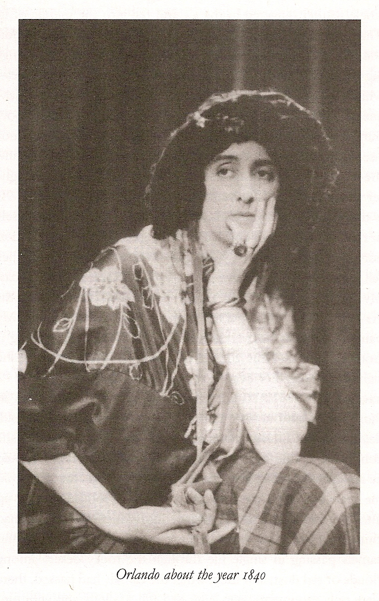

El presente ensayo intentará indagar en cuestiones acerca de la identidad y su construcción, la subjetivación de los cuerpos, y la experiencia no binaria. Estos temas serán abarcados desde una revisión académica de la teoría de género de Judith Butler –con su concepto de _performatividad–_ y Rosi Braidotti –desde su _política nómade_–, entremezclada con extractos y comentarios acerca de la experiencia trans en la novela cuasi-biográfica _Orlando,_ de Virginia Woolf. Las preguntas que buscan iluminarse serán ¿cómo se construye una identidad fuera del binarismo del género?, ¿cómo se subjetiva un cuerpo?

> “¡Ven, ven! Este yo me harta. Necesito otro” (Woolf, 1951, p. 305)

Virginia Woolf, aclamada autora feminista, presenta en 1928 _Orlando,_ una historia de ficción bajo el estilo de una biografía. Inspirada en la aristocrática historia familiar de Vita Sackville-West, Woolf despliega un relato de vida que empieza en el año 1500 y llega hasta tiempos modernos, reimaginando la vida de Vita y esparciendo en la novela referencias a ella, su entorno, la relación entre ambas, y su familia. Tomando como inspiración al trasfondo aristocrático y la sexualidad poco ortodoxa de Vita, Woolf elabora una historia biográfica que relata a una personalidad a momentos disconforme con su género, y en otros desafiante de las convenciones del género, y que, en un momento dado, encarna el escenario ideal, prácticamente sobrenatural, de una transición de género inmediata y socialmente validada, que permite a su personaje principal vivir, de la noche a la mañana, su vida desde otro género.

<!--more-->

La escena en que Orlando pasa de ser hombre a mujer ocurre mientras elle se encuentra en un profundo sueño de siete días. A su alrededor aparecen los dioses de la verdad, el candor y la honestidad, entonando en sus trompetas de plata notas extensas que exigen que se revele “la verdad” (Woolf, 2003, p. 65).

En esta escena, la habitación de Orlando da lugar a un despliegue de personajes sobrenaturales que dan expresión a la batalla interna del momento de transición de género: entre impedir el cambio bajo principios que subliman el deseo de ser otre (las damas de la castidad, pureza y modestia con que amenazan a Orlando con sus atributos y hechizos en cierto sentido feminizantes), y entre las fuerzas divinas que impulsan la expresión de la verdad interna (los dioses con sus trompetas). Las imágenes que suscitan estas páginas refieren a luna nueva, el frágil cervatillo, lo nocturno, el mar plateado, velos oscuros, toques que congelan, miradas que matan, campos fértiles, soldados protectores, saqueos, el orientalismo, la pluma del escritor, el sueño eterno. Los conceptos que colisionan son modestia, duelo, lamentación, fertilidad, crecimiento, seducción, inacción, pobreza, duda, fragilidad, ceguera, castidad, pureza, modestia y curiosidad. Finalmente, Orlando despierta convertida en una mujer. Desde este vendaval simbólico, surgen preguntas: ¿cuáles son las imágenes y conceptos que definen a un género? ¿Cuáles “entran” y cuales “salen”, si es que existe tal recambio, durante el proceso de transicionar de masculino a femenino, o viceversa?

Resulta pertinente indagar en la estructuración “contenido” del género. En la mayoría de las culturas del mundo, las diferencias entre hombres y mujeres son pensadas y expresadas como conjuntos de _oposiciones binarias asociadas metafóricamente,_ dando lugar a binomios tales como naturaleza/cultura, privado/público, o interés particular/bien social (Ortner y Whitehead, 2015, p. 134). Estas construcciones abstractas de significado operan como campos de inteligibilidad y validación para los individuos, que tienen el efecto de asignar, por oposición y en referencia a estas metáforas abstractas, los roles, representaciones, prestigios e imágenes sociales que son atribuidas y encarnadas por los géneros.

Sin embargo, las categorías del género no son determinaciones directas o verticales del comportamiento ni de la identificación de las y los individuos. En la experiencia cotidiana, las y los sujetos cuentan con una vaga intuición sobre la división sexual de la sociedad bajo lineamientos de oposiciones binarias, así como con una cierta noción de su identidad de género, usualmente estable en una de las dos categorías binarias de género dominantes: hombre o mujer. En torno a estas nociones, o posibilidades históricas, que caracterizan la matriz de formación de los sujetos generizados en el patriarcado, es que las individualidades parecen subjetivarse como actores del sistema sexo/género.

Los cuerpos, siguiendo a Merleau-Ponty y Beauvoir, son entendidos como procesos activos de encarnación de posibilidades culturales e históricas (Butler, 1998, p. 298), lo que implica la existencia de contenidos sobre el género que son dados de antemano. Siguiendo esta idea, Judith Butler plantea que _llegar a ser_ un género (a partir del _“No se nace mujer, se llega a serlo”_ de Simone de Beauvoir) implica un proceso de interpretación de una realidad cultural cargada de sanciones y prescripciones (2015, p. 296). Por lo tanto, comprendemos que en el género existen ciertas posibilidades contextualizadas sociohistóricamente, las cuales se expresan en designios sobre lo que es o no debido, y sobre lo que es o no posible, al momento de encarnar una identidad.

La pluralidad de metáforas e imágenes que rondan en la realidad social –como las que rondaron la habitación de Orlando durante su transición– son categorizadas en términos de género, y luego conjugadas como identidades dadas para dar lugar a posiciones de sujeto específicas. El género, entonces, remitiría a la encarnación de actos (físicos, psicológicos, simbólicos) que dan lugar a la asunción de un determinado tipo de cuerpo y de una determinada forma de vivir dentro de un _mundo de estilos corpóreos establecidos_ (Butler, 2015, p. 296).

En _Orlando,_ la transición del género del personaje le posibilita experimentar las exigencias de los designios del género desde las dos posiciones: como opresor, entendido como sujeto varón con determinadas expectativas acerca de la feminidad; y como oprimida, en tanto mujer que reconoce –tardíamente– el peso de las “responsabilidades sagradas” en torno a su género:

> Recordó cómo de muchacho había exigido que las mujeres fueran sumisas, castas, perfumadas y exquisitamente ataviadas. “Ahora deberé padecer en carne propia esas exigencias”, pensó, “porque las mujeres no son (a juzgar por mí misma) naturalmente sumisas, castas, perfumadas y exquisitamente ataviadas. Sólo una disciplina aburridísima les otorga esas gracias, sin las cuales no pueden conocer ninguno de los goces de la vida”. “Hay que peinarse”, pensó, “y sólo eso me tomaría una hora cada mañana; hay que mirarse en el espejo, otra hora”; (…) descubriendo al fin, lo que en otras circunstancias le hubieran enseñado desde niña; es decir, las responsabilidades sagradas de la mujer. (Woolf, 1951, pp. 156-157)

De esta forma, Orlando hace propio un estilo corporal previamente determinado en torno a la feminidad, y comprende que lo que había reconocido desde la vereda de la masculinidad como deseo, ahora se tornaba en una responsabilidad, en tanto proceso permanente de encarnación, o bien, una pauta de actos que posibilitarán su identificación como mujer.

Para Butler, “el género es lo que uno asume, invariablemente, bajo coacción, a diario e incesantemente, con ansiedad y placer...” (Butler, 1998, p. 314). Es decir, existe un componente de _coacción_ durante la identificación del sujeto en torno a un género, pero también un _afuera_ que compele a los individuos a asumir ciertos aspectos de éste mismo. Los _estilos corporales_ que caracterizan al género son percibidos por los sujetos como posibilidades válidas de identificación, dando lugar a su posterior interpretación o actuación _(performance),_ actuando conjuntos de actos como si fuesen propios (Butler, 2015, p. 299). A su vez, la re-interpretación de estos actos produce el efecto de reproducir su viabilidad misma, o de actualizar su existencia como conjunto de actos presentes que representan a una subjetividad posible: “elegir un género es interpretar las normas de género recibidas de un modo tal que los reproduce y organiza de nuevo” (Butler, 2015, p. 296).

En la novela de Virginia Woolf, vemos a una _Orlando_ que, luego de transicionar, se halla a sí misma problematizando las expectativas de género que internaliza automáticamente tan sólo al enfrentarse a otros sujetos; en este caso, abrirse o cerrarse a la seducción de alguien a quien interpreta como hombre, o bien, profundizando la forma en que su nueva apariencia, y las respuestas que ésta suscita en su entorno, han cambiado también su forma de pensar:

> Orlando había saludado, había aceptado, había halagado el amor del buen hombre: lo que no hubiera sucedido si el capitán en vez de pantalones hubiera llevado faldas, y confirma la tesis de que son los trajes los que nos usan, y no nosotros los que usamos los trajes: podemos imponerles la forma de muestro brazo o de nuestro pecho, pero ellos forman a su antojo muestros corazones, nuestras lenguas, nuestros cerebros. A fuerza de usar faldas por tanto tiempo, ya un cierto cambio era visible en Orlando; (Woolf, 1951, p. 187)

Los actos que dotan de existencia al género radican en el re-actuar y re-experimentar _conjuntos de significados socialmente establecidos._ La repetición de actos actúa como legitimación, y los significados replicados remiten a un conjunto de imágenes, deseos, órdenes y prohibiciones en torno a una posición de sujeto generizado usualmente validada por la hegemonía patriarcal. Butler indica que, “aunque no seamos conscientes de ello, estamos siendo conformados por unas fantasías ajenas que se nos transmiten por medio de interpelaciones de todo tipo” (2017, pp. 37-38). Y estas fantasías resultan ser la materia prima a las que recurre un sujeto que busca transgredir al/su género, en tanto los significados establecidos, estilos corporales e interpelaciones corresponden a sedimentaciones de _modos de ser_ a los que es posible de recurrir creativamente para re-construirse en términos inteligibles para el resto de su entorno. En otras palabras, una identificación trans no-binaria suele a construirse aún en referencia a los designios del género, ya sea como referencia positiva, oposición, parodia, estrategia de validación, etc.

Podemos ver cómo el cuerpo y sus actos se tornan en el medio principal para expresar y percibir el género. Ya en la primera línea de _Orlando,_ nos encontramos con que la expresión corporal adquiere un rol importante sobre la comunicación del sexo:

> Él —porque no cabía duda sobre su sexo, aunque la moda de la época contribuyera a disfrazarlo— (Woolf, 1951, p. 13)

La vestimenta de Orlando, en su etapa como varón, apunta hacia una cierta androginia, una ambigüedad sexual que remite a una posibilidad de travestismo (Pawlowski, 2003, p. xiii), indicando que el sexo por sí mismo no es una “esencia” suficiente para fijar la identidad, sino que se trata de un factor modulado por otros símbolos impresos en el cuerpo. Como plantea Butler, el cuerpo sólo se conoce por su _apariencia_ de género (Butler, 1998, p. 301). Se trata de la renovación de actos, una dramatización de la identidad, interpretada por un consenso social que juzga su validez a cada momento, cuya viabilidad es revisada por los otros, y que, por lo tanto, implica el despliegue de estrategias de expresión de género acorde con los actos disponibles. En fin, el cuerpo con género, o generizado, es resultado de la herencia de actos de género sedimentados en lo social (Butler, 1998, p. 301).

Dado que el género carecería de una determinación interna, el cuerpo se torna en una materialidad que dramatiza significados, materializando un conjunto de posibilidades mediante expresiones concretas constreñidas por convenciones históricas (Butler, 1998, p. 299). Como planteó Simone de Beauvoir, el cuerpo _se hace_ a la manera de cada individuo, pero no como una capacidad de gobernar externamente un cuerpo de manera individual y descorporeizada, sino como distintas formas de ir formándose en base a determinantes sociales e históricos a la posibilidad de ser, donde los contenidos corporeizados remiten a éstas posibilidades dadas de encarnar subjetivaciones (Butler, 1998, p. 299). Éstos son los estilos corporales, que en breve refieren a los conjuntos de estrategias para _ser_ en base a actos que son a la vez _dramáticos_ (repetición de nociones dadas de antemano, como una obra teatral) y _performativos_ (actos que producen o actualizan posibilidades al ejercerse).

Cuando Simone de Beauvoir habla del “llegar a ser” mujer, Butler entiende que el género es la corporeización de una elección, entendida como un proceso de interpretación corporal en el marco de una red de normas culturales (Butler, 2005, p. 292). Pero, a través de su obra, Butler insiste en que la elección no es completamente libre, sino que se enmarcan en las expectativas, fantasías y normas que rondan nuestro entorno social, las cuales son internalizadas por los sujetos, estructurando sus propias conciencias, y por lo tanto incidiendo en sus modos de vida corporeizados (Butler, 2017, p. 36).

Siguiendo las ideas de Butler, el género sería, entonces, un locus de significados recibidos e innovados, una aculturación de lo corpóreo, un nexo entre cultura y elección, una actuación corporal que constituye en la superficie del cuerpo la significación de su identidad interior (Butler, 2005, pp. 292, 299; Butler, 1999b, p. 419); mientras que _hacer_ el género –continuando con la formulación de Beauvoir– sería contituir una identidad en el tiempo, instituirla mediante la repetición estilizada de actos y la estilización del cuerpo, mantener una ilusión de un yo permanentemente generizado (Butler, 1998, p. 297). Por consiguiente, el género no sería una identidad estable, sustancial, ni de una pieza; sino una identidad construida y débilmente constituida en el tiempo; que se constituye mediante una repetición estilizada de actos, gestos corporales, movimientos y normas; dando lugar a una identidad débil, social y temporal que proyecta la ilusión de un yo generizado y de una apariencia de sustancia interna.

Las teorías de Judith Butler acerca de la construcción social del género y del sexo tienen como conclusión lógica la idea de que el cuerpo generizado carece de un estado ontológico propio que sostenga su realidad. Los actos de género _crean_ la idea de género; no hay una esencia (sexo biológico) por exteriorizar (Butler, 1998, p. 301). En otras palabras, no hay nada en la materialidad del mismo cuerpo que determine al género que encarna en vida. Como respuesta, la autora plantea que el cuerpo generizado es de por sí un cuerpo _performativo,_ dado que su existencia misma genera su propia realidad, a través de los actos que lo constituyen (Butler, 1999b, p. 417).

La autora indica que el género no es un modelo sustancial de identidad, sino una temporalidad social constituida, donde la aparente sustancia que dota al género de solidez en realidad se trata de un logro performativo que la audiencia y los actores —utilizando metáforas teatrales— llegan a creer y repetir a modo de creencia, identificando y reproduciendo las _performances_ que perciben como creíbles (Butler, 1999b, p. 421).

La misma idea de que exista una sustancia fija en el género, una esencia interior al ser hombre o mujer, o una realidad del cuerpo generizado, se trata de una fabricación que es efecto y función de un discurso social capaz de regular la fantasía del género a través de lo que Butler llama las _políticas de la superficie del cuerpo_ (Butler, 1999b, p. 417). El género sería, entonces, un acto (Butler, 1999b, p. 420).

Rosi Braidotti complementa lo anterior con la idea, basada en Foucault, de que el sujeto se constituye mediante actos y funciones codificadas como significativas, normales y deseables por la cultura imperante. Esto quiere decir que la subjetividad se inscribe mediante lo que dicta y permite el poder, donde el sujeto deviene a partir de fragmentos unidos mediante una identificación con el orden falocéntrico (en Butler, el símbolo del sexo) (Braidotti, 2000, p. 42). La performatividad sería un conjunto de acciones –una “producción ritualizada” y no un acto singular– que se reiteran constreñidas por prohibiciones, tabúes, amenazas de exclusión y de violencia (Butler, 2014, p. 95).

Entonces, la _repetición estilizada de actos_ constituye al género en el espacio de lo social (Butler, 1999b, p. 421). Como expresión de la oclusión del sexo como supuesta esencia interna, y de la preponderancia de la apariencia y los actos en la expresión del género, en _Orlando_ se plantea, en torno a la cuestión de la vestimenta, que:

> Por diversos que sean los sexos, se confunden. No hay ser humano que no oscile de un sexo a otro, y a menudo sólo los trajes siguen siendo varones o mujeres, mientras el sexo oculto es lo contrario del que está a la vista. (Woolf, 1951, p. 188)

En su núcleo, la performatividad describe al poder reiterativo del discurso para (re)producir el fenómeno que regula y constriñe (Butler, 1999a, p. 236). Plantea la posibilidad de dar forma a la realidad mediante la reiteración; pero más que una reiteración de una norma o de un conjunto de normas, o de un individuo particular realizando la reiteración, su poder se centra en la posibilidad de _referencia_ o de _citación_ (Butler, 1999a, p. 242): referenciar a la supuesta realidad del sexo, a otros sujetos enunciantes, a otros cuerpos existentes, a marcas de género y de identidad, a cadenas de significados generizados que encuentran sustento en la masividad de una idea o suceso. Son éstas las materias primas a su vez útiles y desechables para un proyecto de identidad fuera del binarismo del género.

El uso de recursos tradicionales que suscitan un reconocimiento binario y predecible del género sobresalta a Orlando, en tanto da a entrever el arsenal simbólico que se encuentra a disposición del sujeto que se enfrenta desde los márgenes al sistema sexo/género:

> Es raro, pero es cierto: hasta ese momento, apenas había pensado en su sexo. Quizá las bombachas turcas la habían distraído; y las gitanas, salvo en algún detalle importante, difieren poquísimo de los gitanos. Sea lo que fuere, sólo cuando sintió que las faldas se le enredaban en las piernas y el galante Capitán ordenó que le armaran en la cubierta un toldo especial, sólo entonces, decimos, comprendió sobresaltada las responsabilidades y los privilegios de su condición. (…) Pero si durante treinta años uno ha sido hombre (…) El sobesalto de Orlando era de naturaleza muy complicada, y no lo podemos definir en un santiamén. (Woolf, 1951, pp. 153-154)

Vemos cómo la performatividad del género estructura un marco de reconocimiento que conecta los actos y expresiones reiteradas con un campo simbólico de interpretación, a partir del cual se perciben las referencias o citaciones que realizan las y los sujetos como indicios de una identidad de género subyacente. A su vez, este campo de inteligibilidad de los cuerpos se encuentra regulado por normas de reconocimiento, que establecen jerarquías y exclusiones en concordancia con las ideas patriarcales, determinando los términos en que los cuerpos pueden llegar a ser reconocidos (Butler, 2017, p. 45).

Subyacente a la teoría de la performatividad se encuentran las capacidades emancipatorias que abre esta forma de comprender el género y las subjetividades generizadas. Si la realidad del género es una construcción que adquiere la apariencia de sustancia a partir de la repetición de actos –una identidad construida a partir de repeticiones, citas y referencias, que es creída y tratada como realidad por parte de la audiencia y sus propios actores– entonces se sigue que, en los intersticios de esas repeticiones de estilos corporales y de ser, resultaría posible transformar al género, volviéndolo susceptible de ser constituido de otra manera (Butler, 1998, p. 297).

Es posible negarse ante la asignación del género llevando a cabo actos que cuestionen de alguna manera las expectativas de género basadas en la percepción del sexo como dato fáctico derivado del cuerpo (Butler, 1998, p. 309), o bien encarnando un rechazo al género asignado, negándose a ajustarse a las normas derivadas de éste, interpretando una norma de manera dudosa, evidenciando normas que son contradictorias o incumplibles, cuestionando los actos que se encuentran de acuerdo o en contra de la senda del proyecto personal de género, o incluso extraviándose de la forma en que se pone en práctica el propio género (Butler, 2017, pp. 36-38).

Por ejemplo, ciertas encarnaciones del género producen un cuestionamiento a la norma de género binaria:

> Mientras que el travesti puede hacer más que simplemente expresar la distinción entre sexo y género: desafía, implícitamente al menos, la distinción entre apariencia y realidad que estructura buena parte del pensamiento común sobre la identidad de género. (Butler, 1998, p. 309)

Como ocurre en _Orlando,_ hechos extremadamente mundanos tienen el efecto de poner en cuestión las expectativas de una audiencia conservadora ante el género que perciben:

> Esa mezcla de hombre y de mujer, la momentánea prevalencia de uno y de otra, solía dar a su conducta un giro inesperado. Por ejemplo, las mujeres curiosas preguntarán: Si Orlando era mujer, ¿cómo no tardaba más de diez minutos para vestirse? ¿Y no estaban sus trajes elegidos a la buena de Dios, y a veces hasta raídos? Sin embargo, le faltaba la gravedad de un hombre, o la codicia de poder que tienen los hombres. Su corazón era muy tierno. No toleraba que golpearan un burro, o ahogaran un gatito. (Woolf, 1951, p. 188)

La misma lógica de reiteraciones y citacionalidad que estructuran la ilusión de fijeza de las categorías de género introducen la posibilidad de abrir fisuras que pueden desestabilizar al sexo, desde las que ciertos elementos escapan o exceden la norma (Butler, 1999a, p. 239). El hecho de que las regulaciones requieran de la reiteración de sus normas abren la opción de que sus leyes sean rearticuladas poco a poco, dado que son evidencia de que la materialización del género nunca está completa, sino que depende de un proceso continuo de reafirmación del género (Butler, 2002, p. 18). Así, el género, como proceso performativo –es decir, como producto de prácticas específicas basadas en normas obligatorias pero posibles de cuestionar– queda abierto a nuevas estructuraciones (Butler, 2017, p. 39), nuevas posibilidades para encarnar identidades y subjetividades sexo-genéricas en la medida que las fisuras de este constructo vayan proliferando como grietas en una estructura en abandono.

Las posibilidades que ilumina la teoría de la performatividad de Butler acerca de romper con los designios del género, poner el foco en las fisuras y contradicciones de su reproducción, e inaugurar así posibilidades para nuevos y tímidos estilos corporales, van en línea con el desarrollo teórico de Rosi Braidotti, condensado en su concepto del _sujeto nómade._

El _nomadismo_ es definido por Braidotti como un estilo de pensamiento (Braidotti, 2000, p. 26), una “conciencia crítica que se resiste a establecerse en los modos socialmente codificados de pensamiento y conducta” (Braidotti, 2000, p. 31). Su propósito es liberar al pensamiento del dogmatismo falocéntrico (Braidotti, 2000, p. 36), que respecta a los rígidos binarismos que buscan fijar el contenido de las categorías de género de manera jerárquica, universalista y oposicional. Este estilo de pensamiento se fundamenta en el reconocimiento de los múltiples ejes de diferenciación que dan lugar a las subjetividades (raza, clase, género, etc.), y el modo en que su presencia simultánea, su intersección e interacción juegan un rol preponderante en dicha formación (Braidotti, 2000, p. 30). Una conciencia nómade significa un sentido de identidad contingente en vez de fijo, que evita explícitamente basarse en oposiciones dualistas, y que promulga no adoptar ningún tipo de identidad como permanente (Braidotti, 2000, pp. 71, 74). Nomadismo es vivir en transición, sin una identidad fija: “El nómade no tiene pasaporte; o tiene demasiados” (Braidotti, 2000, p. 74).

Parte crucial para comprender la idea de nomadismo es el concepto de _figuración._ Las figuraciones son imágenes que operan como ficciones políticas, que tienen un origen referencial y mitológico, y que permiten analizar las categorías y experiencias desde un espacio externo, posibilitando el repensar de lo establecido (Braidotti, 2000, p. 30). Como imágenes con una base política, las figuraciones procuran retratar una interacción compleja de diversos niveles de subjetividad (Braidotti, 2000, p. 30). Mediante los pensamientos que inauguran estas imágenes, se expresan _salidas alternativas_ a la forma imperante de subjetivación de los sujetos, expandiendo, de este modo, las formas de pensar, percibir y organizarse (Braidotti, 2000, p. 26). En este sentido, el concepto de figuración se relaciona con la teoría de la performatividad, en tanto las figuraciones pueden entenderse como formas de dar imagen y cuerpo a los resultados de las performances subversivas que se atisban en el futuro a partir de las evidencias de fisuras en la matriz de constitución del género patriarcal.

Entonces, parte del proyecto nómade planteado por Braidotti reside en la proliferación de la expresión de figuraciones que posibiliten repensar nuevas subjetividades descentradas (Braidotti, 2000, p. 73), otorgando voz a un imaginario donde habiten nuevas formas de ser, sentir, pensar y relacionarse. La posibilidad de figuraciones feministas permite explorar nuevas subjetividades afirmativas femeninas para un futuro post-patriarcal (Braidotti, 2000, p. 28), como se atisba en _lo lesbiano_ de Monique Wittig, la _parodia_ en Judith Butler, los _labios_ en Luce Irigaray, o el _cyborg_ en Donna Haraway.

Las imágenes figurativas suelen basarse en referencias a experiencias que evocan a otras. Algunas de éstas corresponden a las identidades estables/fijadas del género, que se reconocen como en proceso de decadencia (Braidotti, 2000, p. 31). Localizar estas experiencias, analizarlas, deconstruirlas y desvirtuarlas de manera mimética da lugar a un flujo de experiencias, transiciones entre estados, proximidades empáticas, metáforas performativas, interconectividades intensas y estilos creativos de transformación que posibilitan situaciones, conocimientos y experiencias otrora insospechados (Braidotti, 2000, p. 32). Estas ficciones críticas de la realidad permiten al sujeto “viajar” en el nivel del pensamiento para apartarse de las convenciones socialmente establecidas acerca de la conducta y del pensamiento (Braidotti, 2000, p. 31). De este modo, al renunciar a las ideas y deseos de lo establecido, el nómade cruza fronteras sin un destino establecido, abriéndose a desear una identidad “hecha de transiciones, de desplazamientos sucesivos, de cambios coordinados, sin una unidad esencial y contra ella” (Braidotti, 2000, p. 58).

Las figuraciones, por consiguiente, permiten identificar puntos de salida al falocentrismo. Tal es el proyecto político del feminismo nómade. De acuerdo con Rosi Braidotti, las figuraciones permiten reelaborar las representaciones del género, consumiéndolas desde dentro. Algunas de sus herramientas son el consumo de lo viejo para engendrar lo nuevo, así como la mímesis como técnica subversiva. De ese modo, se ataca desde su interior a los conceptos e imágenes de _la mujer_ establecidas, reelaborando imágenes nuevas a la vez que se critica lo antiguo. Braidotti plantea que el objetivo político del feminismo debiese ser este _consumo_ (estudio, visibilización, crítica, denuncia, parodia, imitación) de las imágenes retrógradas de lo femenino, posibilitando así el surgimiento de nuevas subjetividades femeninas (Braidotti, 2000, p. 82).

En este sentido, es posible interpretar la transición de _Orlando_ como una _figuración,_ en términos de Braidotti, en el sentido que permite pensar nuevas formas de encarnar, primero, una masculinidad no convencional desde la androginia, y posteriormente, la emancipación de expresar la verdad del deseo de identificarse como femenina, analizando de forma crítica las prescripciones de género desde la posición privilegiada del _afuera,_ del simultáneo flujo del ser y del no ser.

> Y al ensayar esas palabras, le horrorizó advertir la baja opinión que ya se había formado del sexo opuesto, al que había pertenecido con tanto orgullo. “Caerse de un mástil”, pensó, “porque una mujer muestra los tobillos; disfrazarse de mamarracho y desfilar por la calle para que las mujeres lo admiren; negar instrucción a la mujer para que no se ría de uno; ser el esclavo de la falda más insignificante, y, sin embargo, pavonearse como si fueran los Reyes de la creación. ¡Cielos!”, pensó, "¡qué tontas nos hacen, qué tontas somos!” Y aquí parecería por cierta ambigüedad en sus términos que condenara a los dos sexos imparcialmente, como si no perteneciera a ninguno; y en efecto, vacilaba en ese momento: era varón, era mujer, sabía los secretos, compartía las flaquezas de los dos. Era un estado de alma vertiginoso. Los consuelos de la ignorancia le estaban vedados. Orlando era una pluma en el viento. (Woolf, 1951, p. 158)

Como plantea Donna Haraway desde su _teoría del punto de vista,_ “la visión es mejor desde abajo que desde las brillantes plataformas de los poderosos” (Haraway, 1995, p. 328). Con esta idea, Haraway aboga por una visión reconocidamente parcial, un conocimiento situado que se ubica desde una posición inferiorizada que se reconoce como encarnada y parcial, en lugar de pretenderse universal u objetiva. En efecto, las experiencias vividas “en el borde” desarrollan un modo especial de ver la realidad, que permite aprehender tanto el afuera como el adentro de las problemáticas sociales (hooks, 2020, p. 23). La transición de Orlando le otorga una localización marcada a su pensamiento, permitiéndole ver las relaciones de género en perspectiva antipatriarcal, más aún cuando ella mantiene, en ciertas instancias, una identificación de hombre y mujer a la vez, una suerte de identidad no-binaria.

Más allá de la dimensión de lo abstracto, el nomadismo como práctica política implica una resistencia, como “forma de resistirse a la asimilación u homologación con las formas dominantes de representación del yo” (Braidotti, 2000, p. 62); es decir, una forma de escapar la subjetivación binaria y dualista del género. Nomadismo “no es fluidez sin fronteras, sino que consiste más bien en una aguda conciencia de no fijación de límites. Es el intenso deseo de continuar irrumpiendo, transgrediendo” (Braidotti, 2000, p. 77-78).

El nomadismo, apoyado de la idea de figuración, desafía los elementos estatuidos que limitan las expresiones de la subjetividad, invitando a romper sus moldes, negar sus fronteras, e irrumpir la realidad social a través de la mera existencia. Se trata de conceptos fuertemente contingentes a las experiencias de transición de género y de identificación no binaria, dado que instan a desafiar las categorías y saberes fijos, replantearse las subjetividades posibles, y poner en práctica modos de ser fluidos y transitorios, cuyo movimiento y localización fuera de los binomios patriarcales habiliten nuevas formas de organización de las subjetividades y del propio género.

En la escena en que Orlando transiciona de género, bajo un largo letargo en la ciudad de Constantinopla, llama la atención el cambio de pronombres de género en apenas dos páginas. Se pasa del masculino inicial, a un par de párrafos redactados con exquisito castellano neutro (que evita el uso de palabras con género, aunque en la versión en inglés (Woolf, 2003, p. 167) se usa la forma singular de la tercera persona plural _(they/them)_ como pronombre neutro), para luego pasar al femenino. El personaje pasa de ser un hombre que transgrede al género con sus vestimentas a volverse una mujer ambiguamente marcada por elementos de apariencia y personalidad de ambos polos del género binario:

> “Nadie, desde que el mundo comenzó, ha sido más hermoso. Sus formas combinaban la fuerza del hombre y la gracia de la mujer. (…) Orlando se había transformado en una mujer — inútil negarlo. Pero, en todo lo demás, Orlando era el mismo. El cambio de sexo modificaba su porvenir, no su identidad. (…) Orlando, ahora, se había lavado y vestido con esas casacas y bombachas turcas que sirven indiferentemente para uno y otro sexo; y tuvo que enfrentar su situación. (Woolf, 1951, pp. 137-138)

Nos encontramos con un personaje cuyos actos como varón le representaban como un sujeto que limitaba con el travestismo _(“no cabía duda sobre su sexo, aunque la moda de la época contribuyera a disfrazarlo”),_ y que frecuentemente ponderaba la función social de la vestimenta en la expresión de género _(“A fuerza de usar faldas por tanto tiempo, ya un cierto cambio era visible en Orlando”),_ así como la dialéctica entre actos generizados y generización de los actos _(“son los trajes los que nos usan, y no nosotros los que usamos los trajes”)._

La figuración de un personaje transgénero, cuyas experiencias de vida desarrollan las diferencias –a veces mínimas, otras trascendentes– de encarnar una misma existencia desde dos posiciones subjetivas diferentes (hombre y mujer), expresa las consecuencias performativas de los actos. Ya sean rasgos de personalidad, expresión o apariencia, el hecho de la asignación de los actos a una u otra categoría binaria del género significa que su uso transgresor posee un potencial desestabilizador del binario. Dichos actos conllevan un efecto profundo en la forma en que se percibe al sujeto, pero también un efecto acumulativo en la sedimentación de estilos corporales con el potencial de carcomer paulatinamente a la heteronorma. Esta figuración, además, dota de la oportunidad de imaginar un futuro en el que se habilite la libre proliferación de identidades al margen del binarismo de género, ya sean transgénero, queer o no-binarias. La imagen fantástica de una experiencia de transición no traumática y automáticamente validada nos permite prefigurar sociedades donde, efectivamente, la biología deje de ser destino, y las subjetividades fluyan libres de cadenas.

> La oscuridad que separa los sexos y en la que se conservan tantas impurezas antiguas, quedó abolida. (Woolf, 1951, p. 161)

* * *

### Referencias

- Agamben, G. (2015). _Gusto._ Buenos Aires: Adriana Hidalgo Editora.
- Beauvoir, S. (1973). _The Second Sex._ New York: Vintage Press.
- Braidotti, R. (2000). _Sujetos nómades. Corporización y diferencia sexual en la teoría feminista contemporánea._ Buenos Aires: Paidós.
- Butler, J. (1998). _Actos performativos y constitución del género: un ensayo sobre fenomenología y teoría feminista._ Debate Feminista, vol. 18, octubre de 1998, (296-314).
- Butler, J. (1999a). _Bodies that Matter._ En Price, J. y Shildrick, M. (1999). _Feminist Theory and The Body, A Reader._ Routledge.
- Butler, J. (1999b). _Bodily Inscriptions, Performative Subvertions._ En Price, J. y Shildrick, M. (1999). _Feminist Theory and The Body, A Reader._ Routledge.
- Butler, J. (2002). _Cuerpos que importan. Sobre los límites materiales y discursivos del “sexo”._ Buenos Aires: Paidós.
- Butler, J. (2014). _Phantasmatic Identification and the Assumption of Sex._ En _Bodies That Matter_ (pp. 93–120). Routledge.
- Butler, J. (2015). _Variaciones sobre sexo y género: Beauvoir, Wittig y Foucault._ En Lamas, M. (compiladora) 2015. _El género: La construcción cultural de la diferencia sexual._ México: Bonilla Artigas Editores.
- Butler, J. (2017). _Política de género y el derecho a aparecer._ En Butler, J. (2017). _Cuerpos aliados y lucha política._ Paidós.
- Haraway, D. J. (1995). _Conocimientos situados: la cuestión científica en el feminismo y el privilegio de la perspectiva parcial._ En: Haraway, D. J. (1995). Ciencia, cyborgs y mujeres: la reinvención de la naturaleza. Madrid: Ediciones Cátedra.
- hooks, b. (2020). _Teoría feminista: de los márgenes al centro._ Madrid: Traficantes de sueños.
- Ortner, S. B. y Whitehead, H. (2015). _Indagaciones acerca de los significados sexuales._ En Lamas, M. (compiladora) 2015. _El género: La construcción cultural de la diferencia sexual._ México: Bonilla Artigas Editores.
- Pawlowski, M. (2003). _General introduction._ En Woolf, V. (2003). _Orlando_ (pp. v-xx). Inglaterra: Wordsworth Editions.
- Scott, J., (1988). _Gender and the Politics of History._ Columbia University Press.
- Woolf, V. (1951). _Orlando. Una biografía._ (Borges, J. L., trad.). Argentina: Editorial Sudamericana.
- Woolf, V. (2003). _Orlando._ Inglaterra: Wordsworth Editions.  
    

* * *

_Apuntes y ensayos sobre estudios de género, sociología del cuerpo y teoría feminista por Bastián Olea Herrera, sociólogo y magíster en sociología (Pontificia Universidad Católica de Chile)._
