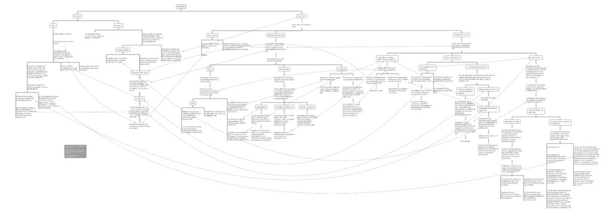

Mapa conceptual de las ideas principales del capítulo _Foucault, Femininity and the Modernization of Patriarchal Power_, del libro _Femininity and Domination_ de Sandra Lee Bartky.

Toca la imagen o [este enlace](http://bastian.olea.biz/wp-content/uploads/2022/07/Bartky-5-Foucault-Femininity-and-the-Modernization-of-Patriarchal-Power.pdf) para acceder al mapa conceptual.

Bartky, Sandra Lee. (1990). Femininity and Domination. Studies in the Phenomenology of Oppression. (Thinking Gender). New York: Routledge.

* * *

_Apuntes y ensayos sobre estudios de género, sociología del cuerpo y teoría feminista por Bastián Olea Herrera, sociólogo, data scientist y magíster en sociología (Pontificia Universidad Católica de Chile)._
