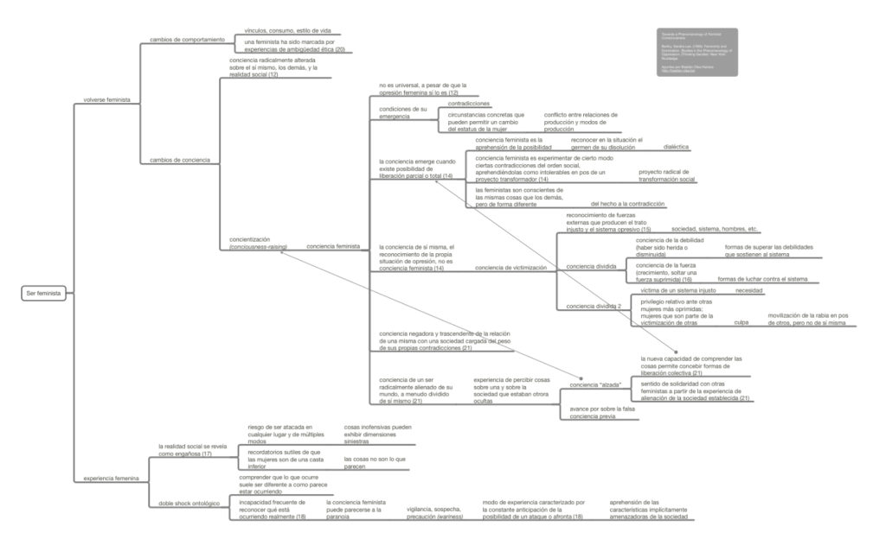

Mapa conceptual de las ideas principales del capítulo _Towards a Phenomenology of Feminist Consciousness_, del libro _Femininity and Domination_ de Sandra Lee Bartky.

Bartky, Sandra Lee. (1990). Femininity and Domination. Studies in the Phenomenology of Oppression. (Thinking Gender). New York: Routledge.

Toca en la imagen o en [este enlace](http://bastian.olea.biz/wp-content/uploads/2022/07/Bartky-1-Towards-a-Phenomenology-of-Feminist-Consciousness.pdf) para acceder al mapa conceptual del texto.

* * *

_Apuntes y ensayos sobre estudios de género, sociología del cuerpo y teoría feminista por Bastián Olea Herrera, sociólogo, data scientist y magíster en sociología (Pontificia Universidad Católica de Chile)._
