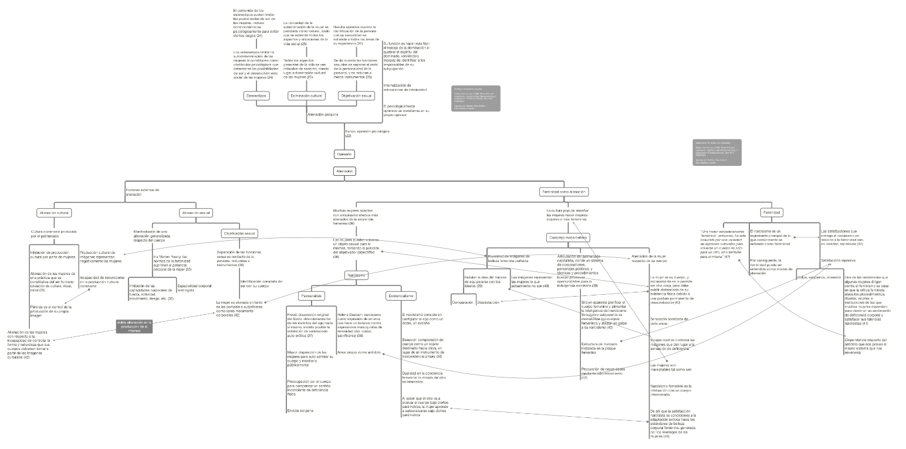

Mapa conceptual de las ideas principales de los capítulos _On Psychological Oppression_ y _Narcissism, Femininity, and Alienation_, del libro _Femininity and Domination_ de Sandra Lee Bartky.

Toca sobre la imagen o en el [siguiente enlace](http://bastian.olea.biz/wp-content/uploads/2022/07/Bartky-3-Narcissism-Femininity-and-Alienation.pdf) para acceder al resumen en mapa conceptual.

* * *

_Apuntes y ensayos sobre estudios de género, sociología del cuerpo y teoría feminista por Bastián Olea Herrera, sociólogo, data scientist y magíster en sociología (Pontificia Universidad Católica de Chile)._
