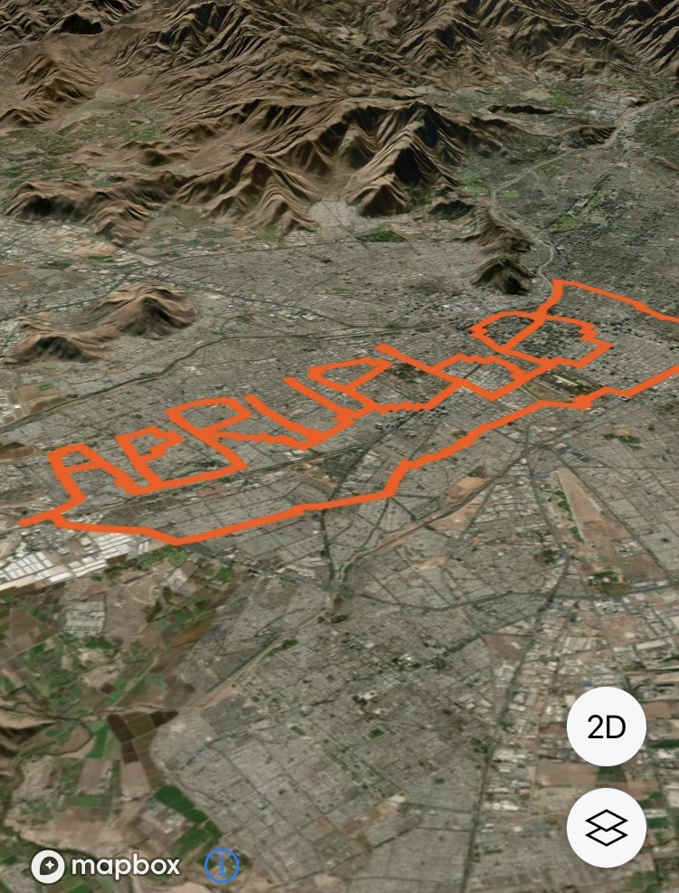
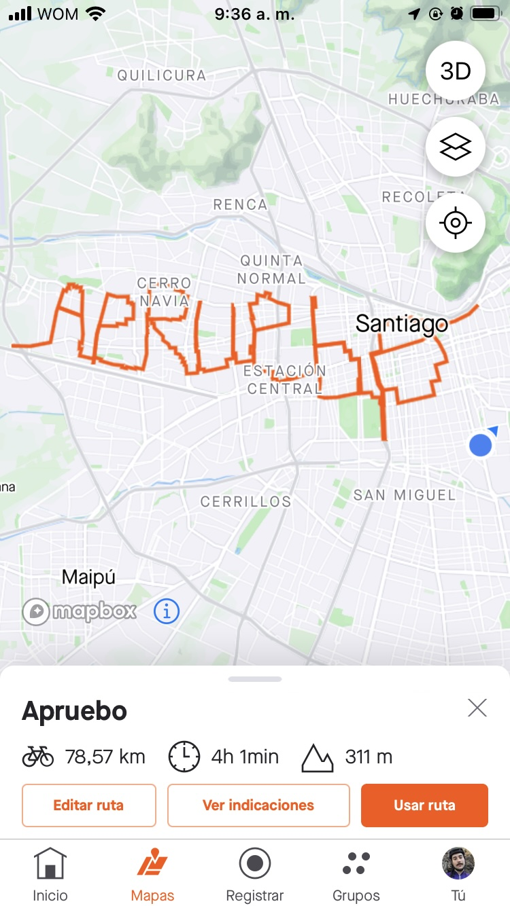
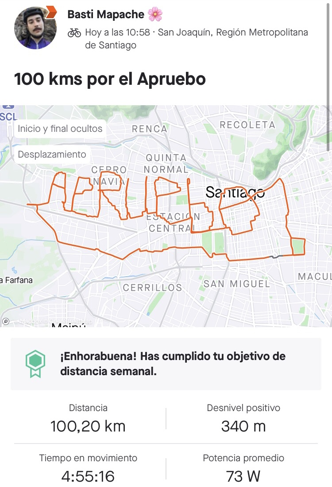
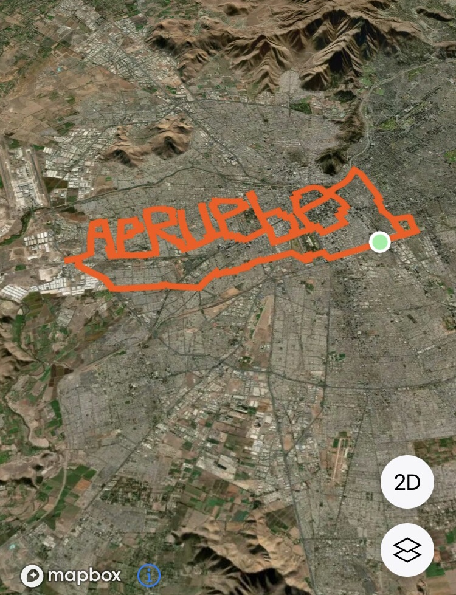

Escribí un **Apruebo** gigante andando en bici 100 kilómetros por Pudahuel, Cerro Navia, Lo Prado y Stgo Centro.

::: {.foto .centrar}
{.lightbox group="apruebo"}
:::

Estuve casi 6 horas trazando las letras en bicicleta usando el GPS, la ruta la planifiqué de antemano, pero no contaba con encontrarme ferias, calles cortadas, pasajes con reja y lacrimógena en la Alameda.

:::: {.galeria}
{.fotito .lightbox group="apruebo"}
{.fotito .lightbox group="apruebo"}
{.fotito .lightbox group="apruebo"}
:::

Fueron 100 kms en bici en aprox. 6 horas (juega muy en contra andar por calles chicas), aunque las letras en sí fueron como 76 kilómetros.

::: {.twitter .centrar}

<blockquote class="twitter-tweet">
Ayer escribí un <a href="https://x.com/hashtag/Apruebo?src=hash&amp;ref_src=twsrc%5Etfw">#Apruebo</a> GIGANTE andando en bici 100 kilómetros por Pudahuel, Cerro Navia, Lo Prado y Stgo Centro 🚴🏻‍♀️💞 <a href="https://t.co/BmrDr8PZme">pic.twitter.com/BmrDr8PZme</a>
&mdash; Bastián Olea 🌸 (@bastimapache) <a href="https://x.com/bastimapache/status/1563190570243092485?ref_src=twsrc%5Etfw">August 26, 2022</a></blockquote> 

:::

Esta locura salió publicada en sitios como [El Desconcierto](https://eldesconcierto.cl/2022/08/26/video-ciclista-crea-un-recorrido-en-gps-y-escribe-apruebo-por-las-calles-de-santiago), entre otros medios de comunicación.

::: {.centrar}
<iframe class="iframe" style="width:100%; height: 700px;"  src="https://eldesconcierto.cl/2022/08/26/video-ciclista-crea-un-recorrido-en-gps-y-escribe-apruebo-por-las-calles-de-santiago"></iframe>
:::

Lo hice en el marco de la campaña del plebiscito constitucional, pero claramente no fue con ánimos de campaña o algo similar, sino por entretención de crear una ruta de larga distancia poco común por una causa positiva.